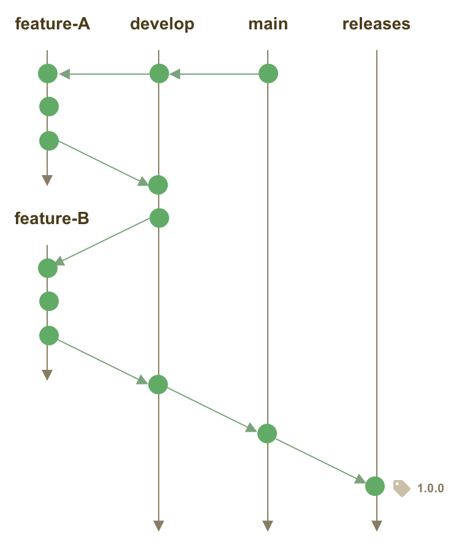

# Contributing to Metacat

:tada: First off, thanks for contributing!:tada:

- [Types of contributions](#types-of-contributions)
- [Pull Requests](#pull-requests)
- [Development Workflow](#development-workflow)
- [Release process](#release-process)
- [Testing](#testing)
- [Code style](#code-style)
- [Contributor license agreement](#contributor-license-agreement)

## Types of contributions

We welcome all types of contributions, including bug fixes, feature enhancements,
bug reports, documentation, graphics, and many others.  You might consider contributing by:

- Report a bug or request a new feature in our [issue tracker](https://github.com/NCEAS/metacat/issues)
- Fix a bug and contribute the code with a Pull Request
- Write or edit some documentation
- Develop a screencast tutorial
- Answer questions on our mailing list or Slack team
- ...

Metacat is an open source project, and we welcome full
participation in the project.  Contributions are reviewed and suggestions are
made to increase the value of Metacat to the community.  We strive to
incorporate code, documentation, and other useful contributions quickly and
efficiently while maintaining a high-quality repository software product.

## Pull Requests
We use the pull-request model for contributions. See [GitHub's help on pull-requests](https://help.github.com/articles/about-pull-requests/).

In short:

- add an [issue](https://github.com/NCEAS/metacat/issues) describing your planned changes, or add a comment to an existing issue;
- on GitHub, fork the [metacat repository](https://github.com/NCEAS/metacat)
- on your computer, clone your forked copy of the metacat repository
- checkout a development branch and commit your changes
- push your branch to your forked repository, and submit a pull-request
- go through the review process, making changes until your pull-request can be merged
- describe your changes in the issue, and close your issue.

## Development Workflow

Development is managed through the git repository at https://github.com/NCEAS/metacat.  The repository is organized into several branches, each with a specific purpose.  

**main**. The `main` branch represents a stable branch that is constantly maintained in a state ready for release. Any unreleased code changes on the main branch represent changes that have been tested and staged for the next release. When a set of features are mature and tested and ready for release, they are merged onto the `main` branch to await the next release.  The tip of the main branch always represents the set of features that have been staged for the next release. The version number in all configuration files and the README on the main branch follows [semantic versioning](https://semver.org/) and should always be set to either:

- the current release version, if the HEAD of `main` still matches the HEAD of `releases`. For example, `2.8.5`.
- the planned next release number with a `beta` designator or release candidate `rc` designator appended as appropriate.  For example, `2.8.6-beta1` or `2.9.0-rc1`.

**releases**. Releases are merged from the `main` branch to the `releases` branch, and the resulting commit is tagged with the release tag (e.g., `2.4.0`). The tip of the `releases` branch always reflects the most recent release of the software.

**develop**. Development takes place on a single branch for integrated development and testing of the set of features
targeting a particular release. Commits should only be pushed to this branch once they are ready to be deployed to
production immediately after being pushed.

**feature**. to isolate development
on a specific set of capabilities, especially if it may be disruptive to other developers
working on the main `develop` branch, feature branches should be created.

Feature branches are named with a prefix of `feature`
and should include a short descriptive label reflecting their purpose.  For example,
`feature-new-search` may be a branch name for a feature related to a new search tool.

You may also want to include the release version that you are targeting, such `feature-2.11.2-new-search`.

You may also want to include the issue number that describes the feature, such as `feature-#1456-new-search`.

All feature branches should be frequently merged with changes from `develop` to
ensure that the feature branch stays up to date with other features that have
been tested and are awaiting release.  Thus, each `feature-*` branch represents an opportunity
for integration testing of the set of features intended to work together for a
particular release.

**dev-X.X**. Development branches named after their minor version number can be used when a patch release
needs to be created that is behind the main **develop** branch.

### Development flow overview

## Release process

The release process starts with integration testing in a `develop` branch. Once all
changes that are desired in a release are merged into the `develop` branch, we run
the full set of tests on a clean checkout of the `develop` branch.

Second, create a pull request to merge those changes from the `metacat/develop` branch
to the `metacat/main` branch.  This pull request should be done from the `develop`
branch within the Metacat repository in order to make it simple for others to
review the changes, and to maintain a record of the development branch commits.
This pull request will be reviewed by another developer, and, after issues and
feedback have been resolved, the pull request can be merged into main.  This
cycle can be repeated multiple times until all features have been tested and
merged into main.  At this point, if all features for the planned release
have been merged to main, then the main branch can be merged to the
`releases` branch, and tagged with the new release tag for that release. At
this point, the tip of the `releases` branch will reflect the new release and
the main branch is ready for work on the next release.

## Testing

**Unit and integration tests**. Metacat has a full suite of unit tests and
integration tests in the `tests` subdirectory. Please refer to the
[test/README.md](./test/README.md) file for more information.

Any new code developed should include a robust set of unit tests for each public
method, as well as integration tests from new feature sets.  Tests should fully
exercise the feature to ensure that it responds correctly to both good data inputs
as well as various classes of corrupt or bad data.  All tests should pass before
a `develop` branch is merged to main, and all tests should pass before the `main`
branch is merged to `releases` and tagged for a release.

**Continuous integration**. Metacat is built upon every commit through the Jenkins
system for [continuous integration at DataONE](https://purl.dataone.org/integration).  
Both the `releases` and `main` branch are built and tested, and the current
development branch is built as well.

## Code style

Code should be written to professional standards to enable clean, well-documented,
readable, and maintainable software.  While there has been significant variablility
in the coding styles applied historically, new contributions should strive for
clean code formatting.  Some of the guidelines we follow include:

**Java**. For Java code, follow the [Google Java Style Guide](https://google.github.io/styleguide/javaguide.html), with the single exception that indentation is performed with 4 spaces rather than 2.  When working on a class that
does not follow the conventions, strive to reformat that code module in a single
isolated code commit before starting other code changes.

**Javadoc**. All Java code should be fully documented with JavaDoc comments.  Special
attention should be paid to documentation of the public API for classes.  Documentation
should explain both what the code does, but also why it does it in a particular
way when appropriate.  Class and method documentation should be written to provide
sufficient context for people that are not intimately familiar with the rest of the code.
Class-level documentation often is strengthened through explaining the role of the
class in the architecture.  Avoid using tautological definitions that reuse the name of
a class or method in its definition.  And please be complete.

## Contributor license agreement

In order to clarify the intellectual property license
granted with Contributions from any person or entity, you agree to
a Contributor License Agreement ("CLA") with the Regents of the University of
California (hereafter, the "Regents").

1. Definitions.
   "You" (or "Your") shall mean the copyright owner or legal entity
   authorized by the copyright owner that is making this Agreement
   with the Regents. For legal entities, the entity making a
   Contribution and all other entities that control, are controlled
   by, or are under common control with that entity are considered to
   be a single Contributor. For the purposes of this definition,
   "control" means (i) the power, direct or indirect, to cause the
   direction or management of such entity, whether by contract or
   otherwise, or (ii) ownership of fifty percent (50%) or more of the
   outstanding shares, or (iii) beneficial ownership of such entity.
   "Contribution" shall mean any original work of authorship,
   including any modifications or additions to an existing work, that
   is intentionally submitted by You to the Regents for inclusion
   in, or documentation of, any of the products owned or managed by
   the Regents (the "Work"). For the purposes of this definition,
   "submitted" means any form of electronic, verbal, or written
   communication sent to the Regents or its representatives,
   including but not limited to communication on electronic mailing
   lists, source code control systems, and issue tracking systems that
   are managed by, or on behalf of, the Regents for the purpose of
   discussing and improving the Work, but excluding communication that
   is conspicuously marked or otherwise designated in writing by You
   as "Not a Contribution."
2. Grant of Copyright License. Subject to the terms and conditions of
   this Agreement, You hereby grant to the Regents and to
   recipients of software distributed by the Regents a perpetual,
   worldwide, non-exclusive, no-charge, royalty-free, irrevocable
   copyright license to reproduce, prepare derivative works of,
   publicly display, publicly perform, sublicense, and distribute Your
   Contributions and such derivative works.
3. Grant of Patent License. Subject to the terms and conditions of
   this Agreement, You hereby grant to the Regents and to
   recipients of software distributed by the Regents a perpetual,
   worldwide, non-exclusive, no-charge, royalty-free, irrevocable
   (except as stated in this section) patent license to make, have
   made, use, offer to sell, sell, import, and otherwise transfer the
   Work, where such license applies only to those patent claims
   licensable by You that are necessarily infringed by Your
   Contribution(s) alone or by combination of Your Contribution(s)
   with the Work to which such Contribution(s) was submitted. If any
   entity institutes patent litigation against You or any other entity
   (including a cross-claim or counterclaim in a lawsuit) alleging
   that your Contribution, or the Work to which you have contributed,
   constitutes direct or contributory patent infringement, then any
   patent licenses granted to that entity under this Agreement for
   that Contribution or Work shall terminate as of the date such
   litigation is filed.
4. You represent that you are legally entitled to grant the above
   license. If your employer(s) has rights to intellectual property
   that you create that includes your Contributions, you represent
   that you have received permission to make Contributions on behalf
   of that employer, that your employer has waived such rights for
   your Contributions to the Regents, or that your employer has
   executed a separate Corporate CLA with the Regents.
5. You represent that each of Your Contributions is Your original
   creation (see section 7 for submissions on behalf of others).  You
   represent that Your Contribution submissions include complete
   details of any third-party license or other restriction (including,
   but not limited to, related patents and trademarks) of which you
   are personally aware and which are associated with any part of Your
   Contributions.
