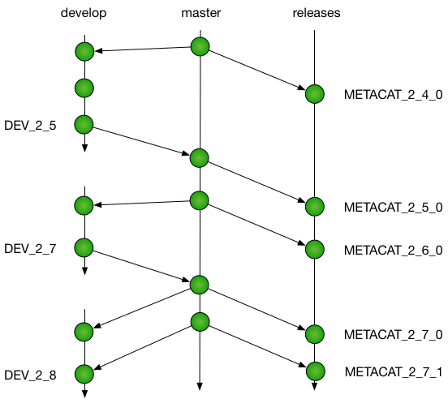

# Contributing to Metacat

:tada: First off, thanks for contributing!:tada:

## Types of contributions

We welcome all types of contributions, including bug fixes, feature enhancements,
bug reports, documentation, graphics, and many others.  You might consider contributing by:

- Report a bug or request a new feature in our [issue tracker](https://github.com/NCEAS/metacat/issues)
- Fix a bug and contribute the code with a Pull Request
- Write or edit some documentation
- Develop a screencast tutorial
- Answer questions on our mailing list or Slack team
- ...

Metacat is an open source project, and we welcome full
participation in the project.  Contributions are reviewed and suggestions are
made to increase the value of Metacat to the community.  We strive to
incorporate code, documentation, and other useful contributions quickly and
efficiently while maintaining a high-quality repository software product.

## Pull Requests
We use the pull-request model for contributions. See [GitHub's help on pull-requests](https://help.github.com/articles/about-pull-requests/).

In short:

- add an [issue](https://github.com/NCEAS/metacat/issues) describing your planned changes, or add a comment to an existing issue;
- on GitHub, fork the [metacat repository](https://github.com/NCEAS/metacat)
- on your computer, clone your forked copy of the metacat repository
- checkout a development branch and commit your changes
- push your branch to your forked repository, and submit a pull-request
- go through the review process, making changes until your pull-request can be merged
- describe your changes in the issue, and close your issue.

## Development Workflow

Development is managed through the git repository at https://github.com/NCEAS/metacat.  The repository is organized into several branches, each with a specific purpose.  

**master**. The `master` branch represents a stable branch that is constantly maintained in a state ready for release. Any unreleased code changes on the master branch represent changes that have been tested and staged for the next release. When a set of features are mature and tested and ready for release, they are merged onto the `master` branch to await the next release.  The tip of the master branch always represents the set of features that have been staged for the next release. The version number in all configuration files and the README on the master branch follows [semantic versioning](https://semver.org/) and should always be set to either:

- the current release version, if the HEAD of `master` still matches the HEAD of `releases`. For example, `2.8.5`.
- the planned next release number with a `beta` designator or release candidate `rc` designator appended as appropriate.  For example, `2.8.6-beta1` or `2.9.0-rc1`.

**releases**. Releases are merged from the `master` branch to the `releases` branch, and the resulting commit is tagged with the release tag (e.g., `METACAT_2_4_0`). The tip of the `releases` branch always reflects the most recent release of the software.

**DEV**. Development takes place on a series of development branches.  While there is some
flexibility in how many development and feature branches are made, we typically
create one `DEV_X_Y` branch for integrated development and testing of the set of features
targeting a particular release.  Much of the development happens directly on these *DEV*
branches, but when needed a separate feature branch can be created to isolate development
on a specific set of capabilities, especially if it may be disruptive to other developers
working on the main DEV* branch.

**FEATURE**. Feature branches should be named with a prefix of the DEV branch
that they are targeting,
and should include a short descriptive label reflecting their purpose.  For example,
`DEV_2_9_indexing` might be a new feature being developed independently but intended to be merged into the `DEV_2_9` branch. If a feature is being developed for an uncertain future
release, the branch should be prefixed with `FEATURE_` and contain a descriptive label.
For example, a `FEATURE_globus_auth` might target some unknown future release.

All development branches should be frequently merged with changes from `master` to
ensure that the development branch stays up to date with other features that have
been tested and are awaiting release.  Thus, each `DEV*` branch represents an opportunity
for integration testing of the set of features intended to work together for a
particular release.

## Testing

**Unit and integration tests**. Metacat has a full suite of unit tests and
integration tests in the `tests` subdirectory.
Any new code developed should include a robust set of unit tests for each public
method, as well as integration tests from new feature sets.  Tests should fully
exercise the feature to ensure that it responds correctly to both good data inputs
as well as various classes of corrupt or bad data.  All tests should pass before
a `DEV` branch is merged to master, and all tests should pass before the `master`
branch is merged to `releases` and tagged for a release.

**Continuous integration**. Metacat is build upon every commit through the Jenkins
system for [continuous integration at DataONE](https://purl.dataone.org/integration).  
Both the `releases` and `master` branch are built
and tested, and the current development branch is built as well.

## Code style

Code should be written to professional standards to enable clean, well-documented,
readable, and maintainable software.  While there has been significant variablility
in the coding styles applied historically, new contributions should strive for
clean code formatting.  Some of the guidelines we follow include:

**Java**. For Java code, follow the [Google Java Style Guide](https://google.github.io/styleguide/javaguide.html), with the single exception that indentation is performed with 4 spaces rather than 2.  When working on a class that
does not follow the conventions, strive to reformat that code module in a single
isolated code commit before starting other code changes.

**Javadoc**. All Java code should be fully documented with JavaDoc comments.  Special
attention should be paid to documentation of the public API for classes.  documentation
should strive to explain both what the code does, but also why it does it in a particular
way when appropriate.  Class and method documentation should be written to provide
sufficient context for people that are not intimately familiar with the rest of the code.
Class-level documentation often is strengthened through explaining the role of the
class in the architecture.  Avoid using tautological definitions that reuse the name of
a class or method in its definition.  And please be complete.
