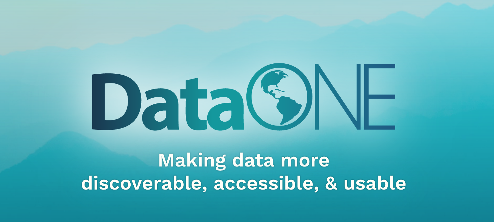
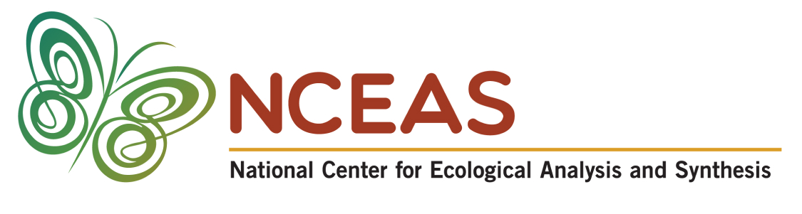

# Metacat: Data Preservation and Discovery System

Version: 3.0.0 Release
- See [Release Notes](RELEASE-NOTES.md)
- *DOI:* [PLACEHOLDER]

Send feedback and bugs to: 

- metacat-dev@ecoinformatics.org
- http://github.com/NCEAS/metacat

Metacat is repository software for preserving data and metadata
(documentation about data) that helps scientists find, understand and
effectively use data sets they manage or that have been created by
others. Hundreds of thousands of data sets are currently documented in
a standardized way and stored in Metacat systems, providing the
scientific community with a broad range of science data that can be
easily searched, compared, merged, or used in other ways because the
data are well and consistently described.

## Installation
See [installation notes](./docs/user/metacat/source/install.rst) for detailed instructions for your OS.

## Documentation
See the docs directory for detailed documentation and installation
instructions.

Details of the Metacat architecture can be found on the website for
the Knowledge Network for Biocomplexity (KNB):

  http://knb.ecoinformatics.org/software/metacat/

Contributions to this work are welcome.  Please see the above web site
for details on how to contribute.

## Major Known Bugs or Feature Requests (see http://github.com/NCEAS/metacat/issues)
If you discover a bug please report it, either by email (above) or by using
our bug tracking system (http://github.com/NCEAS/metacat/issues). There is a
list of currently unimplemented issues that we are working on
for the next release.

## Current Contributors

- Jing Tao (tao@nceas.ucsb.edu) [ORCID: 0000-0002-1209-5268](https://orcid.org/0000-0002-1209-5268)
- Matthew Brooke (brooke@nceas.ucsb.edu) [ORCID: 0000-0002-1472-913X](https://orcid.org/0000-0002-1472-913X)
- Dou Mok (mok@nceas.ucsb.edu) [ORCID: 0000-0002-6076-8092](https://orcid.org/0000-0002-6076-8092)
- Matthew B. Jones (jones@nceas.ucsb.edu): [ORCID: 0000-0003-0077-4738](https://orcid.org/0000-0003-0077-4738)

## Previous Contributors

- Chad Berkley (berkley@nceas.ucsb.edu)
- Jing Tao (tao@nceas.ucsb.edu)
- Jivka Bojilova (bojilova@nceas.ucsb.edu)
- Dan Higgins (higgins@nceas.ucsb.edu)
- Saurabh Garg (sgarg@nceas.ucsb.edu)
- Duane Costa (dcosta@lternet.edu)
- Veronique Connolly (connolly@nceas.ucsb.edu)
- Chris Jones (cjones@msi.ucsb.edu)
- John Harris (harris@nceas.ucsb.edu)
- Callie Bowdish (bowdish@ecoinformatics.org)
- Will Tyburczy (tyburczy@ecoinformatics.org)
- Matthew Perry (perry@nceas.ucsb.edu)
- Chad Burt (underbluewaters@gmail.com)
- Ben Leinfelder (leinfelder@nceas.ucsb.edu)
- Chris Barteau (barteau@nceas.ucsb.edu)
- Shaun Walbridge (walbridge@nceas.ucsb.edu)
- Michael Daigle (daigle@nceas.ucsb.edu)
- Lauren Walker (walker@nceas.ucsb.edu)
- Peter Slaughter (slaughter@nceas.ucsb.edu)
- Rob Nahf (rnahf@epscor.unm.edu)
- Matthew Brooke (brooke@nceas.ucsb.edu)

### Patch contributors
- Andrea Chadden (chadden@nceas.ucsb.edu)
- Johnoel Ancheta (johnoel@hawaii.edu)
- Owen Jones (owen.jones@imperial.ac.uk)

## Funding and Acknowledgements

This material is based upon work supported by the National Science Foundation under several grants along with the Department of Energy, the Mellon Foundation, and the Sloan Foundation.  Any opinions, findings and conclusions or recomendations expressed in this material are those of the author(s) and do not necessarily reflect the views of the National Science Foundation (NSF). Grant numbers (reverse chronological):

- NSF 2042102: Arctic Data Center (2021)
- DOE ESS-DIVE (2020)
- DOE ESS-DIVE (2017)
- NSF 1546024: Arctic Data Center (2015)
- NSF 1443062: MetaDIG (2014)
- NSF 1448821: Make Data Count (2014)
- NSF 1430508: DataONE (Data Observation Network for Earth) (2014)
- Mellon Foundation (2009)
- NSF 0830944: DataONE project (DataNet) (2008)
- Mellon Foundation (2006)
- NSF 0225676: SEEK project (ITR) (2002)
- NSF 99-04777: MARINE project (DBI) (1999)
- NSF 99-80154: KNB project (KDI) (1999)

## License

Copyright (C) 2024 Regents of the University of California and the National Center for Ecological Analysis and Synthesis

    This program is free software; you can redistribute it and/or modify
    it under the terms of the GNU General Public License as published by
    the Free Software Foundation; either version 2 of the License, or
    (at your option) any later version.

    This program is distributed in the hope that it will be useful,
    but WITHOUT ANY WARRANTY; without even the implied warranty of
    MERCHANTABILITY or FITNESS FOR A PARTICULAR PURPOSE.  See the
    GNU General Public License for more details.

    You should have received a copy of the GNU General Public License
    along with this program; if not, write to the Free Software
    Foundation, Inc., 59 Temple Place, Suite 330, Boston, MA  02111-1307  USA

This product includes software developed by the Apache Software
Foundation (http://www.apache.org/). See the LICENSE file in lib/apache
for details.

The source code, object code, and documentation in the com.oreilly.servlet
package is copyright and owned by Jason Hunter. See the cos-license.html file
for details of the license.  Licensor retains title to and ownership of the
Software and all enhancements, modifications, and updates to the Software.

This software includes the JDBC driver for PostgreSQL. See the [postgresql-license.txt](.lib/postgresql-license.txt)
 file for details.

