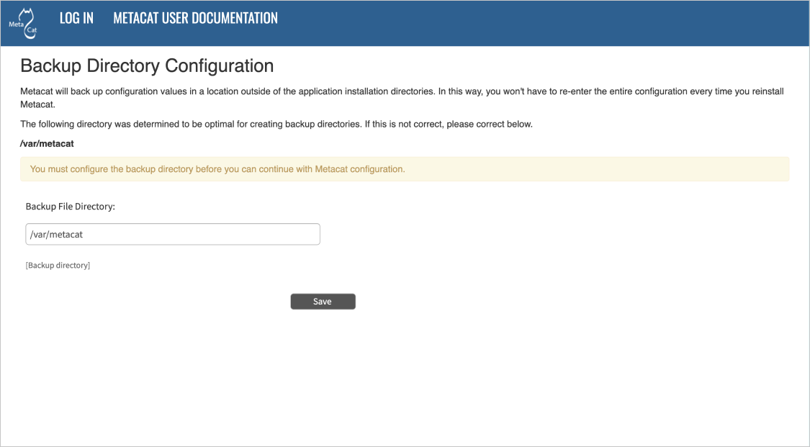
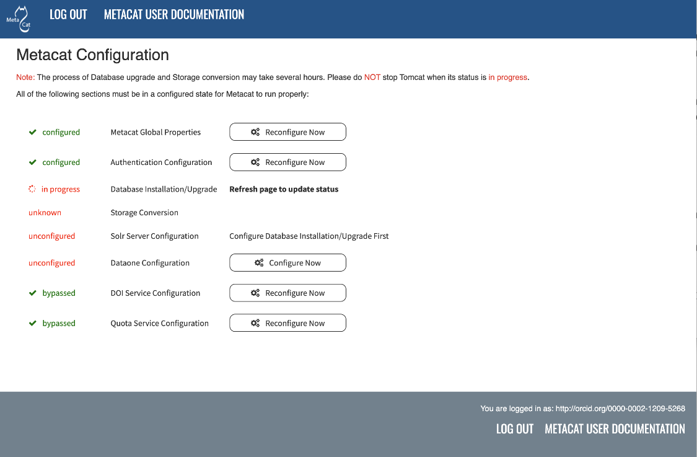
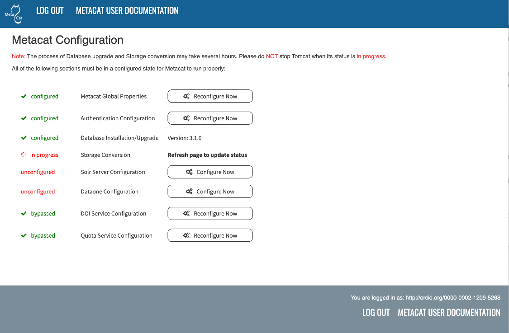
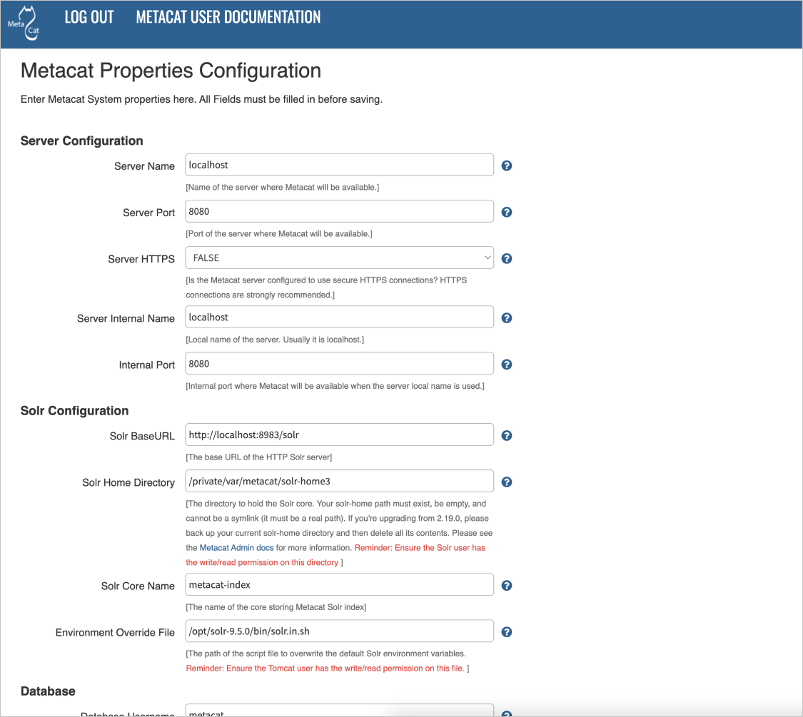
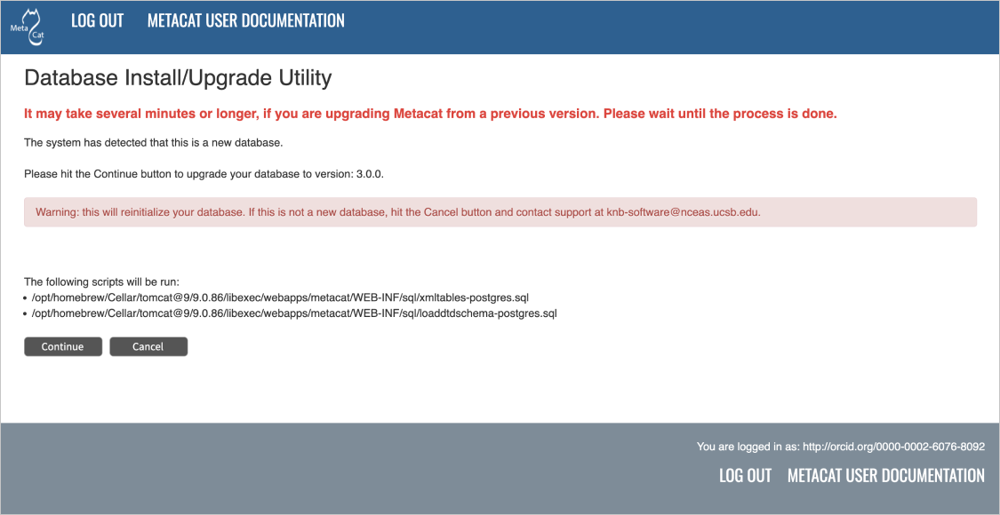
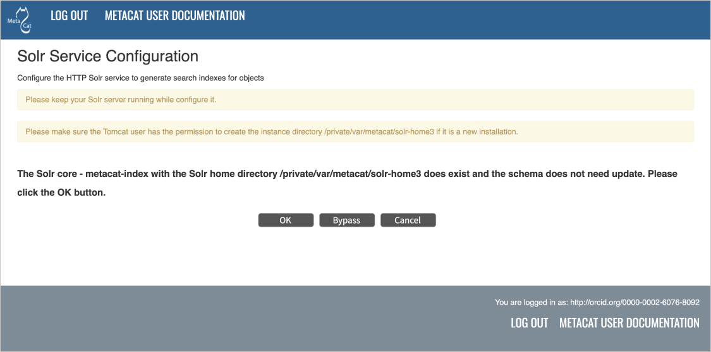
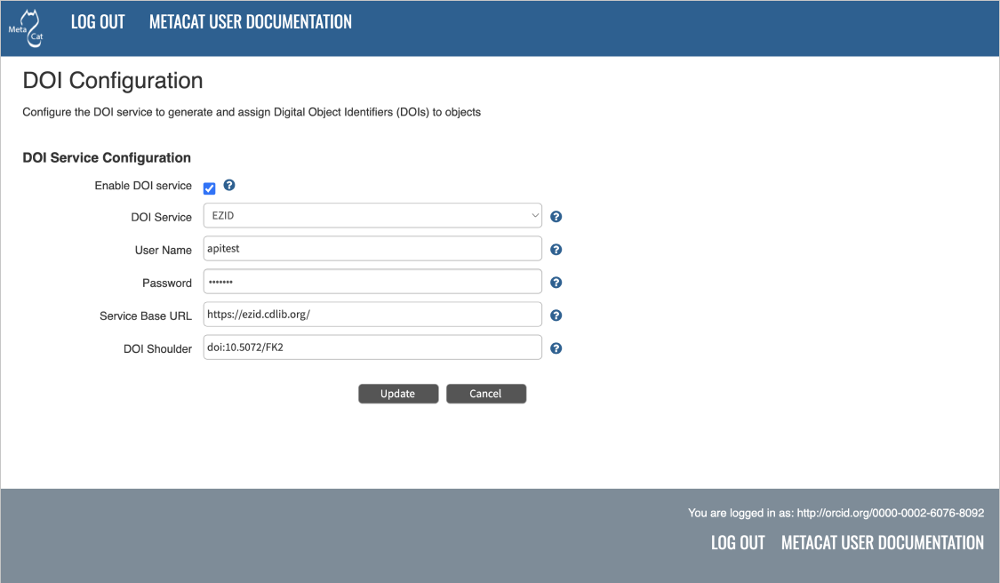

Configuring Metacat
===================

.. contents::
  
When Metacat (Tomcat) is started, the Metacat servlet checks to see if it is 
configured. If not, Metacat will automatically send you to the configuration 
pages. You will first be asked to set up the ORCID authentication.

If the installation is new, or the previous version is before 1.9.0, pay close 
attention to the configuration values. If you have upgraded Metacat, and the 
previous version is 1.9.0 or later, Metacat will pull existing configuration 
settings from a backup location. You should still verify that the values are 
correct.

To access your Metacat, open a Web browser and type::

  http://<your_context_url>

Where <your_context_url> is the URL of the server hosting the Metacat followed 
by the name of the WAR file (i.e., the application context) that you installed.
For instance, the context URL for the KNB Metacat is: http://knb.ecoinformatics.org/knb

You can always open the configuration screen from within Metacat by typing::

  http://<your_context_url>/admin

Initial Configuration & Backup Properties
-----------------------------------------
Before you can log in to the Metacat Admin interface and configure it, you are required to
confirm Metacat's back-up location for the configuration settings. You will also need to set up
the authentication configuration (if it is not already configured). This is required for logging in
to Metacat and for defining administrative accounts.

 **More on configuration backup settings:**

 - To preserve its configuration settings, Metacat backs up crucial configuration details to
   a directory outside the application directories.

 - Metacat will automatically attempt to locate an existing back-up directory, but you may need to
   correct the value or specify a directory (if the installation is new, or if Metacat was unable to
   determine the location of an existing back-up directory).

Starting from Metacat version 3.0.0, **metacat.properties** no longer contains any custom
settings that need to be backed up before a Metacat upgrade. Instead, custom settings are now saved
to a file named ``metacat-site.properties`` that is located outside of the tomcat webapps directory,
and so is not overwritten by deploying a new Metacat war file.

 **Note:** If you are unable to access your Metacat admin ORCID iD and need to swap it out, instructions
 for `Changing Authentication Configuration without Authentication`_ are included at the end of this
 section.

   Configuring the Backup Directory.

Authentication Configuration
----------------------------
Whether you are installing or upgrading the Metacat servlet, you will 
automatically be sent to the Authentication Configuration page. You can also 
reach the Authentication Configuration page from a running Metacat by typing

::
  
  http://<your_context_url>/admin

Starting from Metacat v3.0.0, only `ORCID authentication`_ is supported. In Metacat v2.19.0 and
previous releases, an internal password file or LDAP was used as the authentication mechanism.
Password-based and LDAP authentication has been deprecated. If you don't already have an account,
registering for an ORCID is simple, please visit:

  https://orcid.org/

.. _ORCID authentication: ./authinterface.html

After signing up for an ORCID iD, you can then use it as an admin identity when configuring
authentication.

 **Important:** Even though your ORCID iD should typically be expressed as a full https URI
 (e.g. https://orcid.org/0000-0001-2345-6789), it is necessary to use http-only orcid URIs when
 entering them in the Metacat Administrator Interface.

 - ex. **http**://orcid.org/0000-0001-2345-6789

You will not be allowed to continue with configuration if this is missing. If you require more
than one Metacat administrator, multiple accounts can be entered by separating the admin identities
with a semi-colon (;) character.

.. figure:: images/screenshots/image071_authconfig.png
   :align: center

   Configuring ORCID Authentication

Changing Authentication Configuration without Authentication
------------------------------------------------------------
If you need to change or add authentication information and cannot authenticate 
using the existing authentication settings (e.g., the existing Metacat 
administrator is no longer available or you forgot the administrator password), 
you must edit the Metacat configuration file by hand. This ensures that only a 
person who has access to the Metacat server and the configuration files on that 
server will be able to change the administrator accounts.

To edit the authentication configuration file:

1. Stop Tomcat and edit the Metacat site properties (*metacat-site.properties*) file. The
   default location for this file is in /var/metacat/config/, but this path is configurable,
   so it may be elsewhere.

  Tip: If you cannot find the **metacat-site.properties** file, its location is stored in a
  property named ``application.sitePropertiesDir`` inside the **metacat.properties** file,
  which can be found in:

  ::

    <tomcat_app_dir>/<context_dir>/WEB-INF/metacat.properties

    (where the <context_dir> is the application context, usually named "metacat".)

  See :ref:`configuration-properties-overview` for details

2. Once you have located **metacat-site.properties**, change the following properties appropriately
(or add them if they do not already exist)

  ::

    auth.administrators  - a semicolon-separated list of administrators' ORCID iDs

3. Save the **metacat-site.properties** file and start Tomcat.

Logging in to Metacat
---------------------
In order to configure Metacat, you must log in with an administrative account (ex. ORCID iD)
that has been configured in the Authentication Configuration settings. If you did not set up the
correct administrative user there, you must change the authentication configuration by hand
before you can log in.

In the log-in screen, click "Sign in with ORCID". You will be redirected to ORCID's login screen and
back to Metacat after successfully signing in with the correct administrative account.

   Logging into Metacat.

.. figure:: images/screenshots/image016_signintoorcid.png
   :align: center

   Sign into ORCID with the adminstrative account set during the auth configuration process.
   
Required Configuration
----------------------
All required Metacat settings can be accessed from the Metacat Configuration 
utility, which becomes available after the initial configurations 
have been specified and an authorized administrator logs in. 

   Metacat configuration menu, showing each configuration section.  Once all sections are marked as
   green ``configured`` (or ``complete`` or ``bypassed`` where relevant), Metacat can be accessed.

Configuration sections may have the following statuses (although not every status will be available
for all sections):

==============  ==========================================================================
Status          Description
==============  ==========================================================================
unknown         The section's status is unknown, pending configuration of earlier sections
unconfigured    The section has yet to be configured
in progress     The section is in the process of being configured
configured      The section has been configured successfully
complete        The section has performed an upgrade that is now complete
bypassed        The administrator has chosen not to configure the section
==============  ==========================================================================
 
To the right of each configuration section is one of the following options: 
**Configure Now**, **Reconfigure Now**, **Configure Global Properties First**, **Version: X.X.X**,
or **Refresh page to update status**.

If the option is a clickable link (e.g., **Configure Now** or **Reconfigure Now**),
you can use the link to open the associated configuration settings and edit them.
If the option is not linked, the settings cannot be specified until the global properties are set.
Once the global properties are configured, the option to configure this section becomes available.

The **Version: X.X.X** option is used only for the Database Installation/Upgrade section. If the
database schema version detected by Metacat matches the application version (e.g., 3.1.0),
then no further database configuration is required. Otherwise, the database upgrade should
be initiated by clicking the upgrade button on the database configuration page.

Since the database upgrade and the storage upgrade may take a long time to complete, you may see the
**Refresh page to update status** option:

   The Metacat settings as they appear when the database upgrade is in progress.

As indicated, you may refresh the page in your browser to see updates.

The Storage Conversion will start automatically, immediately after the database upgrade is
finished. The Storage Conversion converts the existing file storage format to the new DataONE
hashstore format, which introduces significant performance enhancements for managing large
datasets. The Storage Conversion may take a long time to complete, depending on the number and
size of the files in your repository. Again, you may refresh the page to see updates:

   The Metacat settings as they appear when the storage upgrade is in progress.

All settings must be in a ``configured``, ``complete`` or ``bypassed`` state in order to run
Metacat.

 **Reminder:** If you are reconfiguring a running version of Metacat, you must restart the Tomcat
 server for the changes to take effect.

.. figure:: images/screenshots/image019_configured.png
   :align: center

   The Metacat settings as they appear after having been configured.
   
Global Properties
-----------------
The Metacat configurations included under Global Properties represent the bulk 
of the settings required to run Metacat. Click a blue question-mark 
icon beside any setting for detailed instructions. More information about each 
property is also included in the :doc:`metacat-properties`.

   The Metacat Global Properties editing screen. Scrolling down will reveal additional global properties.

Metacat Initial Global Property Values
......................................
The first time you install Metacat, the system attempts to automatically detect
the values for a number of settings (see table). It is important to ensure that 
the following values are the properties below are correct.

 **Note:** When you save global properties, Metacat also saves a back-up file that is
 located in ``/var/metacat/.metacat`` (on Linux). When you update Metacat,
 the system automatically locates the back-up file so you do not have to re-enter
 the configuration settings.

=========================  =============================================================
Property                   Description
=========================  =============================================================
Metacat Context            The name of the deployed Metacat WAR file (minus the .war
                           extension). E.g., "metacat"
Server Name                The DNS name of the server hosting Metacat, not including
                           port numbers or the protocol ("http://").
HTTP Port                  The non-secure port where Metacat will be available.
HTTP SSL Port              The secure port where Metacat will be available.
Deploy Location            The directory where the application is deployed.
Site Properties Directory  Directory in which to store the metacat-site.properties file.
=========================  =============================================================

Solr Global Property Values
...........................
Please set the solr home directory property ``Solr Home Directory`` and ensure that the solr home
directory is writable/readable by the user **solr**.

Please ensure that the ``Environment Override File`` is writable/readable by the Tomcat user (ex. tomcat9).

=========================  =============================================================
Property                   Description
=========================  =============================================================
Solr Home Directory        The path to your solr-home (solr core).
                           If you are upgrading Metacat from version 2.12.2 or earlier,
                           please choose a different directory rather than the old one.
Environment Override File  The path of the script file to overwrite the default Solr
                           environment variables.
=========================  =============================================================

 For additional details, please see the section of Tomcat And Solr User Management on the `Solr installation page`_.

.. _Solr installation page: ./install.html#solr-server

Token Configuration
..............................................
A valid admin (auth) token and DataONE CA certificate are required for a Metacat v3.0.0 installation
to function correctly (i.e. to handle private datasets). Please `contact DataONE`_ to obtain a
long-term auth token (valid for 1 year). **This is only an interim requirement**; a future release
of Metacat will remove the need for this token.

  * If you are already part of the DataONE network and have a member node, we will issue you an auth token
  linked to your DataONE Node identity.

  * If you're not a DataONE member node, we `encourage you to join`_ (it's free!) so that your data
  can partake in DataONE's goal of the preservation of scientific data for future use.

  * Otherwise, we can issue an auth token linked to your Metacat administrator's ORCID iD.

If you are checking out Metacat for the first time, you can obtain a temporary auth token to continue
evaluating Metacat by logging into the KNB website, and navigating to "My Profile" -> "Settings" -> "Authentication Token".

 **Note:** This temporary auth token is only valid for 24 hours, but you can continue manually retrieving short-term tokens

.. _contact DataONE: https://www.dataone.org/contact/

.. _encourage you to join: https://www.dataone.org/jointhenetwork/

===============================  =============================================================
Property                         Description
===============================  =============================================================
Token Verification Certificates  Semicolon-separated list of paths to certificate files, each
                                 containing a single public key (not a certificate chain).
                                 These will be used to verify incoming request jwt tokens,
                                 in addition to verifying against the CN server.
Admin Token Path                 The path to the admin jwt token that will be used in
                                 dataone-indexer to access the private objects' system metadata.
===============================  =============================================================

The Admin Token
~~~~~~~~~~~~~~~
After obtaining an admin (auth) token, save it to the default path (below). If you wish to save it
elsewhere, be sure to update the global properties' ``Admin Token Path`` value with your custom path.

 Default Value for the admin (auth) token:

 ::

   /var/metacat/certs/token

Token Verification Certificate
~~~~~~~~~~~~~~~~~~~~~~~~~~~~~~
Next, you will need to obtain a DataONE Intermediate Certificate.
Depending on your needs, there are two available:

 1. `DataONE Production Intermediate CA Intermediate`_

 2. `DataONE Test Intermediate CA Certificate`_

 **Note:** the DataONE Intermediate CA certificate is a single certificate, NOT a certificate chain!

.. _DataONE Production Intermediate CA Intermediate: https://raw.githubusercontent.com/DataONEorg/ca/main/DataONEProdIntCA/certs/DataONEProdIntCA.pem
.. _DataONE Test Intermediate CA Certificate: https://raw.githubusercontent.com/DataONEorg/ca/main/DataONETestIntCA/certs/DataONETestIntCA.pem

After obtaining the certificate and saving it to your determined location, please set the value in
the following global property ``Token Verification Certificates`` with the path to the certificate.

Database Configuration
----------------------
Because the Database Configuration is dependent on values specified in the 
Global Properties section, the link to these settings does not become active 
until after the global settings have been saved. Once the global settings have 
been saved, Metacat automatically detects the database schema version and 
upgrades it if necessary (and with your permission). There are two expected
database configuration statuses:

 * New Installation

 * Upgrade

New Installation
................
If Metacat determines that your database is new, the Database Install/Upgrade 
utility lists the SQL scripts that will run in order to create a database 
schema for the new version of Metacat.

   Database installation creates tables needed for Metacat.
   
If the database is not new, or if you have any questions about whether it is 
new or not, choose Cancel and contact support at knb-help@nceas.ucsb.edu. 

When you choose Continue, Metacat runs the listed scripts and creates the 
database schema.

Upgrade
.......
If Metacat identifies a previous database schema, the Database Install/Upgrade 
utility notes the existing version and lists the SQL scripts that will run in 
order to update the schema for the new version of Metacat.

If the detected schema version is incorrect, or if you have any questions about 
whether it is correct or not, click the Cancel button and contact support at 
knb-help@nceas.ucsb.edu. When you choose to continue, Metacat runs the listed
scripts and updates the database schema.

Additional upgrade tasks may also run after the database upgrade is complete.
For systems hosting large amounts of data, these upgrade routines can take time to complete.
It is important to let the process complete before using Metacat otherwise your deployment may become unstable.

Solr Server Configuration
-------------------------
Because the Solr Server Configuration is dependent on values specified in the 
Global Properties section, the link to these settings does not become active 
until after the global settings have been saved. Once the global settings have 
been saved, Metacat automatically detects the status of the Solr Core and creates 
or upgrades it if necessary (and with your permission).

 **Note:** Your Solr server should be running when you configure Metacat. If it is not, please see the `Solr installation page`_.

   
Solr Troubleshooting
....................
If you click the Solr Configuration button and get the error message like 
``Server refused connection at: http://localhost:8983/solr``, this means the
Solr server is not running and you need to start it.

If you click the Create button to create the Solr core and get an error message 
like ``Couldn't persist core properties to /var/metacat/solr-home2/``, this means 
the solr user doesn't have the write permission to the Solr Home directory. You need
to add the solr user to the tomcat group, restart Solr server and Tomcat, log in again
and continue to configure Metacat. The instructions for adding users to groups can be found in the
Tomcat And Solr User Management part of the `Solr installation page`_.

DataONE Configuration
---------------------
Metacat can be configured to operate as a Member Node within the DataONE
federation of data repositories.  See :doc:`dataone` for background and details
on DataONE and details about configuring Metacat to act as a DataONE Member Node.

DOI Service Configuration
-------------------------
Metacat can be configured to assign Digital Object Identifiers (DOIs) to metadata/data objects
through a EZID service. Click a blue question-mark icon beside any setting for detailed instructions.
More information about each property is also included in the :doc:`metacat-properties`.

   Configuring DOI Service Configuration with EZID service.

Additional Configuration
------------------------
Metacat's properties are managed and modified either through use of the form-based
Metacat Configuration utility, or by being set directly via Metacat's editable properties file
(**metacat-site.properties**). More-detailed information is given in the following section.

Metacat Properties Overview
~~~~~~~~~~~~~~~~~~~~~~~~~~~
Properties Files
................
.. include:: ./properties-overview.rst

For information about each property, and default or example settings, please see the
:doc:`metacat-properties`. Properties that can only be edited manually in the
**metacat-site.properties** file are highlighted in the appendix.

Secret Properties
.................
Some properties hold sensitive information such as secret passwords. When these are entered via the
Metacat Configuration Utility, they are saved as plain text in the **metacat-site.properties** file.
If this causes security concerns, note that secrets may instead be passed to Metacat via
environment variables.

Full details on how to set these values and how they are used by Metacat can be found in the
Appendix, under: :ref:`secret-properties`.

(e.g., ``default`` or ``nceas``).

Read-only Mode
-------------------------------------
.. include:: ./readonly.rst

MetacatUI Themes
----------------
Metacat's default web interface `metacatui`_ can be easily modified. Please visit the `metacatui`_
docs to learn more and get started.

.. _metacatui: https://nceas.github.io/metacatui/
