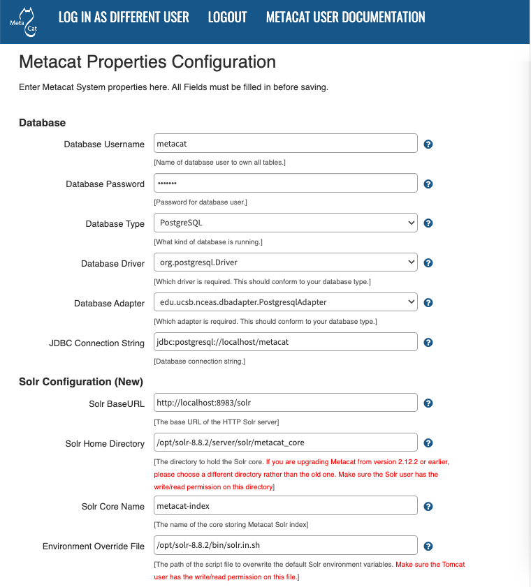

Configuring Metacat
===================

.. contents::
  
When Metacat (Tomcat) is started, the Metacat servlet checks to see if it is 
configured. If not, Metacat will automatically send you to the configuration 
pages. You will first be asked to set up the ORCID authentication.

If the installation is new, or the previous version is before 1.9.0, pay close 
attention to the configuration values. If you have upgraded Metacat, and the 
previous version is 1.9.0 or later, Metacat will pull existing configuration 
settings from a backup location. You should still verify that the values are 
correct.

To access your Metacat, open a Web browser and type::

  http://<your_context_url>

Where <your_context_url> is the URL of the server hosting the Metacat followed 
by the name of the WAR file (i.e., the application context) that you installed.
For instance, the context URL for the KNB Metacat is: http://knb.ecoinformatics.org/knb

You can always open the configuration screen from within Metacat by typing::

  http://<your_context_url>/admin

Initial Configuration & Backup Properties
-----------------------------------------
Before you can log in to the Metacat Admin interface and configure it, you are required to
set up the authentication configuration (if it is not already configured). This is required
for logging in to the Metacat and for defining administrative accounts.

Starting from Metacat version 3.0.0 or later, **metacat.properties** no longer contains any custom
settings that need to be backed up before a Metacat upgrade. Instead, custom settings are now saved
to a file named ``metacat-site.properties`` that is located outside of the tomcat webapps directory,
and so is not overwritten by deploying a new Metacat war file.

.. Note::

  If you are unable to access your Metacat admin ORCID iD and need to swap it out, instructions
  for `Changing Authentication Configuration without Authentication`_ are included at the end of
  this section.

Authentication Configuration
----------------------------
Whether you are installing or upgrading the Metacat servlet, you will 
automatically be sent to the Authentication Configuration page. You can also 
reach the Authentication Configuration page from a running Metacat by typing

::
  
  http://<your_context_url>/admin

Starting from Metacat 3.0.0, only `ORCID authentication`_ is supported. In Metacat v2.19.0 and
previous releases, an internal password file or LDAP was used as the authentication mechanism.
Password-based and LDAP authentication has been deprecated. If you don't already have an account,
registering for an ORCID is simple, please visit:

  http://orcid.org/

.. _ORCID authentication: ./authinterface.html

After signing up for an ORCID iD, you can then use it as an admin identity when configuring
authentication. **Note, your full ORCID iD includes "https://orcid.org/" not just the 16-digit
ORCID iD**:

  ex. http://orcid.org/0000-0001-2345-6789

Make sure that your full ORCID iD is entered into the Metacat Administrators field
(e.g., http://orcid.org/0000-0001-2345-6789). You will not be allowed to continue with configuration
if this is missing. In Metacat v2.19.0 and previous releases, multiple accounts can be entered,
separated by the colon (:) character. Starting from Metacat 3.0.0, please use the
semi-colon (;) character.

   Configuring ORCID Authentication

Changing Authentication Configuration without Authentication
------------------------------------------------------------
If you need to change or add authentication information and cannot authenticate 
using the existing authentication settings (e.g., the existing Metacat 
administrator is no longer available or you forgot the administrator password), 
you must edit the Metacat configuration file by hand. This ensures that only a 
person who has access to the Metacat server and the configuration files on that 
server will be able to change the administrator accounts.

To edit the authentication configuration file:

1. Stop Tomcat and edit the Metacat site properties (*metacat-site.properties*) file. The
   default location for this file is in /var/metacat/config/, but this path is configurable,
   so it may be elsewhere.

  Tip: If you cannot find the **metacat-site.properties** file, its location is stored in a
  property named ``application.sitePropertiesDir`` inside the **metacat.properties** file,
  which can be found in:

  ::

    <tomcat_app_dir>/<context_dir>/WEB-INF/metacat.properties

    (where the <context_dir> is the application context, usually named "metacat".)

  See :ref:`configuration-properties-overview` for details

2. Once you have located **metacat-site.properties**, change the following properties appropriately
(or add them if they do not already exist)

  ::

    auth.administrators  - a semicolon-separated list of administrators' ORCID iDs
    auth.url             - the authentication server URL
    auth.surl            - the authentication secure server URL
    auth.file.path       - the authentication password file path

3. Save the **metacat-site.properties** file and start Tomcat.

Logging in to Metacat
---------------------
In order to configure Metacat, you must log in with an administrative account (ex. ORCID iD)
that has been configured in the Authentication Configuration settings. If you did not set up the
correct administrative user there, you must change the authentication configuration by hand
before you can log in.

In the log-in screen, click "Sign in with ORCID". You will be redirected to ORCID's login screen and
back to Metacat after successfully signing in with the correct administrative account.

.. figure:: images/screenshots/image015_orcidlogin.png
   :align: center

   Logging into Metacat.

   Sign into ORCID with the adminstrative account set during the auth configuration process.
   
Required Configuration
----------------------
All required Metacat settings can be accessed from the Metacat Configuration 
utility, which becomes available after the initial configurations 
have been specified and an authorized administrator logs in. 

.. figure:: images/screenshots/image017_configupdated.png
   :align: center

   Metacat configuration menu, showing each configuration section.  Once all
   sections are marked as green ``configured``, metacat can be accessed.

Each configuration section has three statuses:

==============  =============================================================
Status          Description
==============  =============================================================
unconfigured    The section has yet to be configured 
configured      The section has been configured. 
bypassed        The administrator 
                can choose not to configure or skip the section.
==============  =============================================================
 
To the right of each configuration section is one of the following options: 
Configure Now, Reconfigure Now, Configure Global Properties First, or 
Version:X.X.X. If the option is linked (e.g., Configure Now or Reconfigure Now), 
you can select the link to open the associated configuration settings and edit them. 
If the option is not linked (e.g., Configure Global Properties First), the settings
cannot be specified until the global properties are set. Once the global properties
are configured, the option to configure this section becomes available.
The Version:X.X.X option is used only for the Database Installation/Upgrade section.
If the database schema version detected by Metacat matches the application version (e.g., 3.0.0),
then no further database configuration is required.

All settings must be in a configured or bypassed state in order to run Metacat. 
Note that Metacat indexes at start-up time, so the initial start-up may take some time depending
on the amount of data in your database and whether or not you have opted to regenerate the spatial
cache. If you are reconfiguring a running version of Metacat, you must restart the Tomcat server
for the changes to take effect.
   
.. figure:: images/screenshots/image019_configured.png
   :align: center

   The Metacat settings as they appear after having been configured.
   
Global Properties (server, ports, etc)
~~~~~~~~~~~~~~~~~~~~~~~~~~~~~~~~~~~~~~
The Metacat configurations included under Global Properties represent the bulk 
of the settings required to run Metacat. Click a blue question-mark 
icon beside any setting for detailed instructions. More information about each 
property is also included in the :doc:`metacat-properties`.

   The Metacat Global Properties editing screen.
   
When you save global properties, Metacat also saves a back-up file that is 
located in ``/var/metacat/.metacat`` (on Linux). When you update Metacat, 
the system automatically locates the back-up file so you do not have to re-enter 
the configuration settings.

The first time you install Metacat, the system attempts to automatically detect 
the values for a number of settings (see table). It is important to ensure that 
these values are correct.

=========================  =============================================================
Property                   Description
=========================  =============================================================
Metacat Context            The name of the deployed Metacat WAR file (minus the .war
                           extension). E.g., "metacat"
Server Name                The DNS name of the server hosting Metacat, not including
                           port numbers or the protocol ("http://").
HTTP Port                  The non-secure port where Metacat will be available.
HTTP SSL Port              The secure port where Metacat will be available.
Deploy Location            The directory where the application is deployed.
Site Properties Directory  Directory in which to store the metacat-site.properties file.
=========================  =============================================================

.. Note:: 

  The Solr Home directory you choose should be writable/readable by the user solr.
  
  The Environment Overwrites File should be writable/readable by the user tomcat8.
  
  The section of Tomcat And Solr User Management on the `Solr installation page`_ will resolve this issue.

.. _Solr installation page: ./install.html#solr-server

Authentication Configuration
~~~~~~~~~~~~~~~~~~~~~~~~~~~~
Because you must specify the Authentication settings before you can access the 
main configuration page, the settings will always be configured when you view 
them in the admin interface. If you wish to change the authentication settings, 
you must restart Metacat to put the changes into effect. For more information 
about the Authentication configurations, please see Initial Configurations.

Skins Configuration 
~~~~~~~~~~~~~~~~~~~   
Customizing the look and feel of Metacat's web interface is done via skins or
MetacatUI themes, however as of Version 2.2.0, skins have been deprecated. 
Use MetacatUI themes instead - see :doc:`themes`. Themes can be deployed separately from the
Metacat server allowing easier independent user interface customization.

MetacatUI Themes
................
Themes are applied in the Skins Configuration section. If you have installed 
the optional Registry, which provides a web interface for creating, editing, 
and submitting content to Metacat, you can also choose which form fields 
appear in that interface and which are required. Note that if you do not have 
a custom theme AND you are not using the Registry, you can simply save the 
``metacatui`` default configuration.

To use the new MetacatUI theming system, select ``metacatui`` and click the 
``Make metacatui default`` radio button. Metacat will open a list of options 
that apply to the Registry interface. For more information about creating 
custom themes, see the section called :doc:`themes`.

.. figure:: images/screenshots/image070.png
   :align: center
   :width: 1100px

   Configuring Metacat themes.

Skins
.....

.. deprecated:: 2.2.0
   Use ``themes`` instead; see :doc:`themes`

   To use MetacatUI themes, select ``metacatui`` as the default skin during skin configuration
   in the administration interface.

If your Metacat has a customized skin, it will appear as a choice in the
Skins Configuration settings (see below screenshot). Select the checkbox next
to your customized skin or and click the ``Make <skin_name> default`` radio button.
If you do not have a custom skin, select the ``default`` skin. 

Once you have selected a skin, Metacat will open a list of options that apply to the Registry 
interface. For more information about creating skins, see the Creating a Custom Skin
section in :doc:`themes`.

.. figure:: images/screenshots/image023.png
   :align: center
   :width: 1100px

   Configuring Metacat skins.
   
Select the checkbox next to your customized skin or and click the 
``Make <skin_name> default`` radio button. If you do not have a custom skin, 
select the ``default`` skin. Once you have selected a skin, Metacat will open 
a list of options that apply to the Registry interface.

Select the lists and modules that you would like to appear in the Registry 
form-interface by checking the box beside each. When you save the configuration, 
the customized interface will appear to site visitors.

Database Configuration
~~~~~~~~~~~~~~~~~~~~~~
Because the Database Configuration is dependent on values specified in the 
Global Properties section, the link to these settings does not become active 
until after the global settings have been saved. Once the global settings have 
been saved, Metacat automatically detects the database schema version and 
upgrades it if necessary (and with your permission). 

* New Installation
* Upgrade

New Installation
................
If Metacat determines that your database is new, the Database Install/Upgrade 
utility lists the SQL scripts that will run in order to create a database 
schema for the new version of Metacat.

.. figure:: images/screenshots/image027.png
   :align: center

   Database installation creates tables needed for Metacat.
   
If the database is not new, or if you have any questions about whether it is 
new or not, choose Cancel and contact support at knb-help@nceas.ucsb.edu. 

When you choose Continue, Metacat runs the listed scripts and creates the 
database schema.

Upgrade
.......
If Metacat identifies a previous database schema, the Database Install/Upgrade 
utility notes the existing version and lists the SQL scripts that will run in 
order to update the schema for the new version of Metacat.

If the detected schema version is incorrect, or if you have any questions about 
whether it is correct or not, click the Cancel button and contact support at 
knb-help@nceas.ucsb.edu.When you choose to continue, Metacat runs the listed 
scripts and updates the database schema.

.. figure:: images/screenshots/image029.png
   :align: center

   Upgrading an existing database.
   
Additional upgrade tasks may also run after the database upgrade is complete.
For systems hosting large amounts of data, these upgrade routines can take time to complete.
It is important to let the process complete before using Metacat otherwise your deployment may become unstable.

Solr Server Configuration
~~~~~~~~~~~~~~~~~~~~~~~~~
Because the Solr Server Configuration is dependent on values specified in the 
Global Properties section, the link to these settings does not become active 
until after the global settings have been saved. Once the global settings have 
been saved, Metacat automatically detects the status of the Solr Core and creates 
or upgrades it if necessary (and with your permission). 

.. figure:: images/screenshots/image073.png
   :align: center
   :width: 1200px

.. Note:: 

  Solr server should be running when you configure Metacat.
   
Troubleshooting
...............
If you click the Solr Configuration button and get the error message like 
``Server refused connection at: http://localhost:8983/solr``, this means the 
Solr server is not running and you need to start it.

If you click the Create button to create the Solr core and get an error message 
like ``Couldn't persist core properties to /var/metacat/solr-home2/``, this means 
the solr user doesn't have the write permission to the Solr Home directory. You need
to add the solr user to the tomcat group, restart Solr server and Tomcat, log in again
and continue to configure Metacat. The instructions for adding users to groups can be found in the
Tomcat And Solr User Management part of the `Solr installation page`_.

DataONE Configuration
~~~~~~~~~~~~~~~~~~~~~
Metacat can be configured to operate as a Member Node within the DataONE
federation of data repositories.  See :doc:`dataone` for background and details
on DataONE and details about configuring Metacat to act as a DataONE Member Node.

Replication Configuration
~~~~~~~~~~~~~~~~~~~~~~~~~
Metacat can be configured to replicate its metadata and/or data content to another
Metacat instance for backup and redundancy purposes, as well as to share data across
sites.  This feature has been used to create the Knowledge Network for Biocomplexity
(KNB), as well as other networks.  See :doc:`replication` for details on
the replication system and how to configure Metacat to replicate with another node.

.. Note:: 
  
  Note that much of the functionality provided by the replication subsystem in Metacat
  has now been generalized and standardized by DataONE, so consider utilizing the
  DataONE services for replication as it is a more general and standardized approach
  than this Metacat-specific replication system.  The Metacat replication system
  will be supported for a while longer, but will likely be deprecated in a future
  release in favor of using the DataONE replication approach. 

EZID Configuration
~~~~~~~~~~~~~~~~~~
Metacat can be configured to assign Digital Object Identifiers (DOIs) to metadata/data objects
through a EZID service. Click a blue question-mark icon beside any setting for detailed instructions.
More information about each property is also included in the :doc:`metacat-properties`.

.. figure:: images/screenshots/image072.png
   :align: center
   :width: 900px

   Configuring EZID service.

Additional Configuration
------------------------
Metacat's properties are managed and modified either through use of the form-based
Metacat Configuration utility, or by being set directly via Metacat's editable properties file
(**metacat-site.properties**). More-detailed information is given in the following section.

Metacat Properties Overview
~~~~~~~~~~~~~~~~~~~~~~~~~~~
Properties Files
................
.. include:: ./properties-overview.rst

For information about each property, and default or example settings, please see the
:doc:`metacat-properties`. Properties that can only be edited manually in the
**metacat-site.properties** file are highlighted in the appendix.

Secret Properties
.................
Some properties hold sensitive information such as secret passwords. When these are entered via the
Metacat Configuration Utility, they are saved as plain text in the **metacat-site.properties** file.
If this causes security concerns, note that secrets may instead be passed to Metacat via
environment variables.

Full details on how to set these values and how they are used by Metacat can be found in the
Appendix, under: :ref:`secret-properties`.

<SKIN_NAME>.properties
~~~~~~~~~~~~~~~~~~~~~~
.. deprecated:: 2.2.0
   Use ``themes`` instead; see :doc:`themes`

The ``<SKIN_NAME>.properties`` file contains skin-specific properties
(e.g., template information). For each skin, the skin-specific properties are 
found here::

  <CONTEXT_DIR>/style/skins/<SKIN_NAME>/<SKIN_NAME>.properties

Where ``<CONTEXT_DIR>`` is the directory in which the Metacat application code 
lives (described above) and ``<SKIN_NAME>`` is the name of the skin 
(e.g., ``default`` or ``nceas``).

Additional configuration for Tomcat 7
~~~~~~~~~~~~~~~~~~~~~~~~~~~~~~~~~~~~~
When running Metacat on Tomcat 7, you may get the following 
error logging in via the Morpho application: "Fatal error sending data to Metacat: Bad Set_Cookie header:JSESSIONID=...".
In order to fix the issue, modify <Catalina_HOME>/conf/context.xml 
(e.g., /var/lib/tomcat7/conf/context.xml) by adding a new attribute - "useHttpOnly" - and set it to false for the "Context" element::

  <Context useHttpOnly="false">

Then restart Tomcat 7.

.. include:: ./readonly.rst
