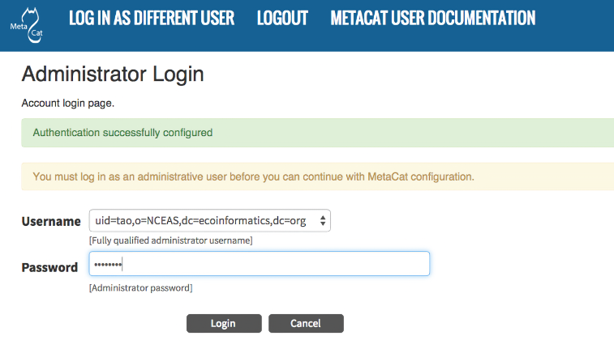

Configuring Metacat
===================

.. contents::
  
When Metacat (Tomcat) is started, the Metacat servlet checks to see if it is 
configured. If not, Metacat will automatically send you to the configuration 
pages. 

If the installation is new, or the previous version is before 1.9.0, pay close 
attention to the configuration values. If you have upgraded Metacat, and the 
previous version is 1.9.0 or later, Metacat will pull existing configuration 
settings from a backup location. You should still verify that the values are 
correct.

To access your Metacat, open a Web browser and type::

  http://<your_context_url>

Where <your_context_url> is the URL of the server hosting the Metacat followed 
by the name of the WAR file (i.e., the application context) that you installed.
For instance, the context URL for the KNB Metacat is: http://knb.ecoinformatics.org/knb

You can always open the configuration screen from within Metacat by typing::

  http://<your_context_url>/admin

Initial Configuration
---------------------
Before you can log in to the Metacat and configure it, you are required to 
confirm Metacat's back-up location and authentication configuration (if not 
already configured). Metacat will automatically attempt to locate an existing 
back-up directory, but you may need to correct the value or specify a directory 
(if the installation is new, or if Metacat was unable to determine the location 
of an existing back-up directory). The authentication configuration is required 
for logging in to the Metacat and for defining administrative accounts. 
Instructions for `Changing Authentication Configuration without Authentication`_ 
are included at the end of this section.

Back-up Configuration
~~~~~~~~~~~~~~~~~~~~~
To preserve its configuration settings, Metacat backs up crucial configuration details to 
a directory outside the application directories. Because a new installation/upgrade 
does not know where this external directory is, Metacat uses a discovery 
algorithm to locate it. If Metacat cannot identify a backup directory, you will 
see the Backup Directory Configuration screen.

NOTE: If the metacat.properties file has many custom settings, it should be manually 
backed up before any Metacat upgrade as deploying a new Metacat war file will overwrite
the existing file.

.. figure:: images/screenshots/image011.png
   :align: center

   Configuring the Backup Directory.
   
Authentication Configuration
~~~~~~~~~~~~~~~~~~~~~~~~~~~~
Whether you are installing or upgrading the Metacat servlet, you will 
automatically be sent to the Authentication Configuration page. You can also 
reach the Authentication Configuration page from a running Metacat by typing::
  
  http://<your_context_url>/admin

Metacat uses LDAP as its primary authentication mechanism, but you can define 
your own authentication mechanism by creating a Java class that implements 
``AuthInterface``. Required configuration values are: Authentication Class, 
Authentication URL, Authentication Secure URL, and Metacat Administrators. 
Make sure that your user account information is entered into the Metacat 
Administrators field (e.g., uid=daigle,o=nceas,dc=ecoinformatics,dc=org). You 
will not be allowed to continue with configuration if this is missing. 

NOTE: To create an LDAP account on the KNB LDAP server (specified as the 
default LDAP server), go to http://knb.ecoinformatics.org and select the 
"create a new user account" link.

If you make changes to the authentication settings, you must restart Tomcat to 
put them into effect.

.. figure:: images/screenshots/image009.png
   :align: center

   Configuring Authentication Values.

Changing Authentication Configuration without Authentication
~~~~~~~~~~~~~~~~~~~~~~~~~~~~~~~~~~~~~~~~~~~~~~~~~~~~~~~~~~~~
If you need to change or add authentication information and cannot authenticate 
using the existing authentication settings (e.g., the existing Metacat 
administrator is no longer available or you forgot the administrator password), 
you must edit the Metacat configuration file by hand. This ensures that only a 
person who has access to the Metacat server and the configuration files on that 
server will be able to change the administrator accounts.

To edit the authentication configuration file:

1. Stop Tomcat and edit the Metacat properties (``metacat.properties``) file in the
   Metacat context directory inside the Tomcat application directory. The 
   Metacat context directory is the name of the application (usually metacat):

  ::
  
    <tomcat_app_dir>/<context_dir>/WEB-INF/metacat.properties

2. Change the following properties appropriately:

  ::
  
    auth.administrators - a colon separated list of administrators 
    auth.url - the authentication server URL 
    auth.surl - the authentication secure server URL

3. Save the ``metacat.properties`` file and start Tomcat.

Logging in to Metacat
---------------------
In order to configure Metacat, you must log in with an administrative account 
that has been configured in the Authentication Configuration settings. If you 
did not set up the correct administrative user there, you must change the 
authentication configuration by hand before you can log in.

In the log-in screen enter your user name and password and click 
the "Login" button.

   Logging into Metacat.
   
Required Configuration
----------------------
All required Metacat settings can be accessed from the Metacat Configuration 
utility, which becomes available after the initial configurations 
have been specified and an authorized administrator logs in. 

.. figure:: images/screenshots/image017.png
   :align: center

   Metacat configuration menu, showing each configuration section.  Once all
   sections are marked as green ``configured``, metacat can be accessed.

The configuration settings are grouped into five sections (Metacat Global 
Properties, Authentication Configuration, Skins Specific Properties, Database 
Installation/Upgrade, Geoserver, DataONE, and Replication Configuration), 
each of which is listed with its current status (see table).

==============  =============================================================
Status          Description
==============  =============================================================
unconfigured    The section has yet to be configured 
configured      The section has been configured. 
bypassed        The administrator 
                can choose not to configure or skip the section.
==============  =============================================================
 
To the right of each configuration section is one of the following options: 
Configure Now, Reconfigure Now, Configure Global Properties First, or 
Version:X.X.X. If the option is linked (e.g., Configure Now or Reconfigure Now), 
you can select the link to open the associated configuration settings and edit them. 
If the option is not linked (e.g., Configure Global 
Properties First), the settings cannot be specified until the global properties 
are set. Once the global properties are configured, the option to configure this 
section becomes available. The Version:X.X.X option is used only for the 
Database Installation/Upgrade section. If the database schema version detected 
by Metacat matches the application version (eg, 1.9.0), then no further database 
configuration is required.

All settings must be in a configured or bypassed state in order to run Metacat. 
For new installations or upgrades, click the "go to metacat" link that appears 
after configuration is complete to go directly to Metacat. Note that Metacat 
indexes at start-up time, so the initial start-up may take some time depending 
on the amount of data in your database and wheter or not you have opted to regenerate the spatial cache. 
If you are reconfiguring a running 
version of Metacat, you must restart the Tomcat server for the changes to 
take effect.
   
.. figure:: images/screenshots/image019.png
   :align: center

   The Metacat settings as they appear after having been configured.
   
Global Properties (server, ports, etc)
~~~~~~~~~~~~~~~~~~~~~~~~~~~~~~~~~~~~~~
The Metacat configurations included under Global Properties represent the bulk 
of the settings required to run Metacat. Click a blue question-mark 
icon beside any setting for detailed instructions. More information about each 
property is also included in the :doc:`metacat-properties`.

.. figure:: images/screenshots/image021.png
   :align: center

   The Metacat Global Properties editing screen.
   
When you save global properties, Metacat also saves a back-up file that is 
located in ``/var/metacat/.metacat`` (on Linux) or 
``C:\Program Files\metacat\.metacat`` (on Windows). When you update Metacat, 
the system automatically locates the back-up file so you do not have to re-enter 
the configuration settings.

The first time you install Metacat, the system attempts to automatically detect 
the values for a number of settings (see table). It is important to ensure that 
these values are correct.

================  ============================================================
Property          Description
================  ============================================================
Metacat Context   The name of the deployed Metacat WAR file (minus the .war 
                  extension). E.g., "metacat"
Server Name       The DNS name of the server hosting Metacat, not including 
                  port numbers or the protocol ("http://"). 
HTTP Port         The non-secure port where Metacat will be available.
HTTP SSL Port     The secure port where Metacat will be available. 
Deploy Location   The directory where the application is deployed. 
================  ============================================================

Authentication Configuration
~~~~~~~~~~~~~~~~~~~~~~~~~~~~
Because you must specify the Authentication settings before you can access the 
main configuration page, the settings will always be configured when you view 
them in the admin interface. If you wish to change the authentication settings, 
you must restart Metacat to put the changes into effect. For more information 
about the Authentication configurations, please see Initial Configurations.

Skins Configuration 
~~~~~~~~~~~~~~~~~~~   
Customizing the look and feel of Metacat's web interface is done via skins or
MetacatUI themes, however as of Version 2.2.0, skins have been deprecated. 
Use MetacatUI themes instead. Themes can be deployed separately from the 
Metacat server allowing easier independent user interface customization.

MetacatUI Themes
................
Themes are applied in the Skins Configuration section. If you have installed 
the optional Registry, which provides a web interface for creating, editing, 
and submitting content to Metacat, you can also choose which form fields 
appear in that interface and which are required. Note that if you do not have 
a custom theme AND you are not using the Registry, you can simply save the 
``metacatui`` default configuration.

To use the new MetacatUI theming system, select ``metacatui`` and click the 
``Make metacatui default`` radio button. Metacat will open a list of options 
that apply to the Registry interface. For more information about creating 
custom themes, see the section called :doc:`themes`.

.. figure:: images/screenshots/image070.png
   :align: center

   Configuring Metacat themes.

Skins
................
.. deprecated:2.2.0
   Use themes instead
   
If your Metacat has a customized skin, it will appear as a choice in the 
Skins Configuration settings (see below screenshot). Select the checkbox next 
to your customized skin or and click the ``Make <skin_name> default`` radio button. 
If you do not have a custom skin, select the ``default`` skin. 

Once you have selected a skin, Metacat will open a list of options that apply to the Registry 
interface. For more information about creating skins, see the Creating a Custom Skin
section in :doc:`themes`.

.. figure:: images/screenshots/image023.png
   :align: center

   Configuring Metacat skins.
   
Select the checkbox next to your customized skin or and click the 
``Make <skin_name> default`` radio button. If you do not have a custom skin, 
select the ``default`` skin. Once you have selected a skin, Metacat will open 
a list of options that apply to the Registry interface.

.. figure:: images/screenshots/image025.png
   :align: center

   Configuring Metacat skins.

Select the lists and modules that you would like to appear in the Registry 
form-interface by checking the box beside each. When you save the configuration, 
the customized interface will appear to site visitors.

Database Configuration
~~~~~~~~~~~~~~~~~~~~~~
Because the Database Configuration is dependent on values specified in the 
Global Properties section, the link to these settings does not become active 
until after the global settings have been saved. Once the global settings have 
been saved, Metacat automatically detects the database schema version and 
upgrades it if necessary (and with your permission). 

* New Installation
* Upgrade

New Installation
................
If Metacat determines that your database is new, the Database Install/Upgrade 
utility lists the SQL scripts that will run in order to create a database 
schema for the new version of Metacat.

.. figure:: images/screenshots/image027.png
   :align: center

   Database installation creates tables needed for Metacat.
   
If the database is not new, or if you have any questions about whether it is 
new or not, choose Cancel and contact support at knb-help@nceas.ucsb.edu. 

When you choose Continue, Metacat runs the listed scripts and creates the 
database schema.

Upgrade
.......
If Metacat identifies a previous database schema, the Database Install/Upgrade 
utility notes the existing version and lists the SQL scripts that will run in 
order to update the schema for the new version of Metacat.

If the detected schema version is incorrect, or if you have any questions about 
whether it is correct or not, click the Cancel button and contact support at 
knb-help@nceas.ucsb.edu.When you choose to continue, Metacat runs the listed 
scripts and updates the database schema.

.. figure:: images/screenshots/image029.png
   :align: center

   Upgrading an existing database.
   
Additional upgrade tasks may also run after the database upgrade is complete.
For systems hosting large amounts of data, these upgrade routines can take time to complete.
It is important to let the process complete before using Metacat otherwise your deployment may become unstable.
   

Geoserver Configuration (Highly Recommended)
~~~~~~~~~~~~~~~~~~~~~~~~~~~~~~~~~~~~~~~~~~~~
.. sidebar:: Manual Geoserver Update

  Alternatively, you can change the Geoserver username and password manually by 
  directly logging in to the Geoserver. To configure the credentials manually: 

  1. Go to the Geoserver admin page: http://<your_context_url>/geoserver/ 
  2. Log in using the default username and password ( admin / geoserver ) 
  3. Navigate to the Password Change Page.  Enter a new user and password and click Submit. 
  4. Click Apply then Save to save your new password. 
  
Metacat comes bundled with a Web Mapping Service called Geoserver, which 
converts spatial data into Web-deliverable map images. Geoserver installs with 
a default administrative username and password. *We highly recommend that you 
change the default credentials so that only local administrators can make 
changes to your Geoserver.* For more information about Geoserver, 
see :doc:`geoserver`.

When you choose the Geoserver Configuration link from the main configuration 
screen, Metacat will prompt you for a few important details about your Geoserver 
installation. The data directory and context settings allow Geoserver and 
Metacat to share the same spatial data store and render maps within Metacat skins. 
The security configuration prompts for a new admin password. After you enter 
the new settings, Metacat writes the information to the Geoserver deployment.

The default settings are typically appropriate for most Metacat deployments, 
but if you wish to skip the Geoserver configuration, click the Bypass button. 
Geoserver (if deployed) will remain with a default configuration and the main 
Metacat configuration screen will display the "bypassed" status beside the 
Geoserver settings. You will be able to run Metacat, but maps will not be 
rendered.

.. figure:: images/screenshots/image031.png
   :align: center

   Configuring Geoserver.

DataONE Configuration
~~~~~~~~~~~~~~~~~~~~~
Metacat can be configured to operate as a Member Node within the DataONE
federation of data repositories.  See :doc:`dataone` for background and details
on DataONE and details about configuring Metacat to act as a DataONE Member Node.

Replication Configuration
~~~~~~~~~~~~~~~~~~~~~~~~~
Metacat can be configured to replicate its metadata and/or data content to another
Metacat instance for backup and redundancy purposes, as well as to share data across
sites.  This feature has been used to create the Knowledge Network for Biocomplexity
(KNB), as well as other networks.  See :doc:`replication` for details on
the replication system and how to configure Metacat to replicate with another node.

.. Note:: 
  
  Note that much of the functionality provided by the replication subsystem in Metacat
  has now been generalized and standardized by DataONE, so consider utilizing the
  DataONE services for replication as it is a more general and standardized approach
  than this Metacat-specific replication system.  The Metacat replication system
  will be supported for a while longer, but will likely be deprecated in a future
  release in favor of using the DataONE replication approach. 

Additional Configuration
------------------------
The most dynamic Metacat properties are managed and modified with the 
form-based Metacat Configuration utility. These configuration properties can 
also be accessed directly (along with additional static properties) via 
Metacat's property files: ``metacat.properties`` (which contains global 
properties, e.g., authorization and database values) and 
``<SKIN_NAME>.properties`` (which contains skin-specific properties). Each of 
these property files is discussed in more depth in this section.

The ``metacat.properties`` file
~~~~~~~~~~~~~~~~~~~~~~~~~~~~~~~
Metacat's ``metacat.properties`` file contains all of Metacat's global 
properties, both the dynamic properties, which are managed with the 
Configuration utility, as well as the more static properties, which can only 
be modified manually in this file. The ``metacat.properties`` file also contains 
optional properties that are only relevant when optional Metacat features 
(such as the harvester or replication) are enabled. The `
`metacat.properties file`` is found here::

  <CONTEXT_DIR>/WEB_INF/metacat.properties

Where ``<CONTEXT_DIR>`` is the directory in which the Metacat application code 
lives (e.g., ``/var/lib/tomcat6/webapps/metacat``). The path is a combination 
of the Web application directory (e.g., ``/var/lib/tomcat6/webapps/``) and 
the Metacat context directory (e.g., ``metacat``). Both values depend upon how your 
system was set up during installation.

For information about each property and default or example settings, please 
see the :doc:`metacat-properties`. Properties that can only be edited manually 
in the metacat.properties file are highlighted in the appendix.

<SKIN_NAME>.properties
~~~~~~~~~~~~~~~~~~~~~~
The ``<SKIN_NAME>.properties`` file contains skin-specific properties 
(e.g., template information). For each skin, the skin-specific properties are 
found here::

  <CONTEXT_DIR>/style/skins/<SKIN_NAME>/<SKIN_NAME>.properties

Where ``<CONTEXT_DIR>`` is the directory in which the Metacat application code 
lives (described above) and ``<SKIN_NAME>`` is the name of the skin 
(e.g., ``default`` or ``nceas``).
