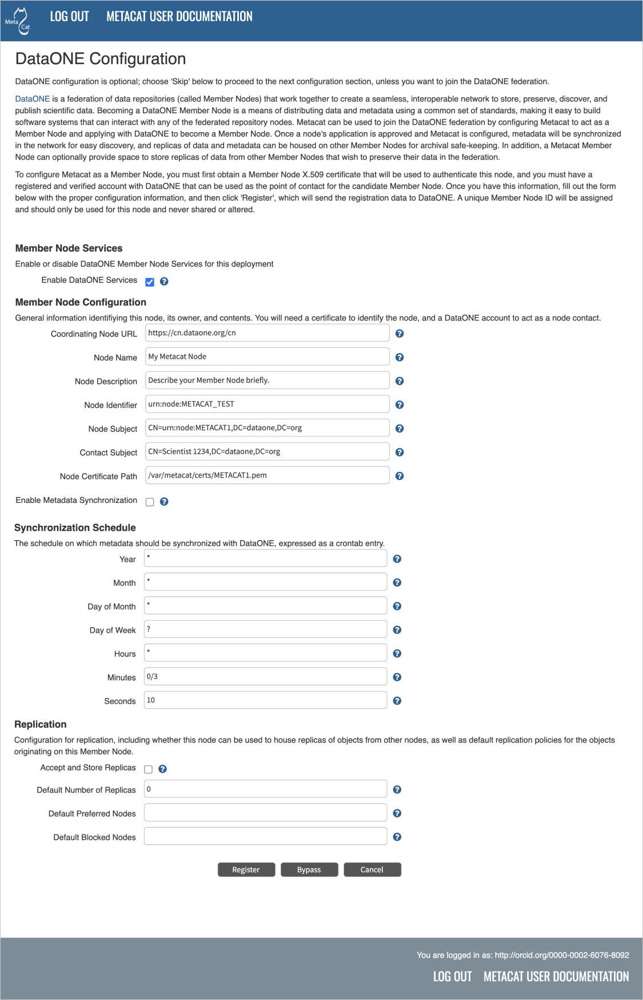
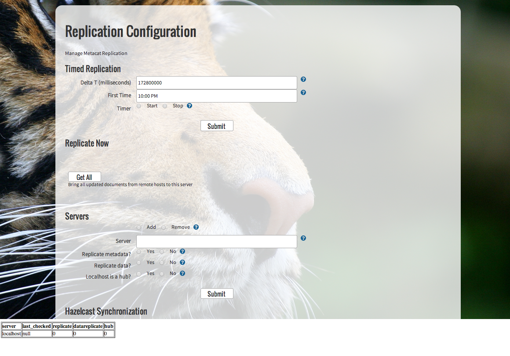

DataONE Member Node Support
===========================
DataONE_ is a federation of data repositories that aims to improve 
interoperability among data repository software systems and advance the
preservation of scientific data for future use.
Metacat deployments can be configured to participate in DataONE_. This 
chapter describes the DataONE_ data federation, its architecture, and the
way in which Metacat can be used to participate as a node in the DataONE system.

.. _DataONE: http://dataone.org/

What is DataONE?
----------------
The DataONE_ project is a collaboration among scientists, technologists, librarians,
and social scientists to build a robust, interoperable, and sustainable system for
preserving and accessing Earth observational data at national and global scales.  
Supported by the U.S. National Science Foundation, DataONE partners focus on
technological, financial, and organizational sustainability approaches to 
building a distributed network of data repositories that are fully interoperable,
even when those repositories use divergent underlying software and support different
data and metadata content standards. DataONE defines a common web-service service 
programming interface that allows the main software components of the DataONE system
to seamlessly communicate. The components of the DataONE system include:

  * DataONE Service Interface

  * Member Nodes

  * Coordinating Nodes

  * Investigator Toolkit

Metacat implements the services needed to operate as a DataONE Member Node, 
as described below.  The service interface then allows many different scientific 
software tools for data management, analysis, visualization and other parts of 
the scientific lifecycle to directly communicate with Metacat without being
further specialized beyond the support needed for DataONE.  This streamlines the
process of writing scientific software both for servers and client tools.

The DataONE Service Interface
-----------------------------
DataONE achieves interoperability by defining a lightweight but powerful set of
REST_ web services that can be implemented by various data management software 
systems to allow those systems to effectively communicate with one another, 
exchange data, metadata, and other scientific objects.  This `DataONE Service Interface`_
is an open standard that defines the communication protocols and technical 
expectations for software components that wish to participate in the DataONE
federation. This service interface is divided into `four distinct tiers`_, with the 
intention that any given software system may implement only those tiers that are 
relevant to their repository; for example, a data aggregator might only implement
the Tier 1 interfaces that provide anonymous access to public data sets, while
a complete data management system like Metacat implements all four tiers:

  1. **Tier 1:** Read-only, anonymous data access

  2. **Tier 2:** Read-only, with authentication and access control

  3. **Tier 3:** Full Write access

  4. **Tier 4:** Replication target services

.. _REST: http://en.wikipedia.org/wiki/Representational_state_transfer

.. _DataONE Service Interface: http://releases.dataone.org/online/d1-architecture-1.0.0

.. _four distinct tiers: http://releases.dataone.org/online/d1-architecture-1.0.0/apis/index.html

Member Nodes
------------
In DataONE, Member Nodes represent the core of the network, in that they represent
particular scientific communities, manage and preserve their data and metadata, and
provide tools to their community for contributing, managing, and accessing data.
DataONE provides a standard way for these individual repositories to interact, and helps
to coordinate among the Member Nodes in the federation.  This allows Member Nodes
to provide services to each other, such as replication of data for backup and failover.
To be a Member Node, a repository must implement the Member Node service interface, 
and then register with DataONE.  Metacat provides this implementation automatically,
and provides an easy configuration option to register a Metacat instance as a 
DataONE Member Node (see configuration section below). If you are deploying a Metacat
instance, it is relatively simple to become a Member Node, but keep in mind that 
DataONE is aiming for longevity and preservation, and so is selecting for nodes
that have long-term data preservation as part of their mission. 

Coordinating Nodes
------------------
The DataONE Coordinating Nodes provide a set of services to Member Nodes that
allow Member Nodes to easily interact with one another and to provide a unified
view of the whole DataONE Federation.  The main services provided by Coordinating
Nodes are:

  * Global search index for all metadata and web portal for data discovery

  * Resolution service to map unique identifiers to the Member Nodes that hold data

  * Authentication against a shared set of accounts based on `ORCID iD`_

  * Replication management services to reliably replicate data according to policies set by the Member Nodes

  * Fixity checking to ensure that preserved objects remain valid

  * Member Node registration and management

  * Aggregated logging for data access across the whole federation

Three geographically distributed Coordinating Nodes replicate these coordinating 
services at UC Santa Barbara, the University of New Mexico, and the Oak Ridge Campus.
Coordinating Nodes are set up in a fully redundant manner, such that any of the coordinating
nodes can be offline and the others will continue to provide availability of the services
without interruption.  The DataONE services expose their services at::

  https://cn.dataone.org/cn
  
And the DataONE search portal is available at:

  https://search.dataone.org/

.. _ORCID iD: https://orcid.org/

Investigator Toolkit
--------------------
In order to provide scientists with convenient access to the data and metadata in
DataONE, the third component represents a library of software tools that have been 
adapted to work with DataONE via the service interface and can be used to
discover, manage, analyze, and visualize data in DataONE.  For example, DataONE
has released metadata editors (e.g., Morpho), data search tools (e.g., Mercury), 
data access tools (e.g., ONEDrive), and data analysis tools (e.g., R) that all 
know how to interact with DataONE Member Nodes and Coordinating Nodes.  Consequently,
scientists will be able to access data from any DataONE Member Node, such as a Metacat
node, directly from within the R environment.  In addition, software tools that 
are written to work with one Member Node should also work with others, thereby
greatly increasing the efficiency of creating an entire toolkit of software that
is useful to investigators.  

Because DataONE services are REST web services, software written in any
programming language can be adapted to interact with DataONE.
In addition, to ease the process of adapting tools to work with DataONE, libraries
are provided for common programming languages such as Java (d1-libclient-java) 
and Python (d1_libclient-python) are provided that allow simple function calls 
to be used to access any DataONE service.

Configuring Metacat as a Member Node
------------------------------------
Configuring Metacat as a DataONE Member Node is accomplished with the standard
Metacat Administrative configuration utility. To access the utility, visit the 
following URL::

  http://<yourhost.org>/<context>/admin
  
where ``<yourhost.org>`` represents the hostname of your webserver running metacat,
and ``<context>`` is the name of the web context in which Metacat was installed.
Once at the administrative utility, click on the DataONE configuration link, which
should show the following screen:

   
   The configuration screen for configuring Metacat as a DataONE node.

To configure Metacat as a node in the DataONE network, configure the properties shown
in the figure above.  The Node Name should be a short name for the node that can
be used in user interface displays that list the node.  For example, one node in
DataONE is the 'Knowledge Network for Biocomplexity'.  Also provide a brief sentence
or two describing the node, including its intended scope and purpose.  

The Node Identifier field is a unique identifier assigned by DataONE to identify
this node even when the node changes physical locations over time.  After Metacat
registers with the DataONE Coordinating Nodes (when you click 'Register' at the
bottom of this form), the Node Identifier should not be changed.  **It is critical that
you not change the Node Identifier after registration**, as that will break the connection with the
DataONE network.  Changing this field should only happen in the rare case
in which a new Metacat instance is being established to act as the provider for an 
existing DataONE Member Node, in which case the field can be edited to set it to
the value of a valid, existing Node Identifier.

The Node Subject and Node Certificate Path are linked fields that are critical for
proper operation of the node.  To act as a Member Node in DataONE, you must obtain
an X.509 certificate that can be used to identify this node and allow it to securely
communicate using SSL with other nodes and client applications.  This certificate can 
be obtained from the DataONE Certificate Authority. 
Once you have the certificate in hand, use a tool such 
as ``openssl`` to determine the exact subject distinguished name in the 
certificate, and use that to set the Node Subject field.  Set the Node 
Certificate Path to the location on the system in which you stored the 
certificate file. Be sure to protect the certificate file, as it contains the
private key that is used to authenticate this node within DataONE.

.. Note:: 

	For Tier 2 deployments and above, the Metacat Member Node must have Apache configured to request 
	client certificates. Detailed instructions are included at the end of this chapter.

The ``Enable DataONE Services`` checkbox allows the administrator to decide whether to 
turn on synchronization with the DataONE network.  When this box is unchecked, the 
DataONE Coordinating Nodes will not attempt to synchronize at all, but when checked, 
then DataONE will periodically contact the node to synchronize all metadata content.
To be part of the DataONE network, this box must be checked as that allows 
DataONE to receive a copy of the metadata associated with each object in the Metacat
system.  The switch is provided for those rare cases when a node needs to be disconnected
from DataONE for maintenance or service outages.  When the box is checked, DataONE
contacts the node using the schedule provided in the ``Synchronization Schedule``
fields.  The example in the dialog above has synchronization occurring once every third
minutes at the 10 second mark of those minutes.  The syntax for these schedules
follows the Quartz Crontab Entry syntax, which provides for many flexible schedule 
configurations.  If the administrator desires a less frequent schedule, such as daily, 
that can be configured by changing the ``*`` in the ``Hours`` field to be a concrete 
hour (such as ``11``) and the ``Minutes`` field to a concrete value like``15``, 
which would change the schedule to synchronize at 11:15 am daily.  

The Replication section is used to configure replication options for the node
overall and for objects stored in Metacat.  The ``Accept and Store Replicas``
checkbox is used to indicate that the administrator of this node is willing to allow
replica data and metadata from other Member Nodes to be stored on this node.  We
encourage people to allow replication to their nodes, as this increases the
scalability and flexibility of the network overall.  The three "Default" fields set
the default values for the replication policies for data and metadata on this node
that are generated when System Metadata is not available for an object (such as when
it originates from a client that is not DataONE compliant).  The ``Default Number of
Replicas`` determines how many replica copies of the object should be stored on
other Member Nodes.  A value of 0 or less indicates that no replicas should be
stored.  In addition, you can specify a list of nodes that are either preferred for
use when choosing replica nodes, or that are blocked from use as replica nodes.
This allows Member Nodes to set up bidirectional agreements with partner nodes to
replicate data across their sites. The values for both ``Default Preferred Nodes``
and ``Default Blocked Nodes`` is a comma-separated list of NodeReference identifiers 
that were assigned to the target nodes by DataONE.

Once these parameters have been properly set, us the ``Register`` button to
request to register with the DataONE Coordinating Node.  This will generate a
registration document describing this Metacat instance and send it to the 
Coordinating Node registration service.  At that point, all that remains is to wait for
the DataONE administrators to approve the node registration.  Details of the approval
process can be found on the `DataONE web site`_.

.. _DataONE web site: https://dataone.org

Access Control Policies
-----------------------
Metacat has supported fine grained access control for objects in the system since
its inception.  DataONE has devised a simple but effective access control system
that is compatible with the prior system in Metacat.  For each object in the DataONE
system (including data objects, scientific metadata objects, and resource maps), 
a SystemMetadata_ document describes the critical metadata needed to manage that
object in the system.  This metadata includes a ``RightsHolder`` field and an
``AuthoritativeMemberNode`` field that are used to list the people and node that
have ultimate control over the disposition of the object.  In addition, a separate
AccessPolicy_ can be included in the ``SystemMetadata`` for the object.  This ``AccessPolicy``
consists of a set of rules that grant additional permissions to other people, 
groups, and systems in DataONE.  For example, for one data file, two users 
(Alice and Bob) may be able make changes to the object, and the general public may
be allowed to read the object.  In the absence of explicit rules extending these permissions,
Metacat enforces the rule that only the ``RightsHolder`` and ``AuthoritativeMemberNode`` have
rights to the object, and that the Coordinating Node can manage ``SystemMetadata``
for the object.  An example AccessPolicy that might be submitted with a dataset
(giving Alice and Bob permission to read and write the object) follows:

::

  ...
  <accessPolicy>
      <allow>
        <subject>/C=US/O=SomeIdP/CN=Alice</subject>
        <subject>/C=US/O=SomeIdP/CN=Bob</subject>
        <permission>read</permission>
        <permission>write</permission>
      </allow>
  </accessPolicy>
  ...
  
These AccessPolicies can be embedded inside of the ``SystemMetadata`` that accompany
submission of an object through the `MNStorage.create`_ and `MNStorage.update`_ services, 
or can be set using the `CNAuthorization.setAccessPolicy`_ service.

.. _SystemMetadata: http://releases.dataone.org/online/d1-architecture-1.0.0/apis/Types.html#Types.AccessPolicy

.. _AccessPolicy: http://releases.dataone.org/online/d1-architecture-1.0.0/apis/Types.html#Types.AccessPolicy

.. _MNStorage.create: http://releases.dataone.org/online/d1-architecture-1.0.0/apis/MN_APIs.html#MNStorage.create

.. _MNStorage.update: http://releases.dataone.org/online/d1-architecture-1.0.0/apis/MN_APIs.html#MNStorage.update

.. _CNAuthorization.setAccessPolicy: http://releases.dataone.org/online/d1-architecture-1.0.0/apis/CN_APIs.html#CNAuthorization.setAccessPolicy

Configuration as a replication target
-------------------------------------
DataONE is designed to enable a robust preservation environment through replication
of digital objects at multiple Member Nodes.  Any Member Node in DataONE that implements
the Tier 4 Service interface can offer to act as a target for object replication.  
Currently, Metacat configuration supports turning this replication function on or off.
When the 'Act as a replication target' checkbox is checked, then Metacat will notify
the Coordinating Nodes in DataONE that it is available to house replicas of objects
from other nodes.  Shortly thereafter, the Coordinating Nodes may notify Metacat to
replicate objects from throughout the system, which it will start to do.  There objects
will begin to be listed in the Metacat catalog.

 **Note:** Future versions of Metacat will allow finer specification of the Node Replication Policy,
 which determines the set of objects that it is willing to replicate, using constraints on object size,
 total objects, source nodes, and object format types.

Object Replication Policies
---------------------------
In addition to access control, each object also can have a ``ReplicationPolicy``
associated with it that determines whether DataONE should attempt to replicate the
object for failover and backup purposes to other Member Nodes in the federation. 
Both the ``RightsHolder`` and ``AuthoritativeMemberNode`` for an object can set the
``ReplicationPolicy``, which consists of fields that describe how many replicas 
should be maintained, and any nodes that are preferred for housing those replicas, or
that should be blocked from housing replicas.  

These ReplicationPolicies can be embedded inside of the ``SystemMetadata`` that accompany
submission of an object through the `MNStorage.create`_ and `MNStorage.update`_ services, 
or can be set using the `CNReplication.setReplicationPolicy`_ service.

.. _CNReplication.setReplicationPolicy: http://releases.dataone.org/online/d1-architecture-1.0.0/apis/CN_APIs.html#CNReplication.setReplicationPolicy

Generating DataONE System Metadata
~~~~~~~~~~~~~~~~~~~~~~~~~~~~~~~~~~

 **Note:**

 - The following feature is not available in Metacat 3.0.0. If you've installed Metacat v3.0.0, or
   have upgraded to Metacat v3.0.0, please ignore this section.

 - Reminder, if your current Metacat version is v1.*, please first upgrade to v2.19.0 before
   proceeding with generating DataONE System Metadata.

When a Metacat instance becomes a Member Node, System Metadata must be generated for the existing
content. This can be invoked in the Replication configuration screen of the Metacat administration
interface. Initially, Metacat instances will only need to generate System Metadata for their local
content (the ``localhost`` entry).

In cases where Metacat has participated in replication with other Metacat servers, it may be useful
to generate System Metadata for those replica records as well. Please consult both the replication
partner's administrator and the DataONE administrators before generating System Metadata for replica
content.

   The replication configuration screen for generating System Metadata.

Apache configuration details
----------------------------

A number of Apache directives are required for a Member Node to function at Tier 2 or higher and various combinations of these directives may be required for your installation depending on which version of Apache you are running and other requirements detailed below.

It's recommended to use LetsEncrypt_ to enable TLS (HTTPS) for your installation and ensure the following directives are set in your VirtualHost to set up both TLS across your host and also enable client certificate based authentication of requests from the Coordinating Node.

Ensure your configuration has directives similar to the following at the VirtualHost level:

::

    SSLEngine on
    SSLOptions +StrictRequire +StdEnvVars +ExportCertData
    SSLVerifyClient none # The default, but explicitly included here
    SSLVerifyDepth 10

    SSLCertificateFile /etc/letsencrypt/live/<yourhost.org>/cert.pem
    SSLCertificateKeyFile /etc/letsencrypt/live/<yourhost.org>/privkey.pem
    SSLCertificateChainFile /etc/letsencrypt/live/<yourhost.org>/chain.pem
    SSLCACertificatePath /etc/ssl/certs/

    # Enable authentication with client certificates only for the REST API and 
    # only when the request's user agent isn't a web brwoser or common programming 
    # environment (i.e., is the DataONE Coordinating Node)
    <Location "/<yourcontext>/d1/mn">
        <If " ! ( %{HTTP_USER_AGENT} =~ /(windows|chrome|mozilla|safari|webkit|httr|julia|python)/i )">
            SSLVerifyClient optional
        </If>
    </Location>

Note: Setting `SSLVerifyClient none` and the `Location` block above is a workaround for two separate issues:

  1. Safari 11 attempts to send a client certificate when `SSLVerifyClient` is set to `optional` even though other browsers do not. Without the above `Location` directive, Safari 11 users will be prompted to select a client certificate to authenticate with even when attempting to browse as a public (unauthenticated) user.

  2. libcurl deprecated sending the HTTP `Expect` header with POST requests and programmatic uploads from clients such as the R dataone package will fail unless this `Location` directive is in place and `SSLVerifyClient` is set to `none`.

  If you are running a version of Apache older than 2.4.29, the above set of directives should work fully.
  
  If you are running a version of Apache between 2.4.29 and 2.4.39, omit the entire `Location` block in the above snippet and set `SSLVerifyClient optional` instead of `none` across your VirtualHost. Apache 2.4.29 introduced a bug which causes significant delays on TLS renegotiation when using the above `Location` block. But note that this will cause Safari 11 users to see the erroneous client certificate prompt mentioned above. Programmatic uploads from environments such as R will still work.

  If you are running a version of Apache newer than or equal to 2.4.39, the above set of directives should work fully.

The DataONE Certificate Authority certificate - available from the DataONE administrators -
will also need to be added to the directory specified by ``SSLCACertificatePath`` 
in order to validate client certificates signed by that authority. DataONE has also provided a CA chain file that may be used in lieu of directory-based CA 
configuration. The `SSLCACertificateFile` directive should be used when configuring your member node with the DataONE CA chain.

When these changes have been applied, Apache should be restarted:

::

  cd /etc/ssl/certs
  sudo c_rehash
  sudo /etc/init.d/apache2 restart

.. _LetsEncrypt: https://letsencrypt.org/

Configure Tomcat to allow DataONE identifiers
----------------------------------------------
Edit ``/etc/tomcat/catalina.properties`` to include:

::

  org.apache.tomcat.util.buf.UDecoder.ALLOW_ENCODED_SLASH=true
  org.apache.catalina.connector.CoyoteAdapter.ALLOW_BACKSLASH=true  
