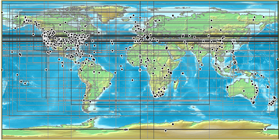
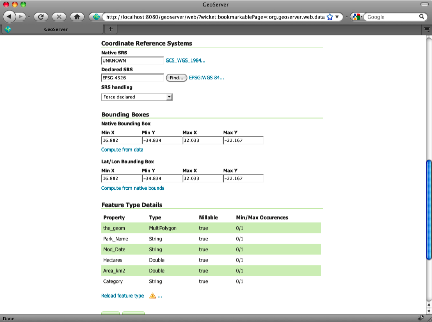
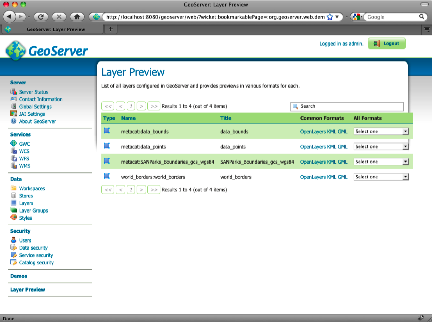

Metacat's Use of Geoserver
==========================

GeoServer 2.0.2, an open source Web Mapping Service (WMS) written in Java, is 
bundled with Metacat and can be used to render spatial data as web-deliverable 
maps. Metacat uses OpenLayers (http://openlayers.org/) to provide a web-based 
user interface for interacting with the generated maps. You can use any 
WMS-compatible client (e.g., ArcGIS, QGIS, JUMP, UDig, OpenLayers, Mapbender, 
Map Builder). 

IMPORTANT: Regardless of whether you plan on using the mapping functionality 
you should, for security purposes, configure GeoServer so that it doesn't 
use the default password. For instructions, please see 
Geoserver Configuration.

   
   A map generated by Metacat's GeoServer. Points and "bounding boxes" 
   represent the geographic extent of datasets stored in the KNB Metacat repository.

GeoServer supports a wide variety of vector GIS data sources, which can be 
styled using Styled Layer Descriptors (SLDs) and output as images (the default) 
or raw vector data (GML or KML).

Currently, GeoServer can be used with the following limitations:

* GeoServer will only map documents that are publicly available. This is 
  because the mapping server's support for permissions control is not as 
  fine-grained as Metacat's.

Metacat developers plan to continue extending and improving Metacat's mapping 
capabilities. If you are interested in contributing to those efforts, or if 
you are interested in learning more about the architecture and future plans for 
the mapping software, please contact the Metacat  development 
team  (metacat-dev@ecoinformatics.org).

Installing and Configuring
--------------------------
The GeoServer webapp should be installed as a sibling of Metacat. If you do 
NOT wish to run GeoServer, the deployment can be skipped, but any skins that 
use maps will not render correctly. (NOTE: Geoserver recommends using a PermGen 
space setting of at least 128MB.). 

Metacat comes with a pre-configured data directory to be used by GeoServer. 
This includes a world-countries base layer and a default configuration that 
is already aware of Metacat's spatial cache. The Metacat configuration interface 
is used to configure GeoServer to use this shared data directory. To further 
configure GeoServer, use the Web-based configuration utility, 
which is available at: http://your.server.com/context/geoserver.jsp 
(e.g., http://knb.ecoinformatics.org/metacat/geoserver.jsp). 

Common configuration tasks include:

* Adding a Map to a Web Page or Skin
* Configuring the Size and Initial Extent of the Map
* Configuring the Layout of the HTML Mapping Interface
* Configuring the "Select Location Drop-down Menu
* Configuring the Visual Portrayal of Geospatial Data (e.g., symbology and color)
* Adding Other Spatial Datasets to the Web Map

.. figure:: images/screenshots/image053.png
   :align: center
   
   GeoServer's Web-based administrative interface.

Note: Some configurations may need to be made to the XML files as well.

OpenLayers, which Metacat uses as the front-end for GeoServer's WMS service, 
provides interface components or "widgets" (e.g., the map, a box zoom, layer 
list, "Select Location" drop-down menu, scale bar, lat/long coordinates, and 
a query form) that make it easy to deploy web-based mapping applications with 
minimal coding.

OpenLayers has three main configuration files used to customize the map interface.
Default configurations are in::

  $METACAT/lib/style/common/spatial/
  
+----------------------------------+---------------+-------------------------------------------------------------+
| Document                         | Location      | Description                                                 |
+==================================+===============+=============================================================+
| The named location file          | locations.jsp | The list of pre-defined locations (name and lat/lon bounds) |
+----------------------------------+---------------+-------------------------------------------------------------+
| Main map rendering functions     | maps.js       | Defines the map, widgets and their behavior                 |
+----------------------------------+---------------+-------------------------------------------------------------+
| The rendered map and page layout | map.jsp       | Loads the map and controls the HTML layout of the widgets.  |
+----------------------------------+---------------+-------------------------------------------------------------+

NOTE: By default, the first time Metacat is restarted, it generates a 
"spatial cache" containing geographic information about documents in its 
repository. This default behavior is specified in lib/metacat.properties, 
where the regenerateCacheOnRestart parameter is set to true. The information 
in the spatial cache is stored in a GIS-compatible format (the ESRI Shapefile) 
and consists of the document name and its geographic coverage. When documents 
are inserted, deleted, and updated in the Metacat repository, Metacat 
automatically syncs the spatial cache to reflect the changes. Because 
generating the cache can take a considerable amount of time (several minutes 
in the case of a few thousand documents), Metacat resets the 
regenerateCacheOnRestart property to false after the spatial cache has been 
generated. Note that if you upgrade or reinstall Metacat, the spatial cache 
will be regenerated again.

Adding a Map to a Web Page or Skin
~~~~~~~~~~~~~~~~~~~~~~~~~~~~~~~~~~
To add a map to a Web page, simply include the map interface using an iframe:: 

  <iframe scrolling="no" frameborder="0" width="780" height="420" 
          src="/metacat/style/common/spatial/map.jsp">
  </iframe>

The map URL, ``/metacat/style/common/spatial/map.jsp``, is 
the default map interface. If you plan to customize the map interface, copy
the map.jsp file into your skin's directory (either the default or 
customized skin directory). 

::

  cp -r style/common/spatial/map.jsp /style/skins/<myskin>/spatial

You can access the customized map with the URL: ``/metacat/style/skins/<myskin>/spatial/map.jsp`` 

Configuring the Size and Initial Extent of the Map
~~~~~~~~~~~~~~~~~~~~~~~~~~~~~~~~~~~~~~~~~~~~~~~~~~
Before you configure the size and initial extent of the map, make sure that you 
have copied the map layout page into your skin's directory (See 
:doc:`configuration` for directions). Once the file has been copied, you can 
modify the map's initial extent in: ``${skin.dir}/spatial/map.jsp``.

To change the map's initial extent, edit the bounding box. The default is to 
show the entire globe. The ``initMap()`` function should also be given the skin 
name so that spatial search results can be correctly styled.

::

  

The size (height/width) of the map can be controlled by the ``#map`` CSS entry 
included in the ``map.jsp`` page.

Configuring the Layout of the HTML Mapping Interface
~~~~~~~~~~~~~~~~~~~~~~~~~~~~~~~~~~~~~~~~~~~~~~~~~~~~
The size and initial extent of the map can be edited in : ${skin.dir}/spatial/map.jsp.

The map.jsp is a simple container that can be included in other more complex 
pages if desired. It contains the map, widgets and location dropdown list.

Configuring the "Select Location" Drop-down Menu
~~~~~~~~~~~~~~~~~~~~~~~~~~~~~~~~~~~~~~~~~~~~~~~~
The locations that appear in the "Select Location" drop-down menu are specified 
in the ``locations.jsp`` file. The locations.jsp can be copied from the common 
spatial template into your skin directory. Each location is defined as an 
HTML ``<option/>`` tag. Edit the value and label to edit or add new locations.

::

  <option value="-149.725,68.475 -149.3254,68.725"> Arctic LTER (ARC)</option>

Configuring the Visual Portrayal of Geospatial Data (e.g., symbology and color)
~~~~~~~~~~~~~~~~~~~~~~~~~~~~~~~~~~~~~~~~~~~~~~~~~~~~~~~~~~~~~~~~~~~~~~~~~~~~~~~
Geospatial data sets are styled through the use of Styled Layer Descriptors 
(SLD). The default SLDs used for the data points and data bounding boxes are in
``/lib/spatial/geoserver/data/styles/`` and are named data_points_style.sld and 
data_bounds_style.sld, respectively. 

You can find a more detailed tutorial on using SLD with GeoServer in the GeoServer documentation::

  http://docs.geoserver.org/

Adding Other Spatial Datasets to the Web Map
~~~~~~~~~~~~~~~~~~~~~~~~~~~~~~~~~~~~~~~~~~~~
If you have vector GIS data sets, such as weather or topographical information, 
on your server that you'd like to include in the interactive map, you must 
first register the data set with GeoServer. After the data set has been 
registered, you can add the layer to the map. You can also add spatial layers 
that have been made publically available through WMS (There are hundreds of 
spatial data sets available. Check out wms-sites.com for good catalog). 
Instructions for adding publically available layers are included at the end 
of this section. 

To register the data set and add it to the map:

1. Point your browser to ``http://your.server/geoserver``, log in to GeoServer, 
   and navigate to the "Data Stores" configuration page under ``Data > Stores``. 
2. Create a new vector data source from a Shapefile in the "metacat" workspace.

.. figure:: images/screenshots/image055.png
   :align: center
   
   Creating a new shapefile using GeoServers web-based administrative interface.

3. The Description, if specified, is mostly used internally to provide other 
   administrators with information about the DataStore. Click Submit.
4. Navigate to the "Layers" configuration page under Data > Layers. 
   Add a new Layer from your new data source.
5. You should also define a spatial reference system (SRS) number for the new 
   layer. Most lat/long data is "4326". If your data is in another projection, 
   determine its spatial reference system using the help links provided.

   
   GeoServer's FeatureType configuration. The SRS settings discussed in step 5 are highlighted.

6. Style the layer using a style from the drop-down menu on the Publishing tab, 
   or create a new SLD to create a new style object and corresponding SLD 
   (this option provides more control over the style). 
7. Try out the styled data set as a WMS layer using a the Layer Preview.

   
   GeoServer's Layer Preview allows you to see an OpenLayer rendering of the new layer.

8. Copy the default ``map.js`` file that assembles the map in OpenLayers 
   (``style/common/spatial/map.js``) to your skin's spatial directory.
9. Edit the init() method to include your new layer in the map - either as an 
   overlay or as a base layer.
10. Point your browser to the map interface. Your new layer should appear with 
    the existing ones.

Adding External Spatial Data Made Publically Available through WMS
~~~~~~~~~~~~~~~~~~~~~~~~~~~~~~~~~~~~~~~~~~~~~~~~~~~~~~~~~~~~~~~~~~
There are hundreds of sources of spatial data made publically available 
through WMS (check out http://wms-sites.com for a good catalog). To add these 
data sources to your map, add the layers in your skin's ``spatial/map.js`` file.

Spatial Queries
---------------
To find out which documents in the Metacat repository lie in a specified 
geographic region, query the spatial cache using Metacat's spatial_query action. 
Metacat can perform any query supported by the WFS/WMS standards.

An example of a spatial query string is::

  http://localhost/metacat/metacat?action=spatial_query&xmin=-117.5&xmax=-64&ymin=3&ymax=46&skin=default

Where ``xmin``, ``xmax``, ``ymin`` and ``ymax`` represent the western, eastern, 
southern and northern bounding coordinates (the "bounding box"), respectively. 
The spatial query action returns all documents that overlap or that are 
contained inside the specified spatial coordinates. The result set is returned 
as HTML using the style of the specified skin (in this example, default).

