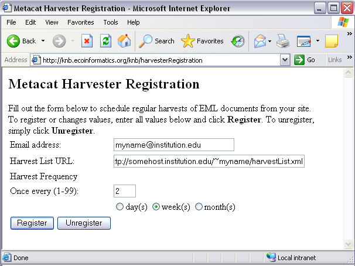

Harvester and Harvest List Editor
=================================

**2024/03/26 - The Metacat Harvester is obsolete.**

While some features remain visible, the old Metacat API has been disabled.
All features that depend on the old Metacat API are deprecated.

Metacat's Harvester is an optional feature that can be used to automatically
retrieve EML documents from one or more custom data management system (e.g., 
SRB or PostgreSQL) and to insert (or update) those documents to the home 
repository. The local sites control when they are harvested, and which documents 
are harvested. 

For example, the Long Term Ecological Research Network (LTER) uses the Metacat 
Harvester to create a centralized repository of data stored on twenty-six 
different sites that store EML metadata, but that use different data management 
systems. Once the data have been harvested and placed into a centralized 
repository, they are replicated to the KNB network, exposing the information 
to an even larger scientific community.

Once the Harvester is properly configured, listed documents are retrieved and 
uploaded on a regularly scheduled basis. You must configure both the home 
Metacat and the remote sites (aka the "harvest sites") before using this 
feature. Local sites must also provide the Metacat server with a list of 
documents that should be harvested.

Configuring Harvester
---------------------
Before you can use the Harvester to retrieve documents, you must configure the 
feature using the settings in the **metacat-site.properties** file. Note that you must
also configure each site that the Harvester will connect to and retrieve 
documents from (see section 7.2 for details). 

The default values for the Harvester configuration information can be viewed in the (non-editable)
**metacat.properties** file. If you wish to override any of these defaults, the new values may be
added to the **metacat-site.properties** file. (For more detail on changing Metacat's configurable
properties, see :ref:`configuration-properties-overview`)

In the **metacat.properties** file, the default Harvester properties are grouped together and begin
after the comment line::

  # Harvester properties

To configure Harvester, edit **metacat-site.properties** (**not**  metacat.properties!), and
set appropriate values for the ``harvesterAdministrator`` and ``smtpServer`` properties. You may
also wish to customize the other Harvester parameters, each discussed in the table below.

Harvester Properties and their Functions
----------------------------------------

+------------------------------------+-------------------------------------------------------------------------------------------------+-+
| Property                           | Description and Values                                                                          | |
+====================================+=================================================================================================+=+
| connectToMetacat                   | Determine whether Harvester should connect to Metacat to upload retrieved documents.            | |
|                                    | Set to true (the default) under most circumstances. To test whether Harvester can               | |
|                                    | retrieve documents from a site without actually connecting to Metacat                           | |
|                                    | to upload the documents, set the value to false.                                                | |
|                                    |                                                                                                 | |
|                                    | Values: true/false                                                                              | |
+------------------------------------+-------------------------------------------------------------------------------------------------+-+
| delay                              | The number of hours that Harvester will wait before beginning its first harvest.                | |
|                                    | For example, if Harvester is run at 1:00 p.m., and the delay is set to 12,                      | |
|                                    | Harvester will begin its first harvest at 1:00 a.m.                                             | |
|                                    |                                                                                                 | |
|                                    | Default: 0                                                                                      | |
+------------------------------------+-------------------------------------------------------------------------------------------------+-+
| harvesterAdministrator             | The email address of the Harvester Administrator. Harvester will send                           | |
|                                    | email reports to this address after every harvest. Enter multiple email addresses by separating | |
|                                    | each address with a comma or semicolon (e.g., name1@abc.edu,name2@abc.edu).                     | |
|                                    |                                                                                                 | |
|                                    | Values: An email address, or multiple email addresses separated by commas or semi-colons        | |
+------------------------------------+-------------------------------------------------------------------------------------------------+-+
| logPeriod                          | The number of days to retain Harvester log entries. Harvester log entries                       | |
|                                    | record information such as which documents were harvested, from which sites,                    | |
|                                    | and whether any errors were encountered during the harvest. Log entries older                   | |
|                                    | than logPeriod number of days are purged from the database at the end of each harvest.          | |
|                                    |                                                                                                 | |
|                                    | Default: 90                                                                                     | |
+------------------------------------+-------------------------------------------------------------------------------------------------+-+
| maxHarvests                        | The maximum number of harvests that Harvester should execute before                             | |
|                                    | shutting down. If the value of maxHarvests is set to 0 or a                                     | |
|                                    | negative number, Harvester will execute indefinitely.                                           | |
|                                    |                                                                                                 | |
|                                    | Default: 0                                                                                      | |
+------------------------------------+-------------------------------------------------------------------------------------------------+-+
| period                             | The number of hours between harvests. Harvester will run a new harvest                          | |
|                                    | every specified period of hours (either indefinitely or until the maximum                       | |
|                                    | number of harvests have run, depending on the value of maxHarvests).                            | |
|                                    |                                                                                                 | |
|                                    | Default: 24                                                                                     | |
+------------------------------------+-------------------------------------------------------------------------------------------------+-+
| smtpServer                         | The SMTP server that Harvester uses for sending email messages to the                           | |
|                                    | Harvester Administrator and Site Contacts.                                                      | |
|                                    | (e.g., somehost.institution.edu). Note that the default value only works                        | |
|                                    | if the Harvester host machine is configured as a SMTP server.                                   | |
|                                    |                                                                                                 | |
|                                    | Default: localhost                                                                              | |
+------------------------------------+-------------------------------------------------------------------------------------------------+-+
| Harvester Operation Properties     | The Harvester Operation properties are used by Harvester to report information                  | |
| (GetDocError, GetDocSuccess, etc.) | about performed operations for inclusion in log entries and email messages.                     | |
|                                    | Under most circumstances the values of these properties should not be modified.                 | |
+------------------------------------+-------------------------------------------------------------------------------------------------+-+

Configuring a Harvest Site (Instructions for Site Contact)
----------------------------------------------------------

After Metacat's Harvester has been configured, remote sites can register and 
send information about which files should be retrieved. Each remote site must 
have a site contact who is responsible for registering the site and creating a 
list of EML files to harvest (the "Harvest List"), as well as for reviewing 
harvest reports. The site contact can unregister the site from the Harvester 
at any time.

To use Harvester:

1. Register with Harvester
2. Compose a Harvest List (you will likely wish to use the Harvest List Editor)
3. Prepare your EML Documents for Harvest
4. Review the Harvester Reports

Register with Harvester
~~~~~~~~~~~~~~~~~~~~~~~

To register a remote site with Harvester, the Site Contact should log in to 
Metacat's Harvester Registration page and enter information about the site and 
how it should be harvested. 

1. Using a Web browser, log in to Metacat's Harvester Registration page. 
   The Harvester Registration page is inside the skins directory. For example, 
   if the Metacat server that you wish to register with resides at the following URL: 

   ::
   
     http://somehost.somelocation.edu:8080/metacat/index.jsp

   then the Harvester Registration page would be accessed at: 

   ::
   
     http://somehost.somelocation.edu:8080/metacat/style/skins/default/harvesterRegistrationLogin.jsp

.. figure:: images/screenshots/image065.jpg
   :align: center
   
   Metacat's Harvester Registration page.

2. Enter your Metacat account information and click Submit to log in to your 
   Metacat from the Harvester Registration page.

   Note: In some cases, you may need to log in to an anonymous "site" account 
   rather than your personal account so that the registered data will not appear 
   to have been registered by a single user. For example, an information 
   manager (jones) who is registering data created by a team of scientists 
   (jones, smith, and barney) from the Georgia Coastal Ecosystems site  might 
   log in to a dedicated account (named with the site's acronym, "GCE") to 
   indicate that the registered data is from the entire site rather than "jones". 

3. Enter information about your site and how often you want to schedule harvests 
   and then click the Register button (Figure 7.2). The Harvest List URL should 
   point to the location of the Harvest List, which is an XML file that lists 
   the documents to harvest. If you do not yet have a Harvest List, please see 
   the next section for more information about creating one.
   

   
   Enter information about your site and how often you want to schedule harvests.

The example settings in the previous figure instruct Harvester to harvest 
documents from the site once every two weeks. The Harvester will access the 
site's Harvest List at URL "http://somehost.institution.edu/~myname/harvestList.xml", 
and will send email reports to the Site Contact at email address 
"myname@institution.edu". Note that you can enter multiple email addresses by 
separating each address with a comma or a semi-colon. For example, 
"myname@institution.edu,anothername@institution.edu"

Compose a Harvest List (The Harvest List Editor)
~~~~~~~~~~~~~~~~~~~~~~~~~~~~~~~~~~~~~~~~~~~~~~~~
The Harvest List is an XML file that contains a list of documents to be harvested. 
The list is created by the site contact and stored on the site contact's site 
at the location specified during the Harvester registration process (see 
previous section for details). The list can be generated by hand, or you can 
use Metacat's Harvest List Editor to automatically generate and structure the 
list to conform to the required XML schema (displayed in figure at the end of 
this section). In this section we will look at what information is required when 
building a Harvest List, and how to configure and use the Harvest List Editor. 
Note that you must have a source distribution of Metacat in order to use the 
Harvest List Editor.

The Harvest List contains information that helps Metacat identify and retrieve 
each specified EML file. Each document in the list must be described with a 
docid, documentType, and documentURL (see table).

Table: Information that must be included in the Harvest List about each EML file
+--------------+-------------------------------------------------------------------------------------------------+
| Item         | Description                                                                                     |
+==============+=================================================================================================+
| docid        | The docid uniquely identifies each EML document. Each docid consists of three elements:         |
|              |                                                                                                 |
|              | ``scope`` The document group to which the document belongs                                      |
|              | ``identifier``  A number that uniquely identifies the document within the scope.                |
|              | ``revision`` A number that indicates the current revision.                                      |
|              |                                                                                                 |
|              | For example, a valid docid could be: demoDocument.1.5, where demoDocument represents            |
|              | the scope, 1 the identifier, and 5 the revision number.                                         |
+--------------+-------------------------------------------------------------------------------------------------+
| documentType | The documentType identifies the type of document as EML                                         |
|              | e.g., "eml://ecoinformatics.org/eml-2.0.0".                                                     |
+--------------+-------------------------------------------------------------------------------------------------+
| documentURL  | The documentURL specifies a place where Harvester can locate and retrieve the                   |
|              | document via HTTP. The Metacat Harvester must be given read access to the contents at this URL. |
|              | e.g. "http://www.lternet.edu/~dcosta/document1.xml".                                            |
+--------------+-------------------------------------------------------------------------------------------------+

The example Harvest List below contains two <document> elements that specify the 
information that Harvester needs to retrieve a pair of EML documents and 
upload them to Metacat.

::

  <!-- Example Harvest List -->
  <?xml version="1.0" encoding="UTF-8" ?>
  <hrv:harvestList xmlns:hrv="eml://ecoinformatics.org/harvestList" >
    <document>
        <docid>
            <scope>demoDocument</scope>
            <identifier>1</identifier>
            <revision>5</revision>
        </docid>
        <documentType>eml://ecoinformatics.org/eml-2.0.0</documentType>
        <documentURL>http://www.lternet.edu/~dcosta/document1.xml</documentURL>
    </document>
    <document>
        <docid>
            <scope>demoDocument</scope>
            <identifier>2</identifier>
            <revision>1</revision>
        </docid>
        <documentType>eml://ecoinformatics.org/eml-2.0.0</documentType>
        <documentURL>http://www.lternet.edu/~dcosta/document2.xml</documentURL>
    </document>
  </hrv:harvestList>

Rather than formatting the list by hand, you may wish to use Metacat's Harvest 
List Editor to compose and edit it. The Harvest List Editor displays a Harvest 
List as a table of rows and fields. Each table row corresponds to 
a single <document> element in the corresponding Harvest List file (i.e., one 
EML document). The row numbers are used only for visual reference and are 
not editable.

To add a new document to the Harvest List, enter values for all five editable 
fields (all fields except the "Row #" field). Partially filled-in rows will 
cause errors that will result in an invalid Harvest List. 

The buttons at the bottom of the Editor can be used to Cut, Copy, and Paste 
rows from one location to another. Select a row and click the desired button, 
or paste the default values (which are specified in the Editor's configuration 
file, discussed later in this section) into the currently selected row by 
clicking the Paste Defaults button. Note: Only one row can be selected at any 
given time: all cut, copy, and paste operations work on only a single row 
rather than on a range of rows. 

To run the Harvest List Editor, from the terminal on which the Metacat 
source code is installed: 
      
1. Open a system command window or terminal window. 
2. Set the METACAT_HOME environment variable to the value of the Metacat 
   installation directory. Some examples follow: 

   ::
   
     export METACAT_HOME=/home/somePath/metacat

3. cd to the following directory: 

   ::
   
     cd $METACAT_HOME/lib/harvester

4. Run the appropriate Harvester shell script, as determined by the operating system: 

   ::
   
     sh runHarvestListEditor.sh

   The Harvest List Editor will open. 

If you would like to customize the Harvest List Editor (e.g., specify a 
default list to open automatically whenever the editor is opened and/or 
default values), create a file called .harvestListEditor (note the leading 
dot character). Use a plain text editor to create the file and place the file 
in the Site Contact's home directory. To determine the home directory, open a 
system command window or terminal window and type the following: 

::

  echo $HOME

The configuration file contains a number of optional properties that can make 
using the Editor more convenient. A sample configure file is displayed below, and 
more information about each configuration property is contained in the table.

A sample .harvestListEditor configuration file

::

  defaultHarvestList=C:/temp/harvestList.xml
  defaultScope=demo_document
  defaultIdentifier=1
  defaultRevision=1
  defaultDocumentURL=http://www.lternet.edu/~dcosta/
  defaultDocumentType=eml://ecoinformatics.org/eml-2.0.0

Harvest List Editor Configuration Properties

+---------------------+----------------------------------------------------------------------------------------------+
| Property            | Description                                                                                  |
+=====================+==============================================================================================+
| defaultHarvestList  | The location of a Harvest List file that the Editor will                                     |
|                     | automatically open for editing on startup. Set this property                                 |
|                     | to the path to the Harvest List file that you expect to edit most frequently.                |
|                     |                                                                                              |
|                     | Examples:                                                                                    |
|                     | ``/home/jdoe/public_html/harvestList.xml``                                                   |
|                     | ``C:/temp/harvestList.xml``                                                                  |
+---------------------+----------------------------------------------------------------------------------------------+
| defaultScope        | The value pasted into the Editor's Scope field when the Paste                                |
|                     | Defaults button is clicked. The Scope field should contain                                   |
|                     | a symbolic identifier that indicates the family of documents                                 |
|                     | to which the EML document belongs.                                                           |
|                     |                                                                                              |
|                     | Example:   xyz_dataset                                                                       |
|                     | Default:    dataset                                                                          |
+---------------------+----------------------------------------------------------------------------------------------+
| defaultIdentifier   | The value pasted into the Editor's Identifier field when the                                 |
|                     | Paste Defaults button is clicked. The Scope field should contain                             |
|                     | a numeric value indicating the identifier for this particular EML document within the Scope. |
+---------------------+----------------------------------------------------------------------------------------------+
| defaultRevision     | The value pasted into the Editor's Revision field when the Paste Defaults button             |
|                     | is clicked. The Scope field should contain a numeric value indicating the                    |
|                     | revision number of this EML document within the Scope and Identifier.                        |
|                     |                                                                                              |
|                     | Example:   2                                                                                 |
|                     | Default:    1                                                                                |
+---------------------+----------------------------------------------------------------------------------------------+
| defaultDocumentType | The document type specification pasted into the                                              |
|                     | Editor's DocumentType field when the Paste Defaults button is clicked.                       |
|                     |                                                                                              |
|                     | Default: ``eml://ecoinformatics.org/eml-2.0.0``                                              |
+---------------------+----------------------------------------------------------------------------------------------+
| defaultDocumentURL  | The URL or partial URL pasted into the Editor's URL field                                    |
|                     | when the Paste Defaults button is clicked. Typically, this                                   |
|                     | value is set to the portion of the URL shared by all harvested EML documents.                |
|                     |                                                                                              |
|                     | Example:                                                                                     |
|                     | ``http://somehost.institution.edu/somepath/``                                                |
|                     | Default: ``http://``                                                                         |
+---------------------+----------------------------------------------------------------------------------------------+

XML Schema for Harvest Lists

::

  <?xml version="1.0" encoding="UTF-8"?>
  <!-- edited with XMLSPY v5 rel. 4 U (http://www.xmlspy.com) by Matt Jones (NCEAS) -->
  <xs:schema xmlns:xs="http://www.w3.org/2001/XMLSchema" xmlns:hrv="eml://ecoinformatics.org/harvestList" xmlns="eml://ecoinformatics.org/harvestList" targetNamespace="eml://ecoinformatics.org/harvestList" elementFormDefault="unqualified" attributeFormDefault="unqualified">
  <xs:annotation>
    <xs:documentation>This module defines the required information for the harvester to collect documents from the local site. The local system containing this document must give the Metacat Harvester read access to this document.</xs:documentation>
  </xs:annotation>
  <xs:annotation>
    <xs:appinfo>
      <tooltip/>
      

      <description/>
    </xs:appinfo>
  </xs:annotation>
  <xs:element name="harvestList">
    <xs:annotation>
      <xs:documentation>This represents the local document information that is used to inform the Harvester of the docid, document type, and location of the document to be harvested.</xs:documentation>
    </xs:annotation>
    <xs:complexType>
      <xs:sequence>
        <xs:element name="document" maxOccurs="unbounded">
          <xs:complexType>
            <xs:sequence>
              <xs:element name="docid">
                <xs:annotation>
                  <xs:documentation>The complete document identifier to be used by metacat.  The docid is a compound element that gives a scope for the identifier, an integer local identifier that is unique within that scope, and a revision.  Each revision is assumed to specify a unique, non-changing document, so once a particular revision is harvested, there is no need for it to be harvested again.  To trigger a harvest of a document that has been updated, increment the revision number for that identifier.</xs:documentation>
                </xs:annotation>
                <xs:complexType>
                  <xs:sequence>
                    <xs:element name="scope" type="xs:string">
                      <xs:annotation>
                        <xs:documentation>The system prefix of a metacat docid that defines the scope within which the identifier is unique.</xs:documentation>
                      </xs:annotation>
                    </xs:element>
                    <xs:element name="identifier" type="xs:long">
                      <xs:annotation>
                        <xs:documentation>The local (site specific) portion of the identifier (docid) that is unique within the context of the scope.</xs:documentation>
                      </xs:annotation>
                    </xs:element>
                    <xs:element name="revision" type="xs:long">
                      <xs:annotation>
                        <xs:documentation>The revision identifier for this document, indicating a unique document version.</xs:documentation>
                      </xs:annotation>
                    </xs:element>
                  </xs:sequence>
                </xs:complexType>
              </xs:element>
              <xs:element name="documentType" type="xs:string">
                <xs:annotation>
                  <xs:documentation>The type of document to be harvested, indicated by a namespace string, formal public identifier, mime type, or other type indicator.   </xs:documentation>
                </xs:annotation>
              </xs:element>
              <xs:element name="documentURL" type="xs:anyURI">
                <xs:annotation>
                  <xs:documentation>The documentURL field contains the URL of the document to be harvested. The Metacat Harvester must be given read access to the contents at this URL.</xs:documentation>
                </xs:annotation>
              </xs:element>
            </xs:sequence>
          </xs:complexType>
        </xs:element>
      </xs:sequence>
    </xs:complexType>
  </xs:element>
  </xs:schema>

Prepare EML Documents for Harvest
~~~~~~~~~~~~~~~~~~~~~~~~~~~~~~~~~
To prepare a set of EML documents for harvest, ensure that the following is true for each document: 

* The document contains valid EML 
* The document is specified in a ``<document>`` element in the site's Harvest List
* The file resides at the location specified by its URL in the Harvest List 

Review Harvester Reports
~~~~~~~~~~~~~~~~~~~~~~~~
Harvester sends an email report to the Site Contact after every scheduled site 
harvest. The report contains information about the performed operations, such 
as which EML documents were harvested and whether any errors were encountered. 
Errors are indicated by operations that display a status value of 1; a status 
value of 0 indicates that the operation completed successfully. 

When errors are reported, the Site Contact should try to determine whether the 
source of the error is something that can be corrected at the site. Common 
causes of errors include:

* a document URL specified in the Harvest List does not match the location of the actual EML file on the disk 
* the Harvest List does not contain valid XML as specified in the harvestList.xsd schema 
* the URL to the Harvest List (specified during registration) does not match the actual location of the Harvest List on the disk 
* an EML document that Harvester attempted to upload to Metacat does not contain valid EML 

If the Site Contact is unable to determine the cause of the error and its 
resolution, he or she should contact the Harvester Administrator for assistance. 

Unregister with Harvester
~~~~~~~~~~~~~~~~~~~~~~~~~
To discontinue harvests, the Site Contact must unregister with Harvester. 
To unregister:

1. Using a Web browser, log in to Metacat's Harvester Registration page. 
   The Harvester Registration page is inside the skins directory. For example, 
   if the Metacat server that you wish to register with resides at the 
   following URL: 

   ::
   
     http://somehost.somelocation.edu:8080/metacat/index.jsp

   then the Harvester Registration page would be accessed at: 

   ::

     http://somehost.somelocation.edu:8080/metacat/style/skins/default/harvesterRegistrationLogin.jsp

2. Enter and submit your Metacat account information. On the subsequent screen, 
   click Unregister to remove your site and discontinue harvests. 

Running Harvester
-----------------
The Harvester can be run as a servlet or in a command window. Under most 
circumstances, Harvester is best run continuously as a background servlet 
process. However, if you expect to use Harvester infrequently, or if wish only 
to test that Harvester is functioning, it may desirable to run it from a 
command window.

Running Harvester as a Servlet
~~~~~~~~~~~~~~~~~~~~~~~~~~~~~~
To run Harvester as a servlet:

1. Remove the comment symbols around the HarvesterServlet entry in the
   deployed Metacat web.xml ($TOMCAT_HOME/webapps/<context>/WEB-INF).

   ::
   
     <!--
     <servlet>
       <servlet-name>HarvesterServlet</servlet-name>
       <servlet-class>edu.ucsb.nceas.metacat.harvesterClient.HarvesterServlet</servlet-class>
       <init-param>
       <param-name>debug</param-name>
       <param-value>1</param-value>
       </init-param>
       <init-param>
       <param-name>listings</param-name>
       <param-value>true</param-value>
       </init-param>
       <load-on-startup>1</load-on-startup>
     </servlet>
     -->

2. Save the edited file.

3. Restart Tomcat.

About thirty seconds after you restart Tomcat, the Harvester servlet will 
start executing. The first harvest will occur after the number of hours 
specified in metacat's configured properties. The servlet will continue running
new harvests until the maximum number of harvests have been completed, or until 
Tomcat shuts down (harvest frequency and maximum number of harvests are also 
set in the Harvester properties). 

Running Harvester in a Command Window
~~~~~~~~~~~~~~~~~~~~~~~~~~~~~~~~~~~~~

To run Harvester in a Command Window:
 
1. Open a system command window or terminal window. 
2. Set the ``METACAT_HOME`` environment variable to the value of the 
   Metacat webapp deployment directory. 

   ::
   
     export METACAT_HOME=/home/somePath/metacat

3. cd to the following directory: 

   ::
   
     cd $METACAT_HOME/lib/harvester

4. Run the appropriate Harvester shell script, as determined by the operating system: 

   ::
   
     sh runHarvester.sh $METACAT_HOME

The Harvester application will start executing. The first harvest will occur 
after the number of hours specified in the configured properties (see `Configuring Harvester`_).
The servlet will continue running new harvests until the maximum number of harvests
have been completed, or until you interrupt the process by hitting CTRL/C in 
the command window (harvest frequency and maximum number of harvests are also 
set in the Harvester properties). 

Reviewing Harvest Reports
-------------------------
Harvester sends an email report to the Harvester Administrator after every 
harvest. The report contains information about the performed operations, such 
as which sites were harvested as well as which EML documents were harvested 
and whether any errors were encountered. Errors are indicated by operations 
that display a status value of 1; a status value of 0 indicates that the 
operation completed successfully. 

The Harvester Administrator should review the report, paying particularly 
close attention to any reported errors and accompanying error messages. When 
errors are reported at a particular site, the Harvester Administrator should 
contact the Site Contact to determine the source of the error and its 
resolution. Common causes of errors include:

* a document URL specified in the Harvest List does not match the location of the actual EML file on the disk 
* the Harvest List does not contain valid XML as specified in the harvestList.xsd schema 
* the URL to the Harvest List (specified during registration) does not match the actual location of the Harvest List on the disk 
* an EML document that Harvester attempted to upload to Metacat does not contain valid EML 

Errors that are independent of a particular site may indicate a problem with 
Harvester itself, Metacat, or the database connection. Refer to the error 
message to determine the source of the error and its resolution. 
