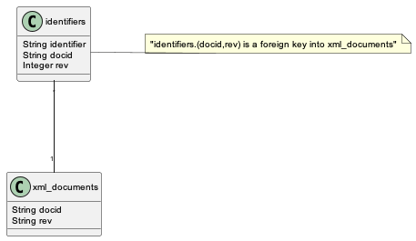
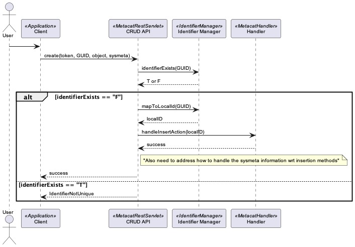
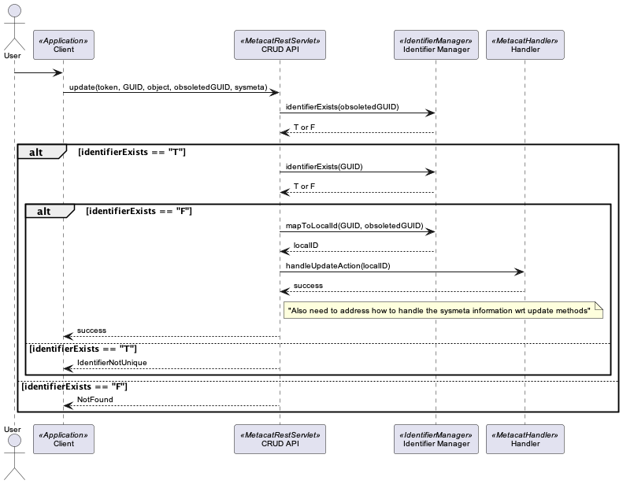

.. raw:: latex

  \newpage
  

Identifier Management
=====================

.. index:: Identifiers

Author
  Matthew B. Jones

Date
  - 20100301 [MBJ] Initial draft of Identifier documentation

Goal
  Extend Metacat to support identifiers with arbitrary syntax

Summary 
  Metacat currently supports identifier strings called 'docids' that have
  the syntax 'scope.object.revision', such as 'foo.34.1' (we will refer to
  these as 'LocalIDs'). We now want Metacat to support identifiers that are 
  arbitrary strings, but still enforce uniqueness and proper revision
  handling (refer to these as GUIDs).  Metacat must be able to accept 
  these strings as identifiers for all CRUD operations, and reference them 
  in search results.

Identifier Resolution
---------------------
Because Metacat uses LocalIDs throughout the code for references to objects,
and that LocalID has a constrained structure that includes semantics about
revisions in the identifier, it is difficult to wholesale replace it with
less-constrained string identifiers without re-writing much of Metacat.
Thus, our alternate strategy is to wrap the Metacat APIs with a
identifier resolution layer that keeps track of the unconstrained GUIDs and
maps them to constrained local identifiers which are used internally within
Metacat. The basic identifer table model is shown in Figure 1, while the
basic strategy for retrieving an object is shown in Figure 2, creating an 
object is shown in Figure 3, updating an object in Figure 4, and deleting
an object is shown in Figure 5.

Identifier Table Structure
~~~~~~~~~~~~~~~~~~~~~~~~~~

   Figure 1. Table structure for identifiers.

..
  This block defines the table structure diagram referenced above.
  @startuml images/identifiers.png

  identifiers "*" -- "1" xml_documents

  identifiers : String identifier
  identifiers : String docid
  identifiers : Integer rev

  xml_documents : String docid
  xml_documents : String rev

  note right of identifiers
    "identifiers.(docid,rev) is a foreign key into xml_documents"
  end note
  @enduml

.. raw:: latex

  \newpage

.. raw:: pdf

  PageBreak

Handling document read operations
~~~~~~~~~~~~~~~~~~~~~~~~~~~~~~~~~

An overview of the process needed to read an object using a GUID.

   Figure 2. Basic handling for string identifiers (GUIDs) as mapped to
   docids (LocalIDs) to retrieve an object.

..
  @startuml images/guid_read.png
  !include plantuml.conf
  actor User
  participant "Client" as app_client << Application >>
  participant "CRUD API" as c_crud << MetacatRestServlet >>
  participant "Identifier Manager" as ident_man << IdentifierManager >>
  participant "Handler" as handler << MetacatHandler >>
  User -> app_client
  app_client -> c_crud: get(token, GUID)
  c_crud -> ident_man: getLocalID(GUID)
  c_crud <-- ident_man: localID
  c_crud -> handler: handleReadAction(localID)
  c_crud <-- handler: object
  c_crud --> app_client: object
  
  @enduml

Handling document create operations
~~~~~~~~~~~~~~~~~~~~~~~~~~~~~~~~~~~

An overview of the process needed to create an object using a GUID.

   Figure 3. Basic handling for string identifiers (GUIDs) as mapped to
   docids (LocalIDs) to create an object.

..
  @startuml images/guid_insert.png
  !include plantuml.conf
  actor User
  participant "Client" as app_client << Application >>
  participant "CRUD API" as c_crud << MetacatRestServlet >>
  participant "Identifier Manager" as ident_man << IdentifierManager >>
  participant "Handler" as handler << MetacatHandler >>
  User -> app_client
  app_client -> c_crud: create(token, GUID, object, sysmeta)
  c_crud -> ident_man: identifierExists(GUID)
  c_crud <-- ident_man: T or F 
  alt identifierExists == "F"
      c_crud -> ident_man: mapToLocalId(GUID)
      c_crud <-- ident_man: localID
      c_crud -> handler: handleInsertAction(localID)
      c_crud <-- handler: success
      note right of c_crud
        "Also need to address how to handle the sysmeta information wrt insertion methods"
      end note
      app_client <-- c_crud: success
  else identifierExists == "T"
      app_client <-- c_crud: IdentifierNotUnique
  end
  @enduml

Handling document update operations
~~~~~~~~~~~~~~~~~~~~~~~~~~~~~~~~~~~

An overview of the process needed to update an object using a GUID.

   Figure 4. Basic handling for string identifiers (GUIDs) as mapped to
   docids (LocalIDs) to update an object.

..
  @startuml images/guid_update.png
  !include plantuml.conf
  actor User
  participant "Client" as app_client << Application >>
  participant "CRUD API" as c_crud << MetacatRestServlet >>
  participant "Identifier Manager" as ident_man << IdentifierManager >>
  participant "Handler" as handler << MetacatHandler >>
  User -> app_client
  app_client -> c_crud: update(token, GUID, object, obsoletedGUID, sysmeta)

  c_crud -> ident_man: identifierExists(obsoletedGUID)
  c_crud <-- ident_man: T or F 
  alt identifierExists == "T"

      c_crud -> ident_man: identifierExists(GUID)
      c_crud <-- ident_man: T or F 
      alt identifierExists == "F"
          c_crud -> ident_man: mapToLocalId(GUID, obsoletedGUID)
          c_crud <-- ident_man: localID
          c_crud -> handler: handleUpdateAction(localID)
          c_crud <-- handler: success
          note right of c_crud
            "Also need to address how to handle the sysmeta information wrt update methods"
          end note
          app_client <-- c_crud: success
      else identifierExists == "T"
          app_client <-- c_crud: IdentifierNotUnique
      end
  else identifierExists == "F"
      app_client <-- c_crud: NotFound
  end
  @enduml

Handling document delete operations
~~~~~~~~~~~~~~~~~~~~~~~~~~~~~~~~~~~

An overview of the process needed to delete an object using a GUID.

   Figure 5. Basic handling for string identifiers (GUIDs) as mapped to
   docids (LocalIDs) to delete an object.

..
  @startuml images/guid_delete.png
  !include plantuml.conf
  actor User
  participant "Client" as app_client << Application >>
  participant "CRUD API" as c_crud << MetacatRestServlet >>
  participant "Identifier Manager" as ident_man << IdentifierManager >>
  participant "Handler" as handler << MetacatHandler >>
  User -> app_client
  app_client -> c_crud: delete(token, GUID)
  c_crud -> ident_man: identifierExists(GUID)
  c_crud <-- ident_man: T or F 
  alt identifierExists == "T"
      c_crud -> ident_man: mapToLocalId(GUID)
      c_crud <-- ident_man: localID
      c_crud -> handler: handleDeleteAction(localID)
      c_crud <-- handler: success
      app_client <-- c_crud: success
  else identifierExists == "F"
      app_client <-- c_crud: NotFound
  end
  @enduml

..
  This block defines the interaction diagram referenced above.
  startuml images/01_interaction.png
    !include plantuml.conf
    actor User
    participant "Client" as app_client << Application >>
    User -> app_client

    participant "CRUD API" as c_crud << Coordinating Node >>
    activate c_crud
    app_client -> c_crud: resolve(GUID, auth_token)
    participant "Authorization API" as c_authorize << Coordinating Node >>
    c_crud -> c_authorize: isAuth(auth_token, GUID)
    participant "Verify API" as c_ver << Coordinating Node >>
    c_authorize -> c_ver: isValidToken (token)
    c_authorize <-- c_ver: T or F
    c_crud <-- c_authorize: T or F
    app_client <-- c_crud: handle_list
    deactivate c_crud

    participant "CRUD API" as m_crud << Member Node >>
    activate m_crud
    app_client -> m_crud: get(auth_token, handle)
    participant "Server Authentication API" as m_authenticate << Member Node >>
    m_crud -> m_authenticate: isAuth(auth_token, GUID)
    m_crud <-- m_authenticate: T or F
    m_crud -> m_crud: log(get, UserID, GUID)
    app_client <-- m_crud: object or unauth or doesNotExist
    deactivate m_crud
  enduml
