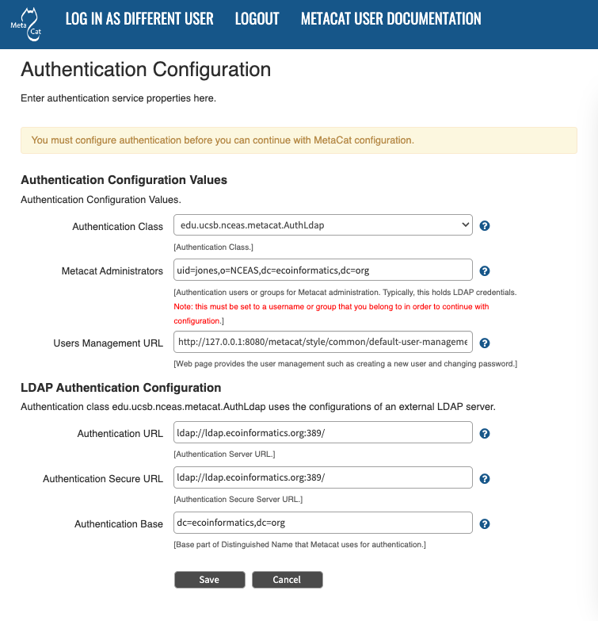

.. role:: note2

Downloading and Installing Metacat
==================================

Instructions for the Linux system is included in this section.

.. contents::

System Requirements
-------------------
In addition to meeting the recommended system requirements, the server on which
you wish to install Metacat must have the following software installed and running correctly:

* PostgreSQL_ 
* `Apache Ant`_ (if building from source)
* `Apache Tomcat`_ 
* `Apache HTTPD Server`_ (recommended)

  * In order to use the Metacat Registry (and for a more robust Web-serving environment in general), the Apache Web server should be installed with Tomcat and the two should be integrated. See the installing Apache for more information.

* `Java 17`_ (Note: Java 7/8 is deprecated)
* `RabbitMQ`_
* `Solr 8.8.2`_

.. _PostgreSQL: http://www.postgresql.org/

.. _Oracle: http://www.oracle.com/

.. _Apache Ant: http://ant.apache.org/

.. _Apache Tomcat: http://tomcat.apache.org/

.. _Apache HTTPD Server: http://httpd.apache.org/

.. _Java 17: https://www.oracle.com/java/technologies/javase/jdk17-archive-downloads.html

.. _RabbitMQ: https://www.rabbitmq.com/

.. _Solr 8.8.2: https://lucene.apache.org/solr/guide/8_8/getting-started.html

System requirements for running Metacat:

* a server running PostgreSQL_ database
* at least 512MB RAM
* 200 MB disk space (Note: The amount of disk space required depends on the size of your RDBMS tablespace and the the size and number of documents stored. Metacat itself requires only about 140 MB of free space after installation).

Installing on Linux
-------------------
This section contains instructions for downloading and installing Metacat on 
Linux systems. As Mac OS X is based on BSD Unix, these Linux instructions can
be adapted to also work on Mac OS X (although the exact commands for
downloading and installing packages will differ due to the different package
management approaches on the Mac).

Quick Start Overview
~~~~~~~~~~~~~~~~~~~~
For the impatient or those who have already installed Metacat and know what
they are doing, here are the steps needed to install Metacat. Detailed
instructions for each step are in the next section.

1. Download and install prerequisites (`Java 17`_, `Apache Tomcat`_ 7, PostgreSQL_, `RabbitMQ`_, `Solr 8.8.2`_, `Apache HTTPD Server`_)
2. Create a database in PostgreSQL named 'metacat' and authorize access to it in ``pb_hba.conf`` for the user 'metacat'
3. Log in to PostgreSQL and create the 'metacat' user
4. Download Metacat from the `Metacat Download Page`_ and extract the archive
5. ``sudo mkdir /var/metacat; sudo chown -R <tomcat_user> /var/metacat``
6. ``sudo cp <metacat_package_dir>/metacat.war <tomcat_app_dir>``
7. ``sudo cp <metacat_package_dir>/metacat-index.war <tomcat_app_dir>``
8. ``sudo cp <metacat_package_dir>/metacatui.war <tomcat_app_dir>``
9. ``sudo /etc/init.d/tomcat7 restart``
10. Configure Metacat through the Web interface

.. _Metacat Download Page: http://knb.ecoinformatics.org/software/metacat/

Downloading Metacat
~~~~~~~~~~~~~~~~~~~
Before installing Metacat, please ensure that all required software is
installed and running correctly. To obtain a Metacat WAR file, which is needed
for installation, download one of the following: 

* the Metacat installer, which has a pre-built WAR file,
* the Metacat source distribution, which must be built in order to create a WAR file, 
* the Metacat source code from GitHub. You must build the source code in order to create a WAR file.

Instructions for all three options are discussed below. Note that downloading
the installer (described in the next section) is the simplest way to get
started. 

Download the Metacat Installer (Highly Recommended)
...................................................
Downloading the Metacat Installer is the simplest way to get started with the
application. To download the installer: 

1.  Browse to the `Metacat Download Page`_. In the Metacat section, select the link to the "GZIP file" (the link should look like: metacat-bin-X.X.X.tar.gz, where X.X.X is the latest version of Metacat e.g., |release|) 
2.  Save the file locally. 
3.  Extract the Metacat package files by typing:

::

  tar -xvzf metacat-bin-X.X.X.tar.gz

You should see a WAR file and several sample supporting files (Table 2.1). The
extraction location will be referred to as the ``<metacat_package_dir>`` for the
remainder of this documentation.

=====================   ==================================================================================================================================
File                    Description
=====================   ==================================================================================================================================
metacat.war             The Metacat Web archive file (WAR) 
metacat-site.conf       Sample Web definition file used by Apache on Ubuntu/Debian Linux systems. 
metacat-site-ssl.conf   Sample SSL definition file used by Apache on Ubuntu/Debian Linux systems.
jk.conf                 Sample JkMount configuration file used by Apache on Ubuntu/Debian Linux systems. 
workers.properties      Sample workers definition file used by Apache on Ubuntu/Debian Linux systems. 
metacat-index.war       The Metacat Index WAR for supporting SOLR query features Optional unless Metacat UI is being used.
metacatui.war           The Metacat UI - can be deployed as a webapp or directly in webserverMetacat UI requires metacat-index be deployed and configured.
authority.war           The optional LSID Server application WAR
=====================   ==================================================================================================================================

Download Metacat Source Code
............................
To get the Metacat source distribution:

1. Browse to the `Metacat Download Page`_. In the Metacat section, select the link to the Metacat Source code (it will look something like this: metacat-src-X.X.X.tar.gz, where X.X.X is the latest version of Metacat, e.g., |release|).
2. Save the file locally. 
3. Extract the Metacat package files by typing (replace X.X.X with the current version number): 

::

  tar -xvzf metacat-src-X.X.X.tar.gz

4. Rename the metacat-X.X.X directory to metacat. 

Note that you do not need to create the WAR file directly because the Ant
build-file has an "install" target that will build and deploy the WAR for you. 

Check Out Metacat Source Code from GitHub (for Developers)
..........................................................

To clone the repository from GitHub, go to the directory where you would like the
code to live and type::

  git clone https://github.com/nceas/metacat metacat

.. sidebar:: Installing a Git Client:

    If you have not already installed Git and you are running Ubuntu/Debian,
    you can get the Git client by typing:

    ::

        sudo apt-get install git

The entire Metacat repository will be cloned to your local machine and the current branch is the `main` branch which is constantly maintained in a state ready for release. Detailed information about the code contribution please see:

https://github.com/NCEAS/metacat/blob/main/CONTRIBUTING.md

Note that you do not need to create the WAR file directly because the Ant
build-file has an "install" target that will build and deploy the WAR for you. 

Installing and Configuring Required Software
~~~~~~~~~~~~~~~~~~~~~~~~~~~~~~~~~~~~~~~~~~~~
Before you can install and run Metacat, you must ensure that a recent Java SDK,
PostgreSQL, Ant (if installing from source), and Tomcat are installed and running correctly.
We also highly recommend that you install Apache Web server, as it provides a more
robust Web-serving environment and is required by some Metacat functionality. 

* `Java 17`_
* `Apache Tomcat`_ 
* `Apache HTTPD Server`_ (Highly Recommended)
* PostgreSQL_ Database 
* `Apache Ant`_ (if building from Source)
* `RabbitMQ`_
* `Solr Server`_

Java 17
......
To run Metacat, you should use Java 17. Make sure that the JAVA_HOME
environment variable is properly set and that both ``java`` and ``javac`` 
are on your PATH. 

To install Java if you are running Ubuntu_/Debian, you can install using apt-get:: 

  sudo apt-get install openjdk-17-jdk

If you are not using Ubuntu_/Debian, you can get Java from the Oracle_ website and install using the RPM installer.

.. _Ubuntu: http://www.ubuntu.com/

Apache Tomcat
.............
We recommend that you install Tomcat 6, 7 or 8 into the directory of your choice. The newer versions are preferred.
Included with the Metacat download is a Tomcat-friendly start-up script that should be installed as well.

Note: we will refer to the Tomcat installation directory as ``<tomcat_home>`` for
the remainder of the documentation. 

If you are running Ubuntu_/Debian, get Tomcat by typing::

  sudo apt-get install tomcat7

Otherwise, get Tomcat from the `Apache Tomcat`_ page.

After installing Tomcat, you can switch back to the Sun JDK by typing::

  sudo update-alternatives --config java

and selecting the correct Java installation.

If using Tomcat with Apache/mod_jk, enable the AJP connector on port 8009 by uncommenting that section in::

  <tomcat_home>/conf/server.xml

For DataONE deployments edit::  

    /etc/tomcat7/catalina.properties

to include::

    org.apache.tomcat.util.buf.UDecoder.ALLOW_ENCODED_SLASH=true
    org.apache.catalina.connector.CoyoteAdapter.ALLOW_BACKSLASH=true

Note: If you're running Tomcat using systemd, systemd sandboxes Tomcat limiting
the directories it can write to and prevents Metacat from operating correctly.
Ensure the following lines exist in the service file for Tomcat (paths may vary depending on your configuration):

::

  ReadWritePaths=/var/metacat
  ReadWritePaths=/etc/default/solr.in.sh

Apache HTTPD Server (Highly Recommended)
........................................
Although you have the option of running Metacat with only the Tomcat server, we
highly recommend that you run it behind the Apache Web server for several
reasons; running Tomcat with the Apache server provides a more robust Web
serving environment. The Apache Web server is required if you wish to
install and run the Metacat Registry or to use the Metacat Replication feature. 

This section contains instructions for installing and configuring the Apache
Web server for Metacat on an Ubuntu_/Debian system. Instructions for configuring
Apache running on other Linux systems are included in
`Configuring Apache on an OS other than Ubuntu/Debian`_

1. Install the Apache and Mod JK packages (Mod JK is the module Apache uses to talk to Tomcat applications) by typing:

::

  sudo apt-get install apache2 libapache2-mod-jk

If you are installing the Apache server on an Ubuntu/Debian system, and you
installed Apache using apt-get as described above, the Metacat code will have
helper files that can be dropped into directories to configure Apache.
Depending on whether you are installing from binary distribution or source,
these helper files will be in one of two locations: 

* the directory in which you extracted the distribution (for binary distribution)
* ``<metacat_code_dir>/src/scripts`` (for both the source distribution and source code checked out from GitHub).  We will refer to the directory with the helper scripts as ``<metacat_helper_dir>`` and the directory where Apache is installed (e.g., ``/etc/apache2/``) as ``<apache_install_dir>``.

2. Set up Mod JK apache configuration by typing:

::

  sudo cp <metacat_helper_dir>/debian/jk.conf <apache_install_dir>/mods-available
  sudo cp <metacat_helper_dir>/debian/workers.properties <apache_install_dir>

3. Disable and re-enable the Apache Mod JK module to pick up the new changes:

::

  sudo a2dismod jk
  sudo a2enmod jk

4. Apache needs to know about the Metacat site. The helper file named "metacat-site.conf" has rules that tell Apache which traffic to route to Metacat. Set up Metacat site by dropping the metacat-site file into the sites-available directory and running a2ensite to enable the site:

::

  sudo cp <metacat_helper_dir>/metacat-site.conf <apache_install_dir>/sites-available
  sudo a2ensite metacat-site.conf
  
5. Disable the default Apache site configuration:

::

  sudo a2dissite 000-default  

6. Restart Apache to bring in changes by typing:

::

  sudo /etc/init.d/apache2 restart

Configuring Apache on an OS other than Ubuntu/Debian
++++++++++++++++++++++++++++++++++++++++++++++++++++

    If you are running on an O/S other than Ubuntu/Debian (e.g., Fedora Core or
    RedHat Linux) or if you installed the Apache source or binary, you must
    manually edit the Apache configuration file, where <apache_install_dir> is the
    directory in which Apache is installed::

      <apache_install_dir>/conf/httpd.conf

    1. Configure the log location and level for Mod JK. If your configuration file does not already have the following section, add it and set the log location to any place you'd like::

        <IfModule mod_jk.c>
          JkLogFile "/var/log/tomcat/mod_jk.log"
          JkLogLevel info
        </IfModule>

    2. Configure apache to route traffic to the Metacat application. ServerName should be set to the DNS name of the Metacat server. ScriptAlias and the following Directory section should both point to the cgi-bin directory inside your Metacat installation::

          <VirtualHost XXX.XXX.XXX.XXX:80>
            DocumentRoot /var/www
            ServerName dev.nceas.ucsb.edu
            ## Allow CORS requests from all origins to use cookies
            SetEnvIf Origin "^(.*)$" ORIGIN_DOMAIN=$1
            Header set Access-Control-Allow-Origin "%{ORIGIN_DOMAIN}e" env=ORIGIN_DOMAIN
            Header set Access-Control-Allow-Headers "Authorization, Content-Type, Origin, Cache-Control"
            Header set Access-Control-Allow-Methods "GET, POST, PUT, OPTIONS"
            Header set Access-Control-Allow-Credentials "true"
            ErrorLog /var/log/httpd/error_log
            CustomLog /var/log/httpd/access_log common
            ScriptAlias /cgi-bin/ "/var/www/cgi-bin/"
            <Directory /var/www/cgi-bin/>
              AllowOverride None
              Options ExecCGI
              Require all granted
            </Directory>
            ScriptAlias /metacat/cgi-bin/ "/var/www/webapps/metacat/cgi-bin/"
            <Directory "/var/www/webapps/metacat/cgi-bin/">
              AllowOverride None
              Options ExecCGI
              Require all granted
            </Directory>
            <Directory "/var/www/metacatui">
               AllowOverride All
               FallbackResource /metacatui/index.html
               Require all granted
            </Directory>
            JkMount /metacat ajp13
            JkMount /metacat/* ajp13
            JkMount /metacat/metacat ajp13
            JkUnMount /metacat/cgi-bin/* ajp13
            JkMount /metacatui ajp13
            JkMount /metacatui/* ajp13
            JkMount /*.jsp ajp13
          </VirtualHost>

    3. Copy the "workers.properties" file provided by Metacat into your Apache configuration
       directory (<apache_install_dir>/conf/).  Depending on whether you are installing from binary
       distribution or source, the workers.properties file will be in one of two locations:

      * the directory in which you extracted the Metacat distribution (for binary distribution)
      * <metacat_code_dir>/src/scripts/workers.properties (for both the source distribution and source code checked out from GitHub)

    4. Edit the workers.properties file and make sure the following properties are set correctly::

          workers.tomcat_home -  set to the Tomcat install directory.
          workers.java_home - set to the Java install directory.

    5. Enable the Apache Mod HEADERS::

          sudo a2enmod headers

    6. Restart Apache to bring in changes by typing::

          sudo /etc/init.d/apache2 restart

PostgreSQL Database
...................
Currently Metacat only supports PostgreSQL_. Please choose from PostgreSQL 8, 9, 10 or 11 -
we recommend selecting a newer release. To install and configure PostgreSQL_:

1. If you are running Ubuntu_/Debian, get PostgreSQL by typing:

  ::

    sudo apt-get install postgresql

  On other systems, install the rpms for postgres.

2. Start the database by running:

  ::

    sudo /etc/init.d/postgresql-8.4 start

3. Change to postgres user: 

  ::

    sudo su - postgres

4. Set up an empty Metacat database instance by editing the postgreSQL configuration file: 

  ::

    gedit /etc/postgresql/8.4/main/pg_hba.conf

  Add the following line to the configuration file: 

  ::

    host metacat metacat 127.0.0.1 255.255.255.255 password

  Save the file and then create the Metacat instance: 

  ::

    createdb metacat

5. Log in to postgreSQL by typing: 

  ::

    psql metacat

6. At the psql prompt, create the Metacat user by typing:

  ::

    CREATE USER metacat WITH PASSWORD 'your_password';

  where 'your_password' is whatever password you would like for the Metacat user. 

7. Exit PostgreSQL by typing 

  ::

    \q

8. Restart the PostgreSQL database to bring in changes: 

  ::

    /etc/init.d/postgresql-8.4 restart

9. Log out of the postgres user account by typing: 

  ::

    logout

10. Test the installation and Metacat account by typing: 

  ::

    psql -U metacat -W -h localhost metacat

11. Log out of postgreSQL: 

  ::

    \q

The Metacat servlet automatically creates the required database schema. For
more information about configuring the database, please see Database
Configuration.

RabbitMQ
...........
Please install the latest release of RabbitMQ:

::

  sudo apt install rabbitmq-server
  sudo systemctl restart rabbitmq-server

For additional details and information about RabbitMQ, please see `RabbitMQ's documentation`_.

.. _RabbitMQ's documentation: https://www.rabbitmq.com/docs

Solr Server
...........

Starting from v2.13.0, Metacat uses the external Solr HTTP server as the search engine. Unfortunately
the Solr Debian packages that come with the Ubuntu operating system are obsoleted, so you will have
to install the binary packages by yourself. This section provides guidance on how to setup Solr to run
in production on \*nix platforms, such as Ubuntu.

Upgrade Note - In Metacat 3.0.0, the solr schema and configuration has changed. As such, a solr upgrade is
not supported in 3.0.0 with an old core. You must start with a new core (solr-home). Additionally,
data from existing or previous solr installations will also be incompatible with the new schema and
configuration. Please select a new solr-home during the Metacat configuration process, and reindex
all objects (see example below).

::

  # curl -X PUT -H "Authorization: Bearer $TOKEN" https://<your-host>/<your-context>/d1/mn/v2/index?all=true
  # where $TOKEN is an environment variable containing your administrator jwt token
  # example:
  curl -X PUT -H "Authorization: Bearer $TOKEN" https://knb.ecoinformatics.org/knb/d1/mn/v2/index?all=true

Metacat supports ``Solr 8.8.2`` to ``Solr 9.5.0``. You may download the binary releases from:

https://solr.apache.org/downloads.html#solr-8112

1. Go to the directory which contains the Solr release file and extract the installation script
   file by typing (assuming the downloaded file is solr-8.11.2.tgz):

::

  tar xzf solr-8.11.2.tgz solr-8.11.2/bin/install_solr_service.sh --strip-components=2

2. Install Solr as the root user:

::

  sudo bash ./install_solr_service.sh solr-8.11.2.tgz
  
If you upgrade Solr from an old 8.* version to 8.11.2, you may run this command instead:
  
::

  sudo bash ./install_solr_service.sh solr-8.11.2.tgz -f

3. Ensure the Solr defaults file is group writable:

::

  sudo chmod g+w /etc/default/solr.in.sh

4. Check if the Solr service is running:

::

  sudo service solr status

5. Make sure the firewall is running and the default port 8983 isn't exposed externally (assume you are using ufw):

::

  sudo ufw status

6. Add New Allowed Solr Paths

Add a new line for the ``SOLR_OPTS`` variable in the environment specific include file (e.g. ``/etc/default/solr.in.sh``) such as:

::

  SOLR_OPTS="$SOLR_OPTS -Dsolr.allowPaths=*"

7. Increase Memory

Note: If you are upgrading the Solr server and you might already run this command during the previous installation, you may skip this step.

By default, Solr sets the maximum Java heap size to 512M (-Xmx512m). Values between 10 and 20 gigabytes are not uncommon for production servers. When you need to change the memory settings for your Solr server, use the ``SOLR_JAVA_MEM`` variable in the environment specific include file (e.g. ``/etc/default/solr.in.sh``) such as:

::

  SOLR_JAVA_MEM="-Xms2g -Xmx2g"

8. Tomcat and Solr User Management

Note: If you are upgrading the Solr server and you have already run this command during the previous installation, you may skip this step.

The interaction of the Tomcat and Solr services can cause the file permission issues. 
Add the ``tomcat8`` user to the ``solr`` group and the ``solr`` user to ``tomcat8`` group to fix the problem:

::

  sudo usermod -a -G solr tomcat8
  sudo usermod -a -G tomcat8 solr

9. Restart the Solr server to make the new group setting effective (:note2:`Important`) 

::

  sudo service solr stop
  sudo service solr start

10. Check that the ``tomcat8`` user and ``solr`` user are members of the appropriate groups with:

::

  sudo groups tomcat8
  sudo groups solr

Note: If you're running Tomcat using systemd, systemd sandboxes Tomcat limiting
the directories it can write to and prevents Metacat from operating correctly.
Ensure the following lines exist in the service file for Tomcat (paths may vary depending on your configuration):

::

  ReadWritePaths=/var/metacat
  ReadWritePaths=/etc/default/solr.in.sh

Apache Ant (if building from Source)
....................................
If you are building Metacat from a source distribution or from source code
checked out from GitHub, Ant is required. (Users installing Metacat from the
binary distribution do not require it.) Ant is a Java-based build application
similar to Make on UNIX systems. It takes build instructions from a file named
"build.xml", which is found in the root installation directory. Metacat source
code comes with a default "build.xml" file that may require some modification
upon installation. 

If you are running Ubuntu/Debian, get Ant by typing::

  sudo apt-get install ant

Otherwise, get Ant from the `Apache Ant`_ homepage.

Ant should be installed on your system and the "ant" executable shell script
should be available in the user's path. The latest Metacat release was tested
with Ant 1.8.2. 

Installing Metacat
~~~~~~~~~~~~~~~~~~
Instructions for a new install, an upgrade, and a source install are included
below.

New Install
...........
Before installing Metacat, please ensure that all required applications are
installed, configured to run with Metacat, and running correctly. If you are
upgrading an existing Metacat servlet, please skip to Upgrade. For information
about installing from source, skip to Source Install and Upgrade.

To install a new Metacat servlet:

1. Create the Metacat directory. Metacat uses a base directory to store data, metadata, temporary files, and configuration backups. This directory should be outside of the Tomcat application directory so that it will not get wiped out during an upgrade. Typically, the directory is '/var/metacat', as shown in the instructions. If you choose a different location, remember it. You will be asked to configure Metacat to point to the base directory at startup.  Create the Metacat directory by typing:

  ::

    sudo mkdir /var/metacat

2. Change the ownership of the directory to the user that will start Tomcat by typing (note: If you are starting Tomcat as the root user, you do not need to run the chown command):

  ::

    sudo chown -R <tomcat_user> /var/metacat

3.  Install the Metacat, Metacat-index and MetacatUI WAR in the Tomcat web-application directory. For instructions on downloading the Metacat WAR, please see Downloading Metacat.  Typically, Tomcat will look for its application files (WAR files) in the <tomcat_home>/webapps directory (e.g., /usr/share/tomcat7/webapps). Your instance of Tomcat may be configured to look in a different directory. We will refer to the Tomcat application directory as <tomcat_app_dir>.  NOTE: The name of the WAR file (e.g., metacat.war) provides the application context, which appears in the URL of the Metacat (e.g., http://yourserver.com/metacat/). To change the context, simply change the name of the WAR file to the desired name before copying it.  To install the Metacat WAR:

  ::

    sudo cp <metacat_package_dir>/metacat.war <tomcat_app_dir>
    sudo cp <metacat_package_dir>/metacat-index.war <tomcat_app_dir>
    sudo cp <metacat_package_dir>/metacatui.war <tomcat_app_dir>

4. Restart Tomcat. Log in as the user that runs your Tomcat server (often "tomcat") and type:  

  ::

    sudo /etc/init.d/tomcat7 restart

Congratulations! You have now installed Metacat. If everything is installed
correctly, you should see the Authentication Configuration screen (Figure 2.1)
when you type http://yourserver.com/yourcontext/ (e.g.,
http://knb.ecoinformatics.org/knb) into a browser. For more information about
configuring Metacat, please see the Configuration Section.

   The Authentication Configuration screen appears the first time you open a 
   new installation of Metacat. 

Upgrade Metacat
...............
To upgrade an existing binary Metacat installation follow the steps in this
section. The steps for upgrading Metacat from source are the same as the
instructions for installing from source:

1. Download and extract the new version of Metacat. For more information about downloading and extracting Metacat, please see Downloading Metacat.

2. Stop running Metacat. To stop Metacat, log in as the user that runs your Tomcat server (often "tomcat") and type:

  ::

    /etc/init.d/tomcat7 stop

3. Back up the existing Metacat installation. Although not required, we highly recommend that you back up your existing Metacat to a backup directory (<backup_dir>) before installing a new one. You can do so by typing:

  ::

    cp <web_app_dir>/metacat <backup_dir>/metacat.<yyyymmdd>
    cp <web_app_dir>/metacat.war <backup_dir>/metacat.war.<yyyymmdd>

  Warning: Do not backup the files to the ``<web_app_dir>`` directory.  Tomcat will
  try to run the backup copy as a service.

4. Copy the new Metacat WAR file in to the Tomcat applications directory: 

  ::

    sudo cp <metacat_package_dir>/metacat.war <tomcat_app_dir>

  Note: Typically, Tomcat will look for its application files (WAR files) in the
  ``<tomcat_home>/webapps`` directory. Your instance of Tomcat may be configured to
  look in a different directory. 

5. If you have been (or would like to start) running an LSID server, copy the new authority.war file to the Tomcat applications directory. For more information about the LSID server, please see Optional Installation Options. 

  ::
   
    sudo cp <metacat_package_dir>/authority.war <tomcat_app_dir>

6. Restart Tomcat (and Apache if you have Tomcat integrated with it). Log in as the user that runs your Tomcat server (often "tomcat"), and type:  

  ::

    /etc/init.d/tomcat7 restart

7. Run your new Metacat servlet. Go to a Web browser and visit your installed
Metacat application, using a URL of the form: 

  ::

    http://yourserver.yourdomain.com/yourcontext/

You should substitute your context name for "yourcontext" in the URL above
(your context will be "metacat" unless you change the name of the metacat.war file to
something else). If everything is working correctly, you should be presented
with Metacat's Authorization Configuration screen. Note that if you do not have
Tomcat integrated with Apache you will probably have to type
http://yourserver.yourdomain.com:8080/yourcontext/

Source Install and Upgrade
..........................
Whether you are building Metacat from the source distribution or source code
checked out from GitHub, you will need Apache Ant to do the build (see Installing
and Configuring Required Software for more information about Ant). 

To install Metacat from source:

1. Edit the build.properties file found in the directory in which you
   downloaded Metacat. Note: Throughout the instructions, we will refer to this
   directory as ``<metacat_src_dir>``. 

  * Set the build.tomcat.dir property to your Tomcat installation directory.
    Metacat will use some of the native Tomcat libraries during the build. For
    instance: build.tomcat.dir=/usr/local/tomcat
  * Set the app.deploy.dir property to your application deployment directory.
    For instance: app.deploy.dir=/usr/local/tomcat/webapps

2. In the ``<metacat_src_dir>``, run: 

  ::

    sudo ant clean install

  You will see the individual modules get built. You should see a "BUILD
  SUCCESSFUL" message at the end.

  You should see a new file named metacat.war in your application deployment
  directory.

To run your new Metacat servlet, open a Web browser and type::

  http://yourserver.yourdomain.com/yourcontext/ 
  (e.g.  http://knb.ecoinformatics.org/metacat/)

Your context will be "metacat" unless you changed the name of the metacat.war file to
something else. The servlet may require a few seconds to start up, but once it
is running, you will be presented with the Authorization Configuration screen.

Optional Installation Options (LSID Server)
~~~~~~~~~~~~~~~~~~~~~~~~~~~~~~~~~~~~~~~~~~~

.. Note::

  The support for LSID identifiers is deprecated, and is being replaced with
  support for DOI_ identifiers in a future release. We are maintaining support
  for LSIDs on one particular site, but this support will be removed in a
  future version of Metacat.

.. _DOI: http://www.doi.org/

Metacat's optional LSID server allows Metacat to use a standardized syntax for
identifying data sets, in addition to Metacat's internal, custom scheme for
identifiers. LSIDs were designed to identify complex biological entities with
short identifiers (much like DOIs in publishing) that are both computer and
human readable. LSID identifiers are URIs and are therefore usable in many
Internet applications, but they also cleanly separate the identity of a data
set (i.e., its permanent identifier) from its current location (e.g., the list
of URLs from which it might be retrieved).  LSIDs accomplish this by using a
level of indirection; the identifier represents simply a name without location,
but an associated resolver service can be used to locate the current location
of the data and metadata for the data set.  This is accomplished by establishing
a well-known location for the resolution service for each authority using an
infrequently used feature of the domain name system called SRV records.  At its
most basic, resolution of an identifier is performed when a client looks up the
SRV record for an LSID by querying DNS, which returns the current host and port
of the authority web service, which is in turn used to locate the data and
metadata.

Using LSIDs to identify data records is being debated among members of the
Taxonomic Databases Working Group (TDWG).  There are several alternate
technologies that are under consideration (e.g., DOI_, plain http URIs), and so
at this time the support for LSIDs in Metacat has been created on an
experimental basis only.  If the LSID approach is ratified by the broader
community, we will expand support for LSIDs in Metacat, but until then it is an
optional and experimental feature.

The format of an LSID is:: 

  urn:lsid:<Authority>:<Namespace>:<ObjectID>[:<Version>]
  e.g., urn:lsid:ecoinformatics.org:tao:12039:1

When you enable the Metacat LSID support, you can use LSID clients (such as
LSID Launchpad) and LSID notation to query Metacat for data and metadata. LSID
notation can be used directly in Metacat HTTP queries as well. For example, a
data package with an ID tao.12039.1 that is stored in a Metacat available at:
http://example.com:9999 can be accessed by the following HTTP Metacat queries::

  http://example.com:9999/authority/data?lsid=urn:lsid:ecoinformatics.org:tao:12039:1
  (To return the data)

  http://example.com:9999/authority/metadata?lsid=urn:lsid:ecoinformatics.org:tao:12039:1
  (To return the metadata)

Notice that in the HTTP query strings, the periods in the data package ID have
been replaced with colons. The authority (ecoinformatics.org) must be properly
configured by the Metacat administrator. Note: In order to configure the
authority, you must have access to the DNS server for the Metacat domain.
Further instructions are provided below.

Install and configure the LSID Server shipped with Metacat
..........................................................

To install the LSID server using the binary installation:

1. Copy the authority.war file to Tomcat:

  ::

    sudo cp <metacat_package_directory>/authority.war /usr/share/tomcat7/webapps
 
2. Set up the LSID server by dropping the authority file into Apache's
   sites-available directory and running a2ensite to enable the site:

   ::

     sudo cp <metacat_helper_dir>/authority /etc/apache2/sites-available
     sudo a2ensite authority

3. Restart Tomcat. Log in as the user that runs your Tomcat server (often
   "tomcat") and type:

   ::

     /etc/init.d/tomcat5.5 restart

4. Restart Apache to bring in changes by typing:

  ::

    sudo /etc/init.d/apache2 restart

5. See notes beneath LSID server source installation for instructions for
   modifying the SRV record(s)

To install the LSID server from a source
........................................

1. In the build.properties file found in the directory into which you
   extracted the Metacat source code, set the authority and config.lsidauthority
   properties. For example:
  
  ::
   
   authority.context=authority
   config.lsidauthority=ecoinformatics.org

2. In the <metacat-src-directory> create the authority.war by running:

  ::

    sudo ant war-lsid

3. Copy the LSID WAR file into the Tomcat application directory.

  ::

    sudo cp <metacat_package_dir>/dist/authority.war <tomcat_app_dir>

4. Restart Tomcat. Log in as the user that runs your Tomcat server (often
   "tomcat") and type:   

  ::

    /etc/init.d/tomcat7 restart

5. If you are running Tomcat behind the Apache server (the recommended
   configuration), set up and enable the authority service site configurations by
   typing:

  ::

    sudo cp <metacat_helper_dir>/authority <apache_install_dir>/sites-available
    sudo a2ensite authority

  Where <metacat_helper_dir> can be found in <metacat_code_dir>/src/scripts

6.  Restart Apache to bring in changes by typing: 

  ::

    sudo /etc/init.d/apache2 restart

  Once the authority.war is installed, you must also modify the SRV record(s)
  on the DNS server for the domain hosting the Metacat. The record should be
  added to the master zone file for the metacat's DNS server:

    ::

      _lsid._tcp      IN      SRV     1       0       8080    <metacat.edu>.

  Where <metacat.edu> is the name of the machine that will serve as the
  physical location of the AuthorityService.

  For example, the value of <metacat.edu> for the below example URL would be
  example.com:
  
    ::
    
      http://example.com:9999/authority/data?lsid=urn:lsid:ecoinformatics.org:tao:12039:1

  For more information, please see http://www.ibm.com/developerworks/opensource/library/os-lsid/

Troubleshooting
~~~~~~~~~~~~~~~
We keep and update a list of common problems and their solutions on the KNB
website. See http://knb.ecoinformatics.org/software/metacat/troubleshooting.html 
for more information.
