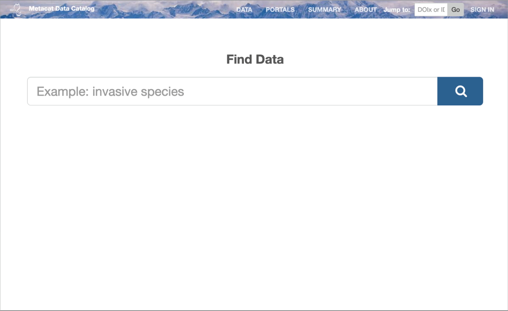

Introduction
============

Metacat is a repository for data and metadata (descriptions of data) that helps
scientists find, understand and effectively use the data sets they manage or
that have been created by others. Thousands of data sets are currently
documented in a standardized way and stored in Metacat systems, providing the
scientific community with a broad range of science data that--because the
data are well and consistently described--can be easily searched, compared,
merged, or used in other ways.

Not only is the Metacat repository a reliable place to store metadata and data
(the database is replicated over a secure connection so that every record is
stored on multiple machines and no data is ever lost to technical failures), it
provides a user-friendly interface for information entry and retrieval.
Scientists can search the repository via the Web using a customizable search
form. Searches return results based on user-specified criteria, such as desired
geographic coverage, taxonomic coverage, and/or keywords that appear in places
such as the data set's title or owner's name. Users need only click a linked
search result to open the corresponding data-set documentation in a browser
window and discover whom to contact to obtain the data themselves (or how to
immediately download the data via the Web).

Metacat's user-friendly Registry application allows data providers to enter
data set documentation into Metacat using a Web form. When the form is
submitted, Metacat compiles the provided documentation into the required format
and saves it. Information providers need never work directly with the XML_
format in which the metadata are stored or with the database records themselves.
In addition, the Metacat application can easily be modified to provide a
customized theme/Web interface.

The metadata stored in Metacat includes all of the information needed
to understand what the described data are and how to use them: a
descriptive data set title; an abstract; the temporal, spatial, and taxonomic
coverage of the data; the data collection methods; distribution information;
and contact information. Each information provider decides who has access to
this information (the public, or just specified users), and whether or not to
upload the data set itself with the data documentation. Information providers
can also edit the metadata or delete it from the repository, again using
Metacat's straightforward Web interface.

Metacat is a `Jakarta servlet`_ application that runs on Linux and  Mac OS
platforms in conjunction with a database, such as
PostgreSQL_, a Web server, RabbitMQ, and a Solr server.
The Metacat application stores data in an XML_ format using `Ecological
Metadata Language`_ (EML) or other metadata standards such as `ISO 19139`_ or the
`FGDC Biological Data Profile`_. For more
information about Metacat or for examples of projects currently using Metacat,
please see http://knb.ecoinformatics.org.

.. _XML: http://en.wikipedia.org/wiki/XML

.. _Jakarta Servlet: https://en.wikipedia.org/wiki/Jakarta_Servlet

.. _PostgreSQL: http://www.postgresql.org/

.. _Ecological Metadata Language: http://knb.ecoinformatics.org/software/eml

.. _ISO 19139: https://www.iso.org/obp/ui/#iso:std:iso:ts:19139:ed-1:v1:en

.. _FGDC Biological Data Profile: http://www.fgdc.gov/standards/projects/FGDC-standards-projects/metadata/biometadata

What's in this Guide
--------------------
This Administrator's guide provides comprehensive steps for downloading, installing, and configuring
Metacat for Ubuntu and other Linux variants, alongside instructions for using Metacatui,
authentication, logging, and creating a site map for improved web search visibility. Metacat can run
on MacOS but it requires users' customized installation.

For detailed information, refer to the table of contents. Additionally, Metacat's `Java API`_ is
available for developers.

.. _Java API: ./api/index.html

Metacat Features
----------------
Metacat is a repository for data and metadata (documentation about data), that
helps scientists find, understand and effectively use the data sets they manage or
that have been created by others. Specifically,

* Metacat is an open source web application, which can run on Linux and MacOS operating systems and is written in Java
* Metacat's Web interface facilitates the input and retrieval of data
* Metacat's optional mapping functionality enables you to query and visualize the geographic coverage of stored data sets
* Metacat's replication feature ensures that all Metacat data and metadata is stored safely on multiple Metacat servers
* Metacat's default web interface `metacatui`_ can be easily modified.
* Metacat can be customized to use Life Sciences Identifiers (LSIDs), uniquely identifying every data record
* Metacat has a built-in logging system for tracking events such as document insertions, updates, deletes, and reads
* The appearance of Metacat's Web interface can be customized via themes.
* Metacat fully supports the DataONE Member Node interface, allowing Metacat deployments to easily participate in the DataONE federation

.. _metacatui: https://nceas.github.io/metacatui/

   Metacat's default home page. Users can customize the appearance using themes.

