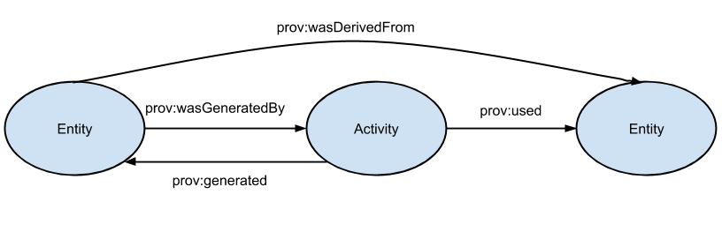
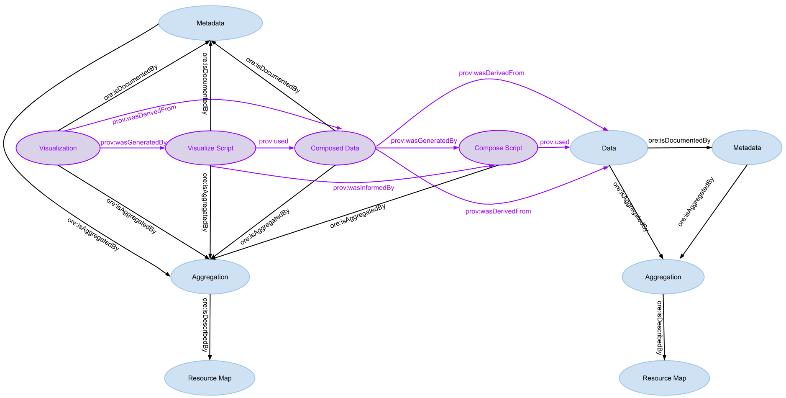
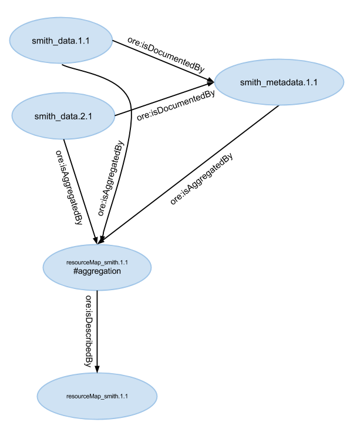
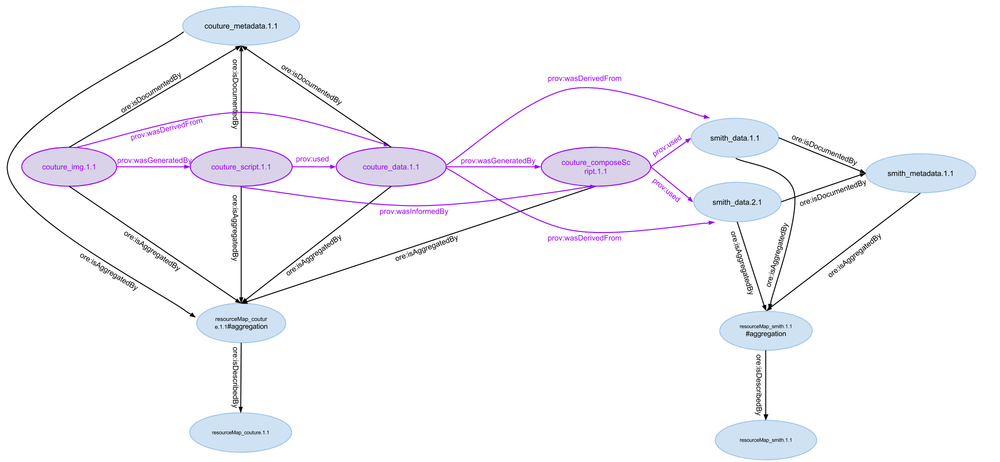
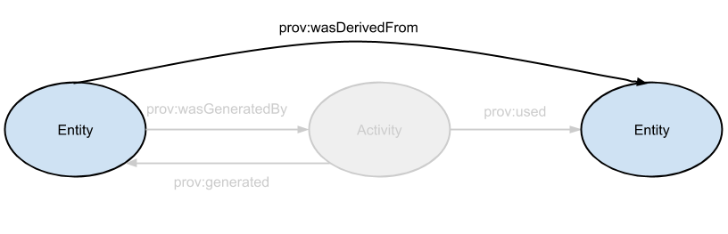

.. raw:: latex

  \newpage
  

ORE Model for Derived Data Packages
===================================

.. index:: Derived Resources
.. index:: PROV

Author
  Lauren Walker

Date
  - 20140513 Initial draft of ORE model expansion for derived data packages

Goal
  Accurately describe the relationships of resources that are derived from other resources.

Summary 
  This proposed expansion of the Metacat ORE model uses the `PROV ontology <http://www.w3.org/TR/prov-overview/>`_ to describe
  the relationships between generated or derived resources and the resources used to generate them.
  
Overview
---------------------------------------
There are two main concepts that are being introduced to Metacat - derived data resources and the activities that create them.

A derived resource is defined as a entity, usually a data file, that is produced by transforming one entity into another or is the production of an activity that generates a new entity from an existing one. 
In Metacat, derived data could be a data table that was composed from analyzing one or more existing data tables. 
It could also be a visualization of another resource, such as a graph, chart, or map.

Because derived data is the product of a transformation activity, Metacat's ORE model will need to have the capability to store information on these activities. 
These activities could be a script (e.g. an R script) that is used to create a visualization from a data table or to compose a new data table from one or more existing data tables. 

These new resources will be documented by metadata, most likely EML.

Ontology and Model
------------------
The `PROV ontology <http://www.w3.org/TR/prov-overview/>`_ will be used to describe the following relationships:
  * Derived resources and the original resources used to create them 
  * Derived resources and the activities used to create them

   Figure 1. A simple diagram illustrating the PROV ontology Metacat will use
   
This model will allow the original data file to remain unchanged as all assertions made about the derived data can be 
described in the derived data RDF.

The terms from the PROV ontology that will be introduced to Metacat to describe these relationships:
   * `wasGeneratedBy <http://www.w3.org/ns/prov#wasGeneratedBy>`_ : Generation is the completion of production of a new entity by an activity. This entity did not exist before generation and becomes available for usage after this generation.
   * `generated <http://www.w3.org/ns/prov#generated>`_ : Generation is the completion of production of a new entity by an activity. This entity did not exist before generation and becomes available for usage after this generation.
   * `wasDerivedFrom <http://www.w3.org/ns/prov#wasDerivedFrom>`_ : A derivation is a transformation of an entity into another, an update of an entity resulting in a new one, or the construction of a new entity based on a pre-existing entity.
   * `used <http://www.w3.org/ns/prov#used>`_ : Usage is the beginning of utilizing an entity by an activity. Before usage, the activity had not begun to utilize this entity and could not have been affected by the entity.
   * `wasInformedBy <http://www.w3.org/ns/prov#wasInformedBy>`_ : Communication is the exchange of an entity by two activities, one activity using the entity generated by the other.
   
The following diagram fully represents the new model for derived resources. New terms and resources are highlighted in purple.

   Figure 2. The model for derived data sets with new terms highlighted in purple.

Examples
---------
Derived data using scripts
__________________________
John Smith is a scientist who has uploaded two data tables and an EML file to a Metacat repository. His package of data is represented below.

	Figure 3. Smith's original data package using the ORE model Metacat has now
	
Jessica Couture is an analyst who wants to create a graph of John's Smith data. She creates an R script that grabs the data files smith_data.1.1 and smith_data.2.1,
performs some sort of analysis on them and transforms them into a single data file, couture_data.1.1. She then creates another R script to visualize this composed data
into a chart. She describes her process and the data in an EML file and uploads all five files to Metacat. Below is the model that describes Couture's new data package:

	Figure 4. Couture's derived data package with the existing Metacat ORE notation in blue and the new PROV notation in purple.

Derived data without scripts
____________________________
Not all derived data will be produced from a script that can be stored in Metacat. An analyst may create a composed data table through a more
manual process, such as transforming values in a spreadsheet program like MS Excel. Or a scientist may create a simple graph of their data with
MS Excel or an online graphing tool.

Let's say John Smith decides to create a time series chart using the data from one of his data files, smith_data.1.1. He adds this image file to
the original data package and edits the metadata to explain his process and the chart. His data package will essentially be using the PROV model without the activity concept.
Smith has the option of creating a new data package with the image and an EML file so that his metadata ID does not have to change. 

   Figure 4. The PROV model without an activity

.. figure:: images/derived-data-smith-package-with-img.png

   Figure 5. Smith's new data package with a data visualization. Note that the resource map and metadata have new revisions. 
 
Sample RDF
----------
A sample RDF notation for our above Couture and Smith example (Figure 4) can be :download:`downloaded <_static/resourceMap_couture.1.1.rdf>` or viewed below. Note that the 
primary data resource will need to be described in the RDFs for its derivations so that an RDF for a derived dataset will have all the information it needs to relate the primary
resource to the derived resource. This way, a SparQL query can be run within a derived dataset RDF to make the assertion that derived_metadata wasDerivedFrom primary_metadata.

::

	<rdf:RDF
	    xmlns:rdf="http://www.w3.org/1999/02/22-rdf-syntax-ns#"
	    xmlns:foaf="http://xmlns.com/foaf/0.1/"
	    xmlns:owl="http://www.w3.org/2002/07/owl#"
	    xmlns:dc="http://purl.org/dc/elements/1.1/"
	    xmlns:ore="http://www.openarchives.org/ore/terms/"
	    xmlns:dcterms="http://purl.org/dc/terms/"
	    xmlns:j.0="http://purl.org/spar/cito/"
	    xmlns:prov="http://www.w3.org/ns/prov#">
	    
	  <rdf:Description rdf:about="https://cn.dataone.org/cn/v1/resolve/couture_data.1.1">
	    <ore:isAggregatedBy>https://cn.dataone.org/cn/v1/resolve/resourceMap_couture.1.1#aggregation</ore:isAggregatedBy>
	    <dcterms:identifier rdf:datatype="http://www.w3.org/2001/XMLSchema#string">couture_data.1.1</dcterms:identifier>
	    <j.0:isDocumentedBy rdf:resource="https://cn.dataone.org/cn/v1/resolve/couture_metadata.1.1"/>
	    <prov:wasGeneratedBy rdf:resource="https://cn.dataone.org/cn/v1/resolve/couture_composeScript.1.1"/>
	    <prov:wasDerivedFrom rdf:resource="https://cn.dataone.org/cn/v1/resolve/smith_data.1.1"/>
	    <prov:wasDerivedFrom rdf:resource="https://cn.dataone.org/cn/v1/resolve/smith_data.2.1"/>
	  </rdf:Description>
	      
	  <rdf:Description rdf:about="https://cn.dataone.org/cn/v1/resolve/smith_data.1.1">
	    <ore:isAggregatedBy>https://cn.dataone.org/cn/v1/resolve/resourceMap_smith .1.1#aggregation</ore:isAggregatedBy>
	    <dcterms:identifier rdf:datatype="http://www.w3.org/2001/XMLSchema#string">smith_data.1.1</dcterms:identifier>
	    <j.0:isDocumentedBy rdf:resource="https://cn.dataone.org/cn/v1/resolve/smith_metadata.1.1"/>
	  </rdf:Description>
	    
	  <rdf:Description rdf:about="https://cn.dataone.org/cn/v1/resolve/resourceMap_couture.1.1#aggregation">
	    <rdf:type rdf:resource="http://www.openarchives.org/ore/terms/Aggregation"/>
	    <ore:isDescribedBy rdf:resource="https://cn.dataone.org/cn/v1/resolve/resourceMap_couture.1.1"/>
	    <dc:title>DataONE Aggregation</dc:title>
	    <ore:aggregates rdf:resource="https://cn.dataone.org/cn/v1/resolve/couture_data.1.1"/>
	    <ore:aggregates rdf:resource="https://cn.dataone.org/cn/v1/resolve/couture_metadata.1.1"/>
	    <ore:aggregates rdf:resource="https://cn.dataone.org/cn/v1/resolve/couture_img.1.1"/>
	    <ore:aggregates rdf:resource="https://cn.dataone.org/cn/v1/resolve/couture_script.1.1"/>
	    <ore:aggregates rdf:resource="https://cn.dataone.org/cn/v1/resolve/couture_composeScript.1.1"/>
	  </rdf:Description>
	    
	  <rdf:Description rdf:nodeID="A0">
	    <foaf:name rdf:datatype="http://www.w3.org/2001/XMLSchema#string">Java libclient</foaf:name>
	    <rdf:type rdf:resource="http://purl.org/dc/terms/Agent"/>
	  </rdf:Description>
	    
	  <rdf:Description rdf:about="https://cn.dataone.org/cn/v1/resolve/resourceMap_couture.1.1">
	    <dcterms:modified rdf:datatype="http://www.w3.org/2001/XMLSchema#dateTime">2013-09-03T09:54:06.392-07:00</dcterms:modified>
	    <ore:describes rdf:resource="https://cn.dataone.org/cn/v1/resolve/resourceMap_couture.1.1#aggregation"/>
	    <rdf:type rdf:resource="http://www.openarchives.org/ore/terms/ResourceMap"/>
	    <dc:creator rdf:nodeID="A0"/>
	    <dcterms:identifier rdf:datatype="http://www.w3.org/2001/XMLSchema#string">resourceMap_couture.1.1</dcterms:identifier>
	  </rdf:Description>
	    
	  <rdf:Description rdf:about="https://cn.dataone.org/cn/v1/resolve/couture_metadata.1.1">
	    <ore:isAggregatedBy>https://cn.dataone.org/cn/v1/resolve/resourceMap_couture.1.1#aggregation</ore:isAggregatedBy>
	    <dcterms:identifier rdf:datatype="http://www.w3.org/2001/XMLSchema#string">couture_metadata.1.1</dcterms:identifier>
	    <j.0:documents rdf:resource="https://cn.dataone.org/cn/v1/resolve/couture_data.1.1"/>
	    <j.0:documents rdf:resource="https://cn.dataone.org/cn/v1/resolve/couture_img.1.1"/>
	    <j.0:documents rdf:resource="https://cn.dataone.org/cn/v1/resolve/couture_script.1.1"/>
	    <j.0:documents rdf:resource="https://cn.dataone.org/cn/v1/resolve/couture_composeScript.1.1"/>
	  </rdf:Description>
	    
	  <rdf:Description rdf:about="https://cn.dataone.org/cn/v1/resolve/couture_img.1.1">
	    <ore:isAggregatedBy>https://cn.dataone.org/cn/v1/resolve/resourceMap_couture.1.1#aggregation</ore:isAggregatedBy>
	    <dcterms:identifier rdf:datatype="http://www.w3.org/2001/XMLSchema#string">couture_img.1.1</dcterms:identifier>
	    <j.0:isDocumentedBy rdf:resource="https://cn.dataone.org/cn/v1/resolve/couture_metadata.1.1"/>
	    <prov:wasDerivedFrom rdf:resource="https://cn.dataone.org/cn/v1/resolve/couture_data.1.1"/>
	    <prov:wasGeneratedBy rdf:resource="https://cn.dataone.org/cn/v1/resolve/couture_script.1.1"/>
	  </rdf:Description>
	    
	  <rdf:Description rdf:about="https://cn.dataone.org/cn/v1/resolve/couture_script.1.1">
	    <ore:isAggregatedBy>https://cn.dataone.org/cn/v1/resolve/resourceMap_couture.1.1#aggregation</ore:isAggregatedBy>
	    <dcterms:identifier rdf:datatype="http://www.w3.org/2001/XMLSchema#string">couture_script.1.1</dcterms:identifier>
	    <j.0:isDocumentedBy rdf:resource="https://cn.dataone.org/cn/v1/resolve/couture_metadata.1.1"/>
	    <prov:used rdf:resource="https://cn.dataone.org/cn/v1/resolve/couture_data.1.1"/>
	    <prov:generated rdf:resource="https://cn.dataone.org/cn/v1/resolve/couture_img.1.1"/>
	    <prov:wasInformedby rdf:resource="https://cn.dataone.org/cn/v1/resolve/couture_composeScript.1.1" />
	  </rdf:Description>
	    
	  <rdf:Description rdf:about="https://cn.dataone.org/cn/v1/resolve/couture_composeScript.1.1">
	    <ore:isAggregatedBy>https://cn.dataone.org/cn/v1/resolve/resourceMap_couture.1.1#aggregation</ore:isAggregatedBy>
	    <dcterms:identifier rdf:datatype="http://www.w3.org/2001/XMLSchema#string">couture_composeScript.1.1</dcterms:identifier>
	    <j.0:isDocumentedBy rdf:resource="https://cn.dataone.org/cn/v1/resolve/couture_metadata.1.1"/>
	    <prov:used rdf:resource="https://cn.dataone.org/cn/v1/resolve/smith_data.1.1"/>
	    <prov:used rdf:resource="https://cn.dataone.org/cn/v1/resolve/smith_data.2.1"/>
	    <prov:generated rdf:resource="https://cn.dataone.org/cn/v1/resolve/couture_data.1.1"/>
	  </rdf:Description>
	    
	</rdf:RDF>

Indexing
--------
The Metacat Index will index some of these relationships mainly to inform MetacatUI.

New Index Fields
	* ``wasGeneratedBy``
	* ``generated``
	* ``used``
	* ``wasDerivedFrom``
	* ``wasInformedBy``
	* ``hadDerivation``

All of these fields are taken directly from the PROV ontology, except for ``hadDerivation``. Because MetacatUI navigation is metadata-centric 
(i.e. metadata are retrieved and listed as search results and details on datasets are viewed via the metadata view [/#view]), it is helpful to 
use SparQL to infer relationships between metadata so that it isn't necessary to send multiple queries to the index to retrieve information about 
derived datasets.

SparQL will infer that the derived metadata wasDerivedFrom the primary source metadata and the Metacat index will index both this relationship and it's inverse, 
hadDerivation, for easier querying.	The SparQL query used to determine the derived metadata for a primary metadata would look like:

::

	SELECT ?primary_metadata_pid ?derived_metadata_pid
	WHERE {
		?primary_data		ore:isDocumentedBy	?primary_metadata .
		?primary_metadata	dcterms:identifier 	?primary_metadata_pid .
		?derived_data		prov:wasDerivedFrom	?primary_data .
		?derived_data		ore:isDocumentedBy	?derived_metadata .
		?derived_metadata	dcterms:identifier 	?derived_metadata_pid .
	}

More information about inverses in PROV-O and in particular, ``hadDerivation``, see `section B of the PROV documentation <http://www.w3.org/TR/prov-o/#inverse-names>`_.
	
Example
_______

Using the above Couture and Smith example (Figure 4), the following fields and values from the PROV relationships would be indexed.

+---------------------------+----------------+---------------------+--------------------------------+
| Object                    |  Field Name    | Field Type          |             Value              |
+===========================+================+=====================+================================+
| couture_metadata.1.1      | wasDerivedFrom | string, multivalued | smith_metadata.1.1             |
+---------------------------+----------------+---------------------+--------------------------------+
| smith_metadata.1.1        | hadDerivation  | string, multivalued | couture_metadata.1.1           |
+---------------------------+----------------+---------------------+--------------------------------+
| couture_img.1.1           | wasGeneratedby | string, multivalued | couture_script.1.1             |
+---------------------------+----------------+---------------------+--------------------------------+
| couture_img.1.1           | wasDerivedFrom | string, multivalued | couture_data.1.1               |
+---------------------------+----------------+---------------------+--------------------------------+
| couture_script.1.1        | used           | string, multivalued | couture_data.1.1               |
+---------------------------+----------------+---------------------+--------------------------------+
| couture_script.1.1        | wasInformedBy  | string, multivalued | couture_composeScript.1.1      |
+---------------------------+----------------+---------------------+--------------------------------+
| couture_script.1.1        | generated      | string, multivalued | couture_img.1.1                |
+---------------------------+----------------+---------------------+--------------------------------+
| couture_data.1.1          | wasGeneratedBy | string, multivalued | couture_composeScript.1.1      |
+---------------------------+----------------+---------------------+--------------------------------+
| couture_data.1.1          | wasDerivedFrom | string, multivalued | smith_data.1.1, smith_data.2.1 |
+---------------------------+----------------+---------------------+--------------------------------+
| couture_composeScript.1.1 | used           | string, multivalued | smith_data.1.1, smith_data.2.1 |
+---------------------------+----------------+---------------------+--------------------------------+
| couture_composeScript.1.1 | generated      | string, multivalued | couture_data.1.1               |
+---------------------------+----------------+---------------------+--------------------------------+

Queries
_______
These indexed fields will be used primarily by MetacatUI to determine relationships between resources. An example use case is the MetacatUI metadata view (/#view/{pid}).
When a user navigates to the metadata view for a primary resource, such as smith_metadata.1.1 from the above example, MetacatUI can send a query to the index to look for
derived resources that the user might be interested in. Some pseduocode to describe this logic:

::

	if(this_metadata.hadDerivation){
		hadDerivation = this_metadata.hadDerivation;
		sendQuery("q=isDocumentedBy:" + hadDerivation + "+-obsoletedBy:*&fl=id");
	}

This query would retrieve the IDs of objects which are documented by metadata that is derived from the metadata currently being viewed. In the above Amith and Couture example (Figure 4), the following IDs
would be returned from this query:

* ``couture_composeScript.1.1``
* ``couture_script.1.1``
* ``couture_data.1.1``
* ``couture_img.1.1``
