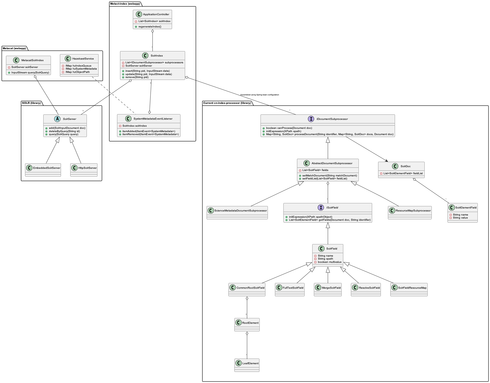

Metacat Indexing
===========================
Metacat v2.1 introduces support for building a SOLR index of Metacat content.
While we continue to support the "pathquery" search mechanism, this will be phased out 
in favor of the more efficient SOLR query interface. Metacat deployments that opt to use
the Metacat SOLR index will be able to take advantage of:

  * Fast search performance

  * Built-in paging features

  * Customizable return formats (for advanced admins)

Indexed Documents and Fields
-----------------------------
Metacat integrates the existing DataONE index library which includes many common metadata formats
out-of-the-box:

  * EML

  * FGDC

  * Dryad*

Default Indexed Fields
-----------------------
For a complete listing of the indexed fields, please see the DataONE documentation.

 https://dataoneorg.github.io/api-documentation/

Metacat also reports on the currently-indexed fields, simply navigate to:

 https://dataoneorg.github.io/api-documentation/apis/MN_APIs.html#query-api

with "solr" as the engine.

Index Configuration
-------------------
Metacat-index is deployed as a separate web application (metacat-index.war) and should be deployed 
as a sibling of the Metacat webapp (metacat.war). Deploying metacat-index.war is only required when SOLR support
is desired (e.g., for MetacatUI) and can safely be omitted if it will not be utilized for any given Metacat deployment.

During the initial installation/upgrade, an empty index will be initialized in the configured "solr-home" location.
Metacat-index will index all the existing Metacat content when the webapp next initializes.

 **Note:** the configured solr-home directory should not exist before configuring Metacat with indexing for the first time,
 otherwise the blank index will not be created for metacat-index to utilize.

Additional advanced configuration options may be set. The existing default values for these
settings (shared between Metacat and Metacat-index) can be viewed in the (non-editable)
**metacat.properties** file. If you wish to override any of these defaults, the new values may be
added to the **metacat-site.properties** file.

 For more details on locating these files and changing Metacat's configurable properties, see :ref:`configuration-properties-overview`).

Adding Additional Document Types and Fields
--------------------------------------------
TBD: Step-by-step guide for adding new documents and indexed fields.

Querying the Index
------------------
The SOLR index can be queried using standard SOLR syntax and return options. 
The DataONE query interface exposes the SOLR query engine.

 https://dataoneorg.github.io/api-documentation/apis/MN_APIs.html#query-api

Please see the SOLR documentation for examples and exhaustive syntax information.

 http://lucene.apache.org/solr/

Access Policy Enforcement
-------------------------
Access control is enforced by the index such that only records that are readable by the 
user performing the query are returned to the user. Any SOLR query submitted will be 
augmented with access control criteria corresponding to if and how the user is currently 
authenticated. Both certificate-based (DataONE API) and JSESSIONID-based (Metacat API) 
authentication are simultaneously supported.

Regenerating The Index
----------------------
When the SOLR index has been drastically modified, a complete regeneration of the 
index may be necessary. Please see the example below to re-index all objects or the `Metacat Admin API`_ docs:

 # curl -X PUT -H "Authorization: Bearer $TOKEN" https://<your-host>/<your-context>/d1/mn/v2/index?all=true

 # where $TOKEN is an environment variable containing your indexer token

 **Example:**

 ::

   curl -X PUT -H "Authorization: Bearer $TOKEN" https://knb.ecoinformatics.org/knb/d1/mn/v2/index?all=true

.. _Metacat Admin API: ./admin-api.html

Class Design Overview
----------------------

   Figure 1. Class design overview.
   
..
  @startuml images/indexing-class-diagram.png
  
	package "Current cn-index-processor (library)" {
	
		interface IDocumentSubprocessor {
			+ boolean canProcess(Document doc)
			+ initExpression(XPath xpath)
			+ Map<String, SolrDoc> processDocument(String identifier, Map<String, SolrDoc> docs, Document doc)
		}
		class AbstractDocumentSubprocessor {
			- List<SolrField> fields
			+ setMatchDocument(String matchDocument)
			+ setFieldList(List<SolrField> fieldList) 
		}
		class ResourceMapSubprocessor {
		}
		class ScienceMetadataDocumentSubprocessor {
		}
			  
		interface ISolrField {
			+ initExpression(XPath xpathObject)
			+ List<SolrElementField> getFields(Document doc, String identifier)
		}
		class SolrField {
			- String name
			- String xpath
			- boolean multivalue
		}
		class CommonRootSolrField {
		}
		class RootElement {
		}
		class LeafElement {
		}
		class FullTextSolrField {
		}
		class MergeSolrField {
		}
		class ResolveSolrField {
		}
		class SolrFieldResourceMap {
		}
		
		class SolrDoc {
		      - List<SolrElementField> fieldList
		}
		
		class SolrElementField {
		      - String name
		      - String value
		}
		    
	}
	
	IDocumentSubprocessor <|-- AbstractDocumentSubprocessor
	AbstractDocumentSubprocessor <|-- ResourceMapSubprocessor
	AbstractDocumentSubprocessor <|-- ScienceMetadataDocumentSubprocessor

	ISolrField <|-- SolrField
	SolrField <|-- CommonRootSolrField
	CommonRootSolrField o--"1" RootElement
	RootElement o--"*" LeafElement
	SolrField <|-- FullTextSolrField
	SolrField <|-- MergeSolrField
	SolrField <|-- ResolveSolrField			
	SolrField <|-- SolrFieldResourceMap
	
	AbstractDocumentSubprocessor o--"*" ISolrField
	
	IDocumentSubprocessor --> SolrDoc
	
	SolrDoc o--"*" SolrElementField
	
	package "SOLR (library)" {
          
        abstract class SolrServer {
            + add(SolrInputDocument doc)
            + deleteByQuery(String id)
            + query(SolrQuery query)
        }
        class EmbeddedSolrServer {
        }
        class HttpSolrServer {
        }
    
    }
    
    SolrServer <|-- EmbeddedSolrServer
    SolrServer <|-- HttpSolrServer
	
	package "Metact-index (webapp)" {
		  
		class ApplicationController {
		    - List<SolrIndex> solrIndex
		    + regenerateIndex()
		}
		
		class SolrIndex {
			- List<IDocumentSubprocessor> subprocessors
			- SolrServer solrServer
			+ insert(String pid, InputStream data)
			+ update(String pid, InputStream data)
			+ remove(String pid)
		}

		class SystemMetadataEventListener {
			- SolrIndex solrIndex
			+ itemAdded(ItemEvent<SystemMetadata>)
			+ itemRemoved(ItemEvent<SystemMetadata>)
		}
	
	}
	
	package "Metacat (webapp)" {
		  
		class MetacatSolrIndex {
			- SolrServer solrServer
			+ InputStream query(SolrQuery)
		}
		
		class HazelcastService {
			- IMap hzIndexQueue
			- IMap hzSystemMetadata
			- IMap hzObjectPath
		}
		
	}
	
	MetacatSolrIndex o--"1" SolrServer
	HazelcastService .. SystemMetadataEventListener
	
	ApplicationController o--"*" SolrIndex
	SolrIndex o--"1" SolrServer	
	SolrIndex "1"--o SystemMetadataEventListener
	SolrIndex o--"*" IDocumentSubprocessor: Assembled using Spring bean configuration
	
	
	
  
  @enduml
