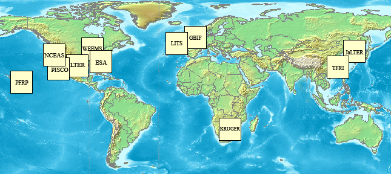
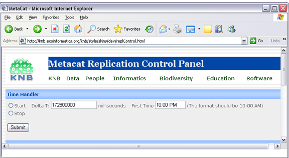
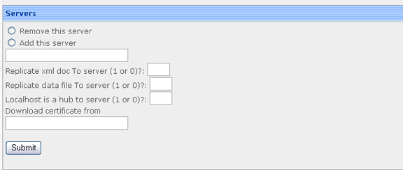

Replication
===========

.. Note:: 
  
  Note that much of the functionality provided by the replication subsystem in Metacat
  has now been generalized and standardized by DataONE, so consider utilizing the
  DataONE services for replication as it is a more general and standardized approach
  than this Metacat-specific replication system.  The Metacat replication system
  will be supported for a while longer, but will likely be deprecated in a future
  release in favor of using the DataONE replication approach. 

Metacat has a built-in replication feature that allows different Metacat servers 
to share data (both XML documents and data files) between each other. Metacat 
can replicate not only its home server's original documents, but also those 
that were replicated from partner Metacat servers. When changes are made to 
one server in a replication network, the changes are automatically propogated 
to the network, even if the network is down.

Replication allows users to manage their data locally and (by replicating them 
to a shared Metacat repository) to make those data available to the greater 
scientific community via a centralized search. In other words, your Metacat can 
be part of a broader network, but you retain control over the local repository 
and how it is managed.

For example, the KNB Network (Figure 6.1), which currently consists of ten 
different Metacat servers from around the world, uses replication to "join" 
the disperate servers to form a single robust and searchable data 
repository--facilitating data discovery, while leaving the data ownership and 
management with the local administrators.

   
   A map of the KNB Metacat network.

When properly configured, Metacat's replication mechanism can be triggered by 
several types of events that occur on either the home or partner server: a 
document insertion, an update, or an automatic replication (i.e., Delta-T 
monitoring), which is set at a user-specified time interval.

+----------------------+----------------------------------------------------------+
| Replication Triggers | Description                                              |
+======================+==========================================================+
| Insert               | Whenever a document is inserted into Metacat, the server |
|                      | notifies each server in its replication list             |
|                      | that it has a new file available.                        |
+----------------------+----------------------------------------------------------+
| Update               | Whenever a document is updated, the server notifies      |
|                      | each server in its replication list of the update.       |
+----------------------+----------------------------------------------------------+
| Delta-T monitoring   | At a user-specified time interval, Metacat checks each   |
|                      | of the servers in its replication list                   |
|                      | for updated documents.                                   |
+----------------------+----------------------------------------------------------+

Configuring Replication
-----------------------
To configure replication, you must configure both the home and partner servers:

1. Create a list of partner servers on your home server using the Replication Control Panel
2. Create certificate files for the home server
3. Create certificate files for the partner server
4. Import partner certificate files to the home server
5. Import home certificate to the partner server
6. Update your Metacat database 

Each step is discussed in more detail in the following sections.

Using the Replication Control Panel
~~~~~~~~~~~~~~~~~~~~~~~~~~~~~~~~~~~
To add, remove, or alter servers on your home server's Replication list, or to 
activate and customize the Delta-T handler, use the Replication control panel, 
which is accessed via the Metacat Administration interface at the following URL::
 
   http://somehost.somelocation.edu/context/admin
   
"http://somehost.somelocation.edu/context" should be replaced with the name 
of your Metacat server and context (e.g., http://knb.ecoinformatics.org/knb/). 
You must be logged in to Metacat as an administrator.

   
   Replication control panel.

Note that currently, you cannot use the Replication Control Panel to remove a 
server after a replication has occurred. To stop replication between two servers,
update the flags that control whether metadata and/or data are replicated.

Generating and Exchanging Security Certificates
~~~~~~~~~~~~~~~~~~~~~~~~~~~~~~~~~~~~~~~~~~~~~~~
Before you can take advantage of Metacat's replication feature, you must 
generate security certificates on both the replication partner and home servers. 
Depending on how the certificates are generated, the certificates may need to be
exchanged so that each machine "trusts" that the other has replication access.
Certificates that are purchased from a commercial and well-recognized 
Certificate Authority do not need to be exchanged with the other replication
partner before replication takes place.  Metacat replication relies on SSL with
client certificate authentication enabled.  When a replication partner server 
communicates with another replication partner, it presents a certificate that
serves to verify and authenticate that the server is trusted.

If you must generate a self-signed certificate, the partner replication server 
will need that public certificate (or the certificate of the signing CA) added 
to its existing Certificate Authorities. 

Generate Certificates for Metacat running under Apache/Tomcat
.............................................................
Note: Instructions are for Ubuntu/Debian systems.

1. Generate a private key using openssl. The key will be named 
   ``<hostname>-apache.key``, where ``<hostname>`` is the name of your Metacat 
   server. Example values for the individual key fields are included in the
   table below.

   ::
   
     openssl req -new -out REQ.pem -keyout <hostname>-apache.key

   +--------------------------+-------------------------------------------------------------------------+
   | Key Field                | Description and Example Value                                           |
   +==========================+=========================================================================+
   | Country Name             | Two letter country code  (e.g., US)                                     |
   +--------------------------+-------------------------------------------------------------------------+
   | State or Province Name   | The name of your state or province spelled in full (e.g., California)   |
   +--------------------------+-------------------------------------------------------------------------+
   | Locality Name            | The name of your city (e.g., Santa Barbara)                             |
   +--------------------------+-------------------------------------------------------------------------+
   | Organization Name        | The company or organization name (e.g., UCSB)                           |
   +--------------------------+-------------------------------------------------------------------------+
   | Organizational Unit Name | The department or section name (e.g., NCEAS)                            |
   +--------------------------+-------------------------------------------------------------------------+
   | Common Name              | The host server name without port numbers (e.g., myserver.mydomain.edu) |
   +--------------------------+-------------------------------------------------------------------------+
   | Email Address            | Administrator's contact email (e.g., administrator@mydomain.edu)        |
   +--------------------------+-------------------------------------------------------------------------+
   | A challenge password     | --leave this field blank--                                              |
   +--------------------------+-------------------------------------------------------------------------+
   | An optional company name | --leave this field blank--                                              |
   +--------------------------+-------------------------------------------------------------------------+

2. Create the local certificate file by running the command:

   ::
   
     openssl req -x509 -days 800 -in REQ.pem -key <hostname>-apache.key -out <hostname>-apache.crt

   Use the same ``<hostname>`` you used when you generated the key. A file named 
   ``<hostname>-apache.crt`` will be created in the directory from which you 
   ran the openssl command. Note: You can name the certificate file anything 
   you'd like, but keep in mind that the file will be sent to the partner 
   machine used for replication. The certificate name should have enough 
   meaning that someone who sees it on that machine can figure out where it 
   came from and for what purpose it should be used. 

3. Enter the certificate into Apache's security configuration. This will
   be used to identify your server to a replication partner. You must 
   register the certificate in the local Apache instance. Note that the 
   security files may be in a different directory from the one used in the 
   instructions depending on how you installed Apache. Copy the certificate and 
   key file using the following commands:
   
   ::
   
     sudo cp <hostname>-apache.crt /etc/ssl/certs 
     sudo cp <hostname>-apache.key /etc/ssl/private 

4. Apache needs to be configured to request a client certificate when the 
   replication API is utilized. The helper file named "metacat-site-ssl.conf" has default 
   rules that configure Apache for SSL and client certificate authentication. 
   Set up these SSL settings by copying the metacat-site-ssl.conf file into the ``sites-available`` 
   directory, editing pertinent values to match your system and running 
   ``a2ensite`` to enable the site. (Note: some settings in metacat-site-ssl.conf need to be 
   changed to match the specifics of your system and Metacat deployment.) 

   ::
   
     sudo cp <metacat_helper_dir>/metacat-site-ssl.conf <apache_install_dir>/sites-available
     sudo a2ensite metacat-site-ssl.conf

5. Enable the ssl module: 

   ::
   
     sudo a2enmod ssl

6. Restart Apache to bring in changes by typing: 

   ::
   
     sudo /etc/init.d/apache2 restart

7. If using a self-signed certificate, SCP ``<hostname>-apache.crt`` to the 
   replication partner machine where it will be added as an additional 
   Certificate Authority.

If using self-signed certificates, after you have created and SCP'd a 
certificate file to each replication partner, and received a certificate file 
from each partner in return, both home and partner servers must add the 
respective partner certificates as Certificate Authorities.

To import a certificate
.......................
1. Copy it into the Apache directory
   
   ::
   
     sudo cp <remotehostfilename> /etc/ssl/certs/

2. Rehash the certificates for Apache by running: 

   ::
   
     cd /etc/ssl/certs
     sudo c_rehash

   where the ``<remotehostfilename>`` is the name of the certificate file 
   created on the remote partner machine and SCP'd to the home machine. 

To import a certificate into Java keystore (for self-signed certificates)
.........................................................................
1. Use Java's keytool to import to the default Java keystore
   
   ::
   
     sudo keytool -import -alias <remotehostname_alias> -file <remotehostfilename> -keystore $JAVA_HOME/lib/security/cacerts

2. Restart Tomcat 

   ::
   
     sudo /etc/init.d/tomcat7 restart

   where the ``<remotehostfilename>`` is the name of the certificate file 
   created on the remote partner machine and SCP'd to the home machine and
   <remotehostname_alias> is a short memorable alias for this certificate and 
   $JAVA_HOME is the same as configured for running Tomcat. NOTE: the cacerts path may be different
   depending on your exact Java installation.

Update Metacat properties
.........................
Metacat needs to be configured with the path to both the server certificate and the private key.
1. Edit metacat.properties, modifying these properties to match your specific deployment.

   ::
   
     replication.certificate.file=/etc/ssl/certs/<hostname>-apache.crt
     replication.privatekey.file=/etc/ssl/private/<hostname>-apache.key
     replication.privatekey.password=<password, or blank if not protected>
     

Update your Metacat database
~~~~~~~~~~~~~~~~~~~~~~~~~~~~
The simplest way to update the Metacat database to use replication is to use 
the Replication Control Panel. You can also update the database using SQL. 
Instructions for both options are included in this section.

   
   Using the Replication Control Panel to update the Metacat database.

To update your Metacat database to use replication, select the "Add this server" 
radio button from the Replication Control Panel, enter the partner server name, 
and specify how the replication should occur (whether to replicate xml, data, 
or use the local machine as a hub).

To update the database using SQL
................................

1. Log in to the database

   ::
   
     psql -U metacat -W -h localhost metacat

2. Select all rows from the replication table

   ::

     select * from xml_replication;  

3. Insert the partner server. 

   ::
   
     INSERT INTO xml_replication (server,last_checked,replicate,datareplicate,hub) VALUES ('<partner.server/context>/servlet/replication',NULL,1,1,0);

   Where ``<partner.server/context>`` is the name of the partner server and 
   context. The values 'NULL, 1,1,0' indicate (respectively) the last time 
   replication occurred, that XML docs should be replicated to the partner 
   server, that data files should be replicated to the partner server, and 
   that the local server should not act as a hub. Set a value of 'NULL,0,0,0' 
   if your Metacat is only receiving documents from the partner site and not 
   replicating to that site.

4. Exit the database 
5. Restart Apache and Tomcat on both home and partner replication machines 
