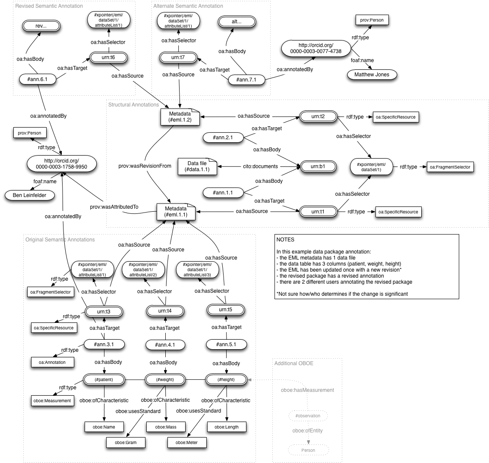

.. raw:: latex

  \newpage
  

Semantic Annotation proposal
===================================

.. index:: Semantic Annotation
.. index:: Open Annotation
.. index:: RDF
.. index:: OBOE

Author
  Ben Leinfelder

Date
  - May, 2014: Initial draft of semantic annotation model and indexing

Goal
  Describe the current state of semantic annotation model using OBOE and OA (Open Annotation) concepts

Summary 
  Years of semantic work on the semtools project has informed the current annotation model we are prosing for use in Metacat.
  The model will initially focus on annotating attribute information for characteristics (e.g., Temperature) and Standard (e.g., Celsius).
  The model will be indexed to support fast and simple queries using the existing SOLR index methods used for standard metadata descriptions.
  This annotation model uses the `OA ontology <http://www.openannotation.org/spec/core/>`_ to describe
  the annotation assertions about metadata resources and fragments. PROV, FOAF, DCTERMS, and OBOE concepts are also utilized.
  
Overview
---------------------------------------
The primary goal of this initial semantic annotation model is to support querying on measurement standard and characteristic information. 
The model also supports annotations that describe these observations with their entity context, but that will not be utilized in the first stage of deployment.

Ontology and Model
------------------
The `OA ontology <http://www.openannotation.org/spec/core/>`_ will be used to describe the following relationships:
  * Which concepts describe which resources and/or parts of resources 
  * Where in the structure of a resource a particular annotation applies
  * Who is credited with authoring an annotation.

The `PROV ontology <http://www.w3.org/TR/prov-overview/>`_ will be used to describe the following relationships:
  * Who is credited with generating a resource being annotated
  * Which resources are newer revisions of other resources

Existing ORE resource map relationships can be augmented in this model to provide more explicit linkage between the data files and the section of metadata that documents them.
These structural annotations can assist package consumers (human and machine) when interpreting data objects. Using fragment selectors with XML-based metadata associates
data resources with their entity and attribute descriptions in a way that existing DataONE ORE maps do not support.

   Figure 1. Diagram illustrating the annotation model for a sample data package
   
In an effort to illustrate as many features of the proposed model, the example makes the following assumptions:
  * the EML metadata package describes 1 data table file
  * the data table has 3 columns (patient, weight, height)
  * the EML package has been updated once with a new revision
  * the revised package has a revised annotation
  * there are 2 different users annotating the revised package

Important concepts used in the model:
   * `oa:hasBody <http://www.openannotation.org/spec/core/core.html#BodyTarget>`_ : The body contains the semantic concept that describes the target
   * `oa:hasTarget <http://www.openannotation.org/spec/core/core.html#BodyTarget>`_ : The target specifies the resource being annotated
   * `oa:hasSource <http://www.openannotation.org/spec/core/specific.html#SpecificAnnotations>`_ : Identifies the source of a target to which selectors can be applied.
   * `oa:hasSelector <http://www.openannotation.org/spec/core/specific.html#FragmentSelector>`_ : Specifies the part of a resource to which an annotation applies. An XPath FragmentSelector will commonly be used for annotating XML-based metadata resources
   * `oa:annotatedBy <http://www.openannotation.org/spec/core/core.html#Provenance>`_ : [subProperty of prov:wasAttributedTo] The object of the relationship is a resource that identifies the agent responsible for creating the Annotation. 

   * `oboe:Measurement <http://ecoinformatics.org/oboe/oboe.1.0/oboe-core.owl#Measurement>`_ : The primary body of semantic annotations on attributes.
   * `oboe:ofCharacteristic <http://ecoinformatics.org/oboe/oboe.1.0/oboe-core.owl#ofCharacteristic>`_ : Specifies which Characteristic (subclass) is measured
   * `oboe:usesStandard <http://ecoinformatics.org/oboe/oboe.1.0/oboe-core.owl#usesStandard>`_ : Specifies in which Standard (Unit subclass) the measurement is recorded.
   

::

Model details
--------------
Using the ``weight`` column in our example data package, we can illustrate the annotation model's use of concepts from OBOE, OA, and PROV.
The primary entry point for the annotation is ``#ann.4.1`` and was asserted by Ben Leinfelder (foaf:name) , identified with his ORCID URI (oa:annotatedBy).
The body of the annotation (oa:hasBody) is comprised of an oboe:Measurement instance, ``#weight``, that measures ``Mass`` (oboe:ofCharacteristic) in ``Gram`` (oboe:usesStandard).
The target of the annotation (oa:hasTarget) points to the EML metadata resource (oa:hasSource) that documents the data table and selects a particular part of the metadata that describes 
the specific ``weight`` data attribute (oa:hasSelector). Because the EML metadata is serialized as XML, we can use an XPath oa:FragmentSelector to identify the data column being annotated.
Note that our XPath expression identifies ``weight`` as the second column in the first data table in the data package: #xpointer(/eml/dataSet/dataTable[1]/attributeList/attribute[2].

In order to bind the column annotation of the metadata to the physical data object (the three-column CSV file), we need to traverse the packaging model where an additional annotation expresses the relationship 
between the data and metadata objects. The annotation, ``#ann.1.1``, asserts that the Metadata file (#eml.1.1) describes (cito:documents) the data file (#data.1.1). More specifically, the annotation target specifies 
where in the EML the #data.1.1 object is described by using an oa:FragmentSelector with an XPath pointer to the first data file documented in the EML: #xpointer(/eml/dataSet/dataTable[1].

Note that the annotation model uses a slightly different model than the original ORE resource map model recommended by DataONE. While it is more complicated to include pointers to data documentation within the metadata,
we have found that the current ORE maps are not sufficiently descriptive on their own and any consumers must also consult the metadata to figure out which object is the csv, which is the pdf, which is the script, etc...
By incorporating the metadata pointer within the annotation model, we hope to be able to hanlde data packages that use manu different metadata serializations without having to write custom handlers for each formatId.

Indexing
--------
The Metacat Index component has been enhanced to parse semantic models provided as RDF. 
The general purpose RdfXmlSubprocessor can be used with SparqlFields to extract key concepts from any given model that is added to the Metacat MN document store.

The processor assumes that the identifier of the RDF document is the name of the graph being inserted into the triple store and provides that graph name to the query engine for substitution in any query syntax ($GRAPH_NAME).
The SPARQL requirements are that the solution[s] return the identifier (pid) of the object being annotated, and the index field being populated with the given value[s].
If multiple fields are to be extracted from the model for indexing, a distinct SPARQL query should be used for each field.

The query can (and is largely expected to) be constrained to the named graph that contains only that set of annotation triples. While the infrastructure can (and likely will) share the same triple store, 
we should not assume other models have been loaded when processing any given graph. This means that any solutions will rely on only the named graph being processed during indexing.

The SPARQL query used to determine the Characteristics measured in a dataset is shown below. Note that the query includes superclasses in the returned solutions so that 
the index returns a match for both general and specific criteria.

::

	PREFIX rdf: <http://www.w3.org/1999/02/22-rdf-syntax-ns#> 
	PREFIX rdfs: <http://www.w3.org/2000/01/rdf-schema#> 
	PREFIX owl: <http://www.w3.org/2002/07/owl#> 
	PREFIX oboe-core: <http://ecoinformatics.org/oboe/oboe.1.0/oboe-core.owl#> 
	PREFIX oa: <http://www.w3.org/ns/oa#>
	PREFIX dcterms: <http://purl.org/dc/terms/>

	SELECT ?characteristic_sm ?pid
	FROM <$GRAPH_NAME>
	WHERE { 
			
			?measurement rdf:type oboe-core:Measurement .
			?measurement rdf:type ?restriction .
			?restriction owl:onProperty oboe-core:ofCharacteristic .
			?restriction owl:allValuesFrom ?characteristic .
			?characteristic rdfs:subClassOf+ ?characteristic_sm .
			?characteristic_sm rdfs:subClassOf oboe-core:Characteristic .
			
			?annotation oa:hasBody ?measurement .												
			?annotation oa:hasTarget ?target .
			?target oa:hasSource ?metadata .
			?metadata dcterms:identifier ?pid . 
			
	 	}
	
::

Index Fields 
_________________

Currently, these dynamic, multi-valued string fields allow us to index the new semantic content without changing the SOLR schema. 
They are multi-valued because they will store the entire class subsumption hierarchy (up) for any matching concepts
and because they will store annotations from the same metadata resources for different attributes.
	* ``characteristic_sm`` - indexes the oboe:Characteristic[s] for oboe:Measurement[s] in the datapackage
	* ``standard_sm`` - indexes the oboe:Standard[s] for oboe:Measurement[s] in the datapackage

	
Example
_______

Continuing with example model, these concepts would be indexed for the data attributes described in the datapackage metadata.

+---------------------------+-------------------+---------------------+-------------------------------------------------------------------------------------+
| Object                    |  Field Name       | Field Type          |                                                Value                                |
+===========================+===================+=====================+=====================================================================================+
| eml.1.1   			    | characteristic_sm | string, multivalued | http://ecoinformatics.org/oboe/oboe.1.0/oboe-core.owl#Characteristic                |
+---------------------------+-------------------+---------------------+-------------------------------------------------------------------------------------+
| eml.1.1   			    | characteristic_sm | string, multivalued | http://ecoinformatics.org/oboe/oboe.1.0/oboe-core.owl#PhysicalCharacteristic        |
+---------------------------+-------------------+---------------------+-------------------------------------------------------------------------------------+
| eml.1.1   			    | characteristic_sm | string, multivalued | http://ecoinformatics.org/oboe/oboe.1.0/oboe-characteristics.owl#Mass               |
+---------------------------+-------------------+---------------------+-------------------------------------------------------------------------------------+
| eml.1.1 				    | characteristic_sm | string, multivalued | http://ecoinformatics.org/oboe/oboe.1.0/oboe-characteristics.owl#Length             |
+---------------------------+-------------------+---------------------+-------------------------------------------------------------------------------------+
| eml.1.1   			    | characteristic_sm | string, multivalued | http://ecoinformatics.org/oboe/oboe.1.0/oboe-core.owl#Name					        |
+---------------------------+-------------------+---------------------+-------------------------------------------------------------------------------------+
| eml.1.1   			    | standard_sm		| string, multivalued | http://ecoinformatics.org/oboe/oboe.1.0/oboe-core.owl#Standard 		                |
+---------------------------+-------------------+---------------------+-------------------------------------------------------------------------------------+
| eml.1.1   			    | standard_sm		| string, multivalued | http://ecoinformatics.org/oboe/oboe.1.0/oboe-core.owl#Unit			                |
+---------------------------+-------------------+---------------------+-------------------------------------------------------------------------------------+
| eml.1.1   			    | standard_sm		| string, multivalued | http://ecoinformatics.org/oboe/oboe.1.0/oboe-core.owl#BaseUnit		                |
+---------------------------+-------------------+---------------------+-------------------------------------------------------------------------------------+
| eml.1.1   			    | standard_sm		| string, multivalued | http://ecoinformatics.org/oboe/oboe.1.0/oboe-standards.owl#Gram 	                |
+---------------------------+-------------------+---------------------+-------------------------------------------------------------------------------------+
| eml.1.1   			    | standard_sm		| string, multivalued | http://ecoinformatics.org/oboe/oboe.1.0/oboe-standards.owl#Meter 	                |
+---------------------------+-------------------+---------------------+-------------------------------------------------------------------------------------+

Queries
_______
These indexed fields will be used primarily by MetacatUI to enhance discovery - both in terms of recall (concept hierarchies are exploited) and precision (concepts like Mass, do not result in false-positives for "Massachusetts"). 
As more aspects of the annotation model (e.g., observation Entity) are included in the index, the queries can incorporate them for greater query precision. Unfortunately, the flat nature of the SOLR index will prevent us from 
constructing queries that take full advantage of the underlying semantic annotation. We can filter results so that only those that measured Length Characteristics and Tree Entities, 
but not that we measured the Length of the Tree (it may be that we actually measured the Length of the bird in the tree).

Extending the model
___________________

The proposed system for asserting and indexing annotations can easily be extended. For practical reasons, we do want to codify a preferred mechanism for expressing 
observation measurements and binding them to their data table attributes. But because the model is essentially just a collection of triples, and the mechanism that indexes those
triples is configured with custom SPARQL queries, we can accommodate additional statements about data objects and packages in the future.

One such semantic extension involves a provenance graph for derived data products. For detailed information on that endeavor, see the ore-model-expansion section.

Another area for extension uses ORCIDs to give attribution to the appropriate author/creator. This is expressed in the model using prov:wasAttributedTo and 
could be readily indexed into a dynamic SOLR field like ``creator_sm``. But until these ORCIDs are more widely adopted, it may be difficult to provide effective querying based on this field.
It would also require authors to actively assert that their ORCIDs are associated certain data packages and objects; perhaps using tools that we currently do not have implemented. 

Annotation serializations
______________________________

Our initial serialization technique for semantic annotations is to have a distinct file for the model. We have been using RDF/XML, but other syntaxes will likely be supported out of the box 
because we are using the Jena library for model parsing.

Other methods for serializing the model we have considered and may support in the future include:
	* ``ORE`` - included as additional triples in our current ORE resource map packaging serializations
	* ``RDFa`` - annotations embedded directly within the science metadata
	* ``triplestore`` - triples written directly to a triple store endpoint using an API
	

Annotation permissions
______________________________

Because annotations ussually assert facts (or opinions) about _other_ objects, we will allow these assertions to be indexed only if the rights holder for the RDF model has the same rightsholder
priveledges on the target object.
This will prevent both malicious and accidental assertions about objects by other parties who should not be influencing how the object is documented or interpreted. 
Unfortunately, this also prevents interested, non-rights holder parties from asserting valuable statements about research data in the system. 
Ideally, we will accommodate third-party annotations and expose them for use in discovery and integration so long as they are effectively labeled (e.g., "alternative annotaiton", "automated annotation", etc...).

Sample annotation using OWL
----------------------------
Serialization of the example model. Authored in and exported from Protege.

::

	<?xml version="1.0"?>
	
	<!DOCTYPE rdf:RDF [
	    <!ENTITY oa "http://www.w3.org/ns/oa#" >
	    <!ENTITY terms "http://purl.org/dc/terms/" >
	    <!ENTITY foaf "http://xmlns.com/foaf/0.1/" >
	    <!ENTITY prov "http://www.w3.org/ns/prov#" >
	    <!ENTITY cito "http://purl.org/spar/cito/" >
	    <!ENTITY owl "http://www.w3.org/2002/07/owl#" >
	    <!ENTITY xsd "http://www.w3.org/2001/XMLSchema#" >
	    <!ENTITY rdfs "http://www.w3.org/2000/01/rdf-schema#" >
	    <!ENTITY rdf "http://www.w3.org/1999/02/22-rdf-syntax-ns#" >
	]>
	
	
	<rdf:RDF xmlns="file:///Users/leinfelder/ontologies/brl/oa_sample.owl#"
	     xml:base="file:///Users/leinfelder/ontologies/brl/oa_sample.owl"
	     xmlns:rdfs="http://www.w3.org/2000/01/rdf-schema#"
	     xmlns:prov="http://www.w3.org/ns/prov#"
	     xmlns:foaf="http://xmlns.com/foaf/0.1/"
	     xmlns:oa="http://www.w3.org/ns/oa#"
	     xmlns:cito="http://purl.org/spar/cito/"
	     xmlns:terms="http://purl.org/dc/terms/"
	     xmlns:owl="http://www.w3.org/2002/07/owl#"
	     xmlns:xsd="http://www.w3.org/2001/XMLSchema#"
	     xmlns:rdf="http://www.w3.org/1999/02/22-rdf-syntax-ns#">
	    <owl:Ontology rdf:about="https://code.ecoinformatics.org/code/semtools/trunk/docs/design/dataone/oa_sample.owl">
	        <owl:imports rdf:resource="http://ecoinformatics.org/oboe/oboe.1.0/oboe.owl"/>
	        <owl:imports rdf:resource="http://purl.org/NET/dc_owl2dl/terms_od"/>
	        <owl:imports rdf:resource="http://purl.org/spar/cito/"/>
	        <owl:imports rdf:resource="http://www.w3.org/ns/oa#"/>
	        <owl:imports rdf:resource="http://www.w3.org/ns/prov#"/>
	        <owl:imports rdf:resource="http://xmlns.com/foaf/0.1/"/>
	    </owl:Ontology>
	    
	
	    <!-- 
	    ///////////////////////////////////////////////////////////////////////////////////////
	    //
	    // Individuals
	    //
	    ///////////////////////////////////////////////////////////////////////////////////////
	     -->
	
	    <!-- https://code.ecoinformatics.org/code/semtools/trunk/docs/design/dataone/oa_sample.owl#BenLeinfelder -->
	    <owl:NamedIndividual rdf:about="https://code.ecoinformatics.org/code/semtools/trunk/docs/design/dataone/oa_sample.owl#BenLeinfelder">
	        <rdf:type rdf:resource="&prov;Person"/>
	        <foaf:name rdf:datatype="&xsd;string">Benjamin River Leinfelder</foaf:name>
	    </owl:NamedIndividual>
	    
	    <!-- https://code.ecoinformatics.org/code/semtools/trunk/docs/design/dataone/oa_sample.owl#MattJones -->
	    <owl:NamedIndividual rdf:about="https://code.ecoinformatics.org/code/semtools/trunk/docs/design/dataone/oa_sample.owl#MattJones">
	        <rdf:type rdf:resource="&prov;Person"/>
	        <foaf:name rdf:datatype="&xsd;string">Matthew Bently Jones</foaf:name>
	    </owl:NamedIndividual>
	    
	    <!-- https://code.ecoinformatics.org/code/semtools/trunk/docs/design/dataone/oa_sample.owl#ann.1.1 -->
	    <owl:NamedIndividual rdf:about="https://code.ecoinformatics.org/code/semtools/trunk/docs/design/dataone/oa_sample.owl#ann.1.1">
	        <rdf:type rdf:resource="&oa;Annotation"/>
	        <oa:hasBody rdf:resource="https://code.ecoinformatics.org/code/semtools/trunk/docs/design/dataone/oa_sample.owl#urn:b1"/>
	        <oa:hasTarget rdf:resource="https://code.ecoinformatics.org/code/semtools/trunk/docs/design/dataone/oa_sample.owl#urn:t1"/>
	    </owl:NamedIndividual>
	
	    <!-- https://code.ecoinformatics.org/code/semtools/trunk/docs/design/dataone/oa_sample.owl#ann.2.1 -->
	    <owl:NamedIndividual rdf:about="https://code.ecoinformatics.org/code/semtools/trunk/docs/design/dataone/oa_sample.owl#ann.2.1">
	        <rdf:type rdf:resource="&oa;Annotation"/>
	        <oa:hasBody rdf:resource="https://code.ecoinformatics.org/code/semtools/trunk/docs/design/dataone/oa_sample.owl#urn:b1"/>
	        <oa:hasTarget rdf:resource="https://code.ecoinformatics.org/code/semtools/trunk/docs/design/dataone/oa_sample.owl#urn:t2"/>
	    </owl:NamedIndividual>
	
	    <!-- https://code.ecoinformatics.org/code/semtools/trunk/docs/design/dataone/oa_sample.owl#ann.3.1 -->
	    <owl:NamedIndividual rdf:about="https://code.ecoinformatics.org/code/semtools/trunk/docs/design/dataone/oa_sample.owl#ann.3.1">
	        <rdf:type rdf:resource="&oa;Annotation"/>
	        <oa:annotatedBy rdf:resource="https://code.ecoinformatics.org/code/semtools/trunk/docs/design/dataone/oa_sample.owl#BenLeinfelder"/>
	        <oa:hasBody rdf:resource="https://code.ecoinformatics.org/code/semtools/trunk/docs/design/dataone/oa_sample.owl#patient"/>
	        <oa:hasTarget rdf:resource="https://code.ecoinformatics.org/code/semtools/trunk/docs/design/dataone/oa_sample.owl#urn:t3"/>
	    </owl:NamedIndividual>
	  
	    <!-- https://code.ecoinformatics.org/code/semtools/trunk/docs/design/dataone/oa_sample.owl#ann.4.1 -->
	    <owl:NamedIndividual rdf:about="https://code.ecoinformatics.org/code/semtools/trunk/docs/design/dataone/oa_sample.owl#ann.4.1">
	        <rdf:type rdf:resource="&oa;Annotation"/>
	        <oa:annotatedBy rdf:resource="https://code.ecoinformatics.org/code/semtools/trunk/docs/design/dataone/oa_sample.owl#BenLeinfelder"/>
	        <oa:hasTarget rdf:resource="https://code.ecoinformatics.org/code/semtools/trunk/docs/design/dataone/oa_sample.owl#urn:t4"/>
	        <oa:hasBody rdf:resource="https://code.ecoinformatics.org/code/semtools/trunk/docs/design/dataone/oa_sample.owl#weight"/>
	    </owl:NamedIndividual>
	
	    <!-- https://code.ecoinformatics.org/code/semtools/trunk/docs/design/dataone/oa_sample.owl#ann.5.1 -->
	    <owl:NamedIndividual rdf:about="https://code.ecoinformatics.org/code/semtools/trunk/docs/design/dataone/oa_sample.owl#ann.5.1">
	        <rdf:type rdf:resource="&oa;Annotation"/>
	        <oa:annotatedBy rdf:resource="https://code.ecoinformatics.org/code/semtools/trunk/docs/design/dataone/oa_sample.owl#BenLeinfelder"/>
	        <oa:hasBody rdf:resource="https://code.ecoinformatics.org/code/semtools/trunk/docs/design/dataone/oa_sample.owl#height"/>
	        <oa:hasTarget rdf:resource="https://code.ecoinformatics.org/code/semtools/trunk/docs/design/dataone/oa_sample.owl#urn:t4"/>
	    </owl:NamedIndividual>
	    
	    <!-- https://code.ecoinformatics.org/code/semtools/trunk/docs/design/dataone/oa_sample.owl#ann.6.1 -->
	    <owl:NamedIndividual rdf:about="https://code.ecoinformatics.org/code/semtools/trunk/docs/design/dataone/oa_sample.owl#ann.6.1">
	        <rdf:type rdf:resource="&oa;Annotation"/>
	        <oa:annotatedBy rdf:resource="https://code.ecoinformatics.org/code/semtools/trunk/docs/design/dataone/oa_sample.owl#BenLeinfelder"/>
	        <oa:hasBody rdf:resource="https://code.ecoinformatics.org/code/semtools/trunk/docs/design/dataone/oa_sample.owl#urn:rev"/>
	        <oa:hasTarget rdf:resource="https://code.ecoinformatics.org/code/semtools/trunk/docs/design/dataone/oa_sample.owl#urn:t6"/>
	    </owl:NamedIndividual>
	
	    <!-- https://code.ecoinformatics.org/code/semtools/trunk/docs/design/dataone/oa_sample.owl#ann.7.1 -->
	    <owl:NamedIndividual rdf:about="https://code.ecoinformatics.org/code/semtools/trunk/docs/design/dataone/oa_sample.owl#ann.7.1">
	        <rdf:type rdf:resource="&oa;Annotation"/>
	        <oa:annotatedBy rdf:resource="https://code.ecoinformatics.org/code/semtools/trunk/docs/design/dataone/oa_sample.owl#MattJones"/>
	        <oa:hasBody rdf:resource="https://code.ecoinformatics.org/code/semtools/trunk/docs/design/dataone/oa_sample.owl#urn:alt"/>
	        <oa:hasTarget rdf:resource="https://code.ecoinformatics.org/code/semtools/trunk/docs/design/dataone/oa_sample.owl#urn:t7"/>
	    </owl:NamedIndividual>
	    
	    <!-- https://code.ecoinformatics.org/code/semtools/trunk/docs/design/dataone/oa_sample.owl#data.1.1 -->
	    <owl:NamedIndividual rdf:about="https://code.ecoinformatics.org/code/semtools/trunk/docs/design/dataone/oa_sample.owl#data.1.1">
	        <rdf:type rdf:resource="&prov;Entity"/>
	        <terms:identifier rdf:datatype="&xsd;string">doi:10.1234/data.1.1</terms:identifier>
	    </owl:NamedIndividual>
	    
	    <!-- https://code.ecoinformatics.org/code/semtools/trunk/docs/design/dataone/oa_sample.owl#eml.1.1 -->
	    <owl:NamedIndividual rdf:about="https://code.ecoinformatics.org/code/semtools/trunk/docs/design/dataone/oa_sample.owl#eml.1.1">
	        <rdf:type rdf:resource="&prov;Entity"/>
	        <terms:identifier rdf:datatype="&xsd;string">doi:10.12345/eml.1.1</terms:identifier>
	        <prov:wasAttributedTo rdf:resource="https://code.ecoinformatics.org/code/semtools/trunk/docs/design/dataone/oa_sample.owl#BenLeinfelder"/>
	    </owl:NamedIndividual>
	
	    <!-- https://code.ecoinformatics.org/code/semtools/trunk/docs/design/dataone/oa_sample.owl#eml.2.1 -->
	    <owl:NamedIndividual rdf:about="https://code.ecoinformatics.org/code/semtools/trunk/docs/design/dataone/oa_sample.owl#eml.2.1">
	        <rdf:type rdf:resource="&prov;Entity"/>
	        <terms:identifier rdf:datatype="&xsd;string">doi:10.12345/eml.2.1</terms:identifier>
	        <prov:wasRevisionOf rdf:resource="https://code.ecoinformatics.org/code/semtools/trunk/docs/design/dataone/oa_sample.owl#eml.1.1"/>
	    </owl:NamedIndividual>
	 
	    <!-- https://code.ecoinformatics.org/code/semtools/trunk/docs/design/dataone/oa_sample.owl#height -->
	    <owl:NamedIndividual rdf:about="https://code.ecoinformatics.org/code/semtools/trunk/docs/design/dataone/oa_sample.owl#height">
	        <rdf:type rdf:resource="http://ecoinformatics.org/oboe/oboe.1.0/oboe-core.owl#Measurement"/>
	        <rdf:type>
	            <owl:Restriction>
	                <owl:onProperty rdf:resource="http://ecoinformatics.org/oboe/oboe.1.0/oboe-core.owl#usesStandard"/>
	                <owl:allValuesFrom rdf:resource="http://ecoinformatics.org/oboe/oboe.1.0/oboe-standards.owl#Meter"/>
	            </owl:Restriction>
	        </rdf:type>
	        <rdf:type>
	            <owl:Restriction>
	                <owl:onProperty rdf:resource="http://ecoinformatics.org/oboe/oboe.1.0/oboe-core.owl#ofCharacteristic"/>
	                <owl:allValuesFrom rdf:resource="http://ecoinformatics.org/oboe/oboe.1.0/oboe-characteristics.owl#Length"/>
	            </owl:Restriction>
	        </rdf:type>
	    </owl:NamedIndividual>
	
	    <!-- https://code.ecoinformatics.org/code/semtools/trunk/docs/design/dataone/oa_sample.owl#patient -->
	    <owl:NamedIndividual rdf:about="https://code.ecoinformatics.org/code/semtools/trunk/docs/design/dataone/oa_sample.owl#patient">
	        <rdf:type rdf:resource="http://ecoinformatics.org/oboe/oboe.1.0/oboe-core.owl#Measurement"/>
	        <rdf:type>
	            <owl:Restriction>
	                <owl:onProperty rdf:resource="http://ecoinformatics.org/oboe/oboe.1.0/oboe-core.owl#ofCharacteristic"/>
	                <owl:allValuesFrom rdf:resource="http://ecoinformatics.org/oboe/oboe.1.0/oboe-core.owl#Name"/>
	            </owl:Restriction>
	        </rdf:type>
	    </owl:NamedIndividual>
	
	    <!-- https://code.ecoinformatics.org/code/semtools/trunk/docs/design/dataone/oa_sample.owl#urn:alt -->
	    <owl:NamedIndividual rdf:about="https://code.ecoinformatics.org/code/semtools/trunk/docs/design/dataone/oa_sample.owl#urn:alt">
	        <rdf:type rdf:resource="https://code.ecoinformatics.org/code/semtools/trunk/docs/design/dataone/oa_sample.owl#Body"/>
	    </owl:NamedIndividual>
	
	    <!-- https://code.ecoinformatics.org/code/semtools/trunk/docs/design/dataone/oa_sample.owl#urn:b1 -->
	    <owl:NamedIndividual rdf:about="https://code.ecoinformatics.org/code/semtools/trunk/docs/design/dataone/oa_sample.owl#urn:b1">
	        <rdf:type rdf:resource="https://code.ecoinformatics.org/code/semtools/trunk/docs/design/dataone/oa_sample.owl#Body"/>
	        <cito:documents rdf:resource="https://code.ecoinformatics.org/code/semtools/trunk/docs/design/dataone/oa_sample.owl#data.1.1"/>
	    </owl:NamedIndividual>
	   
	    <!-- https://code.ecoinformatics.org/code/semtools/trunk/docs/design/dataone/oa_sample.owl#urn:rev -->
	    <owl:NamedIndividual rdf:about="https://code.ecoinformatics.org/code/semtools/trunk/docs/design/dataone/oa_sample.owl#urn:rev">
	        <rdf:type rdf:resource="https://code.ecoinformatics.org/code/semtools/trunk/docs/design/dataone/oa_sample.owl#Body"/>
	    </owl:NamedIndividual>
	
	    <!-- https://code.ecoinformatics.org/code/semtools/trunk/docs/design/dataone/oa_sample.owl#urn:t1 -->
	    <owl:NamedIndividual rdf:about="https://code.ecoinformatics.org/code/semtools/trunk/docs/design/dataone/oa_sample.owl#urn:t1">
	        <rdf:type rdf:resource="&oa;SpecificResource"/>
	        <oa:hasSource rdf:resource="https://code.ecoinformatics.org/code/semtools/trunk/docs/design/dataone/oa_sample.owl#eml.1.1"/>
	        <oa:hasSelector rdf:resource="https://code.ecoinformatics.org/code/semtools/trunk/docs/design/dataone/oa_sample.owl#xpointer(/eml/dataSet/1)"/>
	    </owl:NamedIndividual>
	   
	    <!-- https://code.ecoinformatics.org/code/semtools/trunk/docs/design/dataone/oa_sample.owl#urn:t2 -->
	    <owl:NamedIndividual rdf:about="https://code.ecoinformatics.org/code/semtools/trunk/docs/design/dataone/oa_sample.owl#urn:t2">
	        <rdf:type rdf:resource="&oa;SpecificResource"/>
	        <oa:hasSource rdf:resource="https://code.ecoinformatics.org/code/semtools/trunk/docs/design/dataone/oa_sample.owl#eml.2.1"/>
	        <oa:hasSelector rdf:resource="https://code.ecoinformatics.org/code/semtools/trunk/docs/design/dataone/oa_sample.owl#xpointer(/eml/dataSet/1)"/>
	    </owl:NamedIndividual>
	    
	    <!-- https://code.ecoinformatics.org/code/semtools/trunk/docs/design/dataone/oa_sample.owl#urn:t3 -->
	    <owl:NamedIndividual rdf:about="https://code.ecoinformatics.org/code/semtools/trunk/docs/design/dataone/oa_sample.owl#urn:t3">
	        <rdf:type rdf:resource="&oa;SpecificResource"/>
	        <oa:hasSource rdf:resource="https://code.ecoinformatics.org/code/semtools/trunk/docs/design/dataone/oa_sample.owl#eml.1.1"/>
	        <oa:hasSelector rdf:resource="https://code.ecoinformatics.org/code/semtools/trunk/docs/design/dataone/oa_sample.owl#xpointer(/eml/dataSet/1/attributeList/1)"/>
	    </owl:NamedIndividual>
	
	    <!-- https://code.ecoinformatics.org/code/semtools/trunk/docs/design/dataone/oa_sample.owl#urn:t4 -->
	    <owl:NamedIndividual rdf:about="https://code.ecoinformatics.org/code/semtools/trunk/docs/design/dataone/oa_sample.owl#urn:t4">
	        <rdf:type rdf:resource="&oa;SpecificResource"/>
	        <oa:hasSource rdf:resource="https://code.ecoinformatics.org/code/semtools/trunk/docs/design/dataone/oa_sample.owl#eml.1.1"/>
	        <oa:hasSelector rdf:resource="https://code.ecoinformatics.org/code/semtools/trunk/docs/design/dataone/oa_sample.owl#xpointer(/eml/dataSet/1/attributeList/2)"/>
	    </owl:NamedIndividual>
	
	    <!-- https://code.ecoinformatics.org/code/semtools/trunk/docs/design/dataone/oa_sample.owl#urn:t5 -->
	    <owl:NamedIndividual rdf:about="https://code.ecoinformatics.org/code/semtools/trunk/docs/design/dataone/oa_sample.owl#urn:t5">
	        <rdf:type rdf:resource="&oa;SpecificResource"/>
	        <oa:hasSource rdf:resource="https://code.ecoinformatics.org/code/semtools/trunk/docs/design/dataone/oa_sample.owl#eml.1.1"/>
	        <oa:hasSelector rdf:resource="https://code.ecoinformatics.org/code/semtools/trunk/docs/design/dataone/oa_sample.owl#xpointer(/eml/dataSet/1/attributeList/3)"/>
	    </owl:NamedIndividual>
	
	    <!-- https://code.ecoinformatics.org/code/semtools/trunk/docs/design/dataone/oa_sample.owl#urn:t6 -->
	    <owl:NamedIndividual rdf:about="https://code.ecoinformatics.org/code/semtools/trunk/docs/design/dataone/oa_sample.owl#urn:t6">
	        <rdf:type rdf:resource="&oa;SpecificResource"/>
	        <oa:hasSource rdf:resource="https://code.ecoinformatics.org/code/semtools/trunk/docs/design/dataone/oa_sample.owl#eml.2.1"/>
	        <oa:hasSelector rdf:resource="https://code.ecoinformatics.org/code/semtools/trunk/docs/design/dataone/oa_sample.owl#xpointer(/eml/dataSet/1/attributeList/1)"/>
	    </owl:NamedIndividual>
	
	    <!-- https://code.ecoinformatics.org/code/semtools/trunk/docs/design/dataone/oa_sample.owl#urn:t7 -->
	    <owl:NamedIndividual rdf:about="https://code.ecoinformatics.org/code/semtools/trunk/docs/design/dataone/oa_sample.owl#urn:t7">
	        <rdf:type rdf:resource="&oa;SpecificResource"/>
	        <oa:hasSource rdf:resource="https://code.ecoinformatics.org/code/semtools/trunk/docs/design/dataone/oa_sample.owl#eml.2.1"/>
	        <oa:hasSelector rdf:resource="https://code.ecoinformatics.org/code/semtools/trunk/docs/design/dataone/oa_sample.owl#xpointer(/eml/dataSet/1/attributeList/1)"/>
	    </owl:NamedIndividual>
	   
	    <!-- https://code.ecoinformatics.org/code/semtools/trunk/docs/design/dataone/oa_sample.owl#weight -->
	    <owl:NamedIndividual rdf:about="https://code.ecoinformatics.org/code/semtools/trunk/docs/design/dataone/oa_sample.owl#weight">
	        <rdf:type rdf:resource="http://ecoinformatics.org/oboe/oboe.1.0/oboe-core.owl#Measurement"/>
	        <rdf:type>
	            <owl:Restriction>
	                <owl:onProperty rdf:resource="http://ecoinformatics.org/oboe/oboe.1.0/oboe-core.owl#ofCharacteristic"/>
	                <owl:allValuesFrom rdf:resource="http://ecoinformatics.org/oboe/oboe.1.0/oboe-characteristics.owl#Mass"/>
	            </owl:Restriction>
	        </rdf:type>
	        <rdf:type>
	            <owl:Restriction>
	                <owl:onProperty rdf:resource="http://ecoinformatics.org/oboe/oboe.1.0/oboe-core.owl#usesStandard"/>
	                <owl:allValuesFrom rdf:resource="http://ecoinformatics.org/oboe/oboe.1.0/oboe-standards.owl#Gram"/>
	            </owl:Restriction>
	        </rdf:type>
	    </owl:NamedIndividual>
	
	    <!-- https://code.ecoinformatics.org/code/semtools/trunk/docs/design/dataone/oa_sample.owl#xpointer(/eml/dataSet/1) -->
	    <owl:NamedIndividual rdf:about="https://code.ecoinformatics.org/code/semtools/trunk/docs/design/dataone/oa_sample.owl#xpointer(/eml/dataSet/1)">
	        <rdf:type rdf:resource="&oa;FragmentSelector"/>
	    </owl:NamedIndividual>
	    
	    <!-- https://code.ecoinformatics.org/code/semtools/trunk/docs/design/dataone/oa_sample.owl#xpointer(/eml/dataSet/1/attributeList/1) -->
	    <owl:NamedIndividual rdf:about="https://code.ecoinformatics.org/code/semtools/trunk/docs/design/dataone/oa_sample.owl#xpointer(/eml/dataSet/1/attributeList/1)">
	        <rdf:type rdf:resource="&oa;FragmentSelector"/>
	    </owl:NamedIndividual>
	
	    <!-- https://code.ecoinformatics.org/code/semtools/trunk/docs/design/dataone/oa_sample.owl#xpointer(/eml/dataSet/1/attributeList/2) -->
	    <owl:NamedIndividual rdf:about="https://code.ecoinformatics.org/code/semtools/trunk/docs/design/dataone/oa_sample.owl#xpointer(/eml/dataSet/1/attributeList/2)">
	        <rdf:type rdf:resource="&oa;FragmentSelector"/>
	    </owl:NamedIndividual>
	
	    <!-- https://code.ecoinformatics.org/code/semtools/trunk/docs/design/dataone/oa_sample.owl#xpointer(/eml/dataSet/1/attributeList/3) -->
	    <owl:NamedIndividual rdf:about="https://code.ecoinformatics.org/code/semtools/trunk/docs/design/dataone/oa_sample.owl#xpointer(/eml/dataSet/1/attributeList/3)">
	        <rdf:type rdf:resource="&oa;FragmentSelector"/>
	    </owl:NamedIndividual>
	</rdf:RDF>
	
	<!-- Generated by the OWL API (version 3.4.2) http://owlapi.sourceforge.net -->
	
  

