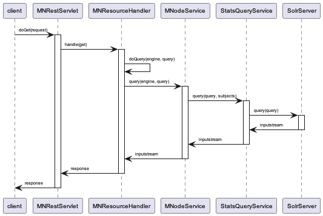

..
  @startuml images/stats-activity-diagram.png
    (*) --> "Initialize event log timer"
    --> "read an event_log entry"
	--> "read system metadata"
	--> "write to stats Solr index"
  @enduml

..
  @startuml images/stats-query-sequence-diagram.png
	participant client
	client -> MNRestServlet : doGet(request)
	activate MNRestServlet
	MNRestServlet -> MNResourceHandler: handle(get)
	activate MNResourceHandler
	MNResourceHandler -> MNResourceHandler: doQuery(engine, query)
	MNResourceHandler -> MNodeService: query(engine, query)
	activate MNodeService
	MNodeService -> StatsQueryService: query(query, subjects)
	activate StatsQueryService
	StatsQueryService -> SolrServer: query(query)
	activate SolrServer
	SolrServer -> StatsQueryService: inputstream
	deactivate SolrServer
	StatsQueryService -> MNodeService: inputstream
	deactivate StatsQueryService
	MNodeService -> MNResourceHandler: inputstream
	deactivate MNodeService
	MNResourceHandler -> MNRestServlet: response
	deactivate MNResourceHandler
	MNRestServlet -> client: response
	deactivate MNRestServlet
  @enduml

Metacat Usage Statistics Service
================================

Overview
--------
This document describes a proposed usage statistics service for Metacat. 

This new service will provide Metacat usage information to clients about data and metacata access events.

Requirements
------------

The statistics service should have an easy to learn API that allows for query fields to be added 
and provide reports in XML, JSON.

Provided Statistics
___________________

The service will include the following statistics: 

	* Dataset views
	* Package downloads
	* Size in bytes of package downloads
	* Citations

Results Filtering
_________________

Reports returned by the service must be able to be filtered by the following fields:

	* A PID or list of PIDs
	* Creator or list of creators (DN, or ORCID, or some amalgam -- to be discussed)
	* A time range of access event (upload, download, etc.)
	* Spatial location of access event (upload, download, etc.)
	* IP Address
	* Accessor or list of accessors (DN, or ORCID, or some amalgam, needs ACL -- to be discussed)

Results Aggregation
___________________

Reports must be able to be aggregated by the following fields:
	* User (DN, or ORCID, or some amalgam )
	* Time range, aggregated to requested unit (day, week, month, year)
	* Spatial range, aggregated to requested unit
	
Performance
___________

The query service should provide results quickly, as it will be used to construct the user dashboard and possibly other UI elements.

Statistics Service Solr Index
-----------------------------
Currently Metacat writes access information to the table ‘access_log’ that has the fields:
	
=========== ===========================
name        data type
----------- ---------------------------
entryid     bigint
ip_address  character varying(512)
user_agent  character varying(512)
principal   character varying(512)
docid       character varying(250)
event       character varying(512) 
date_logged timestamp without time zone
=========== ===========================

In order to provide fast queries, aggregation and faceting of selected fields, access log information will be exported from the current 
‘access_log’ table and from 
the ‘systemmetadata’ table into a new Solr index that will be configured in Metacat as a second Solr core. The new Solr index will 
be based on access events and will contain the fields shown in the following table:

==============  ===========
name             ddata type
--------------  -----------
id 		    	str
datetime		date
event			str
location		location
pid				str
rightsHolder	str
principal		str
size			int
formatId   		str
==============  ===========

The new Solr index will contain the following fields:

::

	<doc>
	<str name="id">2E3E8935-364E-4000-9357-6CE4E067D236</str>
	<date name="datetime">2014-01-01T01:01:01Z</date>
	<str name="event">read</str>
	<location name="location">45.17614,-93.87341</location>
	<str name="pid">sla.2.1</str>
	<str name=”rightsHolder”>uid=williams,o=unaffiliated,dc=ecoinformatics,dc=org</str>
	<str name="principal">uid=williams,o=unaffiliated,dc=ecoinformatics,dc=org</str>
	<int name="size">52273</int>
	<str name=”formatId”>eml://ecoinformatics.org/eml-2.0.1</str>
	</doc>

The second Solr core that will contain usage statistics will require a modification to the existing solr.xml file:

::

	<solr persistent="false">
	  <!--
	  adminPath: RequestHandler path to manage cores.
	    If 'null' (or absent), cores will not be manageable via request handler
	  -->
	  <cores adminPath="/admin/cores" defaultCoreName="collection1">
	    <core name="collection1" instanceDir="." />
	    <core name=”stats” instanceDir=”.”/>
	  </cores>
	</solr>

A Java TimerTask will run the import method that will read event records from the Metacat access_log table and combine these 
record data from the systemmetadata table 
and write this combined entry to the stats Solr index. Access_log entry types such as ‘synchronization_failed’ and ‘replication’ 
will be filtered out and
will not be written to the Solr index. The time of the last record imported from access_log will be stored so that subsequent 
imports would start from the next unimported event record. If required, the data may be aggregated by time interval, such as week or 
month.

The statistics service will be exposed as a new query engine with a DataONE URL such as:

::

	https://hostname/knb/d1/mn/v1/query/stats/<query>

Queries will be passed to the new Solr query engine using the standard Solr query syntax.

One new class will be added to Metacat to handle stats queries, StatsQueryService. Figure 2 shows a call trace for a statistics
service query.

   Figure 2. Statistics query sequence diagram.

The StatsQuerySerivce class will transform the incoming query to Solr parameters, issue the query and returns the query result as a byte stream of text/html content.

Statistics Service Usage
------------------------

The following sections show some of the queries that will be available through the statistics service.

Usage of pids provided by a specified rights holder
___________________________________________________

The following example shows a query for download volume for pids created by rightsHolder=williams with download size statistics aggregated by pid:

::

	http://myd1host/knb/d1/mn/v1/query/stats/q=*:*&fq=rightsHolder:uid=williams*&fq=event:read&stats=true&stats.field=size&rows=0&stats.facet=pid

The following result is returned:

::

	<?xml version="1.0" encoding="UTF-8"?>
	<response>
	  ...
	  <result name="response" numFound="8" start="0"/>
	  <lst name="stats">
	    <lst name="stats_fields">
	      <lst name="size">
	        <double name="min">30.0</double>
	        <double name="max">1000.0</double>
	        <double name="sum">3150.0</double>
	        <long name="count">8</long>
	        <long name="missing">0</long>
	        <double name="sumOfSquares">3004500.0</double>
	        <double name="mean">393.75</double>
	        <double name="stddev">502.0226944215627</double>
	        <lst name="facets">
	          <lst name="pid">
	            <lst name="sla.3.1">
	              <double name="min">1000.0</double>
	              <double name="max">1000.0</double>
	              <double name="sum">3000.0</double>
	              <long name="count">3</long>
	              <long name="missing">0</long>
	              <double name="sumOfSquares">3000000.0</double>
	              <double name="mean">1000.0</double>
	              <double name="stddev">0.0</double>
	            </lst>
	            <lst name="sla.2.1">
	              <double name="min">30.0</double>
	              <double name="max">30.0</double>
	              <double name="sum">150.0</double>
	              <long name="count">5</long>
	              <long name="missing">0</long>
	              <double name="sumOfSquares">4500.0</double>
	              <double name="mean">30.0</double>
	              <double name="stddev">0.0</double>
	            </lst>
	          </lst>
	        </lst>
	      </lst>
	    </lst>
	  </lst>
	</response>
	
The previous query can be constrained to a specific time by adding a time range, i.e.

::

	&fq=datetime:%[2013-01-01T23:59:59Z TO 2013-04-31T23:59:59Z]

Data uploads 
____________

The following query shows counts of data uploads by format type by a specified user:

::

	http://myd1host/knb/d1/mn/v1/query/stats/q=*:*&fq=rightsHolder:uid=williams*&fq=event:create&facet=true&facet.field=formatId&rows=0

::

	<?xml version="1.0" encoding="UTF-8"?>
	<response>
	  ...
	  <result name="response" numFound="3" start="0"/>
	  <lst name="facet_counts">
	    <lst name="facet_queries"/>
	    <lst name="facet_fields">
	      <lst name="formatId">
	        <int name="BIN">2</int>
	        <int name="eml://ecoinformatics.org/eml-2.1.1">1</int>
	        <int name="text/csv">0</int>
	      </lst>
	    </lst>
	    <lst name="facet_dates"/>
	    <lst name="facet_ranges"/>
	  </lst>
	</response>

Data downloads
______________

The following query shows data download counts by a specific user for each month in 2013:

::

    http://myd1host/knb/d1/mn/v1/query/stats/q=*:*&fq=principal:williams&fq=event:read&fq=formatId:BIN&facet=true&facet.field=event&facet.range=datetime&facet.range.start=2013-01-01T01:01:01Z&facet.range.end=2013-12-31T24:59:59Z&facet.range.gap=%2B1MONTH

::

	<?xml version="1.0" encoding="UTF-8"?>
	<response>
	    ...
	    <lst name="facet_ranges">
	      <lst name="datetime">
	        <lst name="counts">
	          <int name="2013-01-01T01:01:01Z">0</int>
	          <int name="2013-02-01T01:01:01Z">0</int>
	          <int name="2013-03-01T01:01:01Z">0</int>
	          <int name="2013-04-01T01:01:01Z">0</int>
	          <int name="2013-05-01T01:01:01Z">0</int>
	          <int name="2013-06-01T01:01:01Z">2</int>
	          <int name="2013-07-01T01:01:01Z">1</int>
	          <int name="2013-08-01T01:01:01Z">0</int>
	          <int name="2013-09-01T01:01:01Z">0</int>
	          <int name="2013-10-01T01:01:01Z">0</int>
	          <int name="2013-11-01T01:01:01Z">0</int>
	          <int name="2013-12-01T01:01:01Z">0</int>
	        </lst>
	        <str name="gap">+1MONTH</str>
	        <date name="start">2013-01-01T01:01:01Z</date>
	        <date name="end">2014-01-01T01:01:01Z</date>
	      </lst>
	    </lst>
	  </lst>
	</response>

The following query shows EML metadata downloads by a specific user for each month in 2013.

::

	http://myd1host/knb/d1/mn/v1/query/stats/q=*:*&fq=principal:*williams*&fq=event:read&fq=formatId:*eml*&facet=true&facet.field=event&facet.range=datetime&facet.range.start=2013-01-01T01:01:01Z&facet.range.end=2013-12-31T24:59:59Z&facet.range.gap=%2B1MONTH

::

	<?xml version="1.0" encoding="UTF-8"?>
	<response>
		...
	    <lst name="facet_ranges">
	      <lst name="datetime">
	        <lst name="counts">
	          <int name="2013-01-01T01:01:01Z">0</int>
	          <int name="2013-02-01T01:01:01Z">0</int>
	          <int name="2013-03-01T01:01:01Z">0</int>
	          <int name="2013-04-01T01:01:01Z">1</int>
	          <int name="2013-05-01T01:01:01Z">1</int>
	          <int name="2013-06-01T01:01:01Z">0</int>
	          <int name="2013-07-01T01:01:01Z">2</int>
	          <int name="2013-08-01T01:01:01Z">0</int>
	          <int name="2013-09-01T01:01:01Z">0</int>
	          <int name="2013-10-01T01:01:01Z">0</int>
	          <int name="2013-11-01T01:01:01Z">0</int>
	          <int name="2013-12-01T01:01:01Z">0</int>
	        </lst>
	        <str name="gap">+1MONTH</str>
	        <date name="start">2013-01-01T01:01:01Z</date>
	        <date name="end">2014-01-01T01:01:01Z</date>
	      </lst>
	    </lst>
	  </lst>
	</response>

Unresolved Issues/Questions
---------------------------

	1. How is the location of an event determined? What do we mean by location?
	2. Currently Solr (3.x and 4.x) doesn’t allow faceting by date/time interval, so it isn't possible to use the stats component to calculate total download volume for a time interval over a time range, such as every month for the last 10 years. Therefor for  calculated amounts, a query for each time interval is required. 
	3. Where will citation info come from? Do we import this into the Solr index?
	4. Are there text fields that the statistics service should include, i.e. do we want to provide statistics for queries such as "how many pids were downloaded that mention kelp?"?

