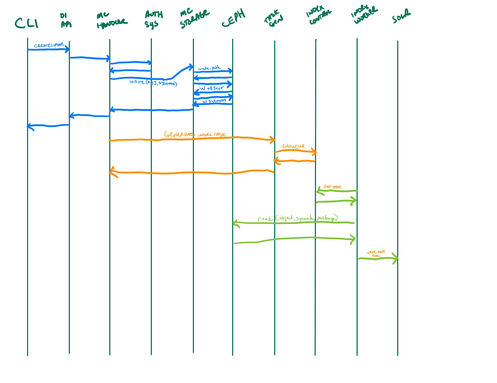
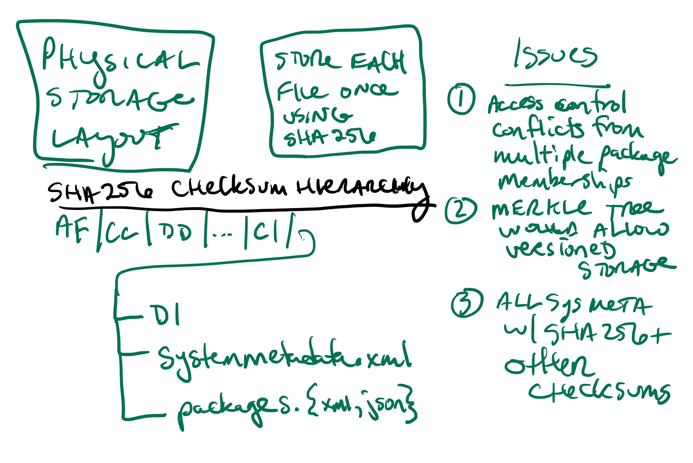

Storage Subsystem
=================

Use Cases
---------

-  **UC01: {Repository operators, researchers} need to upload large, or
   many files**

   -  **Priority: 2** (blocked by UC04)
   -  High volume network transfer, e.g., over Globus or other non-http
      protocols)
   -  Bootstrap new MN install (e.g., ADC) with, say, 5TB of data over
      many files w/o paying the network transfer penalty associated with
      MNStorage.create
   -  MN operators (e.g., ADC) loading large submissions. Currently
      might take hours/days. We might call this “out of band data
      loading”
   -  Have alternative options for users that might have slow internet
      speeds (ability to resume where they might have left off)
   -  Arctic Data Center, ESS-DIVE, PDG, DataONE

-  **UC02: {Repository operators, researchers} want to create/update
   file system based data uploads**

   -  Upload a single file (data or metadata) to the file system
   -  Upload a whole package with all of its metadata and data files in
      a package hierarchy

      -  triggers creation of system metadata?

   -  “zip-based” upload is start of support for create/update
      transactions and rollback
   -  ESS-DIVE, rdataone, …

-  **UC03: {Researchers} needs a hierarchical file system read-only view
   of packages**

   -  e.g., run analysis against files in package hierarchy
   -  view should be read-only
   -  need to enforce access control rules (e.g., only show readable
      files and packages)

-  **UC04: {MN System tools} need direct access to metadata/data**

   -  **Priority: 1** (blocks others)
   -  priviledged tools that can access all data
   -  only available to ‘admin’ users/tools
   -  MetaDIG quality engine needs direct, efficient access to
      metadata/data

      -  would enable metadata/data congruence checks
      -  would enable advanced data checks
      -  Need access to files from distributed clusters like Kubernetes

   -  DataONE LOD service needs read-only access to metadata (possibly
      data). Currently gets it all over HTTP
   -  Efficient data previews in the UI or other client tools
   -  ESS-DIVE file checks of data (e.g., for virus checking)
   -  Indexer needs access to on-disk metadata files and resource maps
      and system-metadata

      -  Currently give file path to bytes for science metadata and
         resource maps,
      -  system metadata comes from HZ, needs to be accessible from the
         filesystem too
      -  Need access to files from distributed clusters like Kubernetes

   -  System metadata needs to be stored on the filesystem
   -  Service to create checksums for all data objects (i.e. Carl
      Bottinger)

      -  a suite of checksums could be calculated and published to a
         registry

   -  Metrics Service access to the metadata to parse citations,…
   -  ADC, ESS_DIVE, DataONE,

-  **UC05: {Researchers} create and trigger data quality assessment
   workflows**

   -  for Arctic Data Center, with user contributed data checking
      workflows

      -  requires access to files on disk, arranged in hierarchical
         packages as the user “sees” it

-  **UC06a: Downloading large packages via BagIt over HTTP**

   -  Need ability to download large packages in the face of network
      errors - HTTP Byte-range support
   -  Fix our Bagit download implementation
   -  The ability to download the files based on how on the hierarchical
      file system (eg. I want to download all the files from the same
      folder)

-  **UC06: Downloading large packages via alternate protocols**

   -  **Priority: 3**
   -  Bulk download is too difficult currently for people and I can
      imagine us being able to set up a permanent or temporary FTP or
      something to give durable access
   -  Subcase 1: download all of Kate Stafford’s files

      -  Requires a large bagit beyond our current capabilities

   -  Subcase 2: mark and download a subset of the files in a package
      hierarchy
   -  Subcase 3: Support OPeNDAP/THREDDS access
   -  Globus support
   -  Being able to download a specific group of data files (eg. all the
      data related to a sample)

-  **UC07: {Researchers} want to remotely mount a filesystem view of
   their {package, collection, repository, DataONE}**

   -  Same as ONEDrive use cases from DataONE Phase I

-  **UC08: {Researchers} want to upload their data packages via Google
   Drive/Box/Dropbox/OneDrive/GitHub**

   -  Fill in metadata somewhere, tag a release, get’s uploaded
      automatically
   -  science metadata gets added on/layered on top of files obtained
      from shared drives, etc.

-  **UC09: {Contributors} want to do batch updates to {large} number of
   existing files**

   -  Need a batch API for things like access control updates e.g. send
      a single API request for various metadata about a collection of
      objects (rather than sending one call for each type of metadata
      for each object)
   -  https://hpad.dataone.org/fJtGygXLRH-pUGG4XnPDWw#

-  **UC10: {Contributors} want to be able to upload and view files in
   folder structures**

   -  For both small and large packages
   -  Involves how we rearchitect packages as large collections of files

-  ESS-DIVE use cases

   -  some files are too large to upload to DataONE

      -  links are made to the data

   -  essdive defined access types

      -  tier 1

         -  in metacat, replicated

      -  tier 2

         -  not in metacat

      -  tier 3

         -  offline, private
         -  requires request, manual access

   -  direct access to data from Jupyter notebook
   -  user creates a list of files to download, creating a collection
      like a shopping cart, then requests download

      -  maybe a BagIt file is created

   -  on upload

      -  check that files are in required format

Requirements (Capabilities)
---------------------------

-  ability to upload very large files, efficiently (current Metacat
   limit is 5MB)
-  ability to upload many files (thousands), efficiently
-  provide high volume, non-HTTP access to Metacat data store
-  provide public or authenticated access depending on object
-  provide a hierarchical view of Metacat data store
-  files ingested/uploaded are integrated into DataONE as if they were
   uploaded via DataONE REST API

   -  system metadata created
   -  objects indexed in Solr

-  access via the storage API should have better performance than the
   DataONE REST API
-  for clients (e.g. MetaDIG enginee)

   -  read access needed for all DataONE metadata
   -  read access needed for potentially all DataONE data objects
   -  more effiecient than downloading metadata for each run

-  read only access to hierarchical view of any data package
-  read only access to all DataONE system metadata
-  Batch updates in Metacat
   (https://hpad.dataone.org/fJtGygXLRH-pUGG4XnPDWw#)

Design diagrams
---------------

Architecture
~~~~~~~~~~~~

.. figure:: images/mc-overview.png
   :align: center

   Figure 1. Metacat components overview, highlighting index task flow with dashed arrows.

..
  This block defines the components diagram referenced above.
  @startuml images/mc-overview.png
  top to bottom direction
  !theme superhero-outline
  !include <logos/solr>
  skinparam actorStyle awesome

  together {
    :Alice:
    :Bob:
    :Chandra:
  }

  frame "Ceph Cluster" as cluster {
    component CephFS
    component "hosts" {
      database "ceph-host-1"
      database "ceph-host-2"
      database "ceph-host-3"
      database "ceph-host-n"
    }
    CephFS-hosts
  }

  frame DataONEDrive as d1d {
    [Globus]
    [WebDAV]
    d1d-u-cluster
  }

  frame "Postgres deployment" as pg {
    database metacat as mcdb {
    }
  }

  frame "Metacat" {
    interface "DataONE API" as D1
    :Alice: -d-> D1
    :Bob: -d-> D1
    :Chandra: -d-> D1
    [MetacatHandler]--D1
    [Task Generator] <.. [MetacatHandler]
    [Search] <-- [MetacatHandler]
    [Auth] <-- [MetacatHandler]
    [EventLog] <-- [MetacatHandler]
    [Replicate] <-- [MetacatHandler]
    frame "Storage Subsystem" as Storage {

      frame "Storage Adapters" as store {
        component ceph
        component S3
        component LocalFS
      }
      rectangle DataObject as do {
              () Read as R
              () Write as W
      }
      do--R
      do--W
      do --> ceph
      do <-- ceph
    }
    W <-- [MetacatHandler]
    R <-- [MetacatHandler]
    do--pg
  }

  frame "Indexing Deployment" as indexer {
    frame "RabbitMQ deployment" {
      interface addTask
      queue PriorityQueue as pqueue
      [Monitor]
      addTask .> pqueue
    }

    node "MC Index" {
      [Index Worker 1] as iw1
      [Index Worker 2] as iw2
      [Index Worker 3] as iw3
      pqueue ..> iw1
      pqueue ..> iw2
      pqueue ..> iw3
    }

    frame "SOLR deployment" as solr {
      database "<$solr>" as s {
        folder "Core" {
          [Index Schema]
        }
      }
    }
  }

  [Task Generator] ..> addTask : add
  iw1 --> [Index Schema] : update
  iw2 --> [Index Schema] : update
  iw3 --> [Index Schema] : update
  ceph <-- CephFS : read
  ceph --> CephFS : write
  iw1 <.. CephFS : read
  iw2 <.. CephFS : read
  iw3 <.. CephFS : read
  Search --> solr

  @enduml

.. raw:: latex

  \newpage

.. raw:: pdf

  PageBreak

Design choices include:

- Storage interface
  
    - Ceph FS
        - see https://docs.ceph.com/en/latest/cephfs/
    - Ceph Object Gateway
        - S3 API (see https://docs.ceph.com/en/latest/radosgw/s3/)
        - Swift API 
  
- Data and metadata access layer
  
    - What level should we plan for access by:
        - System processes
        - User access processes

Indexing Sequence Diagram
~~~~~~~~~~~~~~~~~~~~~~~~~

   
   Indexing and storage sequence.

Physical File Layout
~~~~~~~~~~~~~~~~~~~~

   
   Physical file layout.

Virtual File Layout
~~~~~~~~~~~~~~~~~~~

.. figure:: images/indexing-22.jpg
   :align: center
   
   Virtual file layout.

