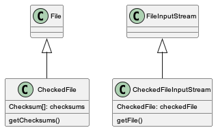

Storage Subsystem
=================

Use Cases
---------

-  **UC01: {Repository operators, researchers} need to upload large, or
   many files**

   -  **Priority: 2** (blocked by UC04)
   -  High volume network transfer, e.g., over Globus or other non-http
      protocols)
   -  Bootstrap new MN install (e.g., ADC) with, say, 5TB of data over
      many files w/o paying the network transfer penalty associated with
      MNStorage.create
   -  MN operators (e.g., ADC) loading large submissions. Currently
      might take hours/days. We might call this “out of band data
      loading”
   -  Have alternative options for users that might have slow internet
      speeds (ability to resume where they might have left off)
   -  Arctic Data Center, ESS-DIVE, PDG, DataONE

-  **UC02: {Repository operators, researchers} want to create/update
   file system based data uploads**

   -  Upload a single file (data or metadata) to the file system
   -  Upload a whole package with all of its metadata and data files in
      a package hierarchy

      -  triggers creation of system metadata?

   -  “zip-based” upload is start of support for create/update
      transactions and rollback
   -  ESS-DIVE, rdataone, …

-  **UC03: {Researchers} needs a hierarchical file system read-only view
   of packages**

   -  e.g., run analysis against files in package hierarchy
   -  view should be read-only
   -  need to enforce access control rules (e.g., only show readable
      files and packages)

-  **UC04: {MN System tools} need direct access to metadata/data**

   -  **Priority: 1** (blocks others)
   -  priviledged tools that can access all data
   -  only available to ‘admin’ users/tools
   -  MetaDIG quality engine needs direct, efficient access to
      metadata/data

      -  would enable metadata/data congruence checks
      -  would enable advanced data checks
      -  Need access to files from distributed clusters like Kubernetes

   -  DataONE LOD service needs read-only access to metadata (possibly
      data). Currently gets it all over HTTP
   -  Efficient data previews in the UI or other client tools
   -  ESS-DIVE file checks of data (e.g., for virus checking)
   -  Indexer needs access to on-disk metadata files and resource maps
      and system-metadata

      -  Currently give file path to bytes for science metadata and
         resource maps,
      -  system metadata comes from HZ, needs to be accessible from the
         filesystem too
      -  Need access to files from distributed clusters like Kubernetes

   -  System metadata needs to be stored on the filesystem
   -  Service to create checksums for all data objects (i.e. Carl
      Bottinger)

      -  a suite of checksums could be calculated and published to a
         registry

   -  Metrics Service access to the metadata to parse citations,…
   -  ADC, ESS_DIVE, DataONE,

-  **UC05: {Researchers} create and trigger data quality assessment
   workflows**

   -  for Arctic Data Center, with user contributed data checking
      workflows

      -  requires access to files on disk, arranged in hierarchical
         packages as the user “sees” it

-  **UC06a: Downloading large packages via BagIt over HTTP**

   -  Need ability to download large packages in the face of network
      errors - HTTP Byte-range support
   -  Fix our Bagit download implementation
   -  The ability to download the files based on how on the hierarchical
      file system (eg. I want to download all the files from the same
      folder)

-  **UC06: Downloading large packages via alternate protocols**

   -  **Priority: 3**
   -  Bulk download is too difficult currently for people and I can
      imagine us being able to set up a permanent or temporary FTP or
      something to give durable access
   -  Subcase 1: download all of Kate Stafford’s files

      -  Requires a large bagit beyond our current capabilities

   -  Subcase 2: mark and download a subset of the files in a package
      hierarchy
   -  Subcase 3: Support OPeNDAP/THREDDS access
   -  Globus support
   -  Being able to download a specific group of data files (eg. all the
      data related to a sample)

-  **UC07: {Researchers} want to remotely mount a filesystem view of
   their {package, collection, repository, DataONE}**

   -  Same as ONEDrive use cases from DataONE Phase I

-  **UC08: {Researchers} want to upload their data packages via Google
   Drive/Box/Dropbox/OneDrive/GitHub**

   -  Fill in metadata somewhere, tag a release, get’s uploaded
      automatically
   -  science metadata gets added on/layered on top of files obtained
      from shared drives, etc.

-  **UC09: {Contributors} want to do batch updates to {large} number of
   existing files**

   -  Need a batch API for things like access control updates e.g. send
      a single API request for various metadata about a collection of
      objects (rather than sending one call for each type of metadata
      for each object)
   -  https://hpad.dataone.org/fJtGygXLRH-pUGG4XnPDWw#

-  **UC10: {Contributors} want to be able to upload and view files in
   folder structures**

   -  For both small and large packages
   -  Involves how we rearchitect packages as large collections of files

-  ESS-DIVE use cases

   -  some files are too large to upload to DataONE

      -  links are made to the data

   -  essdive defined access types

      -  tier 1

         -  in metacat, replicated

      -  tier 2

         -  not in metacat

      -  tier 3

         -  offline, private
         -  requires request, manual access

   -  direct access to data from Jupyter notebook
   -  user creates a list of files to download, creating a collection
      like a shopping cart, then requests download

      -  maybe a BagIt file is created

   -  on upload

      -  check that files are in required format

Requirements (Capabilities)
---------------------------

-  ability to upload very large files, efficiently (current Metacat
   limit is 5MB)
-  ability to upload many files (thousands), efficiently
-  provide high volume, non-HTTP access to Metacat data store
-  provide public or authenticated access depending on object
-  provide a hierarchical view of Metacat data store
-  files ingested/uploaded are integrated into DataONE as if they were
   uploaded via DataONE REST API

   -  system metadata created
   -  objects indexed in Solr

-  access via the storage API should have better performance than the
   DataONE REST API
-  for clients (e.g. MetaDIG enginee)

   -  read access needed for all DataONE metadata
   -  read access needed for potentially all DataONE data objects
   -  more effiecient than downloading metadata for each run

-  read only access to hierarchical view of any data package
-  read only access to all DataONE system metadata
-  Batch updates in Metacat
   (https://hpad.dataone.org/fJtGygXLRH-pUGG4XnPDWw#)

Design diagrams
---------------

Architecture
~~~~~~~~~~~~

.. figure:: images/mc-overview.png
   :align: center

   Figure 1. Metacat components overview, highlighting index task flow with dashed arrows.

..
  This block defines the components diagram referenced above.
  @startuml images/mc-overview.png
  top to bottom direction
  !theme superhero-outline
  !include <logos/solr>
  skinparam actorStyle awesome

  together {
    :Alice:
    :Bob:
    :Chandra:
  }

  frame "Ceph Cluster" as cluster {
    component CephFS
    component "hosts" {
      database "ceph-host-1"
      database "ceph-host-2"
      database "ceph-host-3"
      database "ceph-host-n"
    }
    CephFS-hosts
  }

  frame DataONEDrive as d1d {
    [Globus]
    [WebDAV]
    d1d-u-cluster
  }

  frame "Postgres deployment" as pg {
    database metacat as mcdb {
    }
  }

  frame "Metacat" {
    interface "DataONE API" as D1
    :Alice: -d-> D1
    :Bob: -d-> D1
    :Chandra: -d-> D1
    [MetacatHandler]--D1
    [Task Generator] <.. [MetacatHandler]
    [Search] <-- [MetacatHandler]
    [Auth] <-- [MetacatHandler]
    [EventLog] <-- [MetacatHandler]
    [Replicate] <-- [MetacatHandler]
    frame "Storage Subsystem" as Storage {

      frame "Storage Adapters" as store {
        component ceph
        component S3
        component LocalFS
      }
      rectangle DataObject as do {
              () Read as R
              () Write as W
      }
      do--R
      do--W
      do --> ceph
      do <-- ceph
    }
    W <-- [MetacatHandler]
    R <-- [MetacatHandler]
    do--pg
  }

  frame "dataone-index" as indexer {
    frame "RabbitMQ deployment" {
      interface basicPublish
      queue PriorityQueue as pqueue
      [Monitor]
      basicPublish .> pqueue
    }

    node "MC Index" {
      [Index Worker 1] as iw1
      [Index Worker 2] as iw2
      [Index Worker 3] as iw3
      pqueue ..> iw1
      pqueue ..> iw2
      pqueue ..> iw3
    }

    frame "SOLR deployment" as solr {
      database "<$solr>" as s {
        folder "Core" {
          [Index Schema]
        }
      }
    }
  }

  [Task Generator] ..> basicPublish : add
  iw1 --> [Index Schema] : update
  iw2 --> [Index Schema] : update
  iw3 --> [Index Schema] : update
  ceph <-- CephFS : read
  ceph --> CephFS : write
  iw1 ..> CephFS : read
  iw2 ..> CephFS : read
  iw3 ..> CephFS : read
  Search --> solr

  @enduml

.. raw:: latex

  \newpage

.. raw:: pdf

  PageBreak

Design choices include:

- Storage interface
  
    - Ceph FS
        - see https://docs.ceph.com/en/latest/cephfs/
    - Ceph Object Gateway
        - S3 API (see https://docs.ceph.com/en/latest/radosgw/s3/)
        - Swift API 
  
- Data and metadata access layer
  
    - What level should we plan for access by:
        - System processes
        - User access processes

Physical File Layout
~~~~~~~~~~~~~~~~~~~~
   
For physical file storage and layout, our goal is to provide a consistent directory
structure that enables us to store each file once and only once, that will be
robust against naming issues such as illegal characters, and that allows us to
access both system metadata and the file contents knowing only the PID for an
object. This approach focuses on using a hash identifier for naming objects,
rather than an authority-based identifier such as a PID or SID.

**Raw File Storage**: The raw bytes of each object (data, metadata, or resource
map) are saved in a file that is named using a content identifier (CID) for that
set of bytes. This content identifier is created using a hashing algorithm such
that each unique set of bytes produces a unique checksum value. That checksum
value is then used to name the file. In this way, even when the same file is
uploaded multiple times, it will only be stored once in the filesystem.

**Checksum algorithm and encoding**

We have multiple hash algorithms to choose from, and each has multiple ways of
encoding the binary hash into a string representation. We will choose the
simplest, most common configuration which is to use a `SHA-256` hash
algorithm, with the binary digest converted to a string value using `base64`
encoding. That makes each hash value 64 characters long (representing
the 256 bit binary value). For example, here is a base64-encoded SHA-256 value:

   4d198171eef969d553d4c9537b1811a7b078f9a3804fc978a761bc014c05972c

While we chose this common combination, we could also have chosen other hash
algorithms (e.g., SHA-1, SHA3-256, blake2b-512) and alternate string encodings
(e.g., base58, Multihash (https://multiformats.io/multihash/)). Multihash may be
a valuable approach in to future-proof the storage system, because it enables us
of multiple checksum algorithms.

**Folder layout**

To reduce the number of files in a given directory, we use the first several
characters of the hash to create a directory hierarchy and divide the files up to
make the tree simpler to explore and less likely to exceed operating system
limits on files. We store all objects in an `objects` directory, with two
levels of depth and a 'width' of 2 digits. Because each digit in the hash can
contain 16 values, the directory structure can contain 65,536 subdirectories
(256^2).  To accomodate a larger number of directories, we could add another level or
two of depth to the hierarchy.  An example file layout for three objects would be::

   /var/metacat/objects
   ├── 15
   │   └── 52
   │       └── 5dda7121013bc3eba2e2d237a5ae70b291a461ca539053de75f33c9ac44c
   ├── 4d
   │   └── 19
   │       └── 8171eef969d553d4c9537b1811a7b078f9a3804fc978a761bc014c05972c
   └── 94
      └── f9
         └── b6c88f1f458e410c30c351c6384ea42ac1b5ee1f8430d3e365e43b78a38a

Note how the full hash value is obtained by appending the directory names with
the file name (e.g.,
`15525dda7121013bc3eba2e2d237a5ae70b291a461ca539053de75f33c9ac44c` for the first
object).

**Storing metadata** With this layout, knowing the hash value for a file allows
us to retrieve it. But it does not provide a mechanism to store metadata about
the object, including it's persistent identifier (PID), other system metadata
for the object, or extended metadata that we might want to include. So, in
addition to data objects, the system supports storage for metadata documents
that are associated with particular data objects. These metadata files are
stored as delimited files with a header and body section. The header contains
the 64 character hash of the data file described by this metadata, followed by a
space, then the `formatId` of the metadata format for the metadata in the file,
and then a NULL (`\x00`). This header is then followed by the content of the
metadata document in UTF-8 encoding (see example below). This metadata file is 
named using the SHA-256 hash of the persistent identifier (PID) of the object that 
it describes, and stored in a `sysmeta` directory parallel to the one described 
above, and structured analogously.

For example, given the PID `jtao.1700.1`, one can calculate the SHA-256 of that PID using::

   $ echo -n "jtao.1700.1" | shasum -a 256
   a8241925740d5dcd719596639e780e0a090c9d55a5d0372b0eaf55ed711d4edf

So, the system metadata file would be stored at
`sysmeta/a8/24/1925740d5dcd719596639e780e0a090c9d55a5d0372b0eaf55ed711d4edf` using the
file format described above. Extending our diagram from above, we now see the three 
hashes that represent data files, along with three that represent system metadata files 
named with the hash of the PID they describe::

   /var/metacat
   ├── objects
   │   ├── 15
   │   │   └── 52
   │   │       └── 5dda7121013bc3eba2e2d237a5ae70b291a461ca539053de75f33c9ac44c
   │   ├── 4d
   │   │   └── 19
   │   │       └── 8171eef969d553d4c9537b1811a7b078f9a3804fc978a761bc014c05972c
   │   └── 94
   │       └── f9
   │           └── b6c88f1f458e410c30c351c6384ea42ac1b5ee1f8430d3e365e43b78a38a
   └── sysmeta
      ├── 7f
      │   └── 5c
      │       └── c18f0b04e812a3b4c8f686ce34e6fec558804bf61e54b176742a7f6368d6
      ├── a8
      │   └── 24
      │       └── 1925740d5dcd719596639e780e0a090c9d55a5d0372b0eaf55ed711d4edf
      └── f6
         └── fa
               └── c7b713ca66b61ff1c3c8259a8b98f6ceab30b906e42a24fa447db66fa8ba

**PID-based access**:  Given a PID, we can discover and access both the system
metadata for an object and the bytes of the object itself without any further
store of information. The procedure for this is as follows:

1) given the PID, calculate the SHA-256 hash, and base64-encode it to find the `metadata hash`
2) Use the `metadata hash` to locate and read the metadata file from the `sysmeta` tree
    - parse the header to extract the content identifier (`cid`) and the `formatId`
    - read the remaining body of the document to obtain the `sysmeta`, which includes format information about the data object
3) with the `cid`, open and read the data from the `objects` tree

The structure of the system metadata document along with it's header is shown in hex
format below for reference purposes. Note the presence of the NULL `\x00` character in 
the first line following the format identifier. Parsers can use this first `\x00` NULL 
to delimit the header from the body of the metadata document. This particular metadata
document is for the PID `doi:10.18739_A2901ZH2M`, which is stored in the file 
`sysmeta/f6/fa/c7b713ca66b61ff1c3c8259a8b98f6ceab30b906e42a24fa447db66fa8ba` 
based on the SAH-256 of the PID of the data object::

   ┌────────┬─────────────────────────┬─────────────────────────┬────────┬────────┐
   │00000000│ 34 64 31 39 38 31 37 31 ┊ 65 65 66 39 36 39 64 35 │4d198171┊eef969d5│
   │00000010│ 35 33 64 34 63 39 35 33 ┊ 37 62 31 38 31 31 61 37 │53d4c953┊7b1811a7│
   │00000020│ 62 30 37 38 66 39 61 33 ┊ 38 30 34 66 63 39 37 38 │b078f9a3┊804fc978│
   │00000030│ 61 37 36 31 62 63 30 31 ┊ 34 63 30 35 39 37 32 63 │a761bc01┊4c05972c│
   │00000040│ 20 68 74 74 70 3a 2f 2f ┊ 6e 73 2e 64 61 74 61 6f │ http://┊ns.datao│
   │00000050│ 6e 65 2e 6f 72 67 2f 73 ┊ 65 72 76 69 63 65 2f 74 │ne.org/s┊ervice/t│
   │00000060│ 79 70 65 73 2f 76 32 2e ┊ 30 00 3c 3f 78 6d 6c 20 │ypes/v2.┊00<?xml │
   │00000070│ 76 65 72 73 69 6f 6e 3d ┊ 22 31 2e 30 22 20 65 6e │version=┊"1.0" en│
   │00000080│ 63 6f 64 69 6e 67 3d 22 ┊ 55 54 46 2d 38 22 20 73 │coding="┊UTF-8" s│
   │00000090│ 74 61 6e 64 61 6c 6f 6e ┊ 65 3d 22 79 65 73 22 3f │tandalon┊e="yes"?│
   │000000a0│ 3e 0a 3c 6e 73 33 3a 73 ┊ 79 73 74 65 6d 4d 65 74 │>_<ns3:s┊ystemMet│
   │000000b0│ 61 64 61 74 61 20 78 6d ┊ 6c 6e 73 3a 6e 73 32 3d │adata xm┊lns:ns2=│
   │000000c0│ 22 68 74 74 70 3a 2f 2f ┊ 6e 73 2e 64 61 74 61 6f │"http://┊ns.datao│
   │000000d0│ 6e 65 2e 6f 72 67 2f 73 ┊ 65 72 76 69 63 65 2f 74 │ne.org/s┊ervice/t│
   │000000e0│ 79 70 65 73 2f 76 31 22 ┊ 20 78 6d 6c 6e 73 3a 6e │ypes/v1"┊ xmlns:n│
   │000000f0│ 73 33 3d 22 68 74 74 70 ┊ 3a 2f 2f 6e 73 2e 64 61 │s3="http┊://ns.da│
   │00000100│ 74 61 6f 6e 65 2e 6f 72 ┊ 67 2f 73 65 72 76 69 63 │taone.or┊g/servic│
   │00000110│ 65 2f 74 79 70 65 73 2f ┊ 76 32 2e 30 22 3e 0a 20 │e/types/┊v2.0">_ │
   │00000120│ 20 20 20 3c 73 65 72 69 ┊ 61 6c 56 65 72 73 69 6f │   <seri┊alVersio│
   │00000130│ 6e 3e 30 3c 2f 73 65 72 ┊ 69 61 6c 56 65 72 73 69 │n>0</ser┊ialVersi│
   │00000140│ 6f 6e 3e 0a 20 20 20 20 ┊ 3c 69 64 65 6e 74 69 66 │on>_    ┊<identif│
   │00000150│ 69 65 72 3e 64 6f 69 3a ┊ 31 30 2e 31 38 37 33 39 │ier>doi:┊10.18739│
   │00000160│ 2f 41 32 39 30 31 5a 48 ┊ 32 4d 3c 2f 69 64 65 6e │/A2901ZH┊2M</iden│
   │00000170│ 74 69 66 69 65 72 3e 0a ┊ 20 20 20 20 3c 66 6f 72 │tifier>_┊    <for│
   │00000180│ 6d 61 74 49 64 3e 68 74 ┊ 74 70 3a 2f 2f 77 77 77 │matId>ht┊tp://www│
   │00000190│ 2e 69 73 6f 74 63 32 31 ┊ 31 2e 6f 72 67 2f 32 30 │.isotc21┊1.org/20│
   │000001a0│ 30 35 2f 67 6d 64 3c 2f ┊ 66 6f 72 6d 61 74 49 64 │05/gmd</┊formatId│
   │000001b0│ 3e 0a 20 20 20 20 3c 73 ┊ 69 7a 65 3e 33 39 39 39 │>_    <s┊ize>3999│
   │000001c0│ 33 3c 2f 73 69 7a 65 3e ┊ 0a 20 20 20 20 3c 63 68 │3</size>┊_    <ch│
   │000001d0│ 65 63 6b 73 75 6d 20 61 ┊ 6c 67 6f 72 69 74 68 6d │ecksum a┊lgorithm│
   │000001e0│ 3d 22 53 48 41 2d 32 35 ┊ 36 22 3e 34 64 31 39 38 │="SHA-25┊6">4d198│
   │000001f0│ 31 37 31 65 65 66 39 36 ┊ 39 64 35 35 33 64 34 63 │171eef96┊9d553d4c│
   │00000200│ 39 35 33 37 62 31 38 31 ┊ 31 61 37 62 30 37 38 66 │9537b181┊1a7b078f│
   │00000210│ 39 61 33 38 30 34 66 63 ┊ 39 37 38 61 37 36 31 62 │9a3804fc┊978a761b│
   │00000220│ 63 30 31 34 63 30 35 39 ┊ 37 32 63 3c 2f 63 68 65 │c014c059┊72c</che│
   │00000230│ 63 6b 73 75 6d 3e 0a 20 ┊ 20 20 20 3c 73 75 62 6d │cksum>_ ┊   <subm│
   │00000240│ 69 74 74 65 72 3e 68 74 ┊ 74 70 3a 2f 2f 6f 72 63 │itter>ht┊tp://orc│
   │00000250│ 69 64 2e 6f 72 67 2f 30 ┊ 30 30 30 2d 30 30 30 33 │id.org/0┊000-0003│
   │00000260│ 2d 34 37 30 33 2d 31 39 ┊ 37 34 3c 2f 73 75 62 6d │-4703-19┊74</subm│
   │00000270│ 69 74 74 65 72 3e 0a 20 ┊ 20 20 20 3c 72 69 67 68 │itter>_ ┊   <righ│
   │00000280│ 74 73 48 6f 6c 64 65 72 ┊ 3e 68 74 74 70 3a 2f 2f │tsHolder┊>http://│
   │00000290│ 6f 72 63 69 64 2e 6f 72 ┊ 67 2f 30 30 30 30 2d 30 │orcid.or┊g/0000-0│
   │000002a0│ 30 30 33 2d 34 37 30 33 ┊ 2d 31 39 37 34 3c 2f 72 │003-4703┊-1974</r│
   │000002b0│ 69 67 68 74 73 48 6f 6c ┊ 64 65 72 3e 0a 20 20 20 │ightsHol┊der>_   │
   │000002c0│ 20 3c 61 63 63 65 73 73 ┊ 50 6f 6c 69 63 79 3e 0a │ <access┊Policy>_│
   │000002d0│ 20 20 20 20 20 20 20 20 ┊ 3c 61 6c 6c 6f 77 3e 0a │        ┊<allow>_│
   │000002e0│ 20 20 20 20 20 20 20 20 ┊ 20 20 20 20 3c 73 75 62 │        ┊    <sub│
   │000002f0│ 6a 65 63 74 3e 70 75 62 ┊ 6c 69 63 3c 2f 73 75 62 │ject>pub┊lic</sub│
   │00000300│ 6a 65 63 74 3e 0a 20 20 ┊ 20 20 20 20 20 20 20 20 │ject>_  ┊        │
   │00000310│ 20 20 3c 70 65 72 6d 69 ┊ 73 73 69 6f 6e 3e 72 65 │  <permi┊ssion>re│
   │00000320│ 61 64 3c 2f 70 65 72 6d ┊ 69 73 73 69 6f 6e 3e 0a │ad</perm┊ission>_│
   │00000330│ 20 20 20 20 20 20 20 20 ┊ 3c 2f 61 6c 6c 6f 77 3e │        ┊</allow>│
   │00000340│ 0a 20 20 20 20 20 20 20 ┊ 20 3c 61 6c 6c 6f 77 3e │_       ┊ <allow>│
   │00000350│ 0a 20 20 20 20 20 20 20 ┊ 20 20 20 20 20 3c 73 75 │_       ┊     <su│
   │00000360│ 62 6a 65 63 74 3e 43 4e ┊ 3d 61 72 63 74 69 63 2d │bject>CN┊=arctic-│
   │00000370│ 64 61 74 61 2d 61 64 6d ┊ 69 6e 73 2c 44 43 3d 64 │data-adm┊ins,DC=d│
   │00000380│ 61 74 61 6f 6e 65 2c 44 ┊ 43 3d 6f 72 67 3c 2f 73 │ataone,D┊C=org</s│
   │00000390│ 75 62 6a 65 63 74 3e 0a ┊ 20 20 20 20 20 20 20 20 │ubject>_┊        │
   │000003a0│ 20 20 20 20 3c 70 65 72 ┊ 6d 69 73 73 69 6f 6e 3e │    <per┊mission>│
   │000003b0│ 72 65 61 64 3c 2f 70 65 ┊ 72 6d 69 73 73 69 6f 6e │read</pe┊rmission│
   │000003c0│ 3e 0a 20 20 20 20 20 20 ┊ 20 20 20 20 20 20 3c 70 │>_      ┊      <p│
   │000003d0│ 65 72 6d 69 73 73 69 6f ┊ 6e 3e 77 72 69 74 65 3c │ermissio┊n>write<│
   │000003e0│ 2f 70 65 72 6d 69 73 73 ┊ 69 6f 6e 3e 0a 20 20 20 │/permiss┊ion>_   │
   │000003f0│ 20 20 20 20 20 20 20 20 ┊ 20 3c 70 65 72 6d 69 73 │        ┊ <permis│
   │00000400│ 73 69 6f 6e 3e 63 68 61 ┊ 6e 67 65 50 65 72 6d 69 │sion>cha┊ngePermi│
   │00000410│ 73 73 69 6f 6e 3c 2f 70 ┊ 65 72 6d 69 73 73 69 6f │ssion</p┊ermissio│
   │00000420│ 6e 3e 0a 20 20 20 20 20 ┊ 20 20 20 3c 2f 61 6c 6c │n>_     ┊   </all│
   │00000430│ 6f 77 3e 0a 20 20 20 20 ┊ 3c 2f 61 63 63 65 73 73 │ow>_    ┊</access│
   │00000440│ 50 6f 6c 69 63 79 3e 0a ┊ 20 20 20 20 3c 72 65 70 │Policy>_┊    <rep│
   │00000450│ 6c 69 63 61 74 69 6f 6e ┊ 50 6f 6c 69 63 79 20 72 │lication┊Policy r│
   │00000460│ 65 70 6c 69 63 61 74 69 ┊ 6f 6e 41 6c 6c 6f 77 65 │eplicati┊onAllowe│
   │00000470│ 64 3d 22 66 61 6c 73 65 ┊ 22 20 6e 75 6d 62 65 72 │d="false┊" number│
   │00000480│ 52 65 70 6c 69 63 61 73 ┊ 3d 22 30 22 3e 0a 20 20 │Replicas┊="0">_  │
   │00000490│ 20 20 20 20 20 20 3c 62 ┊ 6c 6f 63 6b 65 64 4d 65 │      <b┊lockedMe│
   │000004a0│ 6d 62 65 72 4e 6f 64 65 ┊ 3e 75 72 6e 3a 6e 6f 64 │mberNode┊>urn:nod│
   │000004b0│ 65 3a 4b 4e 42 3c 2f 62 ┊ 6c 6f 63 6b 65 64 4d 65 │e:KNB</b┊lockedMe│
   │000004c0│ 6d 62 65 72 4e 6f 64 65 ┊ 3e 0a 20 20 20 20 20 20 │mberNode┊>_      │
   │000004d0│ 20 20 3c 62 6c 6f 63 6b ┊ 65 64 4d 65 6d 62 65 72 │  <block┊edMember│
   │000004e0│ 4e 6f 64 65 3e 75 72 6e ┊ 3a 6e 6f 64 65 3a 6d 6e │Node>urn┊:node:mn│
   │000004f0│ 55 43 53 42 31 3c 2f 62 ┊ 6c 6f 63 6b 65 64 4d 65 │UCSB1</b┊lockedMe│
   │00000500│ 6d 62 65 72 4e 6f 64 65 ┊ 3e 0a 20 20 20 20 3c 2f │mberNode┊>_    </│
   │00000510│ 72 65 70 6c 69 63 61 74 ┊ 69 6f 6e 50 6f 6c 69 63 │replicat┊ionPolic│
   │00000520│ 79 3e 0a 20 20 20 20 3c ┊ 61 72 63 68 69 76 65 64 │y>_    <┊archived│
   │00000530│ 3e 66 61 6c 73 65 3c 2f ┊ 61 72 63 68 69 76 65 64 │>false</┊archived│
   │00000540│ 3e 0a 20 20 20 20 3c 64 ┊ 61 74 65 55 70 6c 6f 61 │>_    <d┊ateUploa│
   │00000550│ 64 65 64 3e 32 30 32 31 ┊ 2d 31 31 2d 30 32 54 32 │ded>2021┊-11-02T2│
   │00000560│ 33 3a 30 38 3a 32 30 2e ┊ 37 37 30 2b 30 30 3a 30 │3:08:20.┊770+00:0│
   │00000570│ 30 3c 2f 64 61 74 65 55 ┊ 70 6c 6f 61 64 65 64 3e │0</dateU┊ploaded>│
   │00000580│ 0a 20 20 20 20 3c 64 61 ┊ 74 65 53 79 73 4d 65 74 │_    <da┊teSysMet│
   │00000590│ 61 64 61 74 61 4d 6f 64 ┊ 69 66 69 65 64 3e 32 30 │adataMod┊ified>20│
   │000005a0│ 32 31 2d 31 31 2d 30 32 ┊ 54 32 33 3a 30 38 3a 32 │21-11-02┊T23:08:2│
   │000005b0│ 30 2e 37 37 30 2b 30 30 ┊ 3a 30 30 3c 2f 64 61 74 │0.770+00┊:00</dat│
   │000005c0│ 65 53 79 73 4d 65 74 61 ┊ 64 61 74 61 4d 6f 64 69 │eSysMeta┊dataModi│
   │000005d0│ 66 69 65 64 3e 0a 20 20 ┊ 20 20 3c 6f 72 69 67 69 │fied>_  ┊  <origi│
   │000005e0│ 6e 4d 65 6d 62 65 72 4e ┊ 6f 64 65 3e 75 72 6e 3a │nMemberN┊ode>urn:│
   │000005f0│ 6e 6f 64 65 3a 6d 6e 54 ┊ 65 73 74 41 52 43 54 49 │node:mnT┊estARCTI│
   │00000600│ 43 3c 2f 6f 72 69 67 69 ┊ 6e 4d 65 6d 62 65 72 4e │C</origi┊nMemberN│
   │00000610│ 6f 64 65 3e 0a 20 20 20 ┊ 20 3c 61 75 74 68 6f 72 │ode>_   ┊ <author│
   │00000620│ 69 74 61 74 69 76 65 4d ┊ 65 6d 62 65 72 4e 6f 64 │itativeM┊emberNod│
   │00000630│ 65 3e 75 72 6e 3a 6e 6f ┊ 64 65 3a 6d 6e 54 65 73 │e>urn:no┊de:mnTes│
   │00000640│ 74 41 52 43 54 49 43 3c ┊ 2f 61 75 74 68 6f 72 69 │tARCTIC<┊/authori│
   │00000650│ 74 61 74 69 76 65 4d 65 ┊ 6d 62 65 72 4e 6f 64 65 │tativeMe┊mberNode│
   │00000660│ 3e 0a 20 20 20 20 3c 66 ┊ 69 6c 65 4e 61 6d 65 3e │>_    <f┊ileName>│
   │00000670│ 6d 65 74 61 64 61 74 61 ┊ 2e 78 6d 6c 3c 2f 66 69 │metadata┊.xml</fi│
   │00000680│ 6c 65 4e 61 6d 65 3e 0a ┊ 3c 2f 6e 73 33 3a 73 79 │leName>_┊</ns3:sy│
   │00000690│ 73 74 65 6d 4d 65 74 61 ┊ 64 61 74 61 3e 0a       │stemMeta┊data>_  │
   └────────┴─────────────────────────┴─────────────────────────┴────────┴────────┘

**Other metadata types**: While we currently only have a need to access system
metadata for each object, in the future we envision potentially including other
metadata files that can be used for describing individual data objects. This
might include package relationships and other annotations that we wish to
include for each data file. To accomodate this, we could add another metadata
directory (e.g., `annotations`) as a sibling to the `objects` directory, and include
an additional metadata file using the same PID-based annotation approach described
above for system metadata. This enables the storage system to be used to store
arbitrary additional metadata in a structured and predictable way but that does not
require external database access to predict its location and type. Alternatively, we
could use mime-multipart or a similar multipart file encoding to include multiple
metadata files in the PID-encoded metadata file.

**Aside: Merkle trees** While we plan to hash whole objects as described above,
there also can be benefits of chunking data into smaller blocks and arranging
them as a Merkle tree for storage. See https://en.wikipedia.org/wiki/Merkle_tree
for an overview. Some of the features that might be useful for us:

- Blocks of files that are closely related (e.g,, from append-only versioned files) would share the same hash, and therefore require less storage
- Downloads can be fully parallelized across multiple interfaces/hosts for blocks
- Given the root hash of a merkle tree, one can download the children blocks from any source (distributed, untrusted)
- Given a complex set of objects, a single hash comparison of the root hash can quickly deduce whether two hash collections differ 
    - Proceeding down the tree and comparing sub-tree hashes can pinpoint where the trees differ
- In addition to representing a single "object" as a tree, we can also create other composite trees that represent mutli-object collections, such as data packages
    - All of the benefits at the file level would also apply at the collection level

These features are used within existing systems like Git and IPFS to build fully
decentralized graphs of versioned content. While generating the CID for a leaf
node object is straightforward, these systems also provide mechanisms for graph
nodes to represent directory-level information, which itself is hashed and
becomes part of the graph. For example, in Git, each object is of type `blob`,
`tree`, `commit`, and `tag` (see
https://towardsdatascience.com/understanding-the-fundamentals-of-git-25b5b7ded3c4).
A `blob` represents the content the content of a file, and is named based on the
SHA-1 hash of its contents.  The actual content of a blob object is the string
`blob` followed by a space, the size of the file in bytes, a null `\0`
character, and then the zlib-compressed content of the original file.  In
contrast, a `tree` object represents metadata about a directory, and contains a
listing of all of the blobs and other tree objects in that directory, along with
their CIDs. That file itself is hashed and added to the object store, and
so incorporates by reference the CIDs of the files and directories it contains.
Finally, a `commit` object contains a pointer to the root tree object for the
directory and metadata about the commit itself, including its parent commit,
author, date, and message. These commit files are also hashed and included in
the object store. This simple structure of a graph of hash-derived content
identifiers allows a sophisticated and reliable version control system.

Finally, these blocks can be used within a Distributed Hash Table with hashes as
keys and data blocks as values (see
https://en.wikipedia.org/wiki/Distributed_hash_table#Structure) to build an
efficient search and discovery system for the nodes based on the key values.
This approach is the core for distributed systems like BitTorrent and IPFS.

Public API
~~~~~~~~~~~~~~~~~~~

While Metacat will primarily handle read/write operations, other services like MetaDig and DataONE MNs may interact with the hashstore directly. Below are the public methods proposed and are in the process of being or have been completed.

The methods below will be included in the public API:

+--------------------+------------------------------+----------------------------------+---------------------------------------------+
|     **Method**     |           **Args**           |         **Return Type**          |                  **Notes**                  |
+====================+==============================+==================================+=============================================+
| store_object       | io.BufferedIOBase, checksums | array (list(alg, base64_cid))    | In Progress                                 |
+--------------------+------------------------------+----------------------------------+---------------------------------------------+
| store_sysmeta      | cid, sysmeta, pid            | string (s_cid)                   | In Progress                                 |
+--------------------+------------------------------+----------------------------------+---------------------------------------------+
| retrieve           | pid                          | list(sysmeta, io.BufferedIOBase) |                                             |
+--------------------+------------------------------+----------------------------------+---------------------------------------------+
| retrieve_sysmeta   | pid                          | string (sysmeta)                 |                                             |
+--------------------+------------------------------+----------------------------------+---------------------------------------------+

The proposed public methods below require further discussion to determine their inclusion in the public API:

+--------------------+------------------------------+----------------------------------+---------------------------------------------+
|     **Method**     |           **Args**           |         **Return Type**          |                  **Notes**                  |
+====================+==============================+==================================+=============================================+
| delete             | pid                          |                                  | New Issue/Feature                           |
+--------------------+------------------------------+----------------------------------+---------------------------------------------+
| update_sysmeta     | sysmeta, pid                 | string (s_cid)                   | New Issue/Feature                           |
+--------------------+------------------------------+----------------------------------+---------------------------------------------+

The following methods are to be made private and/or removed:

+--------------------+------------------------------+----------------------------------+---------------------------------------------+
|     **Method**     |           **Args**           |         **Return Type**          |                  **Notes**                  |
+====================+==============================+==================================+=============================================+
| _hash_string       | input                        | string (base64 hex encoded)      | Private Method                              |
+--------------------+------------------------------+----------------------------------+---------------------------------------------+
| _abs_path          | cid/s_cid                    | string                           | Private Method, Pending Removal             |
+--------------------+------------------------------+----------------------------------+---------------------------------------------+
| _rel_path          | hash                         | string                           | Private Method, Pending Removal             |
+--------------------+------------------------------+----------------------------------+---------------------------------------------+
| count              |                              | number                           | Removed                                     |
+--------------------+------------------------------+----------------------------------+---------------------------------------------+
| calculate_checksum | cid                          | list(alg, base64_cid)            | Removed                                     |
+--------------------+------------------------------+----------------------------------+---------------------------------------------+
| hash_blob_string   | data                         | string (base64 hex encoded)      | Removed                                     |
+--------------------+------------------------------+----------------------------------+---------------------------------------------+

Virtual File Layout
~~~~~~~~~~~~~~~~~~~

In both of these cases, the main presentation of the directory layout would be
via a virtual layout that uses human-readable names and a directory structure
derived from the `prov:atLocation` metadata in our packages. Because a single 
file can be a member of multiple packages (both different versions of the same
package, and totally independent packages), there is a 1:many mapping between
files and packages. In addition, a file may be in different locations in these
various packages of which it is a part. So, our 'virtual' view will be derived 
from the metadata for a package, and will enable us to browse through the 
contents of the package independently of its physical layout.

Within the virtual package display, the main data directory will be reflected 
at the root of the tree, with a hidden `.metadata` directroy containing all of
the metadata files.

.. figure:: images/indexing-22.jpg
   :align: center
   
   Virtual file layout.

This layout will be familiar to researchers, but differs somewhat from the BagIt format
used for laying out data packages. In the BagIt approach, metadata files are stored
at the root of the folder structure, and files are held in a `data` subdirectory. Ideally, 
we could hide the BagIt metadata manifests in a hidden directory and keep the main
files at the root.

Filesystem Mounts
~~~~~~~~~~~~~~~~~

To support processing these files, we want to mount the data on various virtual 
machines and nodes in the Kubernetes cluster so that mutliple processors can 
seamlessly update and access the data. Thus our plan is to use a shared virtual 
filesystem. Reading from and writing to the shared virtual filesystem will result 
in reads and writes against the files in the physical layout using checksums.

Legacy MN Indexing
~~~~~~~~~~~~~~~~~~~

.. figure:: images/MN-indexing-hazelcast.png
   :align: center

   This sequence diagram shows the member node indexing message/data flow as it existed before the Metacat Storage/Indexing subsystem.
   The red boxes represent components that could be replaced by RabbitMQ messaging.

..
  @startuml images/MN-indexing-hazelcast.png
   title "Metacat indexing (MN w/Hazelcast)"
      participant Client
      participant "MNResourceHandler" <<Metacat>>
      participant "MNodeService" <<Metacat>>
      participant "D1NodeService" <<Metacat>>
      participant "MetacatHandler" <<Metacat>>
      participant "MetacatSolrIndex" <<Metacat>> #tomato
      queue       "hzIndexQueue" <<Hazelcast>> #tomato
      participant "SystemMetadataEventListener" <<Metacat-index>> #tomato
      participant "SolrIndex" <<Metacat-index>>
  
      Client -> MNResourceHandler : HTTP POST(sysmeta, pid, object) 
      
      activate MNResourceHandler 
      MNResourceHandler -> MNResourceHandler : handle(bytes)
      MNResourceHandler -> MNResourceHandler : putObject(pid, action)
      MNResourceHandler -> MNodeService : create(session, pid, object, sysmeta)
      deactivate MNResourceHandler
      
      activate MNodeService
      MNodeService -> D1NodeService : insertOrUpdateDocument(object, pid)
      deactivate MNodeService
  
      activate D1NodeService
      D1NodeService -> MetacatHandler : handleInsertOrUpdateAction()
      deactivate D1NodeService
      
      activate MetacatHandler
      MetacatHandler -> MetacatSolrIndex : submit(pid, sysmeta)
      deactivate MetacatHandler
      
      activate MetacatSolrIndex
      MetacatSolrIndex -> "hzIndexQueue" : put(pid, task)
      deactivate MetacatSolrIndex
      
      activate hzIndexQueue
      hzIndexQueue -> SystemMetadataEventListener : entryAdded(entryEvent)
      deactivate hzIndexQueue
      
      activate SystemMetadataEventListener
      SystemMetadataEventListener -> SolrIndex : update(pid, sysmeta);
      SystemMetadataEventListener -> SolrIndex : insertFields(pid, fields)
      deactivate SystemMetadataEventListener
      
  @enduml

Legacy CN Indexing 
~~~~~~~~~~~~~~~~~~~

.. figure:: images/CN-indexing-hazelcast.png

  This sequence diagram shows the coordinating legacy indexing message/data flow as implemented before the Metacat Storage/Indexing subsystem.
  The red boxes represent compoenents that could be replaced by RabbitMQ messaging.

..
  @startuml images/CN-indexing-hazelcast.png
   title "DataONE indexing (CN w/Hazelcast)"
      participant "task" <<d1_synchronization>>
      participant "CNCore" <<d1_synchronization>>
      participant "CNodeService" <<metacat>>
      participant "D1NodeService" <<metacat>>
      participant "MetacatHandler" <<metacat>>
      participant "systemMetadataMap" <<Hazelcast>> #tomato
      participant "IndexTaskGenerator" <<d1_cn_index_generator>> #tomato
      participant "IndexTaskRepository" <<d1_cn_index_common>> #tomato
      database    "index task queue" <<PostgreSQL>> #tomato
      participant "IndexTaskProcessor" <<d1_cn_index_processor>>
      participant "IndexTaskUpdateProcessor" <<d1_cn_index_processor>>
      
      activate task
      task -> CNCore : create(session, pid, object, sysmeta)
      deactivate task
      
      activate CNCore
      CNCore -> CNodeService : create (session, pid, object, sysmeta) 
      deactivate CNCore
      
      activate CNodeService 
      CNodeService -> D1NodeService : create (session, pid, object, sysmeta) 
      deactivate CNodeService
      
      activate D1NodeService
      D1NodeService -> D1NodeService : insertOrUpdate(session, pid, object, sysmeta) 
      D1NodeService -> MetacatHandler : handleInsertOrUpdate(ipAddress, ...)
      deactivate D1NodeService
      
      activate MetacatHandler
      MetacatHandler -> systemMetadataMap : put(pid, sysmeta)
      deactivate MetacatHandler
      
      activate systemMetadataMap
      systemMetadataMap -> IndexTaskGenerator : entryAdded(event)
      deactivate systemMetadataMap
      
      activate IndexTaskGenerator
      IndexTaskGenerator -> IndexTaskGenerator : processSystemMetaDataAdd(event, objectPath)
      IndexTaskGenerator -> IndexTaskRepository : repo.save(task(smd, String objectPath))
      deactivate IndexTaskGenerator
      
      activate IndexTaskRepository
      IndexTaskRepository -> "index task queue" : task(smd, String objectPath
      deactivate IndexTaskRepository
      
      activate "index task queue"
      "index task queue" -> IndexTaskProcessor : processIndexTaskQueue()
      deactivate "index task queue"
      
      activate IndexTaskProcessor
      IndexTaskProcessor -> IndexTaskProcessor : processTaskOnThread(task)
      IndexTaskProcessor -> IndexTaskProcessor : processTask(task)
      IndexTaskProcessor -> IndexTaskUpdateProcessor : process(task)
      deactivate IndexTaskProcessor
          
      activate IndexTaskUpdateProcessor
      IndexTaskUpdateProcessor -> SolrIndexService : insertIntoIndex(pid, sysmeta, objectPath)
      deactivate IndexTaskUpdateProcessor
      
  @enduml

Proposed Indexing with RabbitMQ
~~~~~~~~~~~~~~~~~~~~~~~~~~~~~~~

.. figure:: images/MN-indexing-rabbitmq.png
   :align: center

   This sequence diagram shows indexing message/data flow as it could be refactored to use RabbitMQ.
   The green boxes represent compenents that would replace legacy indexing components in order to implement RabbitMQ messaging.

..
  @startuml images/MN-indexing-rabbitmq.png
  title "Metacat indexing with RabbitMQ"
  participant Client
  participant "MNResourceHandler" <<Metacat>>
  participant "MNodeService" <<Metacat>>
  participant "D1NodeService" <<Metacat>>
  participant "MetacatHandler" <<Metacat>>
  participant "TaskGenerator" <<Metacat>> #lightgreen
  queue       "channel" <<RabbitMQ>> #lightgreen
  participant "IndexWorker" <<dataone-index>> #lightgreen
  participant "SolrIndex" <<dataone-index>>

  Client -> MNResourceHandler : HTTP POST(sysmeta, pid, object)

  activate MNResourceHandler
  MNResourceHandler -> MNResourceHandler : handle(bytes)
  MNResourceHandler -> MNResourceHandler : putObject(pid, action)
  MNResourceHandler -> MNodeService : create(session, pid, object, sysmeta)

  activate MNodeService
  MNodeService -> D1NodeService : insertOrUpdateDocument(object, pid)

  activate D1NodeService
  D1NodeService -> MetacatHandler : handleInsertOrUpdateAction()

  activate MetacatHandler
  MetacatHandler -> TaskGenerator : queueEntry(pid, sysmeta)

  activate TaskGenerator

  activate channel
  TaskGenerator -> channel : basicPublish(exchange, key, properties, message)
  TaskGenerator <- channel

  MetacatHandler <- TaskGenerator
  deactivate channel
  deactivate TaskGenerator

  D1NodeService <- MetacatHandler
  deactivate MetacatHandler

  MNodeService <- D1NodeService
  deactivate D1NodeService

  MNResourceHandler <- MNodeService
  deactivate MNodeService

  Client <- MNResourceHandler
  deactivate MNResourceHandler

  activate channel
  channel -> IndexWorker : handleDelivery(tag, envelope, properties, message)
  deactivate channel

  activate IndexWorker
  IndexWorker -> SolrIndex : update(pid, sysmeta, fields)
  IndexWorker <- SolrIndex
  IndexWorker -> SolrIndex : insertFields(pid, fields)
  IndexWorker <- SolrIndex
  IndexWorker -> channel : basicAck(envelope.getDeliveryTag(), false);
  deactivate IndexWorker
  @enduml

Proposed MN.create method
~~~~~~~~~~~~~~~~~~~~~~~~~~~~~~~

.. figure:: images/MN-create.png
   :align: center

   This sequence diagram shows data flow in the MN.create method.
   
..
   @startuml images/MN-create.png
   title "Sequence diagram for the MN.create method "
    participant Client
    participant "MNResourceHandler" <<Metacat>>
    participant "StreamMultipartHandler" <<Metacat>>
    participant "MetacatHandler" <<Metacat>>
    participant "XMLValidator" <<Metacat>>
    participant "StorageManager" <<Metacat Singleton>>
    /'participant "CephFileSystem" <<CEPH>>'/
    participant "MNodeService" <<Metacat>> 
    participant "D1AuthHelper" <<Metacat>>
    participant "ChecksumManager" <<Metacat Singleton>>
    participant "DBSystemMetadataManager" <<Metacat Singletone>>

  
   

   Client -> MNResourceHandler : HTTP POST(sysmeta, pid, object) 

   activate MNResourceHandler 
   MNResourceHandler -> StreamMultipartHandler : resoloveMultipart(HttpServeletRequest)
   deactivate MNResourceHandler

   activate StreamMultipartHandler
   StreamMultipartHandler -> StreamMultipartHandler : parseSysmeta
   StreamMultipartHandler -> StreamMultipartHandler : parsePid
   StreamMultipartHandler -> MetacatHandler : writeTemp(object, checksumAlg[])
   deactivate StreamMultipartHandler 

   activate MetacatHandler
   MetacatHandler -> MetacatHandler : createDigestInputStream(object)
   MetacatHandler -> StorageManager : writeTemp(digestObjectInputStream)
   deactivate MetacatHandler

   activate StorageManager
   StorageManager -> MetacatHandler : objectFile
   deactivate StorageManager

   activate MetacatHandler
   MetacatHandler -> MetacatHandler : createCheckedFile(objectFile, checksums[]) 
   MetacatHandler -> StreamMultipartHandler : checkedFile
   deactivate MetacatHandler

   activate StreamMultipartHandler
   StreamMultipartHandler -> MNResourceHandler : MultipartRequest (sysmeta, pid, checkedFile)
   deactivate StreamMultipartHandler 

   activate MNResourceHandler 
   MNResourceHandler -> MNodeService: create(session, pid, checkedFileInputStream{with the field of checkedFile}, sysmeta)
   deactivate MNResourceHandler

   activate MNodeService
   MNodeService -> D1AuthHelper : doIsAuthorized(session)
   deactivate MNodeService

   activate D1AuthHelper
   D1AuthHelper -> MNodeService : true
   deactivate D1AuthHelper

   activate MNodeService
   MNodeService -> MetacatHandler : write(pid, checkedFileInputStream, sysmeta)
   deactivate MNodeService 

   alt "object is scientific metadata"
      activate MetacatHandler 
      MetacatHandler -> XMLValidator : validate(checkedFile)
      deactivate MetacatHandler
  
      activate XMLValidator
      XMLValidator -> MetacatHandler : true
      deactivate XMLValidator
      activate MetacatHandler
   end

   MetacatHandler -> StorageManager : mkDirs(pid-hash-string)
   deactivate MetacatHandler

   alt
      activate StorageManager 
      StorageManager -> MetacatHandler : directoryPath
      deactivate StorageManager

      activate MetacatHandler
      MetacatHandler -> StorageManager : move(checkedFile, diretoryPath)
      deactivate MetacatHandler

      activate StorageManager 
      StorageManager -> MetacatHandler : success
      deactivate StorageManager

      activate MetacatHandler 
      MetacatHandler -> StorageManager : write(sysmetaInputStream, directoryPath)
      deactivate MetacatHandler

      activate StorageManager 
      StorageManager -> MetacatHandler : success
      deactivate StorageManager

      activate MetacatHandler
      MetacatHandler -> ChecksumManager : map(pid, checksums[])
      deactivate MetacatHandler

      activate ChecksumManager
      ChecksumManager -> MetacatHandler : success
      deactivate ChecksumManager

   else directoryPath already exists

   /'MetacatHandler -> StorageManager : write(sysmetaInputStream)'/

   /'activate StorageManager '/
   /'StorageManager -> MetacatHandler : success'/
   /'deactivate StorageManager'/
   /'activate MetacatHandler'/
   /'MetacatHandler -> ChecksumManager : map(pid, checksum[])'/
   /'deactivate MetacatHandler./
   /'activate ChecksumManager./
   /'ChecksumManager -> MetacatHandler : success'/
      MetacatHandler -> Client : InvalidRequest(pid already used)
      deactivate ChecksumManager

   end

   activate MetacatHandler
   MetacatHandler -> DBSystemMetadataManager : save(sysmeta)
   deactivate MetacatHandler

   activate DBSystemMetadataManager
   DBSystemMetadataManager -> MetacatHandler : success
   deactivate DBSystemMetadataManager

   activate MetacatHandler
   MetacatHandler -> MNodeService : pid
   deactivate MetacatHandler

   activate MNodeService
   MNodeService -> MNResourceHandler : pid
   deactivate MNodeService

   activate MNResourceHandler
   MNResourceHandler -> Client : pid
   deactivate MNResourceHandler

   @enduml

CheckedFile and CheckedFileInputStream Class Diagram
~~~~~~~~~~~~~~~~~~~~~~~~~~~~~~~

..
   @startuml images/checkedFile-class.png

   File <|-- CheckedFile
   CheckedFile : Checksum[]: checksums
   CheckedFile : getChecksums()

   FileInputStream <|-- CheckedFileInputStream
   CheckedFileInputStream : CheckedFile: checkedFile
   CheckedFileInputStream : getFile()

   @enduml
