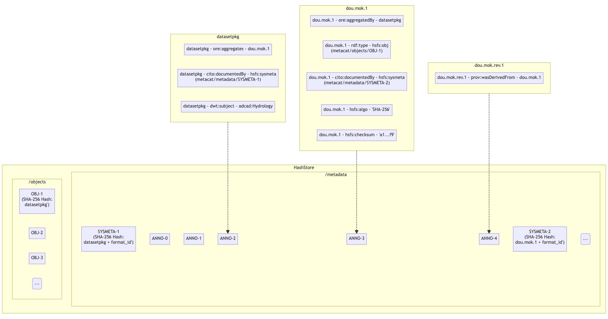

Storage Subsystem
=================

Use Cases
---------

-  **UC01: {Repository operators, researchers} need to upload large, or
   many files**

   -  **Priority: 2** (blocked by UC04)
   -  High volume network transfer, e.g., over Globus or other non-http
      protocols)
   -  Bootstrap new MN install (e.g., ADC) with, say, 5TB of data over
      many files w/o paying the network transfer penalty associated with
      MNStorage.create
   -  MN operators (e.g., ADC) loading large submissions. Currently
      might take hours/days. We might call this “out of band data
      loading”
   -  Have alternative options for users that might have slow internet
      speeds (ability to resume where they might have left off)
   -  Arctic Data Center, ESS-DIVE, PDG, DataONE

-  **UC02: {Repository operators, researchers} want to create/update
   file system based data uploads**

   -  Upload a single file (data or metadata) to the file system
   -  Upload a whole package with all of its metadata and data files in
      a package hierarchy

      -  triggers creation of system metadata?

   -  “zip-based” upload is start of support for create/update
      transactions and rollback
   -  ESS-DIVE, rdataone, …

-  **UC03: {Researchers} needs a hierarchical file system read-only view
   of packages**

   -  e.g., run analysis against files in package hierarchy
   -  view should be read-only
   -  need to enforce access control rules (e.g., only show readable
      files and packages)

-  **UC04: {MN System tools} need direct access to metadata/data**

   -  **Priority: 1** (blocks others)
   -  priviledged tools that can access all data
   -  only available to ‘admin’ users/tools
   -  MetaDIG quality engine needs direct, efficient access to
      metadata/data

      -  would enable metadata/data congruence checks
      -  would enable advanced data checks
      -  Need access to files from distributed clusters like Kubernetes

   -  DataONE LOD service needs read-only access to metadata (possibly
      data). Currently gets it all over HTTP
   -  Efficient data previews in the UI or other client tools
   -  ESS-DIVE file checks of data (e.g., for virus checking)
   -  Indexer needs access to on-disk metadata files and resource maps
      and system-metadata

      -  Currently give file path to bytes for science metadata and
         resource maps,
      -  system metadata comes from HZ, needs to be accessible from the
         filesystem too
      -  Need access to files from distributed clusters like Kubernetes

   -  System metadata needs to be stored on the filesystem
   -  Service to create checksums for all data objects (i.e. Carl
      Bottinger)

      -  a suite of checksums could be calculated and published to a
         registry

   -  Metrics Service access to the metadata to parse citations,…
   -  ADC, ESS_DIVE, DataONE,

-  **UC05: {Researchers} create and trigger data quality assessment
   workflows**

   -  for Arctic Data Center, with user contributed data checking
      workflows

      -  requires access to files on disk, arranged in hierarchical
         packages as the user “sees” it

-  **UC06a: Downloading large packages via BagIt over HTTP**

   -  Need ability to download large packages in the face of network
      errors - HTTP Byte-range support
   -  Fix our Bagit download implementation
   -  The ability to download the files based on how on the hierarchical
      file system (eg. I want to download all the files from the same
      folder)

-  **UC06: Downloading large packages via alternate protocols**

   -  **Priority: 3**
   -  Bulk download is too difficult currently for people and I can
      imagine us being able to set up a permanent or temporary FTP or
      something to give durable access
   -  Subcase 1: download all of Kate Stafford’s files

      -  Requires a large bagit beyond our current capabilities

   -  Subcase 2: mark and download a subset of the files in a package
      hierarchy
   -  Subcase 3: Support OPeNDAP/THREDDS access
   -  Globus support
   -  Being able to download a specific group of data files (eg. all the
      data related to a sample)

-  **UC07: {Researchers} want to remotely mount a filesystem view of
   their {package, collection, repository, DataONE}**

   -  Same as ONEDrive use cases from DataONE Phase I

-  **UC08: {Researchers} want to upload their data packages via Google
   Drive/Box/Dropbox/OneDrive/GitHub**

   -  Fill in metadata somewhere, tag a release, get’s uploaded
      automatically
   -  science metadata gets added on/layered on top of files obtained
      from shared drives, etc.

-  **UC09: {Contributors} want to do batch updates to {large} number of
   existing files**

   -  Need a batch API for things like access control updates e.g. send
      a single API request for various metadata about a collection of
      objects (rather than sending one call for each type of metadata
      for each object)
   -  https://hpad.dataone.org/fJtGygXLRH-pUGG4XnPDWw#

-  **UC10: {Contributors} want to be able to upload and view files in
   folder structures**

   -  For both small and large packages
   -  Involves how we rearchitect packages as large collections of files

-  ESS-DIVE use cases

   -  some files are too large to upload to DataONE

      -  links are made to the data

   -  essdive defined access types

      -  tier 1

         -  in metacat, replicated

      -  tier 2

         -  not in metacat

      -  tier 3

         -  offline, private
         -  requires request, manual access

   -  direct access to data from Jupyter notebook
   -  user creates a list of files to download, creating a collection
      like a shopping cart, then requests download

      -  maybe a BagIt file is created

   -  on upload

      -  check that files are in required format

Requirements (Capabilities)
---------------------------

-  ability to upload very large files, efficiently (current Metacat
   limit is 5MB)
-  ability to upload many files (thousands), efficiently
-  provide high volume, non-HTTP access to Metacat data store
-  provide public or authenticated access depending on object
-  provide a hierarchical view of Metacat data store
-  files ingested/uploaded are integrated into DataONE as if they were
   uploaded via DataONE REST API

   -  system metadata created
   -  objects indexed in Solr

-  access via the storage API should have better performance than the
   DataONE REST API
-  for clients (e.g. MetaDIG enginee)

   -  read access needed for all DataONE metadata
   -  read access needed for potentially all DataONE data objects
   -  more effiecient than downloading metadata for each run

-  read only access to hierarchical view of any data package
-  read only access to all DataONE system metadata
-  Batch updates in Metacat
   (https://hpad.dataone.org/fJtGygXLRH-pUGG4XnPDWw#)

Design diagrams
---------------

Architecture
~~~~~~~~~~~~

.. figure:: images/mc-overview.png
   :align: center

   Figure 1. Metacat components overview, highlighting index task flow with dashed arrows.

..
  This block defines the components diagram referenced above.
  @startuml images/mc-overview.png
  top to bottom direction
  !theme superhero-outline
  !include <logos/solr>
  skinparam actorStyle awesome

  together {
    :Alice:
    :Bob:
    :Chandra:
  }

  frame "Ceph Cluster" as cluster {
    component CephFS
    component "hosts" {
      database "ceph-host-1"
      database "ceph-host-2"
      database "ceph-host-3"
      database "ceph-host-n"
    }
    CephFS-hosts
  }

  frame DataONEDrive as d1d {
    [Globus]
    [WebDAV]
    d1d-u-cluster
  }

  frame "Postgres deployment" as pg {
    database metacat as mcdb {
    }
  }

  frame "Metacat" {
    interface "DataONE API" as D1
    :Alice: -d-> D1
    :Bob: -d-> D1
    :Chandra: -d-> D1
    [MetacatHandler]--D1
    [Task Generator] <.. [MetacatHandler]
    [Search] <-- [MetacatHandler]
    [Auth] <-- [MetacatHandler]
    [EventLog] <-- [MetacatHandler]
    [Replicate] <-- [MetacatHandler]
    frame "Storage Subsystem" as Storage {

      frame "Storage Adapters" as store {
        component ceph
        component S3
        component LocalFS
      }
      rectangle DataObject as do {
              () Read as R
              () Write as W
      }
      do--R
      do--W
      do --> ceph
      do <-- ceph
    }
    W <-- [MetacatHandler]
    R <-- [MetacatHandler]
    do--pg
  }

  frame "dataone-index" as indexer {
    frame "RabbitMQ deployment" {
      interface basicPublish
      queue PriorityQueue as pqueue
      [Monitor]
      basicPublish .> pqueue
    }

    node "MC Index" {
      [Index Worker 1] as iw1
      [Index Worker 2] as iw2
      [Index Worker 3] as iw3
      pqueue ..> iw1
      pqueue ..> iw2
      pqueue ..> iw3
    }

    frame "SOLR deployment" as solr {
      database "<$solr>" as s {
        folder "Core" {
          [Index Schema]
        }
      }
    }
  }

  [Task Generator] ..> basicPublish : add
  iw1 --> [Index Schema] : update
  iw2 --> [Index Schema] : update
  iw3 --> [Index Schema] : update
  ceph <-- CephFS : read
  ceph --> CephFS : write
  iw1 ..> CephFS : read
  iw2 ..> CephFS : read
  iw3 ..> CephFS : read
  Search --> solr

  @enduml

.. raw:: latex

  \newpage

.. raw:: pdf

  PageBreak

Design choices include:

- Storage interface
  
    - Ceph FS
        - see https://docs.ceph.com/en/latest/cephfs/
    - Ceph Object Gateway
        - S3 API (see https://docs.ceph.com/en/latest/radosgw/s3/)
        - Swift API 
  
- Data and metadata access layer
  
    - What level should we plan for access by:
        - System processes
        - User access processes

Physical File Layout (HashStore)
~~~~~~~~~~~~~~~~~~~~~~~~~~~~~~~~

For physical file storage and layout, our goal is to provide a consistent
directory structure that will be robust against naming issues such as
illegal characters, and that allows us to access both system metadata and
the file contents knowing only the PID for an object. This approach focuses
on using a content hash identifier for naming data and metadata objects in
their respective folders, rather than an authority-based identifier such as
a PID or SID, along with reference files to catalogue data.

 **Why not hash identifiers derived from a PID?**

 During the initial development phase, HashStore was implemented with a Public API
 centering around a PID, storing both data and metadata in its respective
 directories using an identifier generated from hashing the PID. However, after
 further review and testing with Metacat - it was determined to be unsuitable
 given the usage of multipart http requests in Metacat, which encapsulates the
 pieces of data that users upload in "body parts" when submitting to Metacat.

 In multipart http requests, a PID may not always be immediately available for Metacat
 to call the HashStore Public API with (since the order in which data and metadata
 is received by Metacat cannot be guaranteed, and this PID lives with the metadata
 body part). If a data "body part" were to arrive first, it would need to be stored
 as a temporary object until a PID is received.

 In this scenario where a temporary object awaits its final location, we also
 would have already calculated the default list of hashes (content identifiers).
 So storing the data object with its content identifier as its permanent address
 (and in its own directory) ensures the atomicity of this storage process - there
 is no waiting period for a data object to be completely stored, or potentially
 lost in limbo indefinitely. It also allows us to store any data object once
 and only once.

 If we could guarantee the order of uploads to Metacat, then using the hash identifier
 generated from a PID would be appropriate. We have discussed this potential change
 of forcing metadata to arrive first during the upload process, but it would
 require extensive changes to processes which we do not have the resources or
 time to undertake (nor the desire to force upon users).

 To learn more about the initial design, please see: storage-subsystem-cid-file-layout.rst

**Raw File Storage**

The raw bytes of each object (data, metadata, or resource map)
are first written into a temporary file. Data objects remain as temp objects while
its content identifiers are calculated using a hashing algorithm such that each
unique set of bytes produces a unique checksum value. That checksum value is then
used to name the file. In this way, even when the same file is uploaded multiple
times, it will only be stored once in the filesystem.

**Duplicate Objects**

To prevent duplicate objects from being stored, all HashStore Public API calls
by a calling app (ex. Metacat) to store data objects are synchronized. Additionally,
all objects begin as temporary objects which are moved (renamed) only when
HashStore has determined that the object does not exist yet.

If an object already exists, an exception will be swallowed. Similarly, all HashStore
Public API calls to store metadata are synchronized and executed in chronological order.
It is the calling client's responsibility to ensure that metadata is stored and/or
backed up appropriately.

**Checksum algorithm and encoding**

We have multiple hash algorithms to choose from, and each has multiple ways of
encoding the binary hash into a string representation. We will choose the
simplest, most common configuration which is to use a `SHA-256` hash
algorithm, with the binary digest converted to a string value using `base64`
encoding. That makes each hash value 64 characters long (representing
the 256 bit binary value). For example, here is a base64-encoded SHA-256 value:

   4d198171eef969d553d4c9537b1811a7b078f9a3804fc978a761bc014c05972c

While we chose this common combination, we could also have chosen other hash
algorithms (e.g., SHA-1, SHA3-256, blake2b-512) and alternate string encodings
(e.g., base58, Multihash (https://multiformats.io/multihash/)). Multihash may be
a valuable approach in to future-proof the storage system, because it enables use
of multiple checksum algorithms.

**Folder layout**

To reduce the number of files in a given directory, we use the first several
characters of the hash to create a directory hierarchy and divide the files up to
make the tree simpler to explore and less likely to exceed operating system
limits on files. We store all objects in an `objects` directory, with 3
levels of 'depth' and a 'width' of 2 digits (https://github.com/DataONEorg/hashstore/issues/3).
Because each digit in the hash can contain 16 values, the directory structure can
contain 16,777,216 subdirectories (256^3). An example file layout for three objects would be::

   /var/metacat/hashstore
   └── objects
       ├── 4d
       │   └── 19
       │       └── 8171eef969d553d4c9537b1811a7b078f9a3804fc978a761bc014c05972c
       ├── 94
       │   └── f9
       │       └── b6c88f1f458e410c30c351c6384ea42ac1b5ee1f8430d3e365e43b78a38a
       └── 44
           └── 73
               └── 516a592209cbcd3a7ba4edeebbdb374ee8e4a49d19896fafb8f278dc25fa

   // Additional Context for Examples (Test Data Items):
   // - doi:10.18739/A2901ZH2M
   // -- SHA-256 Content Hash: 4d198171eef969d553d4c9537b1811a7b078f9a3804fc978a761bc014c05972c
   // - jtao.1700.1
   // -- SHA-256 Content Hash: 94f9b6c88f1f458e410c30c351c6384ea42ac1b5ee1f8430d3e365e43b78a38a
   // - urn:uuid:1b35d0a5-b17a-423b-a2ed-de2b18dc367a
   // -- SHA-256 Content Hash: 4473516a592209cbcd3a7ba4edeebbdb374ee8e4a49d19896fafb8f278dc25fa

Note how the full hash value is obtained by appending the directory names with
the file name

 (e.g., `4d198171eef969d553d4c9537b1811a7b078f9a3804fc978a761bc014c05972c` for the first object).

**Metadata Storage**

With this layout, knowing the content identifier/hash value for an object allows
a client with sufficient privileges to directly retrieve the data object without
the need to retrieve the metadata from Metacat first. But what about our primary
goal of obtaining both system metadata and file contents if we only had a PID?

A mechanism is needed to store metadata about the object, including its persistent
identifier (PID), other system metadata for the object, or extended metadata that
we might want to include. So, in addition to data objects, the system supports
storage for multiple metadata documents that are associated with a given PID, and
the creation of reference files that facilitate the relationship that exists with
a given PID.

 Note: Reference files should be created when objects are stored - and the process
 to do so can be separately invoked if the calling app cannot do it immediately
 (like in the situation when it does not have a PID yet).

**Other metadata types**:

While we currently only have a need to access system metadata for each object,
in the future we envision potentially including other metadata files that can be
used for describing individual data objects. This might include package relationships
and other annotations that we wish to include for each data file.

All metadata documents will be stored in the metadata directory which is broken up into
directory depths and widths as defined by a configuration file 'hashstore.yaml'.
Each metadata document's file name is calculated using the SHA-256 hash of the `PID` + `formatId`.

For example, given the PID `jtao.1700.1`, one can find the directory that contains all
metadata documents related to the given pid by calculating the SHA-256 of that PID using::

   $ echo -n "jtao.1700.1" | shasum -a 256
   a8241925740d5dcd719596639e780e0a090c9d55a5d0372b0eaf55ed711d4edf

 So, the system metadata file (sysmeta), along with all other metadata related to the PID,
 would be stored in the folder:

 `.../metadata/a8/24/1925740d5dcd719596639e780e0a090c9d55a5d0372b0eaf55ed711d4edf/`

 /var/metacat/hashstore
 ├── objects
 └── metadata
     ├── a8
         └── 24
             └── 1925740d5dcd719596639e780e0a090c9d55a5d0372b0eaf55ed711d4edf
                 └── sha256("jtao.1700.1"+"http://ns.dataone.org/service/types/v2.0") // sysmeta namespace
                 └── sha256(pid+formatId_annotations)

 Each metadata file that belongs to the given PID can be found in this folder,
 and specifically located by calculating the SHA-256 hash of the `PID` + respective `formatId`.

Extending our diagram from earlier & above, we now see the three hashes that represent
data files, along with three that represent the metadata directory for a given PID,
and the relevant metadata files - each named with the hash of the `PID` + `formatId`
they describe::

   /var/metacat/hashstore
   ├── objects
   |   ├── 4d
   |   │   └── 19
   |   │       └── 8171eef969d553d4c9537b1811a7b078f9a3804fc978a761bc014c05972c
   |   ├── 94
   |   │   └── f9
   |   │       └── b6c88f1f458e410c30c351c6384ea42ac1b5ee1f8430d3e365e43b78a38a
   |   └── 44
   |       └── 73
   |           └── 516a592209cbcd3a7ba4edeebbdb374ee8e4a49d19896fafb8f278dc25fa
   └── metadata
       ├── 0d
       │   └── 55
       │       └── 555ed77052d7e166017f779cbc193357c3a5006ee8b8457230bcf7abcef65e
       |           └── sha256(pid+formatId_sysmeta)
       |           └── sha256(pid+formatId_annotations)
       ├── a8
       │   └── 24
       │       └── 1925740d5dcd719596639e780e0a090c9d55a5d0372b0eaf55ed711d4edf
       |           └── sha256(pid+formatId_sysmeta)
       |           └── sha256(pid+formatId_annotations)
       └── 7f
           └── 5c
               └── c18f0b04e812a3b4c8f686ce34e6fec558804bf61e54b176742a7f6368d6
                   └── sha256(pid+formatId_sysmeta)
                   └── sha256(pid+formatId_annotations)

 **More on Sysmeta & Metadata Formats**

 Initially, only system metadata files were proposed to be stored, in the format
 of a delimited file with a header and body section. The header contains
 the 64 character hash (content identifier) of the data file described by this
 sysmeta, followed by a space, then the `formatId` of the metadata format for
 the metadata in the file, and then a NULL (`\x00`). This header is then followed
 by the content of the metadata document in UTF-8 encoding.

 This metadata file's permanent address is then calculated by using the SHA-256
 hash of the persistent identifier (PID) of the object, and stored in a `sysmeta`
 directory parallel to the one described above for objects, and structured analogously.
 So given just the `sysmeta` directory, we could reconstruct an entire member node's
 data and metadata content.

 However, to simplify HashStore and address the challenge of locking objects
 in a operating system that can be accessed by many processes, we attempted to
 switch to PID-based hash identifiers. In this system, metadata was stored with
 its permanent address as the `PID` + `formatId`.

 Additionally, the data object would be stored with the hash of the `PID` as the
 permanent address - so the proposed sysmeta (metadata) delimiter format became
 redundant, and only the body portion (metadata content) was required in the
 stored metadata file. In this proposed direction, there was no need for the
 content identifier to be stored.

 Our reversal of this approach necessitated the reintroduction of a way to
 manage the relationships of a given PID in HashStore, leading to reference
 files (more info below).

**Reference Files (a.k.a. Tags)**

To manage the relationship between objects and metadata, reference files are created
in the `/refs/cid` and `/refs/pid` directory for both an object (using its content
identifier as the permanent address) and its respective PID (using the SHA-256 hash
of the given PID as the permanent address).

 1. **Cid Reference File**

    To ensure that an object is stored once and only once using its content identifier (cid),
    a cid reference file for each object is created upon its first storage call. This file
    contains a list of pids delimited by a new line ('\n'). When a duplicate object is found or
    deleted, a cid reference file is updated. An object can not be deleted if its cid reference
    file is still present, and this file (and the object) can only deleted when no more references
    are found.

 2. **Pid Reference File**

    Every metadata document that is stored also generates a pid reference file. This pid
    reference file contains the content identifier that the PID describes, and lives in
    a directory in `/metadata` that is named using the SHA-256 hash of the given `PID` + `formatId`.

 **Note:** Previously, this relationship was represented in the system metadata document
 in a delimiter format with a header and body. Since transitioning back to content
 identifiers, this data was moved to reference files (so we no longer need to fully
 parse a sysmeta document to get what we need), making it easier for developers and
 others to understand and find the connections within the HashStore layout/file system.

Below, is the full HashStore file layout diagram::

   /var/metacat/hashstore
   ├── hashstore.yaml
   ├── objects
   |   ├── 4d
   |   │   └── 19
   |   │       └── 8171eef969d553d4c9537b1811a7b078f9a3804fc978a761bc014c05972c
   |   ├── 94
   |   │   └── f9
   |   │       └── b6c88f1f458e410c30c351c6384ea42ac1b5ee1f8430d3e365e43b78a38a
   |   └── 44
   |       └── 73
   |           └── 516a592209cbcd3a7ba4edeebbdb374ee8e4a49d19896fafb8f278dc25fa
   └── metadata
   |   ├── 0d
   |   │   └── 55
   |   │       └── 555ed77052d7e166017f779cbc193357c3a5006ee8b8457230bcf7abcef65e
   |   |           └── sha256(pid+formatId_sysmeta)
   |   |           └── sha256(pid+formatId_annotations)
   |   ├── a8
   |   │   └── 24
   |   │       └── 1925740d5dcd719596639e780e0a090c9d55a5d0372b0eaf55ed711d4edf
   |   |           └── sha256(pid+formatId_sysmeta)
   |   |           └── sha256(pid+formatId_annotations)
   |   └── 7f
   |       └── 5c
   |           └── c18f0b04e812a3b4c8f686ce34e6fec558804bf61e54b176742a7f6368d6
   |               └── sha256(pid+formatId_sysmeta)
   |               └── sha256(pid+formatId_annotations)
   └── refs
       ├── cid
       |   └── 4d
       |   |   └── 19
       |   |       └── 8171eef969d553d4c9537b1811a7b078f9a3804fc978a761bc014c05972c
       |   ├── 94
       |   │   └── f9
       |   │       └── b6c88f1f458e410c30c351c6384ea42ac1b5ee1f8430d3e365e43b78a38a
       |   └── 44
       |       └── 73
       |           └── 516a592209cbcd3a7ba4edeebbdb374ee8e4a49d19896fafb8f278dc25fa
       └── pid
           └── 0d
           |   └── 55
           |       └── 555ed77052d7e166017f779cbc193357c3a5006ee8b8457230bcf7abcef65e
           ├── a8
           │   └── 24
           │       └── 1925740d5dcd719596639e780e0a090c9d55a5d0372b0eaf55ed711d4edf
           └── 7f
               └── 5c
                   └── c18f0b04e812a3b4c8f686ce34e6fec558804bf61e54b176742a7f6368d6

**PID-based Access (Manually Find Objects)**:

Given a `PID` and a `formatId`, we can discover and access both the system
metadata for an object and the bytes of the object itself without any further
store of information.

 Note: If no `formatId` is supplied, HashStore should use the default `formatId`
 based on the `hashstore.yaml` configuration file

 (i.e. "http://ns.dataone.org/service/types/v2.0")).

The procedure for this without using the HashStore Public API is as follows:

   1) Find the content identifier: Given the `PID`, calculate the SHA-256 hash,
   and base64-encode it to find the location of the pid refs file in 'refs/pid',
   which contains the content identifier of the `PID`.

   2) Find the metadata document: Use the SHA-256 hash of the `PID` to locate the
   folder in the `metadata` tree in which the desired metadata document exists.
   The desired document's file name is formed by the hash of the `pid` + `formatId`.

   3) With the content identifier of the given PID, open and read the data from the
   `objects` tree. With the hash of the `PID` + `formatId`, open and read data from
   the `metadata` tree.

Public API
~~~~~~~~~~~~~~~~~~~

While Metacat will primarily handle read/write operations, other services like MetaDig and
DataONE MNs may interact with the hashstore directly. Below are the public methods implemented
in the Python and Java HashStore library. For detailed information on how each method should
work, please see the respective HashStore interface class in the projects below:

 (Python) https://github.com/DataONEorg/hashstore

 (Java) https://github.com/DataONEorg/hashstore-java

**The methods below will be included in the public API:**

+--------------------+------------------------------+----------------------------------+---------------------------------------------+
|     **Method**     |           **Args**           |         **Return Type**          |                  **Notes**                  |
+====================+==============================+==================================+=============================================+
| store_object       | pid, data, ...               | hash_address (object_cid, ...)   | Pending Review                              |
+--------------------+------------------------------+----------------------------------+---------------------------------------------+
| tag_object         | pid, cid                     | boolean                          | Pending Review                              |
+--------------------+------------------------------+----------------------------------+---------------------------------------------+
| verify_object      | object_info, checksum, ...   | void                             | Pending Review                              |
+--------------------+------------------------------+----------------------------------+---------------------------------------------+
| find_object        | pid                          | string (cid)                     | Pending Review                              |
+--------------------+------------------------------+----------------------------------+---------------------------------------------+
| store_metadata     | sysmeta, pid, format_id      | metadata_cid                     | Pending Review                              |
+--------------------+------------------------------+----------------------------------+---------------------------------------------+
| retrieve_object    | pid                          | io.BufferedIOBase                | Pending Review                              |
+--------------------+------------------------------+----------------------------------+---------------------------------------------+
| retrieve_metadata  | pid, format_id               | string (metadata)                | Pending Review                              |
+--------------------+------------------------------+----------------------------------+---------------------------------------------+
| delete_object      | pid                          | boolean                          | Pending Review                              |
+--------------------+------------------------------+----------------------------------+---------------------------------------------+
| delete_metadata    | pid, format_id               | boolean                          | Pending Review                              |
+--------------------+------------------------------+----------------------------------+---------------------------------------------+
| get_hex_digest     | pid, algorithm               | string (hex_digest)              | Pending Review                              |
+--------------------+------------------------------+----------------------------------+---------------------------------------------+

 Below is a quick summary of how the Public API methods work:

 - **store_object**: Stores an object to HashStore with a given pid and data stream.

   - If a pid is available, it should not only tag the object with the pid, but verify
   that the reference files exist and correctly associated/tagged.
   - If a pid is unavailable, it should store the object. The calling app or method
   should then call 'tag_object' to create the necessary references, and then
   'verify_object' to confirm that everything exists where it should be.
 - **tag_object**: Tag an object by creating reference files
 - **verify_object**: Verifies that the values provided match
 - **find_object**: Check that an object exists, and if it does - return the content identifier
 - **store_metadata**: Store a metadata document to HashStore with a pid and format_id
 - **retrieve_object**: Returns a stream to the object if it exists
 - **retrieve_metadata**: Returns a stream to the metadata if it exists
 - **delete_object**: Deletes the pid reference file, removes the pid from the cid reference
   file and only deletes the object if the cid reference files does not have any references
 - **delete_metadata**: Deletes a metadata document
 - **get_hex_digest**: Returns the hex digest (hash value, checksum) of the algorithm desired
   of an object if it exists in HashStore.

.. figure:: images/hashstore_publicapi_mermaid_store_object_v2.png
   :figclass: top
   :align: center

   Figure 2. Mermaid diagram illustrating the initial store_object flow
   

Annotations
~~~~~~~~~~~~~~~~~~~
   
To support a paging API/query service to parse large data packages, we are proposing that
each member (subject) in a dataset package will have a RDF annotation file formatted in either
N-Triples or JSON-LD. Each annotation file can contain multiple triples that describe the
subject's relationships with its respective objects. These files will exist alongside 
sysmeta documents in HashStore, and can be stored, retrieved and deleted with the same public
API. In the diagram below, we illustrate this concept:

Notes:
   - Each annotation file (prefixed by ANNO-) contains triples about a subject, and the dotted line
     ending with an arrow represents where the annotation file would exist in HashStore
   - Ex. 'dou.mok.1' has 5 triples, describing what package it belongs to, that it's an object that can
     be found in HashStore, with a sysmeta document that can also be found in HashStore and a checksum
     and checksum algorithm.

To actually query the annotation graph, we will require an indexer that can not only index these
annotation files, but also be able to merge what's in additional ORE and EML documents to provide
completeness to the graph. This index serves as the basis for the query service that MetacatUI/front-end
would access. Users would not be accessing HashStore/Metacat directly, but this indexed version instead.

Virtual File Layout
~~~~~~~~~~~~~~~~~~~

In both of these cases, the main presentation of the directory layout would be
via a virtual layout that uses human-readable names and a directory structure
derived from the `prov:atLocation` metadata in our packages. Because a single 
file can be a member of multiple packages (both different versions of the same
package, and totally independent packages), there is a 1:many mapping between
files and packages. In addition, a file may be in different locations in these
various packages of which it is a part. So, our 'virtual' view will be derived 
from the metadata for a package, and will enable us to browse through the 
contents of the package independently of its physical layout.

Within the virtual package display, the main data directory will be reflected 
at the root of the tree, with a hidden `.metadata` directroy containing all of
the metadata files.

   
   Virtual file layout.

This layout will be familiar to researchers, but differs somewhat from the BagIt format
used for laying out data packages. In the BagIt approach, metadata files are stored
at the root of the folder structure, and files are held in a `data` subdirectory. Ideally, 
we could hide the BagIt metadata manifests in a hidden directory and keep the main
files at the root.

Filesystem Mounts
~~~~~~~~~~~~~~~~~

To support processing these files, we want to mount the data on various virtual 
machines and nodes in the Kubernetes cluster so that mutliple processors can 
seamlessly update and access the data. Thus our plan is to use a shared virtual 
filesystem. Reading from and writing to the shared virtual filesystem will result 
in reads and writes against the files in the physical layout using checksums.

Legacy MN Indexing
~~~~~~~~~~~~~~~~~~~

.. figure:: images/MN-indexing-hazelcast.png
   :align: center

   This sequence diagram shows the member node indexing message/data flow as it existed before the Metacat Storage/Indexing subsystem.
   The red boxes represent components that could be replaced by RabbitMQ messaging.

..
  @startuml images/MN-indexing-hazelcast.png
   title "Metacat indexing (MN w/Hazelcast)"
      participant Client
      participant "MNResourceHandler" <<Metacat>>
      participant "MNodeService" <<Metacat>>
      participant "D1NodeService" <<Metacat>>
      participant "MetacatHandler" <<Metacat>>
      participant "MetacatSolrIndex" <<Metacat>> #tomato
      queue       "hzIndexQueue" <<Hazelcast>> #tomato
      participant "SystemMetadataEventListener" <<Metacat-index>> #tomato
      participant "SolrIndex" <<Metacat-index>>
  
      Client -> MNResourceHandler : HTTP POST(sysmeta, pid, object) 
      
      activate MNResourceHandler 
      MNResourceHandler -> MNResourceHandler : handle(bytes)
      MNResourceHandler -> MNResourceHandler : putObject(pid, action)
      MNResourceHandler -> MNodeService : create(session, pid, object, sysmeta)
      deactivate MNResourceHandler
      
      activate MNodeService
      MNodeService -> D1NodeService : insertOrUpdateDocument(object, pid)
      deactivate MNodeService
  
      activate D1NodeService
      D1NodeService -> MetacatHandler : handleInsertOrUpdateAction()
      deactivate D1NodeService
      
      activate MetacatHandler
      MetacatHandler -> MetacatSolrIndex : submit(pid, sysmeta)
      deactivate MetacatHandler
      
      activate MetacatSolrIndex
      MetacatSolrIndex -> "hzIndexQueue" : put(pid, task)
      deactivate MetacatSolrIndex
      
      activate hzIndexQueue
      hzIndexQueue -> SystemMetadataEventListener : entryAdded(entryEvent)
      deactivate hzIndexQueue
      
      activate SystemMetadataEventListener
      SystemMetadataEventListener -> SolrIndex : update(pid, sysmeta);
      SystemMetadataEventListener -> SolrIndex : insertFields(pid, fields)
      deactivate SystemMetadataEventListener
      
  @enduml

Legacy CN Indexing 
~~~~~~~~~~~~~~~~~~~

.. figure:: images/CN-indexing-hazelcast.png

  This sequence diagram shows the coordinating legacy indexing message/data flow as implemented before the Metacat Storage/Indexing subsystem.
  The red boxes represent compoenents that could be replaced by RabbitMQ messaging.

..
  @startuml images/CN-indexing-hazelcast.png
   title "DataONE indexing (CN w/Hazelcast)"
      participant "task" <<d1_synchronization>>
      participant "CNCore" <<d1_synchronization>>
      participant "CNodeService" <<metacat>>
      participant "D1NodeService" <<metacat>>
      participant "MetacatHandler" <<metacat>>
      participant "systemMetadataMap" <<Hazelcast>> #tomato
      participant "IndexTaskGenerator" <<d1_cn_index_generator>> #tomato
      participant "IndexTaskRepository" <<d1_cn_index_common>> #tomato
      database    "index task queue" <<PostgreSQL>> #tomato
      participant "IndexTaskProcessor" <<d1_cn_index_processor>>
      participant "IndexTaskUpdateProcessor" <<d1_cn_index_processor>>
      
      activate task
      task -> CNCore : create(session, pid, object, sysmeta)
      deactivate task
      
      activate CNCore
      CNCore -> CNodeService : create (session, pid, object, sysmeta) 
      deactivate CNCore
      
      activate CNodeService 
      CNodeService -> D1NodeService : create (session, pid, object, sysmeta) 
      deactivate CNodeService
      
      activate D1NodeService
      D1NodeService -> D1NodeService : insertOrUpdate(session, pid, object, sysmeta) 
      D1NodeService -> MetacatHandler : handleInsertOrUpdate(ipAddress, ...)
      deactivate D1NodeService
      
      activate MetacatHandler
      MetacatHandler -> systemMetadataMap : put(pid, sysmeta)
      deactivate MetacatHandler
      
      activate systemMetadataMap
      systemMetadataMap -> IndexTaskGenerator : entryAdded(event)
      deactivate systemMetadataMap
      
      activate IndexTaskGenerator
      IndexTaskGenerator -> IndexTaskGenerator : processSystemMetaDataAdd(event, objectPath)
      IndexTaskGenerator -> IndexTaskRepository : repo.save(task(smd, String objectPath))
      deactivate IndexTaskGenerator
      
      activate IndexTaskRepository
      IndexTaskRepository -> "index task queue" : task(smd, String objectPath
      deactivate IndexTaskRepository
      
      activate "index task queue"
      "index task queue" -> IndexTaskProcessor : processIndexTaskQueue()
      deactivate "index task queue"
      
      activate IndexTaskProcessor
      IndexTaskProcessor -> IndexTaskProcessor : processTaskOnThread(task)
      IndexTaskProcessor -> IndexTaskProcessor : processTask(task)
      IndexTaskProcessor -> IndexTaskUpdateProcessor : process(task)
      deactivate IndexTaskProcessor
          
      activate IndexTaskUpdateProcessor
      IndexTaskUpdateProcessor -> SolrIndexService : insertIntoIndex(pid, sysmeta, objectPath)
      deactivate IndexTaskUpdateProcessor
      
  @enduml

Proposed Indexing with RabbitMQ
~~~~~~~~~~~~~~~~~~~~~~~~~~~~~~~

.. figure:: images/MN-indexing-rabbitmq.png
   :align: center

   This sequence diagram shows indexing message/data flow as it could be refactored to use RabbitMQ.
   The green boxes represent compenents that would replace legacy indexing components in order to implement RabbitMQ messaging.

..
  @startuml images/MN-indexing-rabbitmq.png
  title "Metacat indexing with RabbitMQ"
  participant Client
  participant "MNResourceHandler" <<Metacat>>
  participant "MNodeService" <<Metacat>>
  participant "D1NodeService" <<Metacat>>
  participant "MetacatHandler" <<Metacat>>
  participant "TaskGenerator" <<Metacat>> #lightgreen
  queue       "channel" <<RabbitMQ>> #lightgreen
  participant "IndexWorker" <<dataone-index>> #lightgreen
  participant "SolrIndex" <<dataone-index>>

  Client -> MNResourceHandler : HTTP POST(sysmeta, pid, object)

  activate MNResourceHandler
  MNResourceHandler -> MNResourceHandler : handle(bytes)
  MNResourceHandler -> MNResourceHandler : putObject(pid, action)
  MNResourceHandler -> MNodeService : create(session, pid, object, sysmeta)

  activate MNodeService
  MNodeService -> D1NodeService : insertOrUpdateDocument(object, pid)

  activate D1NodeService
  D1NodeService -> MetacatHandler : handleInsertOrUpdateAction()

  activate MetacatHandler
  MetacatHandler -> TaskGenerator : queueEntry(pid, sysmeta)

  activate TaskGenerator

  activate channel
  TaskGenerator -> channel : basicPublish(exchange, key, properties, message)
  TaskGenerator <- channel

  MetacatHandler <- TaskGenerator
  deactivate channel
  deactivate TaskGenerator

  D1NodeService <- MetacatHandler
  deactivate MetacatHandler

  MNodeService <- D1NodeService
  deactivate D1NodeService

  MNResourceHandler <- MNodeService
  deactivate MNodeService

  Client <- MNResourceHandler
  deactivate MNResourceHandler

  activate channel
  channel -> IndexWorker : handleDelivery(tag, envelope, properties, message)
  deactivate channel

  activate IndexWorker
  IndexWorker -> SolrIndex : update(pid, sysmeta, fields)
  IndexWorker <- SolrIndex
  IndexWorker -> SolrIndex : insertFields(pid, fields)
  IndexWorker <- SolrIndex
  IndexWorker -> channel : basicAck(envelope.getDeliveryTag(), false);
  deactivate IndexWorker
  @enduml

Proposed MN.create method
~~~~~~~~~~~~~~~~~~~~~~~~~~~~~~~

.. figure:: images/MN-create.png
   :align: center

   This sequence diagram shows data flow in the MN.create method.
   
..
   @startuml images/MN-create.png
   title "Sequence diagram for the MN.create method "
    participant Client
    participant "MNResourceHandler" <<Metacat>>
    participant "StreamMultipartHandler" <<Metacat>>
    participant "MetacatHandler" <<Metacat>>
    participant "XMLValidator" <<Metacat>>
    participant "StorageManager" <<Metacat Singleton>>
    /'participant "CephFileSystem" <<CEPH>>'/
    participant "MNodeService" <<Metacat>> 
    participant "D1AuthHelper" <<Metacat>>
    participant "ChecksumManager" <<Metacat Singleton>>
    participant "DBSystemMetadataManager" <<Metacat Singletone>>

  
   

   Client -> MNResourceHandler : HTTP POST(sysmeta, pid, object) 

   activate MNResourceHandler 
   MNResourceHandler -> StreamMultipartHandler : resoloveMultipart(HttpServeletRequest)
   deactivate MNResourceHandler

   activate StreamMultipartHandler
   StreamMultipartHandler -> StreamMultipartHandler : parseSysmeta
   StreamMultipartHandler -> StreamMultipartHandler : parsePid
   StreamMultipartHandler -> MetacatHandler : writeTemp(object, checksumAlg[])
   deactivate StreamMultipartHandler 

   activate MetacatHandler
   MetacatHandler -> MetacatHandler : createDigestInputStream(object)
   MetacatHandler -> StorageManager : writeTemp(digestObjectInputStream)
   deactivate MetacatHandler

   activate StorageManager
   StorageManager -> MetacatHandler : objectFile
   deactivate StorageManager

   activate MetacatHandler
   MetacatHandler -> MetacatHandler : createCheckedFile(objectFile, checksums[]) 
   MetacatHandler -> StreamMultipartHandler : checkedFile
   deactivate MetacatHandler

   activate StreamMultipartHandler
   StreamMultipartHandler -> MNResourceHandler : MultipartRequest (sysmeta, pid, checkedFile)
   deactivate StreamMultipartHandler 

   activate MNResourceHandler 
   MNResourceHandler -> MNodeService: create(session, pid, checkedFileInputStream{with the field of checkedFile}, sysmeta)
   deactivate MNResourceHandler

   activate MNodeService
   MNodeService -> D1AuthHelper : doIsAuthorized(session)
   deactivate MNodeService

   activate D1AuthHelper
   D1AuthHelper -> MNodeService : true
   deactivate D1AuthHelper

   activate MNodeService
   MNodeService -> MetacatHandler : write(pid, checkedFileInputStream, sysmeta)
   deactivate MNodeService 

   alt "object is scientific metadata"
      activate MetacatHandler 
      MetacatHandler -> XMLValidator : validate(checkedFile)
      deactivate MetacatHandler
  
      activate XMLValidator
      XMLValidator -> MetacatHandler : true
      deactivate XMLValidator
      activate MetacatHandler
   end

   MetacatHandler -> StorageManager : mkDirs(pid-hash-string)
   deactivate MetacatHandler

   alt
      activate StorageManager 
      StorageManager -> MetacatHandler : directoryPath
      deactivate StorageManager

      activate MetacatHandler
      MetacatHandler -> StorageManager : move(checkedFile, diretoryPath)
      deactivate MetacatHandler

      activate StorageManager 
      StorageManager -> MetacatHandler : success
      deactivate StorageManager

      activate MetacatHandler 
      MetacatHandler -> StorageManager : write(sysmetaInputStream, directoryPath)
      deactivate MetacatHandler

      activate StorageManager 
      StorageManager -> MetacatHandler : success
      deactivate StorageManager

      activate MetacatHandler
      MetacatHandler -> ChecksumManager : map(pid, checksums[])
      deactivate MetacatHandler

      activate ChecksumManager
      ChecksumManager -> MetacatHandler : success
      deactivate ChecksumManager

   else directoryPath already exists

   /'MetacatHandler -> StorageManager : write(sysmetaInputStream)'/

   /'activate StorageManager '/
   /'StorageManager -> MetacatHandler : success'/
   /'deactivate StorageManager'/
   /'activate MetacatHandler'/
   /'MetacatHandler -> ChecksumManager : map(pid, checksum[])'/
   /'deactivate MetacatHandler./
   /'activate ChecksumManager./
   /'ChecksumManager -> MetacatHandler : success'/
      MetacatHandler -> Client : InvalidRequest(pid already used)
      deactivate ChecksumManager

   end

   activate MetacatHandler
   MetacatHandler -> DBSystemMetadataManager : save(sysmeta)
   deactivate MetacatHandler

   activate DBSystemMetadataManager
   DBSystemMetadataManager -> MetacatHandler : success
   deactivate DBSystemMetadataManager

   activate MetacatHandler
   MetacatHandler -> MNodeService : pid
   deactivate MetacatHandler

   activate MNodeService
   MNodeService -> MNResourceHandler : pid
   deactivate MNodeService

   activate MNResourceHandler
   MNResourceHandler -> Client : pid
   deactivate MNResourceHandler

   @enduml

CheckedFile and CheckedFileInputStream Class Diagram
~~~~~~~~~~~~~~~~~~~~~~~~~~~~~~~~~~~~~~~~~~~~~~~~~~~~

.. figure:: images/checkedFile-class.png
   :align: center  
..
   @startuml images/checkedFile-class.png

   File <|-- CheckedFile
   CheckedFile : Checksum[]: checksums
   CheckedFile : getChecksums()

   FileInputStream <|-- CheckedFileInputStream
   CheckedFileInputStream : CheckedFile: checkedFile
   CheckedFileInputStream : getFile()

   @enduml
