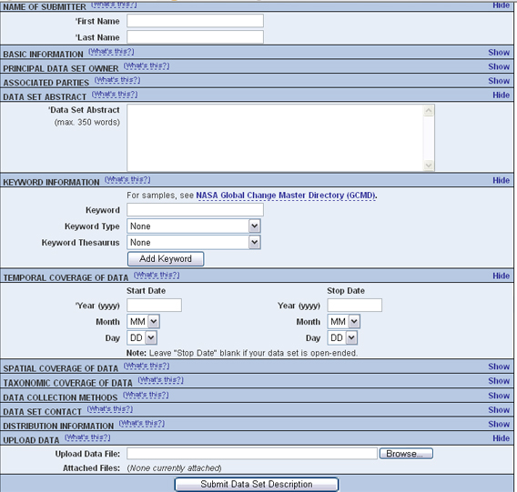
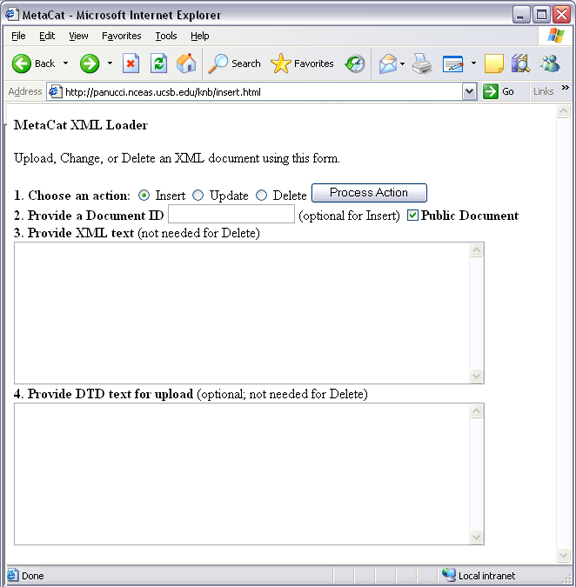
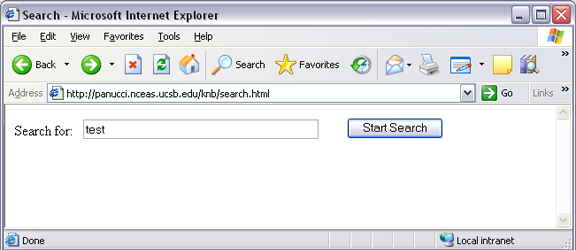
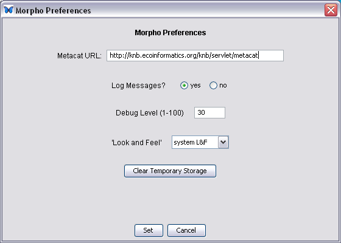

Accessing and Submitting Metadata and Data
==========================================

.. contents::

The Metacat repository can be accessed and updated using a number of tools, 
including: 

* the Registry, Metacat's optional Web interface
* user-created HTML forms 
* Metacat's EarthGrid API
* existing clients, such as KNB's Morpho application, designed to help 
  scientists create, edit, and manage metadata
* user-created desktop clients that take advantage of Metacat's Java API.

In this section, we will look at how to take advantage of these tools to 
customize Metacat for your user-base.

A Brief Note about How Information is Stored
--------------------------------------------
Metacat stores XML files as a hierarchy of nodes, where each node is stored as 
records in database tables. Because many XML data schemas are broken up into 
multiple DTDs requiring multiple XML files that are related but stored 
separately in the system, the system uses "packages" to link related but 
separate documents. Packaged documents contain information that shows how they 
are related to eachother, essentially stating that file A has a relationship 
to file B, etc. A package file also allows users to link metadata files to the 
data files they describe. For more information about the structure of data 
packages and how XML documents and data are stored in Metacat, please see the 
developer's documentation.

Using the Registry
------------------
Metacat's optional Registry provides a simple Web-based interface for creating, 
editing, and submitting metadata to the Metacat repository (screenshot below). The 
interface includes help documentation, and can be customized using Metacat's 
configuration settings. The Registry also includes an administrative interface 
for managing LDAP user accounts, which is useful if you are using LDAP as your 
Metacat authentication system. Note that you must be running your own LDAP 
server if you wish to use the LDAP Web interface. If you do not have your own 
LDAP server, you can create and manage new accounts on the KNB website 
(http://knb.ecoinformatics.org/). Please note that at this time, the Registry 
interface has only been tested on Linux systems.

   An example installation of the Register's web interface. Customize the 
   displayed and required modules with the Skins Configuration settings.
   
You can customize which modules (e.g., "Name of Submitter" or "Temporal 
Coverage of Data") are displayed and which are required using the Skins 
Configuration settings

Installing the Registry
~~~~~~~~~~~~~~~~~~~~~~~
In order to install and run the Registry, you must have Metacat installed and 
Tomcat must be running behind an Apache Web server (see previous sections for 
information about installing and configuring Apache to run with Tomcat).

To install and run the Registry:

1. Install the required system libraries using Ubuntu/Debian (instructions 
   Red Hat in sidebar)
         
  * Install the libraries

    ::

      sudo apt-get install ant libappconfig-perl libxml-libxml-perl \
      libxml-libxslt-perl libtemplate-perl libcgi-session-perl \
      build-essential libnet-ldap-perl libterm-readkey-perl \
      libxml-dom-perl libsoap-lite-perl -y

  * Install two more package using cpan 

    ::
    
      sudo cpan -i Digest::SHA1
      sudo cpan -i Config::Properties
      sudo cpan -i Scalar::Util
      sudo cpan -i Captcha:reCAPTCHA
      sudo cpan -i DateTime
      sudo cpan -i Crypt::JWT
      sudo cpan -i Crypt::X509
          
.. sidebar:: Instructions for Red Hat (Alternate Step 2)

  * Install the libraries

    ::
    
      sudo yum install gcc libxml2-devel libxslt-devel ant -y

  * Install CPAN, which allows us to install the Perl dependencies for the 
    registry and account management parts of Metacat. If asked to manually 
    configure cpan, type 'no' and CPAN will be setup with its default values.

    ::
    
      sudo yum install perl-CPAN
      sudo cpan

  * You should now see a prompt which looks like:

    ::
    
      cpan>

  * The rest of the commands assume you're inside of CPAN. Let's get the most 
    recent version of the CPAN software. Just press return after any prompts 
    you receive during this process.
    
    ::
    
      install Bundle::CPAN
      reload cpan

  * Install the required modules. Here we're installing an old LibXSLT, as the 
    current one requires a newer libxslt than is available on Redhat 4 & 5. 
    Again, just answer 'yes' to any questions.

    ::

      install AutoLoader
      install CGI
      install CGI::SEssion
      install LWP::UserAgent
      install Net::LDAP
      install Template 
      install URI
      install MSERGEANT/XML-LibXSLT-1.58.tar.gz
      install Captcha:reCAPTCHA
      install DateTime
      install Crypt::JWT
      install Crypt::X509

2. Double-check that Metacat's temporary folder, application.tempDir, is 
   writable by the apache user, usually www-data or apache. 

3. Make sure that the following scripts (found in ``<tomcat-home>/webapps/metacat/cgi-bin``) 
   are executable: register-dataset.cgi and ldapweb.cgi.

  ::
  
    sudo chmod +x <tomcat-home>/webapps/metacat/cgi-bin/*.cgi

4. Ensure apache CGI module is enabled

   ::
  
    sudo a2enmod cgid

5. Restart Apache.

  ::
  
    sudo /etc/init.d/apache2 restart

6. Visit the resulting URL: 
   http://<your_context_url>/cgi-bin/register-dataset.cgi?cfg=default
   Where ``<your_context_url>`` is the URL of the server hosting the Metacat 
   followed by the name of the WAR file (i.e., the application context) that 
   you installed. For instance, the context URL for the KNB Metacat is: 
   http://knb.ecoinformatics.org/knb.

If everything worked correctly, the registry home page will open (see figure).

.. figure:: images/screenshots/image035.jpg
   :align: center

   An example of the Registry home page (with the default skin).
   
Customizing the Registry
~~~~~~~~~~~~~~~~~~~~~~~~
Before using the registry, you may wish to customize the interface using the 
Skins Configuration settings. If you are using the default skin, you must 
disable the 'show site list' setting before you can submit the form without 
errors. You may also wish to remove (or modify) the list of NCEAS-specific 
projects that appear in the default registry. To remove these form fields, 
open Metacat's administrative interface (http://<your.context.url>/metacat/admin) 
and select the Skins Specific Properties Configuration option. On the skins 
configuration page, uncheck the boxes beside any form elements that you do not 
wish to appear in the registry.

Once you have saved your changes, you must restart Tomcat for them to come 
into effect. To restart Tomcat, type: ``sudo /etc/init.d/tomcat7 restart`` or an 
equivalent command appropriate to your operating system. 

.. figure:: images/screenshots/image037.jpg
   :align: center

   Uncheck the box beside any setting to remove it from the Registry form. In 
   the example, the "Show Site List" and "Show Work Group" form fields, 
   corresponding to the "Station Name" and "NCEAS Project" drop-down lists in 
   the registry form, have been removed.
   
LDAP account management
~~~~~~~~~~~~~~~~~~~~~~~~
If you intend to use Metacat's built-in LDAP account management feature, 
you will need public and private keys for the reCaptcha widget.

1. Get private and public recaptcha keys from Google using your Google account:
https://www.google.com/recaptcha/admin/create

2. Configure Metacat to use those keys in the metacat.properties file:

  ::
  
	ldap.recaptcha.publickey=<your public key>
	ldap.recaptcha.privatekey=<your private key>

3. Restart Tomcat

   
Using HTML Forms (the HTTP Interface)
-------------------------------------
Metacat's HTTP interface supports Get and Post requests and a variety of actions (Table 4.1) that facilitate information retrieval and storage. HTTP requests can be sent from any client application that communicates using the Web's HTTP protocol. 

* Supported Actions (API)
* Logging in
* Inserting, Updating, and Deleting XML and Data Documents
* Searching Metacat
* Paged Query Return
* Reading Data and Metadata

Supported Actions
~~~~~~~~~~~~~~~~~
Metacat supports get and post requests as well as actions for writing, querying, 
and reading stored XML. In addition, the HTTP interface includes functions for 
validating and transforming XML documents (see table). 

Note that if Replication is enabled, Metacat recognizes several additional 
actions, included in Table 4.2. For more information about replication, 
please see :doc:`replication`.

+--------------------------+--------------------------------------------------------------------------------------------------------------------------------------------------------------------------------------------------------------------------------------------------------------------+
| Action                   | Description and Parameters                                                                                                                                                                                                                                         |
+==========================+====================================================================================================================================================================================================================================================================+
| delete                   | Delete the specified document from the database. For an                                                                                                                                                                                                            |
|                          | example, please see Inserting, Updating, and                                                                                                                                                                                                                       |
|                          | Deleting XML and Data Documents.                                                                                                                                                                                                                                   |
|                          |                                                                                                                                                                                                                                                                    |
|                          | ``docid`` - the docid of the document to delete                                                                                                                                                                                                                    |
+--------------------------+--------------------------------------------------------------------------------------------------------------------------------------------------------------------------------------------------------------------------------------------------------------------+
| export                   | Export a data package in a zip file.                                                                                                                                                                                                                               |
|                          |                                                                                                                                                                                                                                                                    |
|                          | ``docid`` - the docid of the document to delete                                                                                                                                                                                                                    |
+--------------------------+--------------------------------------------------------------------------------------------------------------------------------------------------------------------------------------------------------------------------------------------------------------------+
| getaccesscontrol         | Get the access control list (ACL) for the                                                                                                                                                                                                                          |
|                          | specified document.                                                                                                                                                                                                                                                |
|                          |                                                                                                                                                                                                                                                                    |
|                          | ``docid`` - the docid of the document to delete                                                                                                                                                                                                                    |
+--------------------------+--------------------------------------------------------------------------------------------------------------------------------------------------------------------------------------------------------------------------------------------------------------------+
| getalldocids             | Retrieve a list of all docids registered with the system.                                                                                                                                                                                                          |
|                          |                                                                                                                                                                                                                                                                    |
|                          | ``scope`` - a string used to match a range of docids in a SQL LIKE statement                                                                                                                                                                                       |
+--------------------------+--------------------------------------------------------------------------------------------------------------------------------------------------------------------------------------------------------------------------------------------------------------------+
| getdataguide             | Read a data guide for the specified document type                                                                                                                                                                                                                  |
| DEPRECATED               |                                                                                                                                                                                                                                                                    |
| Use getdtdschema instead | ``doctype`` - the doctype for which to get the data guide                                                                                                                                                                                                          |
+--------------------------+--------------------------------------------------------------------------------------------------------------------------------------------------------------------------------------------------------------------------------------------------------------------+
| getdoctypes              | Get all doctypes currently available in the Metacat Catalog System. No parameters.                                                                                                                                                                                 |
+--------------------------+--------------------------------------------------------------------------------------------------------------------------------------------------------------------------------------------------------------------------------------------------------------------+
| getdtdschema             | Read the DTD or XMLSchema file for the specified doctype.                                                                                                                                                                                                          |
|                          |                                                                                                                                                                                                                                                                    |
|                          | ``doctype`` - the doctype for which DTD or XMLSchema files to read                                                                                                                                                                                                 |
+--------------------------+--------------------------------------------------------------------------------------------------------------------------------------------------------------------------------------------------------------------------------------------------------------------+
| getlastdocid             | Get the latest docid with revision number used by scope.                                                                                                                                                                                                           |
|                          |                                                                                                                                                                                                                                                                    |
|                          | ``scope`` - the scope to be queried                                                                                                                                                                                                                                |
+--------------------------+--------------------------------------------------------------------------------------------------------------------------------------------------------------------------------------------------------------------------------------------------------------------+
| getlog                   | Get the latest docid with revision number used by user.                                                                                                                                                                                                            |
|                          |                                                                                                                                                                                                                                                                    |
|                          | ``ipaddress`` - the internet protocol address for the event                                                                                                                                                                                                        |
|                          | ``principal`` - the principal for the event (a username, etc)                                                                                                                                                                                                      |
|                          | ``docid`` - the identifier of the document to which the event applies                                                                                                                                                                                              |
|                          | ``event`` - the string code for the event                                                                                                                                                                                                                          |
|                          | ``start`` - beginning of date-range for query                                                                                                                                                                                                                      |
|                          | ``end`` - end of date-range for query                                                                                                                                                                                                                              |
+--------------------------+--------------------------------------------------------------------------------------------------------------------------------------------------------------------------------------------------------------------------------------------------------------------+
| getloggedinuserinfo      | Get user info for the currently logged in user. No parameters.                                                                                                                                                                                                     |
+--------------------------+--------------------------------------------------------------------------------------------------------------------------------------------------------------------------------------------------------------------------------------------------------------------+
| getpricipals             | Get all users and groups in the current authentication schema. No parameters.                                                                                                                                                                                      |
+--------------------------+--------------------------------------------------------------------------------------------------------------------------------------------------------------------------------------------------------------------------------------------------------------------+
| getrevisionanddoctype    | Return the revision and doctype of a document.                                                                                                                                                                                                                     |
|                          | The output is String that looks like "rev;doctype"                                                                                                                                                                                                                 |
|                          |                                                                                                                                                                                                                                                                    |
|                          | ``docid`` - the docid of the document                                                                                                                                                                                                                              |
+--------------------------+--------------------------------------------------------------------------------------------------------------------------------------------------------------------------------------------------------------------------------------------------------------------+
| getversion               | Get Metacat version.   Return the current version of Metacat as XML. No parameters.                                                                                                                                                                                |
+--------------------------+--------------------------------------------------------------------------------------------------------------------------------------------------------------------------------------------------------------------------------------------------------------------+
| insert                   | Insert an XML document into the database. For an example, please see                                                                                                                                                                                               |
|                          | Inserting, Updating, and Deleting XML and Data Documents                                                                                                                                                                                                           |
|                          |                                                                                                                                                                                                                                                                    |
|                          | ``docid`` - the user-defined docid to assign to the new XML document                                                                                                                                                                                               |
|                          | ``doctext`` - the text of the XML document to insert                                                                                                                                                                                                               |
+--------------------------+--------------------------------------------------------------------------------------------------------------------------------------------------------------------------------------------------------------------------------------------------------------------+
| insertmultipart          | Insert an XML document using multipart encoding into the database.                                                                                                                                                                                                 |
|                          |                                                                                                                                                                                                                                                                    |
|                          | ``docid`` - the user-defined docid to assign to the new XML document                                                                                                                                                                                               |
|                          | ``doctext`` - the text of the XML document to insert                                                                                                                                                                                                               |
+--------------------------+--------------------------------------------------------------------------------------------------------------------------------------------------------------------------------------------------------------------------------------------------------------------+
| isregistered             | Check if an individual document exists in either the xml_documents or xml_revisions tables.                                                                                                                                                                        |
|                          | For more information about Metacat's database schema, please see the developer documentation.                                                                                                                                                                      |
|                          |                                                                                                                                                                                                                                                                    |
|                          | ``docid`` - the docid of the document                                                                                                                                                                                                                              |
+--------------------------+--------------------------------------------------------------------------------------------------------------------------------------------------------------------------------------------------------------------------------------------------------------------+
| login                    | Log the user in. You must log in using this action before you can perform                                                                                                                                                                                          |
|                          | many of the actions. For an example of the login action, see Logging In.                                                                                                                                                                                           |
|                          |                                                                                                                                                                                                                                                                    |
|                          | ``username`` - the user's login name                                                                                                                                                                                                                               |
|                          | ``password`` - the user's password                                                                                                                                                                                                                                 |
+--------------------------+--------------------------------------------------------------------------------------------------------------------------------------------------------------------------------------------------------------------------------------------------------------------+
| logout                   | Log the current user out and destroy the associated session. No parameters.                                                                                                                                                                                        |
+--------------------------+--------------------------------------------------------------------------------------------------------------------------------------------------------------------------------------------------------------------------------------------------------------------+
| query                    | Perform a free text query. For an example, please see Searching Metacat.                                                                                                                                                                                           |
|                          |                                                                                                                                                                                                                                                                    |
|                          | ``returndoctype`` - the doctype to use for your Package View. For more information about packages, see http://knb.ecoinformatics.org/software/metacat/packages.html                                                                                                |
|                          | ``qformat`` - the format of the returned result set. Possible values are html or xml or the name of your servlet's Metacat skin.                                                                                                                                   |
|                          | ``querytitle`` - OPTIONAL - the title of the query                                                                                                                                                                                                                 |
|                          | ``doctype`` - OPTIONAL - if doctype is specified, the search is limited only to the specified doctype(s). (e.g., eml://ecoinformatics.org/eml-2.0.1 and/or eml://ecoinformatics.org/eml-2.0.0) If no doctype element is specified, all document types are returned |
|                          | ``returnfield`` - a custom field to be returned by any hit document.                                                                                                                                                                                               |
|                          | ``operator`` - the Boolean operator to apply to the query. Possible values are: union or intersect                                                                                                                                                                 |
|                          | ``searchmode`` - the type of search to be performed. Possible values are: contains, starts-with, ends-with, equals, isnot-equal, greater-than, less-than, greater-than-equals, less-than-equals.                                                                   |
|                          | ``anyfield`` - a free-text search variable. The value placed in this parameter will be searched for in any document in any node.                                                                                                                                   |
|                          | ``pagesize`` - the number of search results to display on each search results page (e.g., 10). Used with pagestart. See section 4.3.4 for an example.                                                                                                              |
|                          | ``pagestart`` - the displayed search results page (e.g, 1). Used with pagesize. See section 4.3.4 for an example.                                                                                                                                                  |
+--------------------------+--------------------------------------------------------------------------------------------------------------------------------------------------------------------------------------------------------------------------------------------------------------------+
| read                     | Get a document from the database and return it in the specified format. See Searching Metacat for an example.                                                                                                                                                      |
|                          |                                                                                                                                                                                                                                                                    |
|                          | ``docid`` - the docid of the document to return                                                                                                                                                                                                                    |
|                          | ``qformat`` - the format to return the document in. Possible values are: ``html``, ``xml``,or, if your Metacat uses a skin, the name of the skin.                                                                                                                  |
+--------------------------+--------------------------------------------------------------------------------------------------------------------------------------------------------------------------------------------------------------------------------------------------------------------+
| readinlinedata           | Read inline data only.                                                                                                                                                                                                                                             |
|                          |                                                                                                                                                                                                                                                                    |
|                          | ``inlinedataid`` - the id of the inline data to read                                                                                                                                                                                                               |
+--------------------------+--------------------------------------------------------------------------------------------------------------------------------------------------------------------------------------------------------------------------------------------------------------------+
| setaccess                | Change access permissions for a user on a specified document.                                                                                                                                                                                                      |
|                          |                                                                                                                                                                                                                                                                    |
|                          | ``docid`` - the docid of the document to be modified.                                                                                                                                                                                                              |
|                          | ``principal`` - the user or group whose permissions will be modified                                                                                                                                                                                               |
|                          | ``permission`` - the permission  to set (read, write, all)                                                                                                                                                                                                         |
|                          | ``permType`` - the type of permission to set (allow, deny)                                                                                                                                                                                                         |
|                          | ``permOrder`` - the order in which to apply the permission (allowFirst, denyFirst)                                                                                                                                                                                 |
+--------------------------+--------------------------------------------------------------------------------------------------------------------------------------------------------------------------------------------------------------------------------------------------------------------+
| spatial_query            | Perform a spatial query. These queries may include any of the queries supported by the                                                                                                                                                                             |
|                          | WFS / WMS standards. For more information, see Spatial Queries.                                                                                                                                                                                                    |
|                          |                                                                                                                                                                                                                                                                    |
|                          | ``xmax`` - max x spatial coordinate                                                                                                                                                                                                                                |
|                          | ``ymax`` - max y spatial coordinate                                                                                                                                                                                                                                |
|                          | ``xmin`` - min x spatial coordinate                                                                                                                                                                                                                                |
|                          | ``ymin`` - min y spatial coordinate                                                                                                                                                                                                                                |
+--------------------------+--------------------------------------------------------------------------------------------------------------------------------------------------------------------------------------------------------------------------------------------------------------------+
| squery                   | Perform a structured query. For an example, please see Searching Metacat.                                                                                                                                                                                          |
|                          |                                                                                                                                                                                                                                                                    |
|                          | ``query`` - the text of the pathquery document sent to the server                                                                                                                                                                                                  |
|                          | ``qformat`` - the format to return the results in. Possible values are:  ``xml``, or the name of the a skin.                                                                                                                                                       |
+--------------------------+--------------------------------------------------------------------------------------------------------------------------------------------------------------------------------------------------------------------------------------------------------------------+
| update                   | Overwrite an XML document with a new one and give the new one the same docid but with                                                                                                                                                                              |
|                          | the next revision number. For an example, please see Inserting, Updating, and                                                                                                                                                                                      |
|                          | Deleting XML and Data Documents.                                                                                                                                                                                                                                   |
|                          |                                                                                                                                                                                                                                                                    |
|                          | ``docid`` - the docid of the document to update                                                                                                                                                                                                                    |
|                          | ``doctext`` - the text with which to update the XML document                                                                                                                                                                                                       |
+--------------------------+--------------------------------------------------------------------------------------------------------------------------------------------------------------------------------------------------------------------------------------------------------------------+
| upload                   | Upload (insert or update) a data file into Metacat. Data files are stored on Metacat and may be in any                                                                                                                                                             |
|                          | format (binary or text), but they are all treated as if they were binary.                                                                                                                                                                                          |
|                          |                                                                                                                                                                                                                                                                    |
|                          | ``docid`` - the docid of the data file to upload                                                                                                                                                                                                                   |
|                          | ``datafile`` - the data file to upload                                                                                                                                                                                                                             |
+--------------------------+--------------------------------------------------------------------------------------------------------------------------------------------------------------------------------------------------------------------------------------------------------------------+
| validate                 | Validate a specified document against its DTD.                                                                                                                                                                                                                     |
|                          |                                                                                                                                                                                                                                                                    |
|                          | ``docid`` - the docid of the document to validate                                                                                                                                                                                                                  |
|                          | ``valtext`` - the DTD by which to validate this document                                                                                                                                                                                                           |
+--------------------------+--------------------------------------------------------------------------------------------------------------------------------------------------------------------------------------------------------------------------------------------------------------------+

Metacat Replication Parameters

+----------------+-----------------------------------------------------------------------------------------------------------------------------------------------------------------+
| Action         | Description and Parameters                                                                                                                                      |
+================+=================================================================================================================================================================+
| forcereplicate | Force the local server to get the specified document from the remote host.                                                                                      |
|                |                                                                                                                                                                 |
|                | ``server`` - The server to which this document is being sent                                                                                                    |
|                | ``docid`` - The docid of the document to send                                                                                                                   |
|                | ``dbaction`` - The action to perform on the document: insert or update (the default)                                                                            |
+----------------+-----------------------------------------------------------------------------------------------------------------------------------------------------------------+
| getall         | Force the local server to check all known servers for updated documents. No parameters.                                                                         |
+----------------+-----------------------------------------------------------------------------------------------------------------------------------------------------------------+
| getcatalog     | Send the contents of the xml_catalog table encoded in XML. No parameters.                                                                                       |
+----------------+-----------------------------------------------------------------------------------------------------------------------------------------------------------------+
| getlock        | Request a lock on the specified document.                                                                                                                       |
|                |                                                                                                                                                                 |
|                | ``docid`` - the docid of the document                                                                                                                           |
|                | ``updaterev`` - the revision number of docid                                                                                                                    |
+----------------+-----------------------------------------------------------------------------------------------------------------------------------------------------------------+
| gettime        | Return the local time on this server. No parameters.                                                                                                            |
+----------------+-----------------------------------------------------------------------------------------------------------------------------------------------------------------+
| servercontrol  | Perform the specified replication control on the Replication daemon.                                                                                            |
|                |                                                                                                                                                                 |
|                | ``add`` - add a new server to the replication list                                                                                                              |
|                | ``delete`` - remove a server from the replication list                                                                                                          |
|                | ``list`` - list all of the servers currently in the server list                                                                                                 |
|                | ``replicate`` - a Boolean flag (1 or 0) which determines if this server should copy files from the newly added server.                                          |
|                | ``server`` - the server to add/delete                                                                                                                           |
+----------------+-----------------------------------------------------------------------------------------------------------------------------------------------------------------+
| read           | Sends docid to the remote host.                                                                                                                                 |
|                |                                                                                                                                                                 |
|                | ``docid`` - the docid of the document to read                                                                                                                   |
+----------------+-----------------------------------------------------------------------------------------------------------------------------------------------------------------+
| start          | Start the Replication daemon with a time interval of deltaT.                                                                                                    |
|                |                                                                                                                                                                 |
|                | ``rate`` - The rate (in seconds) at which you want the replication daemon to check for updated documents. The value cannot be less than 30. The default is 1000 |
+----------------+-----------------------------------------------------------------------------------------------------------------------------------------------------------------+
| stop           | Stop the Replication daemon. No parameters.                                                                                                                     |
+----------------+-----------------------------------------------------------------------------------------------------------------------------------------------------------------+
| update         | Send a list of all documents on the local server along with their revision numbers. No parameters.                                                              |
+----------------+-----------------------------------------------------------------------------------------------------------------------------------------------------------------+

Logging In
~~~~~~~~~~
To log in to Metacat, use the ``login`` action.

The following is an example of a Web form (see figure) that logs a user into 
Metact. Example HTML code is included below the screenshot.

.. figure:: images/screenshots/image039.jpg
   :align: center
   
   Logging into Metacat using an HTML form.

::

  <html>
  <body>
  <form name="loginform" method="post"action="http://yourserver.com/yourcontext/servlet/metacat" 
  target="_top" onsubmit="return submitform(this);" id="loginform">
    <input type="hidden" name="action" value="login"> <input type=
    "hidden" name="username" value=""> <input type="hidden" name=
    "qformat" value="xml"> <input type="hidden" name=
    "enableediting" value="false">

    <table>
      <tr valign="middle">
        <td align="left" valign="middle" class="text_plain">
        username:</td>

        <td width="173" align="left" class="text_plain" style=
        "padding-top: 2px; padding-bottom: 2px;"><input name="uid"
        type="text" style="width: 140px;" value=""></td>
      </tr>

      <tr valign="middle">
        <td height="28" align="left" valign="middle" class=
        "text_plain">organization:</td>

        <td align="left" class="text_plain" style=
        "padding-top: 2px; padding-bottom: 2px;"><select name=
        "organization" style="width:140px;">
          <option value=""    selected>&#8212; choose one &#8212;</option>
          <option value="NCEAS">NCEAS</option>
          <option value="LTER">LTER</option>
          <option value="UCNRS">UCNRS</option>
          <option value="PISCO">PISCO</option>
          <option value="OBFS">OBFS</option>
          <option value="OSUBS">OSUBS</option>
          <option value="SAEON">SAEON</option>
          <option value="SANParks">SANParks</option>
          <option value="SDSC">SDSC</option>
          <option value="KU">KU</option>
          <option value="unaffiliated">unaffiliated</option>
        </select></td>
      </tr>

      <tr valign="middle">
        <td width="85" align="left" valign="middle" class=
        "text_plain">password:</td>

        <td colspan="2" align="left" class="text_plain" style=
        "padding-top: 2px; padding-bottom: 2px;">
          <table width="100%" border="0" cellpadding="0"
          cellspacing="0">
            <tr>
              <td width="150" align="left"><input name="password"
              type="password" maxlength="50" style="width:140px;"
              value=""></td>

              <td align="center" class="buttonBG_login">
              <input type="submit" name="loginAction" value="Login"
              class="button_login"></td>

              <td align="left">&nbsp;</td>
            </tr>
          </table>
        </td>
      </tr>
    </table>
  </form>
  </body>
  </html>

Inserting, Updating, and Deleting XML and Data Documents
~~~~~~~~~~~~~~~~~~~~~~~~~~~~~~~~~~~~~~~~~~~~~~~~~~~~~~~~
Adding, editing, and deleting XML documents in Metacat can be accomplished 
using the insert, update, and delete actions, respectively. Before you can 
insert, delete, or update documents, you must log in to Metacat using the 
login action. See Logging in for an example.

``insert``
   Insert a new XML or data document into Metacat. You must specify a document ID.
   
``update``
   Update an existing Metacat document. The original document is archived, 
   then overwritten.

``delete``
   Archive a document and move the pointer in xml_documents to xml_revisions, 
   effectively "deleting" the document from public view, but preserving the 
   revision for the revision history. No further updates will be allowed for
   the Metacat document that was "deleted". All revisions of this identifier are no longer 
   public. 

.. warning::
   It is not possible to "delete" one revision without "deleting" all 
   revisions of a given identifier.

The following is an example of a Web form (see figure) that can perform all 
three tasks. Example HTML code is included in the sidebar.

   
   An example of a Web form used to insert, delete, or update XML documents in Metacat.

::

  <html>
    <head>
    <title>MetaCat</title>
    </head>
    <body class="emlbody">
    <b>MetaCat XML Loader</b>
    

    Upload, Change, or Delete an XML document using this form.
    

    <form action="http://yourserver.com/yourcontext/servlet/metacat" method="POST">
      <strong>1. Choose an action: </strong>
      <input type="radio" name="action" value="insert" checked> Insert
      <input type="radio" name="action" value="update"> Update
      <input type="radio" name="action" value="delete"> Delete
      <input type="submit" value="Process Action">
       
      <strong>2. Provide a Document ID </strong>
      <input type="text" name="docid"> (optional for Insert)
         <input type="checkbox" name="public" value="yes" checked><strong>Public Document</strong>
       
      <strong>3. Provide XML text </strong> (not needed for Delete) 
      <textarea name="doctext" cols="65" rows="15"></textarea> 
      <strong>4. Provide DTD text for upload </strong> (optional; not needed for Delete)
      <textarea name="dtdtext" cols="65" rows="15"></textarea>
    </form>
    </body>
  </html>

Searching Metacat
~~~~~~~~~~~~~~~~~
To search Metacat use the ``query`` or ``squery`` actions. 

``query``:   
   Perform a free text query. Specify the returndoctype, qformat, returnfield, 
   operator, searchmode, anyfield, and (optionally) a querytitle and doctype. 

``squery``:
   Perform a structured query by submitting an XML pathquery document to the 
   Metacat server.
 

When Metacat receives a query via HTTP (screenshot below), the server creates a 
"pathquery" document, which is an XML document populated with the specified 
search criteria. The pathquery document is then translated into 
SQL statements that are executed against the database. Results are translated 
into an XML "resultset" document, which can be returned as XML or transformed 
into HTML and returned (specify which you would prefer with the returnfield 
parameter). You can also opt to submit a pathquery document directly, 
using an squery action.

   
   Example of a basic search form using a query action. The HTML code used to create the form is displayed below.

::

  <html>
  <head>
  <title>Search</title>
  </head>
  <body>
  <form method="POST" action="http://panucci.nceas.ucsb.edu/metacat/metacat">

  Search for:

  <input name="action" value="query" type="hidden">
  <input name="operator" value="INTERSECT" type="hidden">
  <input name="anyfield" type="text" value=" " size="40">
  <input name="qformat" value="html" type="hidden">
  
  <input name="returnfield" value="creator/individualName/surName" type="hidden">
  <input name="returnfield" value="creator/individualName/givenName" type="hidden">
  <input name="returnfield" value="creator/organizationName" type="hidden">
  <input name="returnfield" value="dataset/title" type="hidden">
  <input name="returnfield" value="keyword" type="hidden">

  <input name="returndoctype" value="eml://ecoinformatics.org/eml-2.0.1" type="hidden">

  <input value="Start Search" type="submit">

  </form>
  </body>
  </html>
  
Metacat's pathquery document can query specific fields of any XML document. 
The pathquery can also be used to specify which fields from each hit are 
returned and displayed in the search result set.

::

  <pathquery version="1.0">
      <meta_file_id>unspecified</meta_file_id>
      <querytitle>unspecified</querytitle>
      <returnfield>dataset/title</returnfield>
      <returnfield>keyword</returnfield>
      <returnfield>dataset/creator/individualName/surName</returnfield>
      <returndoctype>eml://ecoinformatics.org/eml-2.1.0</returndoctype>      
      <returndoctype>eml://ecoinformatics.org/eml-2.0.1</returndoctype>
      <returndoctype>eml://ecoinformatics.org/eml-2.0.0</returndoctype>
      <querygroup operator="UNION">
        <queryterm casesensitive="true" searchmode="contains">
          <value>Charismatic megafauna</value>
           <pathexpr>dataset/title</pathexpr>
         </queryterm>
        <queryterm casesensitive="false" searchmode="starts-with">
           <value>sea otter</value>
           <pathexpr>keyword</pathexpr>
        </queryterm>
        <queryterm casesensitive="false" searchmode="contains">
          <value>Enhydra</value>
          <pathexpr>abstract/para</pathexpr>
        </queryterm>
       </querygroup>
   </pathquery>
  </pathquery>
  
Each ``<returnfield>`` parameter specifies a field that the database will 
return (in addition to the fields Metacat returns by default) for each search 
result. 

The ``<returndoctype>`` field limits the type of returned documents 
(eg, eml://ecoinformatics.org/eml-2.0.1 and/or eml://ecoinformatics.org/eml-2.0.0). 
If no returndoctype element is specified, all document types are returned. 

A ``<querygroup>`` creates an AND or an OR statement that applies to the 
nested ``<queryterm>`` tags. The querygroup operator can be UNION or INTERSECT. 
A ``<queryterm>`` defines the actual field (contained in ``<pathexpr>`` tags) 
against which the query (contained in the ``<value>`` tags) is being performed. 

The ``<pathexpr>`` can also contain a document type keyword contained in 
``<returndoc>`` tags. The specified document type applies only to documents 
that are packaged together (e.g., a data set and its corresponding metadata file). 
If Metacat identifies the search term in a packaged document, the servlet will 
check to see if that document's type matches the specified one. If not, 
Metacat will check if one of the other documents in the package matches. If so, 
Metacat will return the matching document. For more information about packages, 
please see the developer documentation.

After Metacat has processed a Pathquery document, it returns a resultset document.

::

  <resultset>
        <query>
          <pathquery version="1.0">
             <meta_file_id>unspecified</meta_file_id>
             <querytitle>unspecified</querytitle>
             <returnfield>dataset/title</returnfield>
             <returnfield>keyword</returnfield>
             <returnfield>dataset/creator/individualName/surName</returnfield>
             <returndoctype>eml://ecoinformatics.org/eml-2.1.0</returndoctype>
             <returndoctype>eml://ecoinformatics.org/eml-2.0.1</returndoctype>
             <returndoctype>eml://ecoinformatics.org/eml-2.0.0</returndoctype>
             <querygroup operator="UNION">
                  <queryterm casesensitive="true" searchmode="contains">
                       <value>Charismatic megafauna</value>
                       <pathexpr>dataset/title</pathexpr>
                   </queryterm>
                   <queryterm casesensitive="false" searchmode="starts-with">
                      <value>sea otter</value>
                      <pathexpr>keyword</pathexpr>
                   </queryterm>
                   <queryterm casesensitive="false" searchmode="contains">
                      <value>Enhydra</value>
                      <pathexpr>abstract/para</pathexpr>
                   </queryterm>
            </querygroup>
          </pathquery>
         </query>  
       
         <document>
           <docid>nrs.569.3</docid>
           <docname>eml</docname>
           <doctype>eml://ecoinformatics.org/eml-2.0.0</doctype>
           <createdate>2012-06-06</createdate>
           <updatedate>2012-06-06</updatedate>
           <param name="dataset/title">Marine Mammal slides</param>
           <param name="creator/individualName/surName">Bancroft</param>
         </document>
 
         <document>
           <docid>knb-lter-sbc.61.1</docid>
           <docname>eml</docname>
           <doctype>eml://ecoinformatics.org/eml-2.1.0</doctype>
           <createdate>2012-06-06</createdate>
           <updatedate>2012-06-06</updatedate>
           <param name="dataset/creator/individualName/surName">Nelson</param>
           <param name="dataset/creator/individualName/surName">Harrer</param>
           <param name="dataset/creator/individualName/surName">Reed</param>
           <param name="dataset/title">SBC LTER: Reef: Sightings of Sea Otters (Enhydra lutris) near Santa Barbara and Channel Islands, ongoing since 2007</param>
         </document>
      .....  
  </resultset>

When Metacat returns a resultset document, the servlet always includes the 
pathquery used to create it. The pathquery XML is contained in the <query> tag, 
the first element in the resultset.

Each XML document returned by the query is represented by a ``<document>`` tag. By 
default, Metacat will return the docid, docname, doctype, doctitle, createdate 
and updatedate for each search result. If the user specified additional return 
fields in the pathquery using ``<returnfield>`` tags (e.g., dataset/title to return 
the document title), the additional fields are returned in ``<param>`` tags. 

Metacat can return the XML resultset to your client as either XML or HTML.

Paged Query Returns
~~~~~~~~~~~~~~~~~~~
Dividing large search result sets over a number of pages speeds load-time and 
makes the result sets more readable to users (Figure 4.12). To break your search 
results into pages, use the query action's optional pagestart and pagesize 
parameters. The pagesize parameter indicates how many results should be 
returned for a given page. The pagestart parameter indicates which page you 
are currently viewing.

.. figure:: images/screenshots/image045.jpg
   :align: center
   
   An example of paged search results. 

When a paged query is performed, the query's resultset contains four extra 
fields: pagestart, pagesize, nextpage, and previouspage (Figure 4.13).  The 
nextpage and previouspage fields help Metacat generate navigational links in 
the rendered resultset using XSLT to transform the XML to HTML. 

:: 

  <!-- An example of an XML resultset that include support for page breaks. 
       The pagestart parameter will always indicate the page you are currently viewing.
  -->
  <resultset>
      <pagestart>1</pagestart>
      <pagesize>10</pagesize>
      <nextpage>2</nextpage>
      <previouspage>0</previouspage>
      <query> ...</query>
      <document>...</document>
      <document>...</document>
    </resultset>

The HTML search results displayed in the figure were rendered using Kepler's XSLT, 
which can be found in lib/style/skins/kepler. Kepler's XSLT uses the four extra 
resultset fields to render the "Next" and "Previous" links.

::
  
  <a href="metacat?action=query&operator=INTERSECT&enableediting=false&anyfield=actor&qformat=kepler&pagestart=0&pagesize=10">Previous Page</a>
  <a href="metacat?action=query&operator=INTERSECT&enableediting=false&anyfield=actor&qformat=kepler&pagestart=2&pagesize=10">Next Page</a>
  
In the example above, the current page is 1, and the previous page (page 0) and next page (page 2) pages are indicated by the values of the pagestart parameters.

Reading Data and Metadata
~~~~~~~~~~~~~~~~~~~~~~~~~
To read data or metadata from Metacat, use the ``read`` action. The ``read`` action 
takes two parameters: ``docid``, which specifies the document ID of the document 
to return, and ``qformat``, which specifies the return format for the document 
(``html`` or ``xml`` or the name of a configured style-set, e.g., ``default``). If ``qformat`` 
is set to ``xml``, Metacat will return the XML document untransformed. If the 
return format is set to ``html``, Metacat will transform the XML document into 
HTML using the default XSLT style sheet (specified in the Metacat 
configuration). If the name of a style-set is specified, Metacat will use the 
XSLT styles specified in the set to transform the XML.

.. figure:: images/screenshots/image047.jpg
   :align: center
   
   The same document displayed using different qformat parameters (from left 
   to right: the default style-set, XML, and HTML). 

Note that the ``read`` action can be used to read both data files and metadata files. 
To read a data file, you could use the following request::

  http://yourserver.com/yourcontext/metacat?action=read&docid=nceas.55&qformat=default

Where ``nceas.55`` is the docid of the data file stored in the Metacat and 
``default`` is the name of the style (you could also use "html" or "xml" or the 
name of a customized skin).

::
  
  <html>
  <head>
    <title>Read Document</title>
  </head>
  <body>
    <form method="POST" action="http://your.server/your.context/servlet/metacat">
      <input name="action" value="read" type="hidden">
      <input name="docid" type="text" value="" size="40">
      <input name="qformat" value="default" type="hidden">
      <input value="Read" type="submit">
    </form>
  </body>
  </html>
  
Using the EarthGrid API (aka EcoGrid)
-------------------------------------

.. Note::

  The EarthGrid/EcoGrid web service API is *deprecated* as of Metacat 2.0.0 and 
  will be removed from a future version of Metacat.  Its functionality is being 
  replaced by the standardized DataONE REST service interface. The EarthGrid API
  will be completely removed by the end of 2013.
   
The EarthGrid (aka EcoGrid) provides access to disparate data on different 
networks (e.g., KNB, GBIF, GEON) and storage systems (e.g., Metacat and SRB), 
allowing scientists access to a wide variety of data and analytic resources 
(e.g., data, metadata, analytic workflows and processors) networked at different 
sites and at different organizations via the internet. 

Because Metacat supports the EarthGrid API (see table), it can query the 
distributed EarthGrid, retrieve metadata and data results, and write new and 
updated metadata and data back to the grid nodes.

For more information about each EarthGrid service and its WSDL file, navigate 
to the "services" page on your Metacat server 
(e.g., http://knb.ecoinformatics.org/metacat/services). 
Note that the AdminService and Version service that appear on this page are 
not part of EarthGrid.

EarthGrid/EcoGrid API Summary

+----------------------------+-----------------------------------------------------------------------------------------------------+
| Service                    | Description                                                                                         |
+============================+=====================================================================================================+
| AuthenticationQueryService | Search for and retrieve protected metadata and data from the EarthGrid as an authenticated user.    |
|                            |                                                                                                     |
|                            | Methods: ``query``, ``get``                                                                         |
+----------------------------+-----------------------------------------------------------------------------------------------------+
| AuthenticationService      | Log in and out of the EarthGrid                                                                     |
|                            |                                                                                                     |
|                            | Methods: ``login``, ``logout``                                                                      |
+----------------------------+-----------------------------------------------------------------------------------------------------+
| IdentifierService          | List, lookup, validate, and add Life Science Identifiers (LSIDs) to the EarthGrid                   |
|                            |                                                                                                     |
|                            | Methods: ``isRegistered``, ``addLSID``, ``getNextRevision``, ``getNextObject``, ``getAllIds``       |
+----------------------------+-----------------------------------------------------------------------------------------------------+
| PutService                 | Write metadata to the EarthGrid                                                                     |
|                            |                                                                                                     |
|                            | Methods: ``put``                                                                                    |
+----------------------------+-----------------------------------------------------------------------------------------------------+
| QueryService               | Search for and retrieve metadata from the EarthGrid                                                 |
|                            |                                                                                                     |
|                            | Methods: ``query``, ``get``                                                                         |
+----------------------------+-----------------------------------------------------------------------------------------------------+
| RegistryService            | Add, update, remove, and search for registered EarthGrid services.                                  |
|                            | Note: The WSDL for this  service is found under http://ecogrid.ecoinformatics.org/registry/services |
|                            |                                                                                                     |
|                            | Methods: ``add``, ``update``, ``remove``, ``list``, ``query``                                       |
+----------------------------+-----------------------------------------------------------------------------------------------------+

Using Morpho
------------
Morpho is a desktop tool created to facilitate the creation, storage, and 
retrieval of metadata. Morpho interfaces with any Metacat server, allowing 
users to upload, download, store, query and view relevant metadata and data 
using the network. Users can authorize the public or only selected colleagues 
to view their data files. 

Morpho is part of the Knowledge Network for Biocomplexity (KNB), a national 
network intended to facilitate ecological and environmental research on 
biocomplexity. To use Morpho with your Metacat, set the Metacat URL in the 
Morpho Preferences to point to your Metacat server.

   
   Set the Metacat URL in the Morpho preferences to point to your Metacat.

For more information about Morpho, please see: http://knb.ecoinformatics.org/

Creating Your Own Client
------------------------

.. Note::

  NOTE: The Client API (and underlying servlet implementation) has been 
  deprecated as of Metacat 2.0.0. Future development should utilize the DataONE 
  REST service methods. The Client API will be completely removed by the end of 2013.
  
Metacat's client API is available in Java and Perl (the Java interface is 
described in this section and further detailed in the appendix). Some of the 
API is also available in Python and Ruby. The API allows client applications 
to easily authenticate users and perform basic Metacat operations such as 
reading metadata and data files; inserting, updating, and deleting files; and 
searching for packages based on metadata matches. 

The Client API is defined by the interface edu.ucsb.nceas.metacat.client.Metacat, 
and all operations are fully defined in the javadoc_ documentation. To use the 
client API, include the ``metacat-client.jar``, ``utilities.jar``, ``commons-io-2.0.jar``, and 
``httpclient.jar`` in your classpath. After including these classes, you can 
begin using the API methods (see the next table). 

.. _javadoc: http://knb.ecoinformatics.org/software/metacat/dev/api/index.html

The following code block displays a typical session for reading a document 
from Metacat using the Java client API.

::
  
  String metacatUrl = "http://foo.com/context/metacat";
  String username = "uid=jones,o=NCEAS,dc=ecoinformatics,dc=org";
  String password = "neverHarcodeAPasswordInCode";
  try {
      Metacat m = MetacatFactory.createMetacatConnection(metacatUrl);
      m.login(username, password);
      Reader r = m.read("testdocument.1.1");
      // Do whatever you want with Reader r
  } catch (MetacatAuthException mae) {
      handleError("Authorization failed:\n" + mae.getMessage());
  } catch (MetacatInaccessibleException mie) {
      handleError("Metacat Inaccessible:\n" + mie.getMessage());
  } catch (Exception e) {
      handleError("General exception:\n" + e.getMessage());
  }
  
  Operations provided by Client API  (Metacat.java class)
  
+----------------------+-------------------------------------------------------------------------------------------------------------------------------------------------------------------------------------------------------------+-------------------------------------------------------------------------------------------------------------------------------------------+
| Method               | Parameters and Throws                                                                                                                                                                                       | Description                                                                                                                               |
+======================+=============================================================================================================================================================================================================+===========================================================================================================================================+
| delete               | ``public String delete(String docid) throws InsufficientKarmaException, MetacatException, MetacatInaccessibleException;``                                                                                   | Delete an XML document in the repository.                                                                                                 |
+----------------------+-------------------------------------------------------------------------------------------------------------------------------------------------------------------------------------------------------------+-------------------------------------------------------------------------------------------------------------------------------------------+
| getAllDocids         | ``public Vector getAllDocids(String scope) throws MetacatException;``                                                                                                                                       | Return a list of all docids that match a given scope. If scope is null, return all docids registered in the system.                       |
+----------------------+-------------------------------------------------------------------------------------------------------------------------------------------------------------------------------------------------------------+-------------------------------------------------------------------------------------------------------------------------------------------+
| getLastDocid         | ``public String getLastDocid(String scope) throws MetacatException;``                                                                                                                                       | Return the highest document ID for a given scope.  Used by clients to determine the next free identifier in a sequence for a given scope. |
+----------------------+-------------------------------------------------------------------------------------------------------------------------------------------------------------------------------------------------------------+-------------------------------------------------------------------------------------------------------------------------------------------+
| getloggedinuserinfo  | ``public String getloggedinuserinfo() throws MetacatInaccessibleException;``                                                                                                                                | Return the logged in user for this session.                                                                                               |
+----------------------+-------------------------------------------------------------------------------------------------------------------------------------------------------------------------------------------------------------+-------------------------------------------------------------------------------------------------------------------------------------------+
| getNewestDocRevision | ``public int getNewestDocRevision(String docId) throws MetacatException;``                                                                                                                                  | Return the latest revision of specified the document from Metacat                                                                         |
+----------------------+-------------------------------------------------------------------------------------------------------------------------------------------------------------------------------------------------------------+-------------------------------------------------------------------------------------------------------------------------------------------+
| getSessonId          | ``public String getSessionId();``                                                                                                                                                                           | Return the session identifier for this session.                                                                                           |
+----------------------+-------------------------------------------------------------------------------------------------------------------------------------------------------------------------------------------------------------+-------------------------------------------------------------------------------------------------------------------------------------------+
| insert               | ``public String insert(String docid, Reader xmlDocument, Reader schema) throws InsufficientKarmaException, MetacatException, IOException, MetacatInaccessibleException;``                                   | Insert an XML document into the repository.                                                                                               |
+----------------------+-------------------------------------------------------------------------------------------------------------------------------------------------------------------------------------------------------------+-------------------------------------------------------------------------------------------------------------------------------------------+
| isRegistered         | ``public boolean isRegistered(String docid) throws MetacatException;``                                                                                                                                      | Return true if given docid is registered; false if not.                                                                                   |
+----------------------+-------------------------------------------------------------------------------------------------------------------------------------------------------------------------------------------------------------+-------------------------------------------------------------------------------------------------------------------------------------------+
| login                | ``public String login(String username, String password) throws MetacatAuthException, MetacatInaccessibleException;``                                                                                        | Log in to a Metacat server.                                                                                                               |
+----------------------+-------------------------------------------------------------------------------------------------------------------------------------------------------------------------------------------------------------+-------------------------------------------------------------------------------------------------------------------------------------------+
| logout               | ``public String logout() throws MetacatInaccessibleException, MetacatException;``                                                                                                                           | Log out of a Metacat server.                                                                                                              |
+----------------------+-------------------------------------------------------------------------------------------------------------------------------------------------------------------------------------------------------------+-------------------------------------------------------------------------------------------------------------------------------------------+
| query                | ``public Reader query(Reader xmlQuery) throws MetacatInaccessibleException, IOException;``                                                                                                                  | Query the Metacat repository and return the result set as a Reader.                                                                       |
+----------------------+-------------------------------------------------------------------------------------------------------------------------------------------------------------------------------------------------------------+-------------------------------------------------------------------------------------------------------------------------------------------+
| query                | ``public Reader query(Reader xmlQuery, String qformat) throws MetacatInaccessibleException, IOException;``                                                                                                  | Query the Metacat repository with the given metacat-compatible query format and return the result set as a Reader.                        |
+----------------------+-------------------------------------------------------------------------------------------------------------------------------------------------------------------------------------------------------------+-------------------------------------------------------------------------------------------------------------------------------------------+
| read                 | ``public Reader read(String docid) throws InsufficientKarmaException, MetacatInaccessibleException, DocumentNotFoundException, MetacatException;``                                                          | Read an XML document from the Metacat server.                                                                                             |
+----------------------+-------------------------------------------------------------------------------------------------------------------------------------------------------------------------------------------------------------+-------------------------------------------------------------------------------------------------------------------------------------------+
| readInlineData       | ``public Reader readInlineData(String inlinedataid) throws InsufficientKarmaException, MetacatInaccessibleException, MetacatException;``                                                                    | Read inline data from the Metacat server session.                                                                                         |
+----------------------+-------------------------------------------------------------------------------------------------------------------------------------------------------------------------------------------------------------+-------------------------------------------------------------------------------------------------------------------------------------------+
| setAccess            | ``public String setAccess(String _docid, String _principal, String _permission, String _permType, String _permOrder ); throws InsufficientKarmaException, MetacatException, MetacatInaccessibleException;`` | Set permissions for an XML document in the Metacat repository.                                                                            |
+----------------------+-------------------------------------------------------------------------------------------------------------------------------------------------------------------------------------------------------------+-------------------------------------------------------------------------------------------------------------------------------------------+
| setMetacatUrl        | ``public void setMetacatUrl(String metacatUrl);``                                                                                                                                                           | Set the MetacatUrl to which connections should be made.                                                                                   |
+----------------------+-------------------------------------------------------------------------------------------------------------------------------------------------------------------------------------------------------------+-------------------------------------------------------------------------------------------------------------------------------------------+
| setSessionId         | ``public void setSessionId(String sessionId);``                                                                                                                                                             | Set the session identifier for this session.                                                                                              |
+----------------------+-------------------------------------------------------------------------------------------------------------------------------------------------------------------------------------------------------------+-------------------------------------------------------------------------------------------------------------------------------------------+
| update               | ``public String update(String docid, Reader xmlDocument, Reader schema) throws InsufficientKarmaException, MetacatException, IOException, MetacatInaccessibleException;``                                   | Update an XML document in the repository by providing a new version of the XML document.                                                  |
+----------------------+-------------------------------------------------------------------------------------------------------------------------------------------------------------------------------------------------------------+-------------------------------------------------------------------------------------------------------------------------------------------+
| upload               | ``public String upload(String docid, File file) throws InsufficientKarmaException, MetacatException, IOException, MetacatInaccessibleException;``                                                           | Upload a data document into the repository.                                                                                               |
+----------------------+-------------------------------------------------------------------------------------------------------------------------------------------------------------------------------------------------------------+-------------------------------------------------------------------------------------------------------------------------------------------+
| upload               | ``public String publicupload(String docid, String fileName, InputStream fileData, int size) throws InsufficientKarmaException, MetacatException, IOException, MetacatInaccessibleException;``               | Upload a data document into the repository.                                                                                               |
+----------------------+-------------------------------------------------------------------------------------------------------------------------------------------------------------------------------------------------------------+-------------------------------------------------------------------------------------------------------------------------------------------+
  
