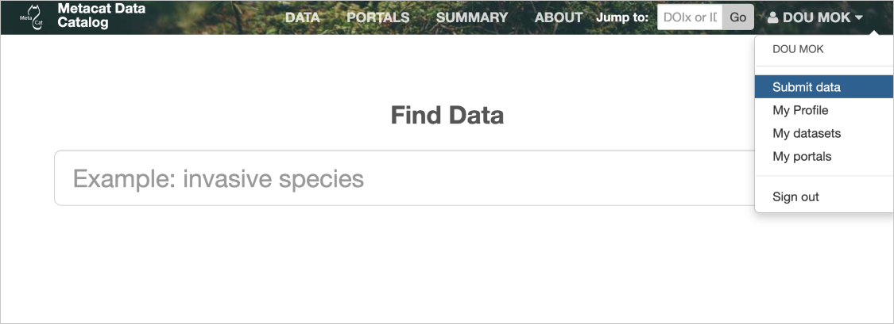

Accessing and Submitting Metadata and Data
==========================================

Your Metacat repository and its respective metadata and data objects can be accessed through
``metacatui``, which is a client-side web interface for querying Metacat servers (and other servers
that implement the DataONE REST API). The web submission form in ``metacatui`` is the suggested
path to access and submit metadata and data to your metacat repository.

.. contents::

Using MetacatUI
--------------------------------------------

MetacatUI is the default web-interface that is shipped with Metacat.

To begin submitting data, navigate to `metacatui` in your internet browser at:

    ``https://<yourhost.org>/metacatui``

Then click 'Sign in' in the upper right hand corner. A modal will appear with a button to sign in.
In order to sign in, you will need an ``ORCID iD``. If you do not have one, you can sign up for
free at https://orcid.org - after which you will receive a 16-digit ORCID iD.

Once you've registered and/or signed in, you will be returned to ``metacatui``. Move your cursor to
the upper right-hand corner and hover above your name, which will reveal a drop down menu. Click
'Submit Data', and add your data and metadata documents & fill in the relevant and required fields.

   Submit data by first signing in, then hovering over your name

The DataONE REST API
--------------------------------------------

Alternatively, you may use the DataONE REST API to submit and access data and metadata.
To learn more, please visit `https://knb.ecoinformatics.org/api`_.

.. _https://knb.ecoinformatics.org/api: https://knb.ecoinformatics.org/api